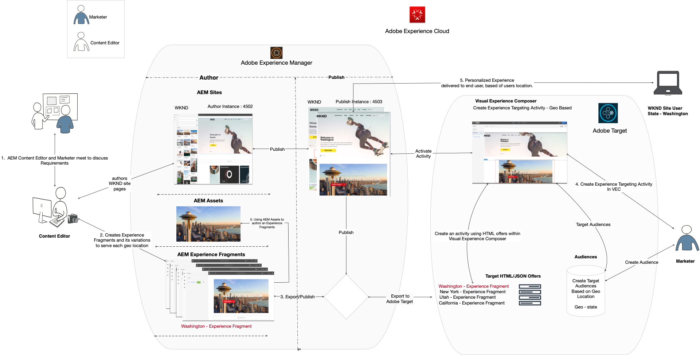
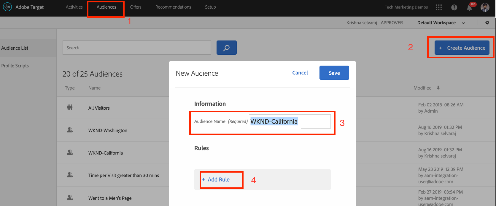
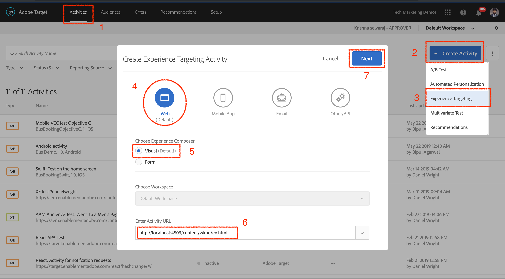
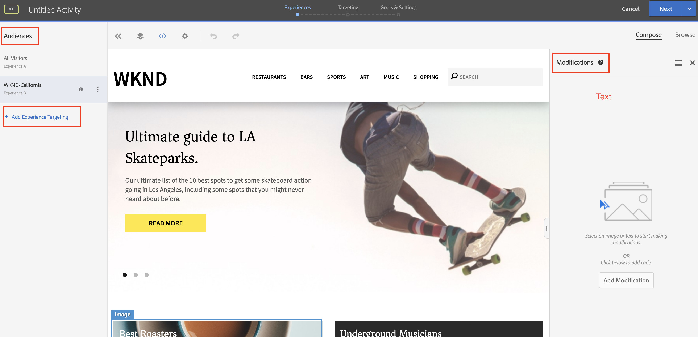

# AEM 경험 조각 및 Adobe Target을 사용한 개인화

AEM 경험 조각을 HTML 오퍼로 Adobe Target으로 내보낼 수 있는 기능을 사용하면 AEM의 사용 편이성 및 강력한 AI(Automated Intelligence) 및 ML(Machine Learning) 기능을 Target에 통합하여 규모에 맞게 경험을 테스트하고 개인화할 수 있습니다.

AEM은 모든 콘텐츠와 자산을 한 곳에 모아 개인화 전략을 실현합니다. AEM을 사용하면 코드를 작성하지 않고도 한 곳에서 데스크탑, 태블릿 및 모바일 디바이스에 배포할 컨텐츠를 손쉽게 제작할 수 있습니다. 모든 디바이스에 맞는 페이지를 제작할 필요가 없습니다. AEM은 컨텐츠를 사용하여 각 경험을 자동으로 조정합니다.

Target을 사용하면 행동, 컨텍스트 및 오프라인 변수를 결합하는 규칙 기반의 머신 러닝 방식과 AI 기반의 머신 러닝 방식을 조합하여 개인화된 경험을 규모에 맞게 전달할 수 있습니다.  Target을 사용하면 A/B 및 MVT(Multivariate Variate) 활동을 손쉽게 설정하고 실행하여 최상의 오퍼, 컨텐츠 및 경험을 결정할 수 있습니다.

경험 조각은 컨텐츠 작성자를 Target을 사용하여 비즈니스 결과를 주도하는 마케터와 연결할 수 있는 엄청난 발전을 의미합니다.

## 시나리오 개요

WKND 사이트는 웹 사이트를 통해 미국 전역에 **SkateFest Challenge** 를 발표할 예정이며 사이트 사용자가 각 주에서 진행되는 오디션에 가입하게 하려고 합니다. 마케터는 WKND 사이트 홈 페이지에서 사용자 위치와 관련된 배너 메시지와 이벤트 세부 사항 페이지에 대한 링크가 포함된 캠페인을 실행하는 작업이 할당됩니다. WKND 사이트 홈 페이지에서 사용자의 현재 위치를 기반으로 개인화된 경험을 제작 및 제공하는 방법을 살펴보십시오.

### 관련된 사용자

이 연습을 수행하려면 다음 사용자가 참여해야 하며 관리 액세스 권한이 필요한 일부 작업을 수행해야 합니다.

* **콘텐츠 프로듀서/콘텐츠 편집기** (Adobe Experience Manager)
* **마케터** (Adobe Target / 최적화 팀)

### 전제 조건

* **AEM**
   * [AEM author and publish instance](./implementation.md#getting-aem) running on localhost 4502 and 4503 each.
* **Experience Cloud**
   * 조직 Adobe Experience Cloud - <https://>`<yourcompany>`.experiencecloud.adobe.com에 액세스
   * 다음 솔루션으로 제공된 Experience Cloud
      * [Adobe Target](https://experiencecloud.adobe.com)

### WKND 사이트 홈 페이지

1. 마케터는 AEM 컨텐츠 편집자와 WKND SkateFest 캠페인 토론을 시작하고 요구 사항에 대해 자세히 설명합니다.
   * ***요구 사항***:미국 각 주의 방문자를 위한 개인화된 컨텐츠로 WKND 사이트 홈 페이지에서 WKND SkateFest 캠페인을 홍보합니다. 배경 이미지, 텍스트 및 단추가 포함된 홈 페이지 회전판 아래에 새 내용 블록을 추가합니다.
      * **배경 이미지**:이미지는 사용자가 WKND 사이트 페이지를 방문하고 있는 상태와 관련이 있어야 합니다.
      * **텍스트**:&quot;Audition 등록&quot;
      * **단추**:WKND SkateFest 페이지를 가리키는 &quot;이벤트 세부 사항&quot;
      * **WKND SkateFest 페이지**:audition 장소, 날짜, 시간 등 이벤트 세부 사항이 있는 새 페이지.
1. 요구 사항에 따라 AEM 컨텐츠 편집기는 컨텐츠 블록에 대한 경험 조각을 생성하여 Adobe Target에 오퍼로 내보냅니다. 미국의 모든 주에 대해 개인화된 컨텐츠를 제공하기 위해 컨텐츠 작성자는 하나의 경험 조각 마스터 변형을 만든 다음 각 주에 대해 하나씩 50개의 다른 변형을 만들 수 있습니다. 관련 이미지 및 텍스트를 사용한 각 상태 변화에 대한 컨텐츠를 수동으로 편집할 수 있습니다. 경험 조각을 작성할 때 컨텐츠 편집자는 자산 파인더 옵션을 사용하여 AEM Assets 내에서 사용 가능한 모든 자산에 빠르게 액세스할 수 있습니다. 경험 조각을 Adobe Target으로 내보내면 모든 변형이 Adobe Target으로 푸시됩니다.

1. 경험 조각을 AEM에서 Adobe Target으로 오퍼로 내보낸 후 마케터는 이러한 오퍼를 사용하여 Target에서 활동을 생성할 수 있습니다. WKND 사이트 SkateFest 캠페인을 기반으로 마케터는 각 주의 WKND 사이트 방문자에게 개인화된 경험을 제작하여 제공해야 합니다. 경험 타깃팅 활동을 만들려면 마케터가 고객을 식별해야 합니다. WKND SkateFest 캠페인의 경우 WKND 웹 사이트를 방문하는 고객의 위치에 따라 50명의 개별 고객을 만들어야 합니다.
   * [대상은](https://docs.adobe.com/content/help/en/target/using/introduction/target-key-concepts.html#section_3F32DA46BDF947878DD79DBB97040D01) 활동에 대한 대상을 정의하며 타깃팅을 사용할 수 있는 모든 곳에서 사용됩니다. Target 대상은 정의된 방문자 기준 세트입니다. 오퍼는 특정 대상(또는 세그먼트)으로 타깃팅될 수 있습니다. 해당 대상에 속하는 방문자만 타깃팅된 경험을 봅니다.  예를 들어 특정 브라우저를 사용하는 방문자나 특정 지리적 위치에서 오퍼를 제공할 수 있습니다.
   * 오퍼는 [캠페인](https://docs.adobe.com/content/help/en/target/using/introduction/target-key-concepts.html#section_973D4CC4CEB44711BBB9A21BF74B89E9) 또는 활동 동안 웹 페이지에 표시되는 컨텐츠입니다. 웹 페이지를 테스트할 때 위치에 있는 다양한 오퍼로 각 경험의 성공을 측정합니다. 오퍼에는 다음을 포함한 다양한 유형의 컨텐츠가 포함될 수 있습니다.
      * 이미지
      * 텍스트
      * **HTML**
         * *이 시나리오의 활동에 HTML 오퍼가 사용됩니다.*
      * 링크
      * 단추

## 컨텐츠 편집기 활동

>[!VIDEO](https://video.tv.adobe.com/v/28596?quality=12&learn=on)

>[!NOTE]
>
>경험 조각을 Adobe Target으로 내보내기 전에 게시합니다.

## 마케터 활동

### 지역 타깃팅을 사용하여 대상자 만들기 {#marketer-audience}

1. 조직 [Adobe Experience Cloud](https://experiencecloud.adobe.com/) (<https://>`<yourcompany>`.experiencecloud.adobe.com)로 이동합니다.
1. Adobe ID을 사용하여 로그인하고 올바른 조직에 속해 있는지 확인하십시오.
1. 솔루션 전환기에서 **Target** 을 클릭한 다음 **Adobe Target을** 실행합니다.

   

1. 오퍼 **탭으로** 이동하여 &quot;WKND&quot; 오퍼를 검색합니다. AEM에서 HTML 오퍼로 내보낸 경험 조각 변형 목록을 볼 수 있어야 합니다. 각 오퍼는 상태에 해당합니다. 예를 들어 *WKND SkateFest California는* 캘리포니아에서 WKND 사이트 방문자에게 제공되는 오퍼입니다.

   

1. 주 탐색에서 대상을 **클릭합니다**.

   마케터는 미국의 각 주에서 온 WKND 사이트 방문자에 대해 50개의 별도 고객을 만들어야 합니다.

1. 대상을 만들려면 대상자 **만들기** 단추를 클릭하고 대상의 이름을 입력합니다.

   **대상 이름 형식:WKND-\&lt;*state*\>**

   

1. 규칙 **추가 > 지역을 클릭합니다**.
1. 선택 **을**&#x200B;클릭한 다음 다음 다음 옵션 중 하나를 선택합니다.
   * 국가
   * **상태** *(WKND 사이트 스케이트페스트 캠페인의 상태 선택)*
   * 도시
   * 우편 번호
   * 위도
   * 경도
   * DMA
   * 모바일 통신사

   **지역** - 국가, 시/도, 우편 번호, DMA 또는 이동통신사 등 지리적 위치에 따라 사용자를 타깃팅하려면 대상을 사용합니다. 지리적 위치 매개 변수를 사용하면 방문자의 지리적 위치에 따라 활동 및 경험을 타깃팅할 수 있습니다. 이 데이터는 각 Target 요청을 통해 전송되며 방문자의 IP 주소를 기반으로 합니다. 타깃팅 값과 마찬가지로 이러한 매개 변수를 선택합니다.

   >[!NOTE]
   >방문자의 IP 주소는 해당 방문자에 대한 지역 타깃팅 매개 변수를 해결하기 위해 방문당 한 번씩 mbox 요청과 함께 전달됩니다.

1. 일치하는 연산자를 **선택하고**&#x200B;적절한 값을 제공합니다(예:California) **에서** 변경 사항을 저장합니다. 이 경우 상태 이름을 입력합니다.

   

   >[!NOTE]
   >대상에 여러 규칙을 할당할 수 있습니다.

1. 6-9단계를 반복하여 다른 상태에 대한 대상을 만듭니다.

   

이 시점에서 미국 내 여러 주에 걸쳐 모든 WKND 사이트 방문자에 대한 고객을 성공적으로 만들고 각 주에 해당하는 HTML 오퍼를 보유했습니다. 이제 WKND 사이트 홈 페이지에 대한 해당 오퍼로 고객을 타깃팅하는 경험 타깃팅 활동을 만듭니다.

### 지역 타깃팅을 사용하여 활동 만들기

1. Adobe Target 창에서 활동 **탭으로** 이동합니다.
1. 활동 **만들기를** 클릭하고 **경험 타깃팅** 활동 유형을 선택합니다.
1. 웹 **채널을** 선택하고 **시각적 경험 작성기를 선택합니다**.
1. 활동 **URL을** 입력하고 **다음을** 클릭하여 시각적 경험 작성기를 엽니다.

   WKND 사이트 홈 페이지 게시 URL:http://localhost:4503/content/wknd/en.html

   

1. Visual Experience **Composer를** 로드하려면 브라우저에서 **안전하지 않은 스크립트** 로드 허용을 활성화하고 페이지를 다시 로드하십시오.

   

1. WKND 사이트 홈 페이지가 Visual Experience Composer 편집기에서 열립니다.

   

1. VEC에 대상을 추가하려면 대상에서 경험 타깃팅 **추가를** 클릭하고 WKND-California 대상을 선택하고 다음을 **클릭합니다**.

   

1. VEC 내의 WKND 사이트 페이지를 클릭하고 WKND-California 대상의 오퍼를 추가할 HTML 요소를 선택한 다음 **다음으로** 바꾸기 옵션을 선택한 다음 **HTML 오퍼를 선택합니다**.

   

1. 오퍼 **선택 UI 및 [** 완료]에서 WKND-캘리포니아 **대상의 WKND SkateFest California** HTML 오퍼를 **선택합니다**.
1. 이제 WKND-California 대상의 WKND 사이트 페이지에 **추가된 WKND SkateFest California** HTML 오퍼를 볼 수 있습니다.
1. 7-10단계를 반복하여 다른 상태에 대한 경험 타깃팅을 추가하고 해당 HTML 오퍼를 선택합니다.
1. 계속하려면 **다음을** 클릭하십시오. 대상에 대한 매핑을 볼 수 있습니다.
1. 다음 **을** 클릭하여 목표 및 설정으로 이동합니다.
1. 보고 소스를 선택하고 활동의 주요 목표를 식별합니다. 시나리오의 경우 보고 소스를 **Adobe Target으로**&#x200B;선택하고, 활동을 **전환**, 페이지를 본 작업 및 WKND SkateFest 세부 사항 페이지를 가리키는 URL을 선택합니다.

   

   >[!NOTE]
   >보고 소스로 Adobe Analytics을 선택할 수도 있습니다.

1. 현재 활동 이름을 마우스로 가리키면 이름을 WKND SkateFest - 미국 **로 바꾼 다음 변경 사항을**&#x200B;저장하고 닫으십시오 **** .
1. 활동 세부 사항 화면에서 활동을 **활성화해야** 합니다.

   

1. 이제 WKND SkateFest Campaign이 모든 WKND 사이트 방문자에게 생방송으로 제공됩니다.
1. WKND [사이트 홈 페이지로](http://localhost:4503/content/wknd/en.html)이동하면, 지역(*주:캘리포니아*).

   

### Target 활동 QA

1. 활동 **세부 사항 > 개요** 탭에서 **활동 QA** 단추를 클릭하면 모든 경험에 대한 직접 QA 링크를 가져올 수 있습니다.

   

1. WKND [사이트 홈 페이지로](http://localhost:4503/content/wknd/en.html)이동하면, 지역(주)을 기반으로 하는 WKND SkateFest 오퍼를 볼 수 있습니다.
1. 아래 비디오를 시청하여 오퍼가 페이지에 어떻게 전달되는지, 응답 토큰을 사용자 정의하고, 품질 검사를 수행하는 방법을 확인하십시오.

>[!VIDEO](https://video.tv.adobe.com/v/28658?quality=12&learn=on)

## 요약

이 장에서, 컨텐츠 편집자는 사용자 지리적 위치를 기반으로 경험 타깃팅을 만들기 위해 Adobe Experience Manager 내에서 WKND SkateFest 캠페인을 지원하는 모든 컨텐츠를 만들어 Adobe Target에 HTML 오퍼로 내보낼 수 있었습니다.
