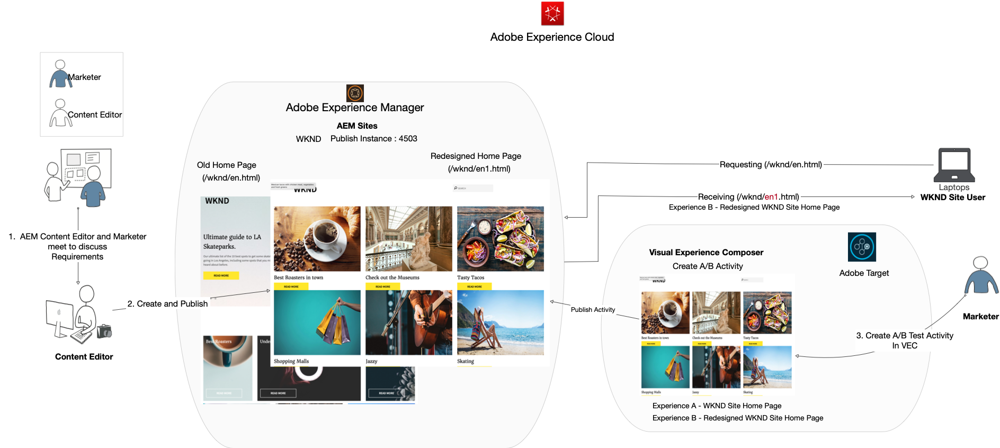
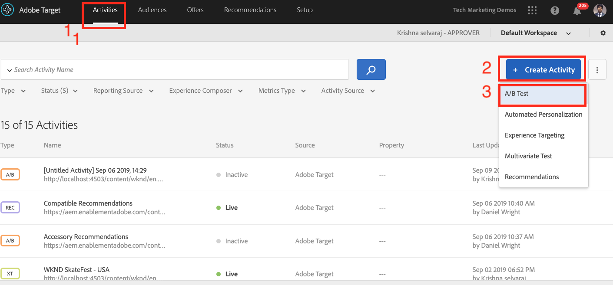

# Adobe Target을 사용한 완벽한 웹 페이지 경험의 개인화

이전 장에서는 경험 조각으로 만들고 AEM에서 HTML 오퍼로 내보낸 컨텐츠를 사용하여 Adobe Target 내에서 지리적 위치 기반 활동을 만드는 방법을 알아보았습니다.

이 장에서는 AEM에서 호스팅하는 사이트 페이지를 Adobe Target을 사용하여 새 페이지로 리디렉션하는 활동 만들기 관련 정보를 살펴봅니다.

## 시나리오 개요

WKND 사이트는 홈 페이지를 다시 설계했으며 현재 홈 페이지 방문자를 새 홈 페이지로 리디렉션하려고 합니다. 동시에 재설계된 홈 페이지를 통해 사용자 참여도와 매출을 향상시킬 수 있는 방법을 파악할 수 있습니다. 마케터에게는 방문자를 새 홈 페이지로 리디렉션하는 활동을 만드는 작업이 할당되었습니다. WKND 사이트 홈 페이지에서 Adobe Target을 사용하여 활동을 만드는 방법을 알아보겠습니다.

### 관련된 사용자

이 연습의 경우 다음 사용자가 참여해야 하며 관리 액세스가 필요한 일부 작업을 수행해야 합니다.

* **콘텐츠 프로듀서/콘텐츠 편집기** (Adobe Experience Manager)
* **마케터** (Adobe Target / 최적화 팀)

### WKND 사이트 홈 페이지

### 전제 조건

* **AEM**
   * [AEM 작성자 및 ](./implementation.md#getting-aem) 각각 localhost 4502 및 4503에 게시 설치
   * [ADOBE EXPERIENCE PLATFORM LAUNCH을 사용하여 Adobe Target과 통합](./using-launch-adobe-io.md#aem-target-using-launch-by-adobe)
* **Experience Cloud**
   * 조직 Adobe Experience Cloud 액세스 - <https://>`<yourcompany>`.experiencecloud.adobe.com
   * 다음 솔루션으로 제공된 Experience Cloud
      * [Adobe Target](https://experiencecloud.adobe.com)

## 컨텐츠 편집기 활동

1. 마케터는 AEM 컨텐츠 편집기를 사용하여 WKND 홈 페이지 재설계 토론을 시작하고 요구 사항에 대한 자세한 내용을 설명합니다.
   * ***요구 사항*** :카드 기반 디자인으로 WKND 사이트 홈 페이지 재설계.
2. 그런 다음 요구 사항을 기반으로 AEM Content Editor가 카드 기반 디자인으로 새 WKND 사이트 홈 페이지를 만들고 새 홈 페이지를 게시합니다.

## 마케터 활동

1. 마케터는 성공 목표 및 지표가 추가된 새 홈 페이지에 할당된 리디렉션 오퍼와 100% 웹 사이트 트래픽을 경험으로 사용하여 A/B 타겟 활동을 만듭니다.
   1. Adobe Target 창에서 **활동** 탭으로 이동합니다.
   2. **활동 만들기** 단추를 클릭하고 활동 유형을 **A/B 테스트**로 선택합니다.

      
   3. **웹** 채널을 선택하고 **시각적 경험 작성기**&#x200B;를 선택합니다.
   4. **활동 URL**&#x200B;을 입력하고 **다음**을 클릭하여 시각적 경험 작성기를 엽니다.
      
   5. **Visual Experience Composer**&#x200B;를 로드하려면 브라우저에서 **안전하지 않은 스크립트 로드 허용**을(를) 활성화하고 페이지를 다시 로드하십시오.
      
   6. WKND 사이트 홈 페이지가 Visual Experience Composer 편집기에서 열립니다.
      
   7. **경험 B** 위에 마우스를 올려 놓고 다른 옵션 보기 보기를 선택합니다.
      
   8. **URL**로 리디렉션 옵션을 선택하고 새 WKND 홈 페이지에 URL을 입력합니다. (http://localhost:4503/content/wknd/en1.html)
      
   9. **변경** 내용을 저장하고 활동 만들기의 다음 단계를 계속 진행합니다.
   10. **트래픽 할당 메서드**&#x200B;를 수동으로 선택하고 **경험 B**에 100% 트래픽을 할당합니다.
      
   11. **다음**&#x200B;을 클릭합니다.
   12. 활동에 대해 **목표 지표**를 제공하고 A/B 테스트를 저장하고 닫습니다.
      
   13. 활동에 대한 이름(**WKND 홈 페이지 재설계**)을 입력하고 변경 내용을 저장합니다.
   14. 활동 세부 사항 화면에서 **활동 활성화**를 참조하십시오.
      
   15. WKND 홈 페이지(http://localhost:4503/content/wknd/en.html)으로 이동하면 다시 디자인된 WKND 사이트 홈 페이지(http://localhost:4503/content/wknd/en1.html)으로 리디렉션됩니다.
      

## 요약

이 장에서 마케터는 AEM에서 호스팅하는 사이트 페이지를 Adobe Target을 사용하여 새 페이지로 리디렉션하는 활동을 만들 수 있었습니다.
