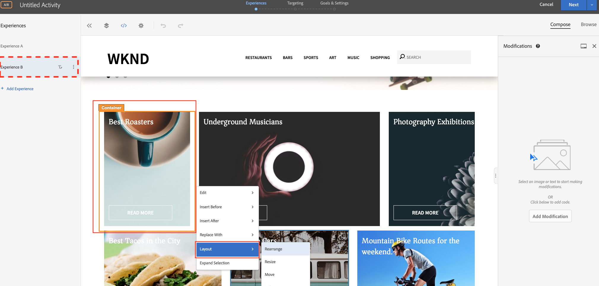

# Visual Experience Composer를 사용한 개인화

이 장에서는 Target 내에서 웹 페이지의 레이아웃 및 콘텐츠를 드래그 앤 드롭하고, 교체하고, 수정하여 **시각적 경험 작성기**&#x200B;를 사용하여 경험을 만드는 방법을 살펴봅니다.

## 시나리오 개요

WKND 사이트 홈 페이지에는 도시 주변에서 수행할 수 있는 로컬 활동이나 가장 좋은 작업이 카드 레이아웃 형태로 표시됩니다. 마케팅 담당자는 카드 레이아웃을 다시 배치하여 사용자 참여와 전환 촉진에 미치는 영향을 확인함으로써 홈 페이지를 수정하는 작업을 수행했습니다.

### 관련 사용자

이 연습에서는 다음 사용자가 참여해야 하며 관리 액세스 권한이 필요할 수 있는 일부 작업을 수행해야 합니다.

* **컨텐츠 프로듀서/컨텐츠 편집기** (Adobe Experience Manager)
* **마케터** (Adobe Target/최적화 팀)

### WKND 사이트 홈 페이지


### 전제 조건

* **AEM**
   * [4503](./implementation.md#getting-aem) 에 AEM 게시 설치
   * [Adobe Experience Platform Launch을 사용하여 Adobe Target과 통합](./using-launch-adobe-io.md#aem-target-using-launch-by-adobe)
* **Experience Cloud**
   * 조직 Adobe Experience Cloud - <https://>`<yourcompany>`.experiencecloud.adobe.com에 액세스
   * [Adobe Target](https://experiencecloud.adobe.com)로 제공된 Experience Cloud

## 마케터 활동

1. 마케터는 Adobe Target 내에서 A/B 타겟 활동을 만듭니다.
   1. Adobe Target 창에서 **활동** 탭으로 이동합니다.
   2. **활동 만들기** 단추를 클릭하고 활동 유형을 **A/B 테스트** 로 선택합니다.

      
   3. **웹** 채널을 선택하고 **시각적 경험 작성기**&#x200B;를 선택합니다.
   4. **활동 URL**&#x200B;을 입력하고 **다음**을 클릭하여 시각적 경험 작성기를 엽니다.
      
   5. **시각적 경험 작성기**&#x200B;를 로드하려면 브라우저에서 **안전하지 않은 스크립트 로드 허용**을(를) 활성화하고 페이지를 다시 로드합니다.
      
   6. WKND 사이트 홈 페이지가 시각적 경험 작성기 편집기에서 열려 있는 것을 확인합니다.
      
   7. **경험** 은 기본 WKND 홈 페이지를 제공하며  **경험 B**의 컨텐츠 레이아웃을 편집하겠습니다.
      
   8. 카드 레이아웃 컨테이너(*최상의 회전자*) 중 하나를 클릭하고 **다시 정렬** 옵션을 선택합니다.
      
   9. 다시 정렬할 컨테이너를 클릭하고 원하는 위치로 드래그하여 놓습니다. *Best Roasters* 컨테이너를 첫 번째 행 1열에서 첫 번째 행 3번째 열로 다시 배열하겠습니다. 이제 *Best Roasters* 컨테이너는 *사진 전시회* 컨테이너 옆에 있습니다.
      

      **교체 후**
      
   10. 마찬가지로 다른 카드 컨테이너의 위치를 다시 정렬합니다.
      
   11. 또한 회전 메뉴 구성 요소 아래와 카드 레이아웃 위에 머리글 텍스트를 추가하겠습니다.
   12. 회전판 컨테이너를 클릭하고 **다음 항목 뒤에 삽입 > HTML** 옵션을 선택하여 HTML을 추가합니다.
      

      ```html
      <h1 style="text-align:center">Check Out the Hot Spots in Town</h1>
      ```

      
   13. 활동을 계속하려면 **다음**&#x200B;을 클릭하십시오.
   14. **트래픽 할당 방법**&#x200B;을 수동으로 선택하고 **경험 B**에 100% 트래픽을 할당합니다.
      
   15. **다음**&#x200B;을 클릭합니다.
   16. 활동에 대한 **목표 지표**를 제공하고 A/B 테스트를 저장하고 닫습니다.
      
   17. 활동에 대한 이름(**WKND 홈 페이지 새로 고침**)을 입력하고 변경 사항을 저장합니다.
   18. 활동 세부 사항 화면에서 활동을 **활성화**해야 합니다.
      
   19. WKND 홈 페이지(http://localhost:4503/content/wknd/en.html)으로 이동하면 WKND 홈 페이지 새로 고침 A/B 테스트 활동에 추가된 변경 사항이 표시됩니다.
      
   20. 브라우저 콘솔을 열고 네트워크 탭을 검사하여 WKND 홈 페이지 새로 고침 A/B 테스트 활동에 대한 target 응답을 찾습니다.
      

## 요약

이 장에서 마케터는 테스트를 실행하기 위해 코드를 변경하지 않고 웹 페이지의 레이아웃 및 콘텐츠를 드래그 앤 드롭하고, 교체하고, 수정하여 시각적 경험 작성기를 사용하여 경험을 만들 수 있었습니다.
