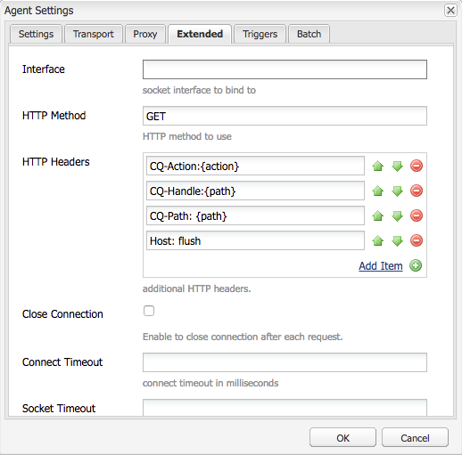

# Dispatcher 별칭 URL

[목차](./overview.md)

[&lt;- 이전: 변수 사용 및 이해](./variables.md)

이 문서는 플러시 발생 방법에 대한 지침을 제공하고 캐시 플러시 및 무효화를 실행하는 메커니즘을 설명합니다.


## 작동 방식

### 작업 순서

일반적인 워크플로우는 콘텐츠 작성자가 페이지를 활성화할 때 가장 잘 설명되며 게시자가 새 콘텐츠를 받으면 다음 다이어그램과 같이 Dispatcher에 대한 플러시 요청을 트리거합니다.

이 이벤트 체인은 새 항목 또는 변경된 항목만 플러시한다는 것을 강조 표시합니다.  이렇게 하면 캐시에서 캐시를 삭제하기 전에 게시자가 컨텐츠를 수신하여 변경 사항을 게시자로부터 픽업하기 전에 플러시가 발생할 수 있는 경쟁 조건을 피할 수 있습니다.

## 복제 에이전트

작성자의 경우 무언가를 활성화할 때 파일과 모든 종속 기능을 게시자에게 보내도록 트리거하는 게시자를 가리키도록 구성된 복제 에이전트가 있습니다.

게시자가 파일을 수신하면 수신 중인 이벤트를 트리거하는 Dispatcher를 가리키도록 복제 에이전트가 구성되어 있습니다.  그런 다음 플러시 요청을 직렬화하고 이를 Dispatcher에 게시합니다.

### 작성자 복제 에이전트

다음은 구성된 표준 복제 에이전트의 스크린샷 예입니다


일반적으로 작성자에게는 콘텐츠를 복제하는 각 게시자에 대해 1~2개의 복제 에이전트가 구성되어 있습니다.

첫 번째는 컨텐츠 활성화를 밀어내는 표준 복제 에이전트입니다.

두 번째는 역방향 에이전트입니다.  선택 사항이며 각 게시자의 보낼 편지함에서 역방향 복제 활동으로 작성자에게 가져올 새 콘텐츠가 있는지 확인하도록 설정되어 있습니다.

### 게시자 복제 에이전트

다음은 구성된 표준 플러시 복제 에이전트의 예제 스크린샷입니다


### DISPATCHER 플러시 복제 수신 가상 호스트

Dispatcher 모듈은 POST 요청이 AEM 렌더링에 전달될 때 또는 플러시 요청으로 직렬화되어 Dispatcher 핸들러 자체에서 처리해야 하는지를 알리기 위해 특정 헤더를 찾습니다.

다음은 이러한 값을 보여주는 구성 페이지의 스크린샷입니다.


기본 설정 페이지에는 `Serialization Type` 다음으로: `Dispatcher Flush` 오류 수준을 설정합니다.


다음에서 `Transport` 탭을 통해 다음을 확인할 수 있습니다. `URI` 플러시 요청을 수신할 Dispatcher의 IP 주소를 가리키도록 설정됩니다.  경로 `/dispatcher/invalidate.cache` 플러시인지 아닌지를 모듈에서 확인하는 방법이 아닙니다. 플러시 요청임을 알기 위해 액세스 로그에서 볼 수 있는 명백한 종단점입니다.  다음에서 `Extended` 탭에서는 Dispatcher 모듈에 대한 플러시 요청임을 확인하기 위한 항목을 살펴봅니다.



다음 `HTTP Method` 플러시 요청의 경우: `GET` 몇 가지 특수 요청 헤더가 있는 요청:
- CQ-Action
   - 요청에 따라 AEM 변수를 사용하며 값은 일반적으로 입니다. *활성화 또는 삭제*
- CQ-Handle
   - 요청에 따라 AEM 변수를 사용하며 값은 일반적으로 플러시된 항목에 대한 전체 경로입니다. 예 `/content/dam/logo.jpg`
- CQ-Path
   - 요청에 따라 AEM 변수를 사용하며 값은 일반적으로 플러시된 항목에 대한 전체 경로입니다. 예 `/content/dam`
- 호스트
   - 여기에서 `Host` 헤더가 특정 타겟으로 스푸핑됨 `VirtualHost` dispatcher Apache 웹 서버에 구성됩니다(`/etc/httpd/conf.d/enabled_vhosts/aem_flush.vhost`).  의 항목과 일치하는 하드 코딩된 값입니다. `aem_flush.vhost` 파일 `ServerName` 또는 `ServerAlias`


다음에서 `Triggers` 탭에서는 사용하는 토글된 트리거와 해당 트리거를 기록합니다.

- `Ignore default`
   - 페이지 활성화 시 복제 에이전트가 트리거되지 않도록 설정됩니다.  이는 작성자 인스턴스가 페이지를 변경할 때 플러시를 트리거하는 것입니다.  이 게시자는 게시자이므로 해당 유형의 이벤트를 트리거하지 않습니다.
- `On Receive`
   - 새 파일이 수신되면 플러시를 트리거하려고 합니다.  따라서 작성자가 업데이트된 파일을 보내면 디스패처에 플러시 요청을 트리거하여 보냅니다.
- `No Versioning`
   - 새 파일이 수신되었기 때문에 게시자가 새 버전을 생성하지 않도록 하려면 이 옵션을 선택합니다.  파일을 바꾸고 게시자가 아닌 작성자에게 의존하여 버전을 추적합니다.

이제 일반적인 플러시 요청이 `curl` 명령

```
$ curl \ 
-H "CQ-Action: Activate" \ 
-H "CQ-Handle: /content/dam/logo.jpg" \ 
-H "CQ-Path: /content/dam/" \ 
-H "Content-Length: 0" \  
-H "Content-Type: application/octect-stream" \ 
-H "Host: flush" \ 
http://10.43.0.32:80/dispatcher/invalidate.cache
```

이 플러시 예제는 `/content/dam` 경로 업데이트 `.stat` 파일을 디렉토리에 저장합니다.

## 다음 `.stat` 파일

플러싱 메커니즘은 본질적으로 단순하며 우리는 다음과 같은 중요성에 대해 설명하고자 한다. `.stat` 캐시 파일이 생성되는 문서 루트에서 생성되는 파일입니다.

내부 `.vhost` 및 `_farm.any` 파일document root 지시문을 구성하여 캐시가 있는 위치와 최종 사용자의 요청이 들어올 때 파일을 저장/제공할 위치를 지정합니다.

Dispatcher 서버에서 다음 명령을 실행하려는 경우 찾기 시작해야 합니다 `.stat` 파일

```
$ find /mnt/var/www/html/ -type f -name ".stat"
```

다음은 캐시에 항목이 있고 디스패처 모듈에서 플러시 요청을 보내고 처리한 경우 이 파일 구조가 어떻게 보이는지에 대한 다이어그램입니다


### 통계 파일 레벨

각 디렉터리에 `.stat` 파일이 있습니다.  플러시가 발생했음을 나타내는 표시기입니다.  위의 예에서 `statfilelevel` 설정이 (으)로 설정되었습니다. `3` 해당 팜 구성 파일 내부.

다음 `statfilelevel` 설정은 모듈이 통과하고 업데이트하는 폴더 수를 나타냅니다. `.stat` 파일.  .stat 파일이 비어 있으면 날짜도장이 있는 파일 이름에 지나지 않으며 수동으로 만들 수도 있지만 Dispatcher 서버의 명령줄에서 터치 명령을 실행할 수도 있습니다.

통계 파일 레벨 설정이 너무 높게 설정된 경우, 각 플러시 요청은 통계 파일을 건드리는 디렉토리 트리를 통과합니다.  이는 대형 캐시 트리에서 주요 성능 저하가 될 수 있으며 Dispatcher의 전체 성능에 영향을 줄 수 있습니다.

이 파일 수준을 너무 낮게 설정하면 플러시 요청이 의도한 것보다 많은 것을 지울 수 있습니다.  그러면 캐시에서 더 적은 요청이 제공되어 캐시가 더 자주 이탈하여 성능 문제가 발생할 수 있습니다.

>[!BEGINSHADEBOX &quot;메모&quot;]

설정 `statfilelevel` 합리적인 수준에서. 폴더 구조를 보고 너무 많은 디렉토리를 탐색하지 않고 간결한 플러시를 허용하도록 설정되어 있는지 확인합니다. 시스템의 성능 테스트 중에 사용자의 요구 사항에 맞는지 테스트하여 확인합니다.

언어를 지원하는 사이트가 좋은 예입니다. 일반적인 콘텐츠 트리에는 다음 디렉터리가 있습니다

`/content/brand1/en/us/`

이 예제에서는 통계 파일 레벨 설정 4를 사용합니다. 이 옵션을 선택하면 아래에 있는 콘텐츠를 플러시할 때 **`us`** 언어 폴더도 플러시되지 않는 폴더

>[!ENDSHADEBOX]

### 통계 파일 타임스탬프 핸드쉐이크

콘텐츠 요청이 동일한 루틴에 있는 경우

1. 의 타임스탬프 `.stat` 파일이 요청된 파일의 타임스탬프와 비교됩니다
2. 다음과 같은 경우 `.stat` 파일이 요청된 파일보다 최신입니다. 캐시된 콘텐츠를 삭제하고 AEM 및 캐시에서 새 콘텐츠를 가져옵니다.  그런 다음 콘텐츠를 제공합니다.
3. 다음과 같은 경우 `.stat` 파일이 요청된 파일보다 오래되었으므로 파일이 최신 상태이고 콘텐츠를 제공할 수 있습니다.

### 캐시 핸드쉐이크 - 예제 1

위의 예에서 콘텐츠 요청 `/content/index.html`

시간 `index.html` 파일은 2019-11-01 @ 오후 6:21입니다.

가장 가까운 시간 `.stat` 파일은 2019-11-01 @ 오후 12:22입니다.

위에서 읽은 사항을 이해하면 색인 파일이 `.stat` 파일과 파일은 캐시에서 요청한 최종 사용자에게 제공됩니다.

### 캐시 핸드쉐이크 - 예제 2

위의 예에서 콘텐츠 요청 `/content/dam/logo.jpg`

시간 `logo.jpg` 파일은 2019-10-31 @ 오후 1:13입니다.

가장 가까운 시간 `.stat` 파일은 2019-11-01 @ 오후 12:22입니다.

이 예제에서 볼 수 있듯이 파일은 보다 오래되었습니다. `.stat` AEM 파일 및 가 제거되고, 요청을 한 최종 사용자에게 제공되기 전에 캐시에서 새 파일을 가져와서 교체합니다.

## 팜 파일 설정

전체 구성 옵션 세트에 대한 모든 설명서가 여기에 있습니다. [https://docs.adobe.com/content/help/en/experience-manager-dispatcher/using/configuring/dispatcher-configuration.html#configuring-dispatcher_configuring-the-dispatcher-cache-cache](https://experienceleague.adobe.com/docs/experience-manager-dispatcher/using/configuring/dispatcher-configuration.html?lang=ko-KR)

캐시 플러싱과 관련된 몇 가지 항목을 강조하고 싶습니다

### 팜 초기화

두 가지 키가 있습니다 `document root` 작성자 및 게시자 트래픽의 파일을 캐시할 디렉터리입니다.  이러한 디렉토리를 최신 콘텐츠로 유지하려면 캐시를 플러시해야 합니다.  이러한 플러시 요청은 요청을 거부하거나 원치 않는 작업을 수행할 수 있는 일반 고객 트래픽 팜 구성과 얽히기를 원치 않습니다.  대신 이 작업에 대해 두 개의 플러시 팜을 제공합니다.

- `/etc/httpd.conf.d/available_farms/001_ams_author_flush_farm.any`
- `/etc/httpd.conf.d/available_farms/001_ams_publish_flush_farm.any`

이러한 팜 파일은 문서 루트 디렉터리를 플러시하는 것 외에는 아무 작업도 하지 않습니다.

```
/publishflushfarm {  
    /virtualhosts {
        "flush"
    }
    /cache {
        /docroot "${PUBLISH_DOCROOT}"
        /statfileslevel "${DEFAULT_STAT_LEVEL}"
        /rules {
            $include "/etc/httpd/conf.dispatcher.d/cache/ams_publish_cache.any"
        }
        /invalidate {
            /0000 {
                /glob "*"
                /type "allow"
            }
        }
        /allowedClients {
            /0000 {
                /glob "*.*.*.*"
                /type "deny"
            }
            $include "/etc/httpd/conf.dispatcher.d/cache/ams_publish_invalidate_allowed.any"
        }
    }
}
```

### 문서 루트

이 구성 항목은 팜 파일의 다음 섹션에 있습니다.

```
/myfarm { 
    /cache { 
        /docroot
```

Dispatcher가 캐시 디렉터리로 채우고 관리할 디렉터리를 지정합니다.

>[!NOTE]
>
>이 디렉토리는 웹 서버가 사용하도록 구성된 도메인의 Apache 문서 루트 설정과 일치해야 합니다.
>
>Apache 문서 루트의 하위 폴더를 활성화하는 각 팜당 중첩된 docroot 폴더가 있으면 매우 안 좋습니다.

### 통계 파일 레벨

이 구성 항목은 팜 파일의 다음 섹션에 있습니다.

```
/myfarm { 
    /cache { 
        /statfileslevel
```

이 설정 게이지는 얼마나 깊은지를 나타냅니다. `.stat` 플러시 요청이 들어올 때 파일을 생성해야 합니다.

`/statfileslevel` 문서 루트가 인 다음 번호로 설정합니다. `/var/www/html/` 을(를) 플러시하면 다음과 같은 결과가 발생합니다 `/content/dam/brand1/en/us/logo.jpg`

- 0 - 다음 통계 파일이 만들어집니다.
   - `/var/www/html/.stat`
- 1 - 다음 통계 파일이 만들어집니다.
   - `/var/www/html/.stat`
   - `/var/www/html/content/.stat`
- 2 - 다음 통계 파일이 만들어집니다.
   - `/var/www/html/.stat`
   - `/var/www/html/content/.stat`
   - `/var/www/html/content/dam/.stat`
- 3 - 다음 통계 파일이 만들어집니다.
   - `/var/www/html/.stat`
   - `/var/www/html/content/.stat`
   - `/var/www/html/content/dam/.stat`
   - `/var/www/html/content/dam/brand1/.stat`
- 4 - 다음 통계 파일이 만들어집니다.
   - `/var/www/html/.stat`
   - `/var/www/html/content/.stat`
   - `/var/www/html/content/dam/.stat`
   - `/var/www/html/content/dam/brand1/.stat`
   - `/var/www/html/content/dam/brand1/en/.stat`
- 5 - 다음 통계 파일이 만들어집니다.
   - `/var/www/html/.stat`
   - `/var/www/html/content/.stat`
   - `/var/www/html/content/dam/.stat`
   - `/var/www/html/content/dam/brand1/.stat`
   - `/var/www/html/content/damn/brand1/en/.stat`
   - `/var/www/html/content/damn/brand1/en/us/.stat`

>[!NOTE]
>
>타임스탬프 핸드쉐이크가 발생할 때 가장 가까운 곳을 찾습니다 `.stat` 파일.
>
>다음 작업 수행 `.stat` 파일 레벨 0 및 stat 파일만 `/var/www/html/.stat` 은 아래에 있는 콘텐츠를 의미합니다. `/var/www/html/content/dam/brand1/en/us/` 가장 가까운 곳을 찾고 있습니다 `.stat` 파일을 만들고 5개 폴더를 탐색하여 `.stat` 레벨 0에 있고 날짜를 비교할 수 있는 파일입니다. 높은 수준에서 플러시하면 캐시된 모든 항목이 본질적으로 무효화됩니다.

### 무효화가 허용됨

이 구성 항목은 팜 파일의 다음 섹션에 있습니다.

```
/myfarm { 
    /cache { 
        /allowedClients {
```

이 구성 안에는 플러시 요청을 보낼 수 있는 IP 주소 목록을 배치할 수 있습니다.  플러시 요청이 Dispatcher로 들어오는 경우 신뢰할 수 있는 IP에서 요청해야 합니다.  이 구성이 잘못되었거나 신뢰할 수 없는 IP 주소에서 플러시 요청을 보내면 로그 파일에 다음 오류가 표시됩니다.

```
[Mon Nov 11 22:43:05 2019] [W] [pid 3079 (tid 139859875088128)] Flushing rejected from 10.43.0.57
```

### 무효화 규칙

이 구성 항목은 팜 파일의 다음 섹션에 있습니다.

```
/myfarm { 
    /cache { 
        /invalidate {
```

이러한 규칙은 일반적으로 플러시 요청으로 무효화될 수 있는 파일을 나타냅니다.

중요한 파일이 페이지 활성화로 무효화되지 않도록 하기 위해 무효화하려는 파일을 수동으로 지정하는 규칙을 사용할 수 있습니다.  다음은 html 파일만 무효화할 수 있는 샘플 구성 세트입니다.

```
/invalidate { 
   /0000 { /glob "*" /type "deny" } 
   /0001 { /glob "*.html" /type "allow" } 
}
```

## 테스트 / 문제 해결

페이지를 활성화하고 페이지 활성화에 성공했다는 녹색 표시등을 받으면 활성화한 콘텐츠가 캐시에서 플러시될 것입니다.

페이지를 새로 고치고 이전 항목을 봅니다! 뭐요!? 녹색 표시등이 켜졌습니다?!

몇 가지 수동 단계 플러시 프로세스를 수행하여 무엇이 잘못되었는지 알아보도록 하겠습니다.  게시자 셸에서 curl을 사용하여 다음 플러시 요청을 실행합니다.

```
$ curl -H "CQ-Action: Activate" \ 
-H "CQ-Handle: /content/<PATH TO ITEM TO FLUSH>" \ 
-H "CQ-Path: /content/<PATH TO ITEM TO FLUSH>" \ 
-H "Content-Length: 0" -H "Content-Type: application/octet-stream" \ 
-H "Host: flush" \ 
http://<DISPATCHER IP ADDRESS>/dispatcher/invalidate.cache
```

테스트 플러시 요청 예

```
$ curl -H "CQ-Action: Activate" \ 
-H "CQ-Handle: /content/customer/en-us" \ 
-H "CQ-Path: /content/customer/en-us" \ 
-H "Content-Length: 0" -H "Content-Type: application/octet-stream" \ 
-H "Host: flush" \ 
http://169.254.196.222/dispatcher/invalidate.cache
```

디스패처에 대한 요청 명령을 실행하면 로그에서 수행한 작업과 로 수행한 작업을 확인합니다. `.stat files`.  로그 파일을 살펴보고 다음 항목을 참조하여 디스패처 모듈에서 플러시 요청을 확인합니다

```
[Wed Nov 13 16:54:12 2019] [I] [pid 19173:tid 140542721578752] Activation detected: action=Activate [/content/dam/logo.jpg] 
[Wed Nov 13 16:54:12 2019] [I] [pid 19173:tid 140542721578752] Touched /mnt/var/www/html/.stat 
[Wed Nov 13 16:54:12 2019] [I] [pid 19173:tid 140542721578752] Touched /mnt/var/www/html/content/.stat 
[Wed Nov 13 16:54:12 2019] [I] [pid 19173:tid 140542721578752] Touched /mnt/var/www/html/content/dam/.stat 
[Wed Nov 13 16:54:12 2019] [I] [pid 19173:tid 140542721578752] "GET /dispatcher/invalidate.cache" 200 purge [publishfarm/-] 0ms
```

이제 모듈이 선택되어 플러시 요청을 승인했음을 알았으므로 이 모듈이 `.stat` 파일.  다음 명령을 실행하고 다른 플러시를 발행하면서 타임스탬프 업데이트를 확인합니다.

```
$ watch -n 3 "find /mnt/var/www/html/ -type f -name ".stat" | xargs ls -la $1"
```

명령 출력에서 볼 수 있듯이 현재 타임스탬프를 출력합니다 `.stat` 파일

```
-rw-r--r--. 1 apache apache 0 Nov 13 16:54 /mnt/var/www/html/content/dam/.stat 
-rw-r--r--. 1 apache apache 0 Nov 13 16:54 /mnt/var/www/html/content/.stat 
-rw-r--r--. 1 apache apache 0 Nov 13 16:54 /mnt/var/www/html/.stat
```

이제 플러시를 다시 실행하면 타임스탬프 업데이트가 표시됩니다.

```
-rw-r--r--. 1 apache apache 0 Nov 13 17:17 /mnt/var/www/html/content/dam/.stat 
-rw-r--r--. 1 apache apache 0 Nov 13 17:17 /mnt/var/www/html/content/.stat 
-rw-r--r--. 1 apache apache 0 Nov 13 17:17 /mnt/var/www/html/.stat
```

콘텐츠 타임스탬프를 당사와 비교해 보겠습니다. `.stat` 파일 타임스탬프

```
$ stat /mnt/var/www/html/content/customer/en-us/.stat 
  File: `.stat' 
  Size: 0           Blocks: 0          IO Block: 4096   regular empty file 
Device: ca90h/51856d    Inode: 17154125    Links: 1 
Access: (0644/-rw-r--r--)  Uid: (   48/  apache)   Gid: (   48/  apache) 
Access: 2019-11-13 16:22:31.000000000 -0400 
Modify: 2019-11-13 16:22:31.000000000 -0400 
Change: 2019-11-13 16:22:31.000000000 -0400 
 
$ stat /mnt/var/www/html/content/customer/en-us/logo.jpg 
File: `logo.jpg' 
  Size: 15856           Blocks: 32          IO Block: 4096   regular file 
Device: ca90h/51856d    Inode: 9175290    Links: 1 
Access: (0644/-rw-r--r--)  Uid: (   48/  apache)   Gid: (   48/  apache) 
Access: 2019-11-11 22:41:59.642450601 +0000 
Modify: 2019-11-11 22:41:59.642450601 +0000 
Change: 2019-11-11 22:41:59.642450601 +0000
```

타임스탬프를 보면 콘텐츠의 시간이 보다 최신임을 알 수 있습니다. `.stat` 파일이 보다 최신이므로 캐시에서 파일을 제공하도록 모듈에 지시하는 파일 `.stat` 파일.

이 파일의 타임스탬프를 업데이트하여 &quot;플러시&quot; 또는 교체할 자격이 없다는 것을 명확히 입력합니다.

[다음 -> 가상 URL](./disp-vanity-url.md)
