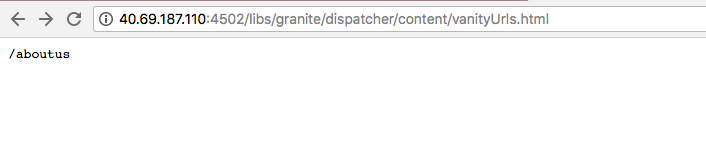

# Dispatcher 별칭 URL

[목차](./overview.md)

[&lt;- 이전: Dispatcher 플러시](./disp-flushing.md)

## 개요

이 문서는 AEM에서 컨텐츠 전달 가장자리에 더 가깝게 매핑하기 위해 규칙 다시 작성을 사용하여 단축 URL 및 일부 추가 기법을 처리하는 방법을 이해하는 데 도움이 됩니다

## 단축 URL 소개

의미가 있는 폴더 구조에 들어 있는 컨텐츠가 있는 경우 참조하기 쉬운 URL에 항상 존재하는 것은 아닙니다. 단축 URL은 단축키와 유사합니다. 실제 컨텐츠가 존재하는 위치를 참조하는 더 짧거나 고유한 URL입니다.

예: `/aboutus` 중요 시점 `/content/we-retail/us/en/about-us.html`

AEM 작성자에게는 AEM의 컨텐츠 일부에 대한 단축 url 속성을 설정하고 이를 게시하는 옵션이 있습니다.

이 기능이 작동하려면 단축 통과를 허용하도록 Dispatcher 필터를 조정해야 합니다. 이는 작성자가 이러한 단축 페이지 항목을 설정해야 하는 비율로 Dispatcher 구성 파일을 조정하는 것과 같이 비합리적입니다.

이러한 이유로 Dispatcher 모듈에는 콘텐츠 트리에 단축으로 나열된 모든 항목을 자동으로 허용하는 기능이 있습니다.


## 작동 방식

### 단축 URL 작성

작성자가 AEM의 페이지를 방문하고 페이지 속성을 클릭한 다음 _별칭 URL_ 섹션. 변경 사항을 저장하고 페이지를 활성화하면 페이지에 단축이 할당됩니다.

작성자는 _별칭 URL 리디렉션_ 추가 시 확인란 _별칭 URL_ 항목을 입력하면 단축 url이 302 리디렉션으로 동작합니다. 즉, 브라우저가 (를 통해) 새 URL로 이동하라는 메시지가 표시됩니다. `Location` response header)를 입력하면 브라우저가 새 URL에 대해 새 요청을 만듭니다.

#### Touch UI:


#### 클래식 컨텐츠 파인더:


>[!NOTE]
>
>이름 공간 문제가 발생하기 쉽다는 것을 이해합니다. 단축 항목은 모든 페이지에 적용되며 문제 해결을 계획해야 하는 짧은 작업 중 하나에 불과합니다. 그 중 일부는 나중에 설명해 드리겠습니다.


## 리소스 확인/매핑

내부 리디렉션을 위한 각 단축 항목은 sling 맵 항목입니다.

AEM 인스턴스 Felix 콘솔( )을 방문하여 맵을 볼 수 있습니다. `/system/console/jcrresolver` )

다음은 단축 항목으로 만든 맵 항목의 스크린샷입니다.


위의 예에서 AEM 인스턴스에 다음을 방문하도록 요청하는 경우 `/aboutus` 다음으로 확인됨: `/content/we-retail/us/en/about-us.html`

## Dispatcher 자동 허용 필터

보안 상태의 Dispatcher는 경로에서 요청을 필터링합니다 `/` 가 JCR 트리의 루트이므로 Dispatcher를 통해

게시자가 다음에서 콘텐츠만 허용하는지 확인하는 것이 중요합니다. `/content` 및 기타 안전한 경로 등. `/system`.

다음은 의 기본 폴더에 있는 단축 URL입니다 `/` 그렇다면 어떻게 하면 그들이 안전하게 출판사들에게 접근할 수 있을까요?

단순 Dispatcher에는 자동 필터 허용 메커니즘이 있으며 AEM 패키지를 설치한 다음 해당 패키지 페이지를 가리키도록 Dispatcher를 구성해야 합니다.

[https://experience.adobe.com/#/downloads/content/software-distribution/en/aem.html?package=/content/software-distribution/en/details.html/content/dam/aem/public/adobe/packages/granite/vanityurls-components](https://experience.adobe.com/#/downloads/content/software-distribution/en/aem.html?package=/content/software-distribution/en/details.html/content/dam/aem/public/adobe/packages/granite/vanityurls-components)

Dispatcher의 팜 파일에는 구성 섹션이 있습니다.

```
/vanity_urls { 
    /url    "/libs/granite/dispatcher/content/vanityUrls.html" 
    /file   "/tmp/vanity_urls" 
    /delay  300 
}
```

다음 `/delay` 초 단위로 측정된 매개 변수는 고정된 간격 기준으로 작동하지 않고, 오히려 조건 기반 확인에 따라 작동합니다. Dispatcher는 의 수정 타임스탬프를 평가합니다. `/file` 목록에 없는 URL에 대한 요청을 받으면 인식된 vanity URL 목록을 저장합니다. 다음 `/file` 현재 모멘트와 의 시간 차이가 있는 경우 새로 고쳐지지 않습니다. `/file`의 마지막 수정이 다음보다 작음: `/delay` 기간. 새로 고침 `/file` 다음 두 가지 조건에서 발생합니다.

1. 들어오는 요청은 캐시되지 않거나 다음에 나열되지 않은 URL에 대한 것입니다. `/file`.
1. 최소 `/delay` 다음 이후 초 경과: `/file` 이(가) 마지막으로 업데이트되었습니다.

이 메커니즘은 서비스 거부(DoS) 공격으로부터 보호되도록 설계되었으며, 이로 인해 Dispatcher가 요청을 압도하여 Vanity URL 기능을 악용할 수 있습니다.

간단히 말하면 `/file` vanity URL 포함은 아직 에 없는 URL에 대한 요청이 도착하는 경우에만 업데이트됩니다. `/file` 및 다음과 같은 경우 `/file`의 마지막 수정이 보다 오래 전에 수행되었습니다. `/delay` 마침표.

의 새로 고침을 명시적으로 트리거하려면 `/file`를 입력하면 을 확인한 후 존재하지 않는 URL을 요청할 수 있습니다 `/delay` 마지막 업데이트 이후 시간이 경과했습니다. 이러한 목적을 위한 URL의 예는 다음과 같습니다.

- `https://dispatcher-host-name.com/this-vanity-url-does-not-exist`
- `https://dispatcher-host-name.com/please-hand-me-that-planet-maestro`
- `https://dispatcher-host-name.com/random-vanity-url`

이 접근 방식은 Dispatcher가 `/file`, 지정한 경우 `/delay` 마지막 수정 이후 간격이 경과했습니다.

응답의 캐시를 `/file` 이 예제에서 인수가 잘못되었습니다. `/tmp/vanity_urls`

따라서 URI의 AEM 인스턴스를 방문하면 해당 인스턴스가 가져오는 내용이 표시됩니다.



말 그대로 매우 간단한 목록입니다

## 단축 규칙으로 규칙 다시 작성

위에서 설명한 대로 AEM에 내장된 기본 메커니즘 대신 규칙 다시 작성을 사용하는 것이 언급되는 이유는 무엇입니까?

간단히 설명하면, 네임스페이스 문제, 성능 및 더 높은 수준의 로직을 효과적으로 처리할 수 있습니다.

단축 항목의 예를 살펴보겠습니다. `/aboutus` 콘텐츠에 `/content/we-retail/us/en/about-us.html` apache 사용 `mod_rewrite` 모듈 을 사용하여 이 작업을 수행할 수 있습니다.

```
RewriteRule ^/aboutus /content/we-retail/us/en/about-us.html [PT,L,NC]
```

이 규칙은 허영심을 찾습니다 `/aboutus` PT 플래그(통과)를 사용하여 렌더러에서 전체 경로를 가져옵니다.

또한 다른 모든 규칙 L 플래그(마지막) 처리를 중지하므로 JCR 해결과 같은 거대한 규칙 목록을 탐색하지 않아도 됩니다.

요청을 프록시하지 않아도 되고 AEM 게시자가 이 두 가지 방법으로 응답할 때까지 기다리면 더 많은 성능이 발휘됩니다.

금상첨화는 고객이 로 URI를 입력하는 경우를 의미하는 NC 플래그(대/소문자 구분 안 함)입니다. `/AboutUs` 대신 `/aboutus` 여전히 작동해요

재작성 규칙을 만들어 이를 수행하려면 Dispatcher에 구성 파일을 만듭니다(예: `/etc/httpd/conf.d/rewrites/examplevanity_rewrite.rules`) 및 포함 `.vhost` 이러한 vanity url을 적용해야 하는 도메인을 처리하는 파일입니다.

다음은 include의 예제 코드 조각입니다 `/etc/httpd/conf.d/enabled_vhosts/we-retail.vhost`

```
<VirtualHost *:80> 
 ServerName weretail.com 
 ServerAlias www.weretail.com 
        ........ SNIP ........ 
 <IfModule mod_rewrite.c> 
  ReWriteEngine on 
  LogLevel warn rewrite:info 
  Include /etc/httpd/conf.d/rewrites/examplevanity_rewrite.rules 
 </IfModule> 
        ........ SNIP ........ 
</VirtualHost>
```

## 사용 방법 및 위치

AEM을 사용하여 단축 항목을 제어하면 다음과 같은 이점이 있습니다

- 작성자는 즉석으로 만들 수 있습니다
- 콘텐츠와 함께 라이브하며 콘텐츠와 함께 패키지화할 수 있습니다

사용 `mod_rewrite` 단축 항목을 제어하면 다음과 같은 이점이 있습니다

- 신속한 컨텐츠 해결
- 최종 사용자 콘텐츠 요청의 가장자리에 더 가깝게
- 기타 조건에서 컨텐츠가 매핑되는 방식을 제어하는 더 많은 확장성 및 옵션
- 대/소문자를 구분하지 않을 수 있음

두 가지 방법을 모두 사용하되 다음 경우에 사용할 권고 사항 및 기준은 다음과 같습니다.

- 단축이 임시적이고 계획된 트래픽이 낮은 수준인 경우 AEM 내장 기능을 사용하십시오
- 단축이 자주 변경되지 않고 자주 사용하는 스테이플 끝점인 경우 `mod_rewrite` 규칙.
- 단축 네임스페이스(예: `/aboutus`)는 동일한 AEM 인스턴스의 많은 브랜드에 대해 재사용한 다음 규칙 다시 작성을 사용해야 합니다.

>[!NOTE]
>
>AEM 단축 기능을 사용하고 네임스페이스를 사용하지 않으려면 명명 규칙을 만들 수 있습니다. 다음과 같이 중첩된 단축 URL 사용 `/brand1/aboutus`, `brand2/aboutus`, `brand3/aboutus`.

[다음 -> 공통 로깅](./common-logs.md)
