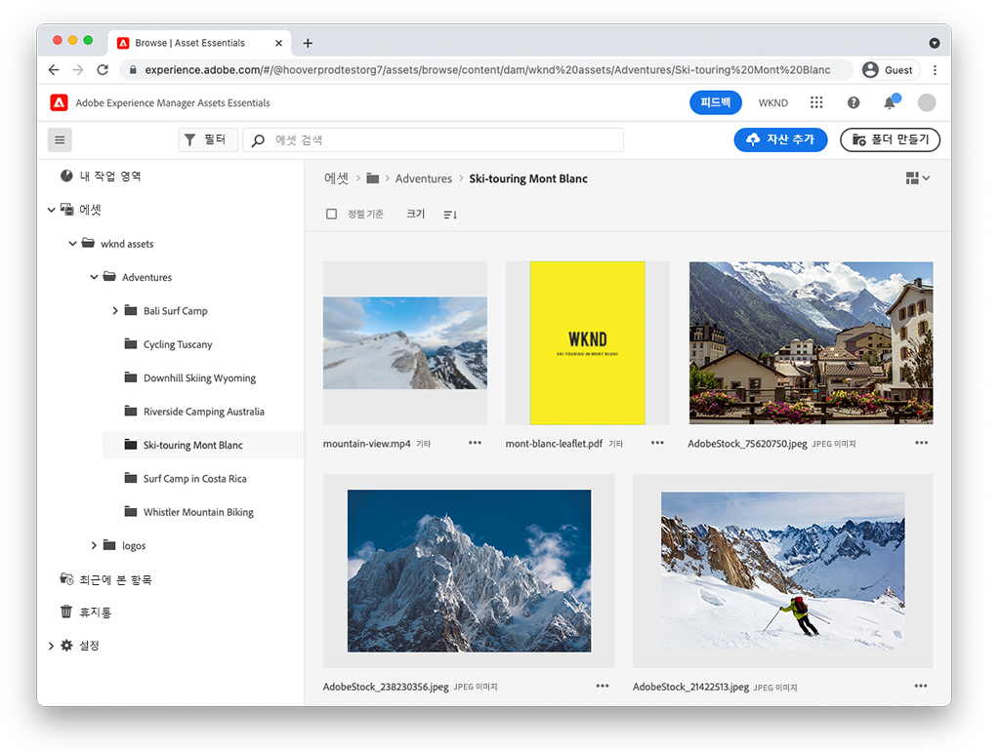

# AEM Assets Essentials

Experience Manager Assets Essentials은 간단한 자산 관리 및 공동 작업을 위한 간소화된 사용자 인터페이스를 제공합니다.

Assets Essentials을 사용하여 자산을 관리하는 방법과 Adobe 여정 Orchestrator와 통합하는 방법에 대한 비디오를 확인하십시오!

## Assets Essentials에 대해 자세히 알아보기

<table>
<td>
   
   

      <a href="./basics/managing.md">
      <strong>Assets Essentials 시작</strong>
      </a>
   

   

      <em>Assets Essentials 방법에 대한 기본 사항을 배웁니다.</em>
   

</td>
<td>
   
   

      <a href="./basics/collaborating.md">
      <strong>공동 작업 Assets Essentials</strong>
      </a>
   

   

      <em>Assets Essentials이 자산의 라이프 사이클을 관리하기 위해 경량 작업 관리를 제공하는 방법에 대해 알아보십시오.</em>
   

</td>
<td>
   
   

      <a href="https://experienceleague.adobe.com/docs/journey-optimizer-learn/tutorials/create-messages/create-email-content-with-the-message-editor.html">
      <strong>Adobe Journey Optimizer</strong>
      </a>
   

   

      <em>Assets Essentials과 Adobe Journey Optimizer이 통합하는 방법을 알아봅니다!</em>
   

</td>
</table>
