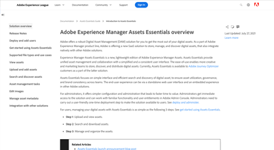

# Assets Essentials 비디오

Experience Manager Assets Essentials는 간단한 에셋 관리 및 공동 작업을 위한 간소화된 사용자 인터페이스를 제공합니다.

이 비디오에서 Assets Essentials을 사용하여 에셋을 관리하는 방법과 Adobe Workfront 및 Adobe 여정 Orchestrator와 통합하는 방법에 대해 알아보십시오.

## Assets Essentials에 대해 자세히 알아보기

<table>
<td>
   
   

      <a href="./basics/managing.md">
      <strong>Assets Essentials 시작</strong>
      </a>
   

   

      <em>Assets Essentials의 기본 사항을 알아보세요!</em>
   

</td>
<td>
   
   

      <a href="https://experienceleague.adobe.com/docs/experience-manager-assets-essentials/help/introduction.html">
      <strong>Assets Essentials 설명서</strong>
      </a>
   

   

      <em>Assets Essentials 제품 설명서를 확인하십시오!</em>
   

</td>
<td>
   
   

      <a href="https://experienceleague.adobe.com/docs/journey-optimizer-learn/tutorials/create-messages/create-email-content-with-the-message-editor.html?lang=ko-KR">
      <strong>Adobe Journey Optimizer 통합</strong>
      </a>
   

   

      <em>Assets Essentials을 Adobe Journey Optimizer과 통합하는 방법을 알아보세요!</em>
   

</td>
</table>
