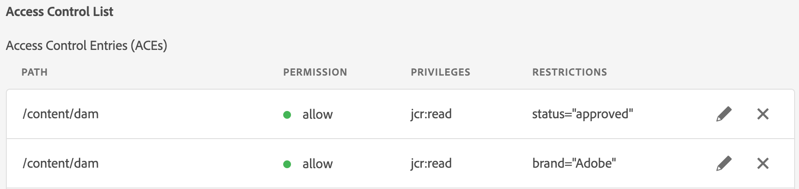

# 메타데이터 기반 권한{#metadata-driven-permissions}

메타데이터 기반 권한은 폴더 구조가 아닌 에셋 메타데이터 속성을 기반으로 AEM Assets 작성자에 대한 액세스 제어 결정을 허용하는 데 사용되는 기능입니다. 이 기능을 사용하면 에셋 상태, 유형 또는 사용자가 정의하는 모든 사용자 지정 메타데이터 속성과 같은 특성을 평가하는 액세스 제어 정책을 정의할 수 있습니다.

예를 살펴보겠습니다. 크리에이티브가 자신의 작업을 AEM Assets에 캠페인 관련 폴더로 업로드합니다. 이는 사용이 승인되지 않은 작업 진행 중인 자산일 수 있습니다. 마케터가 이 캠페인에 대해 승인된 자산만 보도록 하려고 합니다. 메타데이터 속성을 사용하여 자산이 승인되었으며 마케터가 사용할 수 있음을 나타낼 수 있습니다.

## 작동 방법

메타데이터 기반 권한 활성화에는 &quot;상태&quot; 또는 &quot;브랜드&quot;와 같은 액세스 제한을 유도하는 에셋 메타데이터 속성 정의가 포함됩니다. 그런 다음 이러한 속성을 사용하여 특정 속성 값을 가진 에셋에 액세스할 수 있는 사용자 그룹을 지정하는 액세스 제어 항목을 만들 수 있습니다.

## 사전 요구 사항

메타데이터 기반 권한을 설정하려면 최신 버전으로 업데이트된 AEM as a Cloud Service 환경에 액세스해야 합니다.

## OSGi 구성 {#configure-permissionable-properties}

메타데이터 기반 권한을 구현하려면 개발자가 AEM as a Cloud Service에 OSGi 구성을 배포해야 합니다. 이를 통해 특정 에셋 메타데이터 속성을 통해 메타데이터 기반 권한을 강화할 수 있습니다.

1. 액세스 제어에 사용할 자산 메타데이터 속성을 결정합니다. 속성 이름은 자산의 `jcr:content/metadata` 리소스에 있는 JCR 속성 이름입니다. 이 경우 `status`(이)라는 속성이 됩니다.
1. AEM Maven 프로젝트에서 OSGi 구성 `com.adobe.cq.dam.assetmetadatarestrictionprovider.impl.DefaultRestrictionProviderConfiguration.cfg.json`을(를) 만듭니다.
1. 작성된 파일에 다음 JSON 붙여넣기:

   ```json
   {
     "restrictionPropertyNames":[
       "status",
       "brand"
     ],
     "enabled":true
   }
   ```

1. 속성 이름을 필수 값으로 바꿉니다.

## 기본 에셋 권한 재설정

제한 기반 액세스 제어 항목을 추가하기 전에 Assets에 대한 권한 평가의 대상인 모든 그룹(예: &quot;기여자&quot; 또는 이와 유사한 그룹)에 대한 읽기 액세스를 먼저 거부하도록 새로운 최상위 항목을 추가해야 합니다.

1. __도구 → 보안 → 권한__ 화면으로 이동합니다.
1. __기여자__ 그룹(또는 모든 사용자 그룹이 속한 다른 사용자 지정 그룹)을 선택하십시오
1. 화면 오른쪽 상단의 __ACE 추가__&#x200B;를 클릭합니다.
1. __경로__&#x200B;에 대해 `/content/dam` 선택
1. __권한__&#x200B;에 대해 `jcr:read` 입력
1. __권한 유형__&#x200B;에 대해 `Deny` 선택
1. 제한에서 `rep:ntNames`을(를) 선택하고 `dam:Asset`을(를) __제한 값__(으)로 입력하십시오.
1. __저장__ 클릭


## 메타데이터별 자산에 대한 액세스 권한 부여

이제 액세스 제어 항목을 추가하여 [구성된 에셋 메타데이터 속성 값](#configure-permissionable-properties)을(를) 기반으로 사용자 그룹에 읽기 액세스 권한을 부여할 수 있습니다.

1. __도구 → 보안 → 권한__ 화면으로 이동합니다.
1. 에셋에 액세스할 수 있는 사용자 그룹 선택
1. 화면 오른쪽 상단의 __ACE 추가__&#x200B;를 클릭합니다.
1. __경로__&#x200B;에 대해 `/content/dam`(또는 하위 폴더) 선택
1. __권한__&#x200B;에 대해 `jcr:read` 입력
1. __권한 유형__&#x200B;에 대해 `Allow` 선택
1. __제한__&#x200B;에서 OSGi 구성에서 [구성된 에셋 메타데이터 속성 이름 중 하나를 선택하십시오](#configure-permissionable-properties)
1. __제한 값__ 필드에 필요한 메타데이터 속성 값을 입력하십시오.
1. 액세스 제어 항목에 제한을 추가하려면 __+__ 아이콘을 클릭하십시오.
1. __저장__ 클릭


## 적용된 메타데이터 기반 권한

예제 폴더에는 두 개의 자산이 있습니다.


권한을 구성하고 그에 따라 에셋 메타데이터 속성을 설정하면 사용자(이 경우 마케터 사용자)에게 승인된 에셋만 표시됩니다.


## 이점 및 고려 사항

메타데이터 기반 권한의 이점은 다음과 같습니다.

- 특정 속성에 따라 에셋 액세스를 미세하게 제어할 수 있습니다.
- 폴더 구조에서 액세스 제어 정책을 분리하여 보다 유연한 자산 구성을 허용합니다.
- 여러 메타데이터 속성을 기반으로 복잡한 액세스 제어 규칙을 정의할 수 있습니다.

>[!NOTE]
>
> 주의해야 할 사항:
> 
> - 메타데이터 속성은 __문자열 같음__(`=`)을 사용하여 제한에 대해 평가됩니다. (`>`) 또는 날짜 속성보다 큰 경우 다른 데이터 형식 또는 연산자는 아직 지원되지 않습니다.
> - 제한 속성에 대해 여러 값을 허용하려면 &quot;유형 선택&quot; 드롭다운에서 동일한 속성을 선택하고 새 제한 값(예: `status=approved`, `status=wip`)을 입력한 다음 &quot;+&quot;를 클릭하여 항목에 제한을 추가하여 액세스 제어 항목에 추가 제한을 추가할 수 있습니다
> 
> - __AND 제한__&#x200B;이(가) 지원됩니다. 속성 이름이 다른 단일 액세스 제어 항목의 여러 제한(예: `status=approved`, `brand=Adobe`)은 AND 조건으로 평가됩니다. 즉, 선택한 사용자 그룹에는 `status=approved AND brand=Adobe`이(가) 있는 자산에 대한 읽기 액세스 권한이 부여됩니다
> 
> - __OR 제한__&#x200B;은(는) 메타데이터 속성 제한이 있는 새 액세스 제어 항목을 추가하여 지원됩니다. 예를 들어 제한이 `status=approved`인 단일 항목과 `brand=Adobe`인 단일 항목이 `status=approved OR brand=Adobe`(으)로 평가됩니다.
> 
