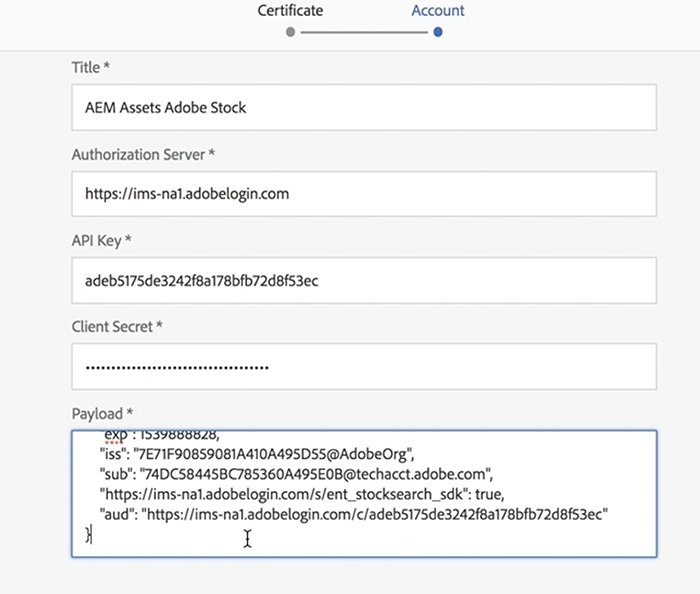

# AEM Assets{#using-adobe-stock-assets-with-aem-assets}에서 Adobe Stock 사용

AEM 6.4.2은 AEM에서 바로 Adobe Stock 에셋을 검색, 미리 보기, 저장 및 라이선스를 부여할 수 있는 기능을 제공합니다. 조직은 이제 Adobe Stock Enterprise 플랜과 AEM Assets을 통합하여 이제 AEM의 강력한 에셋 관리 기능과 함께 라이선스가 부여된 에셋을 크리에이티브 및 마케팅 프로젝트에 광범위하게 사용할 수 있습니다.

>[!VIDEO](https://video.tv.adobe.com/v/24678/?quality=9&learn=on)

>[!NOTE]
>
>통합에는 서비스 팩 2가 적어도 배포된 [엔터프라이즈 Adobe Stock 플랜](https://landing.adobe.com/en/na/products/creative-cloud/ctir-4625-stock-for-enterprise/index.html) 및 AEM 6.4가 필요합니다. AEM 6.4 서비스 팩 세부 정보는 [릴리스 노트](https://helpx.adobe.com/experience-manager/6-4/release-notes/sp-release-notes.html)를 참조하십시오.

Adobe Stock 및 AEM Assets 통합을 통해 컨텐츠 작성자 및 마케터는 크리에이티브 또는 마케팅 목적으로 스톡 에셋에 라이선스를 손쉽게 부여하고 사용할 수 있습니다. Omni Search를 사용하여 위치 필터를 Adobe Stock으로 추가하거나 AEM Assets 주 탐색 간을 탐색하고 Adobe Stock Coral UI 검색 아이콘을 클릭하여 Stock 에셋 검색을 수행할 수 있습니다.

## 기능

### 검색 및 저장

* AEM 작업 영역을 종료하지 않고도 Adobe Stock 에셋 검색을 수행할 수 있습니다.
* 에셋 라이선스를 부여하지 않고도 미리 볼 수 있도록 Adobe Stock 에셋을 저장할 수 있습니다.
* AEM Assets에 Adobe Stock 에셋 라이선스 부여 및 저장 기능
* AEM Assets UI 내에서 Adobe Stock에서 유사한 에셋을 검색하는 기능
* Adobe Stock 웹 사이트의 AEM Assets 내 Stock Search에서 선택한 에셋 보기
* 라이선스가 부여된 에셋 파일은 식별이 용이한 파란색 라이선스 배지를 통해 표시됩니다.

### 자산 메타데이터

* 라이선스가 부여된 에셋은 AEM Assets에 저장됩니다. 자산 속성에는 별도의 자산 메타데이터 탭 아래에 Stock 메타데이터가 포함됩니다.
* 에셋 메타데이터에 라이선스 참조 추가

### 에셋 스톡 프로필

* 사용자는 *사용자 > 내 환경 설정 > Stock 구성*&#x200B;에서 Adobe Stock 프로필을 선택할 수 있습니다.
* 필수 및 선택적 참조를 자산 라이센스 창에 추가할 수 있습니다.
* 지역을 기반으로 자산 라이선스 창의 언어 환경 설정을 선택하는 기능

### 필터

* 사용자는 자산 유형, 방향 및 유사한 보기를 기준으로 스톡 에셋을 필터링할 수 있습니다
* 에셋 유형에는 사진, 일러스트레이션, 벡터, 비디오, 템플릿, 3D, 프리미엄, 에디토리얼
* 방향에는 가로, 세로 및 정사각형이 포함됩니다.
* 비슷한 보기 필터를 사용하려면 Adobe Stock 파일 번호가 필요합니다.

### 액세스 제어

* 관리자는 Adobe Stock 클라우드 서비스 구성을 설정할 때 특정 사용자/그룹에 스톡 에셋에 라이선스를 부여할 수 있는 권한을 제공할 수 있습니다.
* 특정 사용자/그룹에 스톡 에셋에 라이선스를 부여할 권한이 없는 경우 *Stock 에셋 검색/에셋 라이선스* 기능이 비활성화됩니다.

## AEM Assets{#set-up-adobe-stock-with-aem-assets}으로 Adobe Stock 설정

AEM 6.4.2은 AEM에서 바로 Adobe Stock 에셋을 검색, 미리 보기, 저장 및 라이선스를 부여할 수 있는 기능을 제공합니다. 이 비디오에서는 Adobe I/O 콘솔을 사용하여 AEM Assets으로 Adobe 주식을 설정하는 방법을 간략히 설명합니다.

>[!VIDEO](https://video.tv.adobe.com/v/25043/?quality=12&learn=on)

>[!NOTE]
>
>Adobe Stock Cloud 서비스 구성의 경우 PROD 환경 및 라이센스 에셋 경로를 /content/dam으로 선택해야 합니다. 환경 필드는 다음 AEM 릴리스에서 제거되며 라이선스가 부여된 에셋 경로는 향후 기능에 포함되어 있으며 이 필드에 대한 지원은 다음 AEM 릴리스에서 제공될 예정입니다.

>[!NOTE]
>
>통합에는 [기업 Adobe Stock 플랜](https://landing.adobe.com/en/na/products/creative-cloud/ctir-4625-stock-for-enterprise/index.html) 및 최소 [서비스 팩 2](https://www.adobeaemcloud.com/content/marketplace/marketplaceProxy.html?packagePath=/content/companies/public/adobe/packages/cq640/servicepack/AEM-6.4.2.0)가 배포되는 AEM 6.4가 필요합니다. AEM 6.4 서비스 팩 세부 정보는 [릴리스 노트](https://helpx.adobe.com/experience-manager/6-4/release-notes/sp-release-notes.html)를 참조하십시오. 통합을 설정하려면 [Adobe I/O 콘솔](https://console.adobe.io/), [Adobe Admin Console](https://adminconsole.adobe.com/) 및 Adobe Experience Manager에 대한 관리 권한이 필요합니다.

### 설치 {#installations}

* AEM 6.4의 경우 [AEM 서비스 팩 2](https://www.adobeaemcloud.com/content/marketplace/marketplaceProxy.html?packagePath=/content/companies/public/adobe/packages/cq640/servicepack/AEM-6.4.2.0)를 설치한 다음 cq-dam-stock-integration-content-1.0.4.zip 파일을 다시 설치해야 합니다.
* 통합을 설정하려면 [Adobe I/O 콘솔](https://console.adobe.io/), [Adobe Admin Console](https://adminconsole.adobe.com/) 및 Adobe Experience Manager에 대한 관리 권한이 있어야 합니다.

#### Adobe I/O 콘솔 {#set-up-adobe-ims-configuration-using-adobe-i-o-console}을(를) 사용하여 Adobe IMS 구성을 설정합니다.

1. **도구 > 보안**&#x200B;에서 Adobe IMS 기술 계정 구성을 만듭니다.
2. *클라우드 솔루션*&#x200B;을 *Adobe Stock*&#x200B;으로 선택하고 새 인증서를 만들거나 구성에 대한 기존 인증서를 다시 사용합니다.
3. Adobe I/O 콘솔으로 이동하고 *Adobe Stock*&#x200B;에 대한 새 서비스 계정 통합을 만듭니다.
4. 2단계에서 Adobe Stock 서비스 계정 통합으로 인증서를 업로드합니다.
5. 필요한 Adobe Stock 프로파일 구성을 선택하고 서비스 통합을 완료합니다.
6. 통합 세부 정보를 사용하여 Adobe IMS 기술 계정 구성을 완료합니다.
7. Adobe IMS 기술 계정을 사용하여 액세스 토큰을 받을 수 있는지 확인하십시오.

#### Adobe Stock Cloud Services {#set-up-adobe-stock-cloud-services} 설정

1. **도구 > Cloud Services 아래에 Adobe Stock에 대한 새 클라우드 서비스 구성을 만듭니다.**
2. *Adobe Stock Cloud* 구성에 대해 위 섹션에 만든 *Adobe IMS 구성*&#x200B;을 선택합니다.

3. **ENVIRONMENT**&#x200B;를 PROD로 선택해야 합니다. 스테이징 환경은 지원되지 않으며 AEM의 다음 릴리스에서 제거됩니다.
4. **라이선스 자산** 경로는 /content/dam 아래의 모든 디렉토리를 가리킬 수 있습니다. 이 필드에 대한 기능 지원이 AEM의 차기 릴리스에서 추가될 예정입니다.
5. 로케일을 선택하고 설정을 완료합니다.
6. Adobe Stock Cloud 서비스에 사용자/그룹을 추가하여 특정 사용자 또는 그룹에 대한 액세스를 활성화할 수도 있습니다.

### 추가 리소스

* [Enterprise Stock 플랜](https://landing.adobe.com/en/na/products/creative-cloud/ctir-4625-stock-for-enterprise/index.html)
* [AEM 6.4 서비스 팩 2 릴리스 노트](https://helpx.adobe.com/experience-manager/6-4/release-notes/sp-release-notes.html)
* [AEM 및 Adobe Stock 통합](https://helpx.adobe.com/experience-manager/6-5/assets/using/aem-assets-adobe-stock.html#IntegrateAEMandAdobeStock)
* [Adobe I/O 콘솔 통합 API](https://www.adobe.io/apis/cloudplatform/console/authentication/gettingstarted.html)
* [Adobe Stock API 문서](https://www.adobe.io/apis/creativecloud/stock/docs.html)