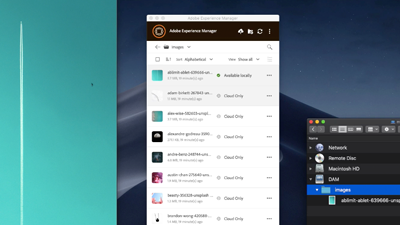

# 개요 {#overview}

Adobe Experience Manager 에셋은 AEM Platform의 디지털 에셋 관리 툴로 사용자는 웹 기반의 저장소에서 디지털 에셋(이미지, 비디오, 문서 및 오디오 클립)을 제작, 관리 및 공유할 수 있습니다. 이 사용자 안내서에는 AEM Assets의 다양한 기능과 기능에 대한 비디오 및 자습서가 포함되어 있습니다.

## 새로운 기능

* **[워터마크(비디오)](./advanced/watermarks.md)**

   *AEM에서 Cloud Service으로 에셋 표현물을 워터마킹하는 방법 살펴보기*

* **[기본 권한(비디오)](./configuring/baseline-permissions.md)**

   *기준 권한으로 AEM Assets을 구성하는 방법 및 이유 살펴보기*

* **[자동 시작 워크플로우(비디오)](./configuring/auto-start-workflows.md)**

   *업로드되거나 재처리된 자산에 대해 AEM 워크플로우를 자동으로 호출하는 방법 살펴보기*

* **[처리 프로필(비디오)](./configuring/processing-profiles.md)**

   *자산 마이크로 서비스를 호출하여 자산 변환 방법 살펴보기*

* **[자산 컬렉션 사용(비디오)](./search-and-discovery/collections.md)**

   *AEM Assets의 컬렉션이 자산을 구성하고 검색하는 새로운 방법을 확인하세요*

## 직원 선택

<table>
<td>
   
   

      <a href="./creative-workflows/aem-desktop-app.md">
      <strong>AEM 데스크탑 앱 사용</strong>
      </a>
   

   

      <em>데스크탑에서 바로 AEM의 에셋에 액세스</em>
   

</td>
<td>
   
   

      <a href="./advanced/asset-insights-launch-tutorial.md">
      <strong>Launch에서 AEM Asset Insights 사용</strong>
      </a>
   

   

      <em>자산 사용 방법에 대한 통찰력 확보</em>
   

</td>
<td>
   
   

      <a href="./dynamic-media/dynamic-media-overview-feature-video-use.md">
      <strong>다이내믹 미디어 개요</strong>
      </a>
   

   

      <em>다이내믹 미디어를 사용하여 미디어 컨텐츠 관리 및 액세스</em>
   

</td>
</table>

## 추가 리소스

* [Experience League - AEM 살펴보기](https://experienceleague.adobe.com/#recommended/solutions/experience-manager)
* [AEM Assets 설명서](https://helpx.adobe.com/kr/experience-manager/6-5/assets/user-guide.html)
* [AEM as a Cloud Service 자습서](/help/cloud-service/overview.md)
* [AEM Sites 자습서](/help/sites/overview.md)
* [AEM Forms 자습서](/help/forms/overview.md)
* [AEM Foundation 자습서](/help/foundation/overview.md)
