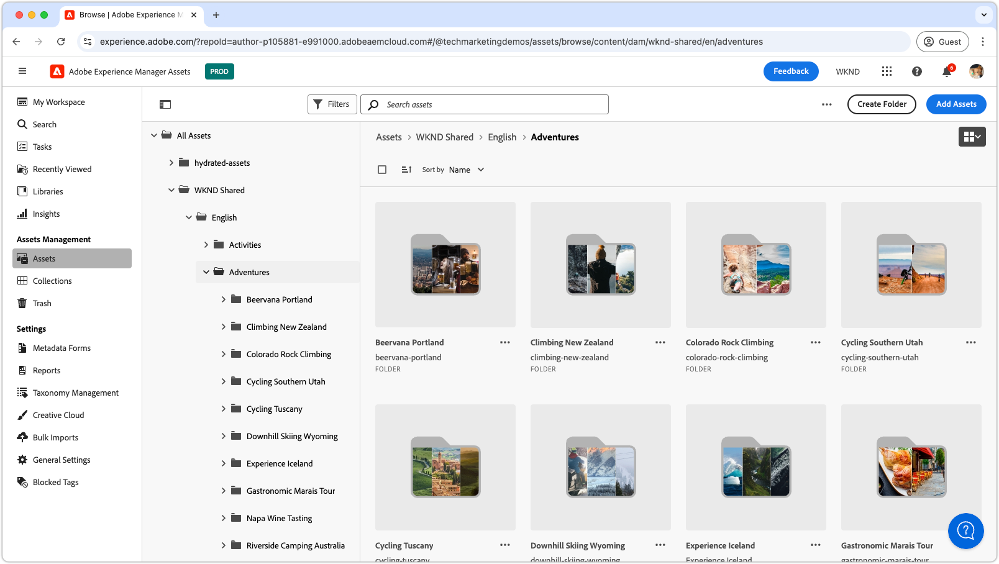

# Assets 보기용 비디오 플레이리스트

{align=center}

이러한 목록을 탐색하여 AEM Assets as a Cloud Service Assets 재생 보기, 구성, 최적화 사용 및 크리에이티브 워크플로우와의 원활한 통합을 다룹니다. AEM Assetsas a Cloud Service 으로 성공하는 데 필요한 통찰력을 얻으십시오.

## Assets 보기 구성

AEM Assetsas a Cloud Service 가 팀 및 프로젝트에 원활하게 작동하도록 하기 위한 설정 및 구성을 시작하십시오.

<!-- CARDS

* https://experienceleague.adobe.com/en/playlists/experience-manager-all-configure-administrative-access
* https://experienceleague.adobe.com/en/playlists/experience-manager-assets-get-started-assets-essentials

-->
<!-- START CARDS HTML - DO NOT MODIFY BY HAND -->

    

        

            

                <figure class="image x-is-16by9">
                    
                </figure>
            

            

                

                    

                        <a href="https://experienceleague.adobe.com/en/playlists/experience-manager-all-configure-administrative-access" target="_blank" rel="referrer" title="Experience Manager에 대한 관리 액세스 구성">Experience Manager에 대한 관리 액세스 구성</a>
                    

                    
사용자가 Adobe IMS를 사용하여 AEM as a Cloud Service에 인증하는 방법과 Adobe IMS 사용자, 사용자 그룹 및 제품 프로필을 사용하여 AEM 및 해당 기능에 대한 액세스를 제어하는 방법을 탐색합니다.

                

                <a href="https://experienceleague.adobe.com/en/playlists/experience-manager-all-configure-administrative-access" target="_blank" rel="referrer" class="spectrum-Button spectrum-Button--outline spectrum-Button--primary spectrum-Button--sizeM" style="align-self: flex-start; margin-top: 1rem;">
                    시청
                </a>
            

        

    

    

        

            

                <figure class="image x-is-16by9">
                    
                </figure>
            

            

                

                    

                        <a href="https://experienceleague.adobe.com/en/playlists/experience-manager-assets-get-started-assets-essentials" target="_blank" rel="referrer" title="AEM Assets Essentials 시작하기">AEM Assets Essentials 시작</a>
                    

                    
AEM Assets Essentials가 어떻게 부서의 에셋 관리를 간소화할 수 있는지 알아봅니다.

                

                <a href="https://experienceleague.adobe.com/en/playlists/experience-manager-assets-get-started-assets-essentials" target="_blank" rel="referrer" class="spectrum-Button spectrum-Button--outline spectrum-Button--primary spectrum-Button--sizeM" style="align-self: flex-start; margin-top: 1rem;">
                    시청
                </a>
            

        

    

<!-- END CARDS HTML - DO NOT MODIFY BY HAND -->

## Assets 보기 시작하기

Pro처럼 Assets 보기 인터페이스를 탐색하고 자산을 효율적으로 관리하는 도구와 기술을 배웁니다.

<!-- CARDS

* https://experienceleague.adobe.com/en/playlists/experience-manager-assets-generate-image-assets-with-adobe-firefly
* https://experienceleague.adobe.com/en/playlists/experience-manager-assets-assets-view-search-use

-->
<!-- START CARDS HTML - DO NOT MODIFY BY HAND -->

    

        

            

                <figure class="image x-is-16by9">
                    
                </figure>
            

            

                

                    

                        <a href="https://experienceleague.adobe.com/en/playlists/experience-manager-assets-generate-image-assets-with-adobe-firefly" target="_blank" rel="referrer" title="Adobe Firefly을 사용하여 이미지 Assets 생성">Adobe Firefly을 사용하여 이미지 Assets 생성</a>
                    

                    
AEM Assets이 Adobe Firefly 및 Gen AI를 사용하여 콘텐츠 속도를 높이는 방법에 대해 알아봅니다.

                

                <a href="https://experienceleague.adobe.com/en/playlists/experience-manager-assets-generate-image-assets-with-adobe-firefly" target="_blank" rel="referrer" class="spectrum-Button spectrum-Button--outline spectrum-Button--primary spectrum-Button--sizeM" style="align-self: flex-start; margin-top: 1rem;">
                    시청
                </a>
            

        

    

    

        

            

                <figure class="image x-is-16by9">
                    
                </figure>
            

            

                

                    

                        <a href="https://experienceleague.adobe.com/en/playlists/experience-manager-assets-assets-view-search-use" target="_blank" rel="referrer" title="AEM Assets Assets 보기에서 검색하여 Assets 찾기">AEM Assets Assets 보기에서 검색하여 Assets 찾기</a>
                    

                    
AEM Assets Assets 보기 검색을 통해 에셋을 빠르고 쉽게 찾는 방법에 대해 알아봅니다.

                

                <a href="https://experienceleague.adobe.com/en/playlists/experience-manager-assets-assets-view-search-use" target="_blank" rel="referrer" class="spectrum-Button spectrum-Button--outline spectrum-Button--primary spectrum-Button--sizeM" style="align-self: flex-start; margin-top: 1rem;">
                    시청
                </a>
            

        

    

<!-- END CARDS HTML - DO NOT MODIFY BY HAND -->

## 크리에이티브 워크플로우와 AEM Assets 연결

AEM Assetsas a Cloud Service 과 크리에이티브 도구를 통합하여 원활한 공동 작업을 수행할 수 있도록 함으로써 통합적이고 효율적인 워크플로를 보장합니다.

<!-- CARDS

* https://experienceleague.adobe.com/en/playlists/experience-manager-assets-manage-creative-workflows-with-workfront-and-assets-essentials

-->
<!-- START CARDS HTML - DO NOT MODIFY BY HAND -->

    

        

            

                <figure class="image x-is-16by9">
                    
                </figure>
            

            

                

                    

                        <a href="https://experienceleague.adobe.com/en/playlists/experience-manager-assets-manage-creative-workflows-with-workfront-and-assets-essentials" target="_blank" rel="referrer" title="Workfront 및 Assets Essentials을 사용하여 크리에이티브 워크플로 관리">Workfront 및 Assets Essentials을 사용하여 Creative 워크플로 관리</a>
                    

                    
Adobe Workfront 및 Experience Manager Assets Essentials가 조직에서 크리에이티브 워크플로우를 관리하는 데 어떻게 도움이 되는지에 대해 알아봅니다.

                

                <a href="https://experienceleague.adobe.com/en/playlists/experience-manager-assets-manage-creative-workflows-with-workfront-and-assets-essentials" target="_blank" rel="referrer" class="spectrum-Button spectrum-Button--outline spectrum-Button--primary spectrum-Button--sizeM" style="align-self: flex-start; margin-top: 1rem;">
                    시청
                </a>
            

        

    

<!-- END CARDS HTML - DO NOT MODIFY BY HAND -->

