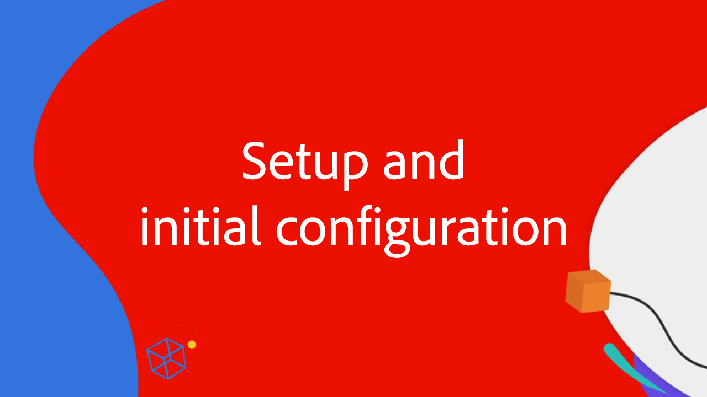

# 향상된 커넥터와 Workfront 및 AEM Assets 통합

4부로 구성된 이 비디오 시리즈에서 Adobe의 Workfront 및 Experience Manager Assets 전문가와 함께 향상된 커넥터를 사용하여 Workfront과 AEM Assets을 통합하는 방법을 시연하고 논의하십시오.

이 4부로 구성된 전문가 시리즈는 제품 관리자, 컨설턴트 및 Adobe 파트너와 같은 Adobe 전문가 그룹이 다음에 대해 논의합니다.

1. [Workfront 및 AEM에서 초기 설정 구성 수행](./setup.md)
2. [Workfront 사용자 정의 양식과 AEM 간의 메타데이터 동기화 구성](./custom-forms.md)
3. [AEM Tags, 프로젝트 연결 폴더, Adobe 에셋 링크 및 폴더 메타데이터 스키마를 사용하여 값 최대화](./aem-tags-project-linked-folders-and-folder-metadata.md)
4. [고급 AEM 워크플로우를 사용하여 AEM 및 Workfront과 기타 고급 설정 전반의 비즈니스 프로세스 능률화](./advanced-settings-and-workflows.md)

<table>
  <td>
      
      

         <a href="./setup.md"><strong>설정 및 초기 구성</strong></a>
          <em>1/4 부</em>
      

      

         
         Workfront for Experience Manager 강화 커넥터의 초기 구성을 설정하고 수행하는 방법에 대해 알아봅니다.
      

   </td>
   <!-- Workfront custom forms and metadata mapping -->
   <td>
      
      

         <a href="./custom-forms.md"><strong>Workfront 사용자 정의 양식 및 메타데이터 매핑</strong></a>
          <em>2/4 부</em>
      

      

         
         Workfront 사용자 정의 양식과 이 양식을 Experience Manager Assets 메타데이터 스키마에 매핑하여 데이터를 동기화하는 방법에 대해 알아봅니다.
      

    </td>
    <!-- AEM Tags, project linked folders, and folder metadata -->
    <td>
      
      

         <a href="./aem-tags-project-linked-folders-and-folder-metadata.md"><strong>AEM 태그, 프로젝트 연결 폴더 및 폴더 메타데이터</strong></a>
          <em>3/4부</em> 
      

      

         
            Workfront에서 AEM 분류법을 추진하고, 프로젝트 연결 폴더를 사용하고, 데이터를 AEM 에셋 폴더 메타데이터로 변환하는 방법에 대해 알아봅니다.
      

   </td>   
   <!-- Advanced workflows -->
    <td>
      
      

         <a href="./advanced-settings-and-workflows.md"><strong>고급 설정 및 워크플로</strong></a>
          <em>4/4부</em>
      

      

         
            Workfront for AEM 강화 커넥터의 고급 설정에 대해 알아보고 고급 워크플로우를 사용하여 데이터 동기화를 관리합니다.
      

   </td>
  </tr>  
</tbody></table>
