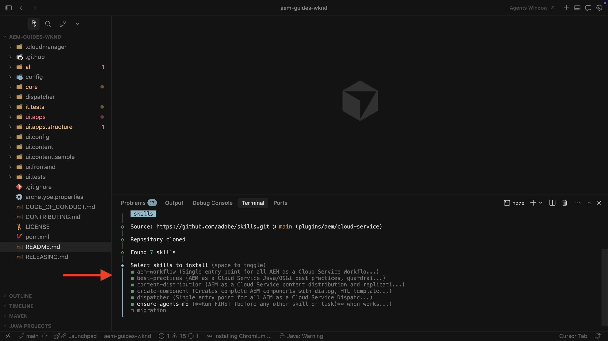

# AI 지원 개발

AI 지원 개발은 `AGENTS.md`, 에이전트 스킬 및 MCP 서버와 함께 AI 기반 IDE 또는 코딩 에이전트를 사용하여 AEM as a Cloud Service 프로젝트에 대한 고품질의 프로덕션 준비 코드를 생성하는 데 도움이 됩니다.

[Cursor](https://www.cursor.com/), [Visual Studio Code의 GitHub Copilot](https://code.visualstudio.com/docs/copilot/overview), [Cloud Code](https://code.claude.com/docs/en/overview) 및 유사한 AI 기반 IDE 및 코딩 에이전트와 같은 도구는 몇 가지 주요 방법으로 도움이 됩니다.

- **더 빠른 반복**: 원하는 기능 또는 변경을 설명하는 자연어 프롬프트에서 코드를 생성하거나 리팩터링합니다.
- **학습 지원**: 메시지가 표시되면 익숙하지 않은 코드 경로, 구성, 개념 또는 모범 사례를 설명합니다.

그러나 이러한 이점은 코딩 에이전트가 사용할 수 있는 _컨텍스트_&#x200B;에 따라 크게 달라집니다. 일반 교육 데이터와 단일 리포지토리 스냅숏은 프로덕션 준비 AEM 코드를 안정적으로 생성하는 데 종종 _충분하지 않습니다_.

## AI만으로는 부족한 이유

적절한 컨텍스트가 없으면 AI 기반 IDE 또는 코딩 에이전트를 통해 AI 모델이 다음을 수행할 수 있습니다.

- **환각 API 또는 주기**: AEM as a Cloud Service 모범 사례 또는 최신 기능과 맞지 않는 코드 또는 구성을 제안합니다.
- **절차 단계 누락**: 코드 리포지토리 또는 교육 데이터에 표시되지 않는 필수 단계를 생략합니다.
- **프로젝트 표준에서 드리프트**: 구성 요소, OSGi 서비스, 워크플로우 또는 Dispatcher 구성에 대해 설정된 패턴을 무시합니다.

이 공백은 AI 지원 개발 _생산성_ 및 _신뢰성_&#x200B;을 만들기 위해 _구조화된 컨텍스트_(에이전트 기술 및 AGENTS.md) 및 _런타임 가시성_(MCP 서버)이 필수적이 되는 곳입니다.

## Adobe이 AI 지원 개발에 어떻게 도움이 됩니까?

AEM as a Cloud Service 프로젝트의 경우 Adobe은 다음을 제공합니다.

- [AI 코딩 에이전트를 위한 Adobe 기술](https://github.com/adobe/skills)을 통해 에이전트 기술 및 AGENTS.md
- [소프트웨어 배포](https://experience.adobe.com/#/downloads/content/software-distribution/en/aemcloud.html?fulltext=mcp*&1_group.propertyvalues.property=.%2Fjcr%3Acontent%2Fmetadata%2Fdc%3AsoftwareType&1_group.propertyvalues.operation=equals&1_group.propertyvalues.0_values=software-type%3Atooling&orderby=%40jcr%3Acontent%2Fjcr%3AlastModified&orderby.sort=desc&layout=list&p.offset=0&p.limit=3) 포털을 통해 AEM SDK 및 로컬 Dispatcher용 로컬 MCP 서버
- IDE 또는 채팅 응용 프로그램에서 콘텐츠 및 Cloud Manager 워크플로를 위한 Adobe 호스팅 AEM MCP 서버 — [AEM의 MCP 서버](../mcp/overview.md) 참조

다음 섹션에서는 각 항목을 요약합니다. AI 지원 개발을 위한 설치 및 연습을 보려면 이 페이지 끝에 있는 **설정** 및 **사용 사례** 섹션을 사용하십시오.

## 에이전트 스킬이란?

에이전트 기술은 코딩 에이전트 _실제 작업을 안정적으로 수행_&#x200B;하는 데 도움이 되는 _절차 지식 또는 전문 지식_&#x200B;입니다. 자세한 내용은 [에이전트 기술](https://agentskills.io)을 참조하세요.

AEM as a Cloud Service 프로젝트의 경우 에이전트 기술은 [AI 코딩 에이전트를 위한 Adobe 기술](https://github.com/adobe/skills) 리포지토리에서 사용할 수 있습니다.

## AGENTS.md란?

AGENTS.md는 코딩 에이전트 _프로젝트에서 작업_&#x200B;하는 데 도움이 되도록 _컨텍스트 및 지침_&#x200B;을 제공합니다. 자세한 내용은 [AGENTS.md](https://agents.md/)을(를) 참조하십시오.

AEM as a Cloud Service 프로젝트의 경우 `ensure-agents-md` 부트스트랩 스킬이 저장소 루트 **이(가) 누락된 경우**&#x200B;에 **AGENTS.md**&#x200B;을(를) 만듭니다. 이 기술은 프로젝트(예: 루트 `pom.xml` 및 모듈)를 검사하고 정적 파일을 사용하는 대신 맞춤 지침을 생성합니다. **AGENTS.md**&#x200B;이(가) 이미 있는 경우 **덮어쓰지 않음**&#x200B;입니다.

파일이 존재하면 편집하여 팀이나 조직의 모범 사례에 대한 컨텍스트와 지침을 추가할 수 있습니다. 이 스킬은 **AGENTS.md**&#x200B;을(를) 참조하는 **CLAUDE.md**&#x200B;을(를) 만들 수도 있으므로 Claude 기반 도구는 동일한 지침을 선택합니다.

## MCP 서버란?

MCP 서버는 디버깅, 검사, 실행 및 변경 내용 유효성 검사와 같은 작업을 지원하는 [Model Context Protocol](https://modelcontextprotocol.io/)을 통해 도구와 데이터를 코딩 에이전트에 표시합니다. MCP 서버는 워크스테이션(**local**)에서 실행되거나 호스팅 서비스(**remote**)로 실행될 수 있습니다.

AEM SDK 및 Dispatcher에 대한 **로컬 개발**&#x200B;의 경우 [소프트웨어 배포](https://experience.adobe.com/#/downloads/content/software-distribution/en/aemcloud.html?fulltext=mcp*&1_group.propertyvalues.property=.%2Fjcr%3Acontent%2Fmetadata%2Fdc%3AsoftwareType&1_group.propertyvalues.operation=equals&1_group.propertyvalues.0_values=software-type%3Atooling&orderby=%40jcr%3Acontent%2Fjcr%3AlastModified&orderby.sort=desc&layout=list&p.offset=0&p.limit=3) 포털에서 다음 **로컬 MCP 서버**&#x200B;를 설치하십시오.

- **AEM 빠른 시작 로컬 MCP 서버**: 문제 해결 및 개발을 지원하기 위해 로컬 AEM SDK 인스턴스의 실시간 런타임 데이터를 표시합니다. 자세한 내용은 [AEM 빠른 시작 MCP 서버](https://experienceleague.adobe.com/en/docs/experience-manager-cloud-service/content/ai-in-aem/local-development-with-ai-tools#aem-quickstart-mcp-server)를 참조하십시오.
- **Dispatcher 로컬 MCP 서버**: 로컬 Dispatcher 인스턴스의 런타임 유효성 검사 및 검사를 사용하도록 설정합니다. 자세한 내용은 [Dispatcher MCP 서버](https://experienceleague.adobe.com/en/docs/experience-manager-cloud-service/content/ai-in-aem/local-development-with-ai-tools#dispatcher-mcp-server)를 참조하십시오.

Adobe에서 호스팅하는 AEM MCP 서버(예: 컨텐츠, 읽기 전용 컨텐츠 및 Cloud Manager)의 경우 [AEM의 MCP 서버](../mcp/overview.md)를 참조하십시오.

## 설정

<!-- 
CARDS
{target = _self}

* ./setup/agent-skills.md
    {title = Set up AEM Agent Skills}
    {description = Learn how to set up AEM Agent Skills for AI-assisted development.}
    {image = ./assets/agent-skills/select-aem-agent-skills-to-install.png}
    {cta = Install AEM Agent Skills}

-->
<!-- START CARDS HTML - DO NOT MODIFY BY HAND -->

    

        

            

                <figure class="image x-is-16by9">
                    
                </figure>
            

            

                

                    

                        <a href="./setup/agent-skills.md" target="_self" rel="referrer" title="AEM 에이전트 스킬 설정">AEM 에이전트 기술 설정</a>
                    

                    
AI 지원 개발을 위한 AEM 에이전트 기술을 설정하는 방법에 대해 알아봅니다.

                

                <a href="./setup/agent-skills.md" target="_self" rel="referrer" class="spectrum-Button spectrum-Button--outline spectrum-Button--primary spectrum-Button--sizeM" style="align-self: flex-start; margin-top: 1rem;">
                    AEM 에이전트 기술 설치
                </a>
            

        

    

<!-- END CARDS HTML - DO NOT MODIFY BY HAND -->

## 사용 사례

<!-- 
CARDS
{target = _self}

* ./use-cases/component-development.md    
    {title = Create AEM Component with AI-assisted development}
    {description = Learn how to use AI-assisted development to develop AEM components.}
    {image = ./assets/component-development/review-generated-code.png}
    {cta = Create AEM Component}
-->
<!-- START CARDS HTML - DO NOT MODIFY BY HAND -->

    

        

            

                <figure class="image x-is-16by9">
                    
                </figure>
            

            

                

                    

                        <a href="./use-cases/component-development.md" target="_self" rel="referrer" title="AI 지원 개발로 AEM 구성 요소 만들기">AI 지원 개발로 AEM 구성 요소 만들기</a>
                    

                    
AI 지원 개발을 사용하여 AEM 구성 요소를 개발하는 방법에 대해 알아봅니다.

                

                <a href="./use-cases/component-development.md" target="_self" rel="referrer" class="spectrum-Button spectrum-Button--outline spectrum-Button--primary spectrum-Button--sizeM" style="align-self: flex-start; margin-top: 1rem;">
                    AEM 구성 요소 만들기
                </a>
            

        

    

<!-- END CARDS HTML - DO NOT MODIFY BY HAND -->

## 추가 리소스

- [AI 도구를 사용한 로컬 개발](https://experienceleague.adobe.com/en/docs/experience-manager-cloud-service/content/ai-in-aem/local-development-with-ai-tools)

- [AI 코딩 에이전트를 위한 Adobe 기술](https://github.com/adobe/skills)

- [AGENTS.md](https://agents.md/)

- [에이전트 스킬](https://agentskills.io/home)
