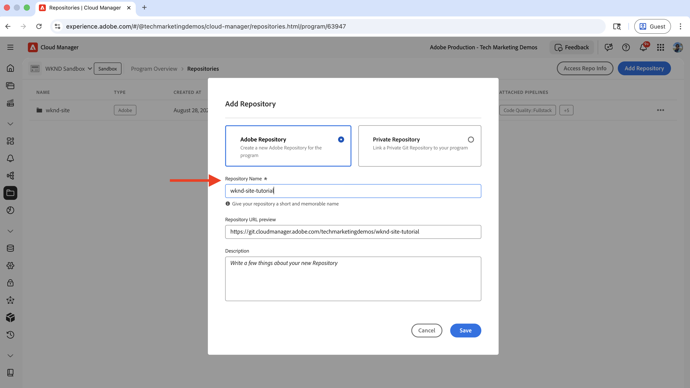
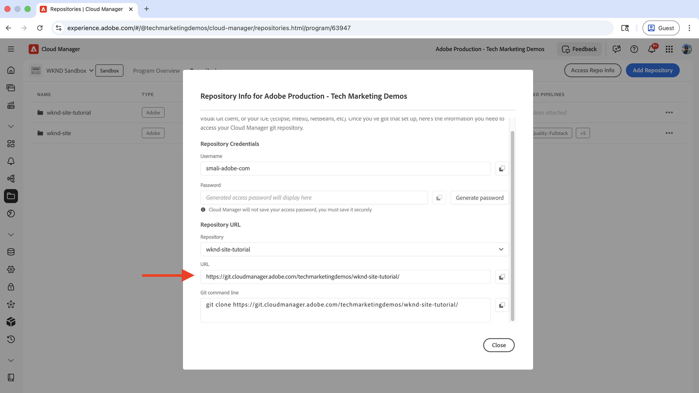
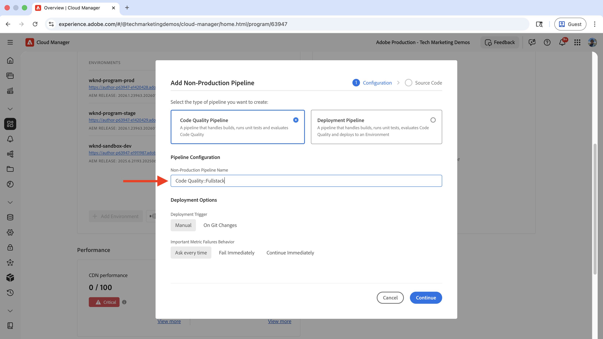
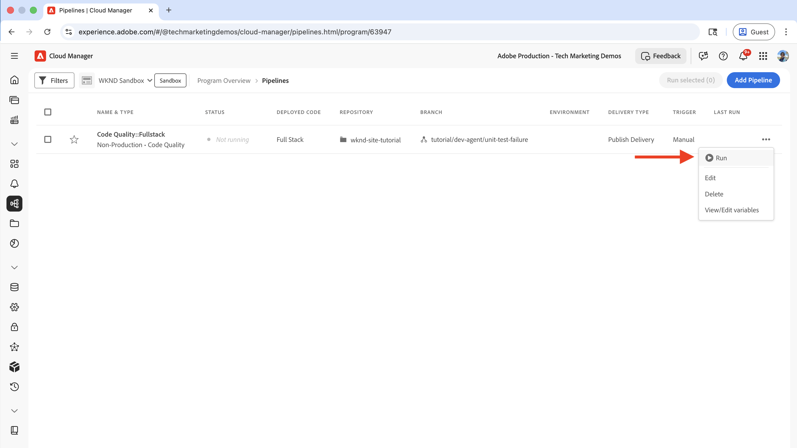
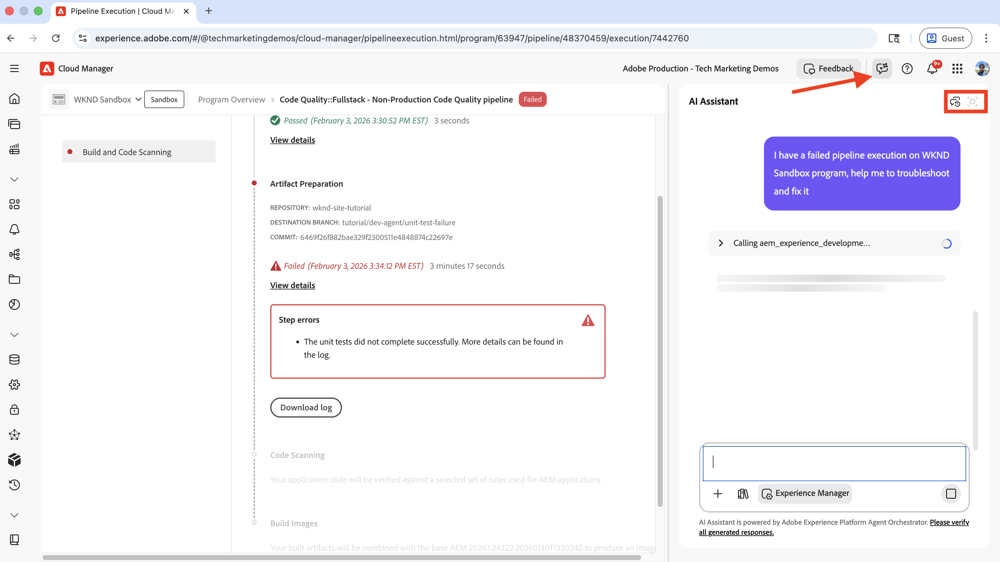
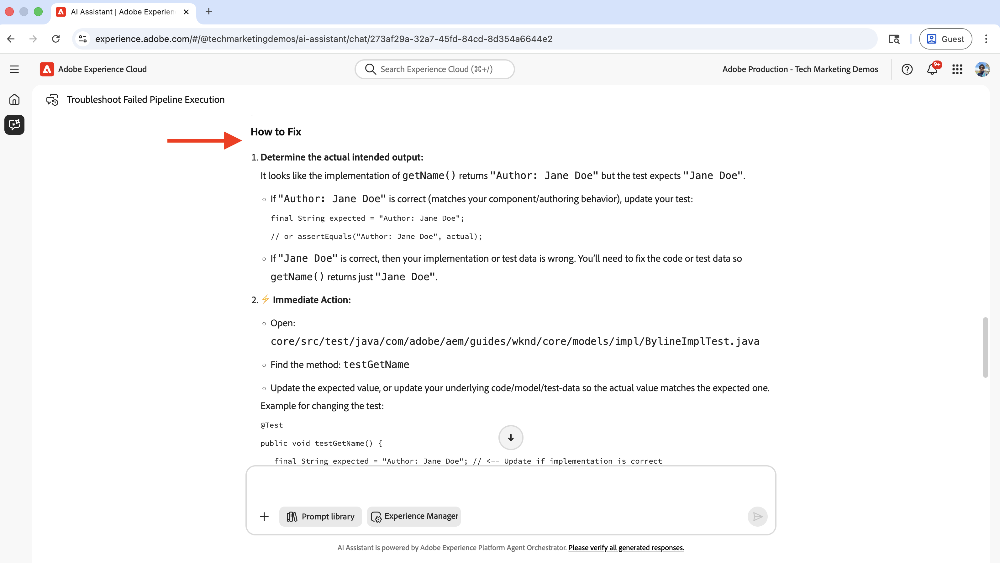

# AEM 개발 에이전트를 사용한 CI/CD 파이프라인 문제 해결

AEM 개발 에이전트를 사용하여 실패한 CI/CD 파이프라인의 문제를 해결하고 수정하는 방법을 알아봅니다.

AEM 개발 에이전트는 개발자, DevOps 엔지니어 및 관리자를 포함한 기술 팀이 **AI 기반 지침 및 작업을 제공**&#x200B;하여 _워크플로를 가속화_&#x200B;할 수 있도록 지원합니다.

>[!TIP]
>
> 또한 AEM에서 사용 가능한 에이전트의 전체 목록, 기능 및 액세스 방법에 대해서는 [AEM as a Cloud Service의 에이전트 개요](https://experienceleague.adobe.com/en/docs/experience-manager-cloud-service/content/ai-in-aem/agents/overview)를 참조하십시오.


## 개요

AEM 개발 에이전트는 실패한 CI/CD 파이프라인을 나열, 문제 해결 및 수정하는 기능을 비롯한 여러 기능을 제공합니다. AI Assistant를 통해 AEM Development Agent를 호출하여 특정 사용 사례를 해결할 수 있습니다.

이 자습서에서는 [WKND Sites 프로젝트](https://github.com/adobe/aem-guides-wknd)를 사용하여 AEM 개발 에이전트를 사용하여 실패한 CI/CD 파이프라인의 문제를 해결하고 수정하는 방법을 보여줍니다. 모든 AEM 프로젝트에도 동일한 원칙이 적용됩니다.

이 자습서에서는 `BylineImpl.java` 파일의 단위 테스트 실패를 소개하여 AEM Development Agent의 파이프라인 문제 해결 기능을 보여 줍니다.

## 사전 요구 사항

이 자습서를 수행하려면 다음이 필요합니다.

- AEM의 AI Assistant 및 에이전트 가 활성화되었습니다. 자세한 내용은 [AEM에서 AI 설정](./setup.md)을 참조하십시오. 이 문서에 언급된 플레이그라운드에는 AEM Development Agent 기능이 없습니다.
- 개발자 또는 프로그램 관리자 역할을 가진 Adobe [Cloud Manager](https://my.cloudmanager.adobe.com/)에 액세스합니다. 자세한 내용은 [역할 정의](https://experienceleague.adobe.com/en/docs/experience-manager-cloud-manager/content/requirements/users-and-roles#role-definitions)를 참조하십시오.
- AEM as a Cloud Service 환경
- [Beta 프로그램](https://experienceleague.adobe.com/en/docs/experience-manager-cloud-service/content/release-notes/release-notes/release-notes-current#aem-beta-programs)을 통해 AEM의 에이전트에 액세스
- 로컬 컴퓨터에 복제된 [WKND Sites 프로젝트](https://github.com/adobe/aem-guides-wknd)

### AEM Development Agent의 현재 기능

튜토리얼로 이동하기 전에 AEM 개발 에이전트의 현재 기능을 검토해 보겠습니다.

- CI/CD 파이프라인 및 상태 나열
- **코드 품질** 및 _배포_ 유형을 모두 포함하여 실패한 _전체 스택_ 파이프라인의 문제를 해결하고 수정하십시오.
- _전체 스택_ 파이프라인의 _빌드_(배포 가능한 아티팩트를 만드는 코드 컴파일) 및 **코드 품질**(SonarQube 규칙을 통한 정적 코드 분석) 단계가 지원됩니다.

AEM Development Agent의 기능은 지속적으로 확장되고 정기적으로 업데이트됩니다. 피드백 및 제안 사항은 [aem-devagent@adobe.com](mailto:aem-devagent@adobe.com)에 전자 메일을 보내십시오.

## 설정

이 자습서를 완료하려면 다음 고급 단계를 따르십시오.

1. [WKND 사이트 프로젝트](https://github.com/adobe/aem-guides-wknd)를 복제하고 Cloud Manager Git 저장소에 푸시합니다.
2. 코드 품질 파이프라인 생성 및 구성
3. 파이프라인을 실행하고 실패한 실행을 확인합니다
4. AEM 개발 에이전트를 사용하여 실패한 파이프라인 문제를 해결하고 수정하십시오

각 단계를 자세히 살펴보겠습니다.

### WKND Sites 프로젝트를 데모 프로젝트로 사용

이 자습서에서는 WKND Sites 프로젝트의 `tutorial/dev-agent/unit-test-failure` 분기를 사용하여 AEM 개발 에이전트를 사용하는 방법을 보여줍니다. 동일한 원칙을 모든 AEM 프로젝트에 적용할 수 있습니다.

- 다음과 같이 `BylineImpl.java` 파일에 단위 테스트 오류가 도입되었습니다. 자체 AEM 프로젝트를 사용하는 경우 유사한 단위 테스트 실패를 도입할 수 있습니다.

  ```java
  ...
  @Override
  public String getName() {
      if (name != null) {
          return "Author: " + name; // This line is intentionally incorrect to introduce a unit test failure.
      }
      return name;
  }
  ...
  ```

- [WKND Sites 프로젝트](https://github.com/adobe/aem-guides-wknd)를 로컬 컴퓨터에 복제하고 프로젝트 디렉터리로 이동한 다음 `tutorial/dev-agent/unit-test-failure` 분기로 전환합니다.

  ```shell
  git clone https://github.com/adobe/aem-guides-wknd.git
  cd aem-guides-wknd
  git checkout tutorial/dev-agent/unit-test-failure
  ```

- WKND Sites 프로젝트용 새 Cloud Manager Git 저장소를 생성하고 로컬 Git 저장소에 원격으로 추가합니다.

   - Adobe [Cloud Manager](https://my.cloudmanager.adobe.com/)&#x200B;(으)로 이동하여 프로그램을 선택합니다.
   - 왼쪽 사이드바에서 **저장소**&#x200B;를 클릭합니다.
   - 오른쪽 상단 모서리에서 **저장소 추가**&#x200B;를 클릭합니다.
   - **저장소 이름**(예: &quot;wknd-site-tutorial&quot;)을 입력하고 **저장**&#x200B;을 클릭합니다. 저장소가 생성될 때까지 기다립니다.

     

   - 오른쪽 상단의 **저장소 정보 액세스**&#x200B;를 클릭하고 저장소 URL을 복사합니다.

     

   - 새로 만든 Cloud Manager Git 저장소를 로컬 Git 저장소에 원격으로 추가합니다.

     ```shell
     git remote add adobe https://git.cloudmanager.adobe.com/<your-adobe-organization>/wknd-site-tutorial/
     ```

- 로컬 Git 저장소를 Cloud Manager Git 저장소로 푸시합니다.

  ```shell
  git push adobe
  ```

  자격 증명을 입력하라는 메시지가 뜨면 Cloud Manager의 **저장소 정보** 양식에서 **사용자 이름** 및 **암호**&#x200B;을(를) 제공하세요.

### 코드 품질 파이프라인 생성 및 구성

이 자습서에서는 코드 품질 파이프라인(비프로덕션)을 사용하여 문제를 해결하기 위해 파이프라인 오류를 트리거합니다. 코드 품질 파이프라인에 대한 자세한 내용은 [CI/CD 파이프라인 소개](https://experienceleague.adobe.com/en/docs/experience-manager-cloud-service/content/implementing/using-cloud-manager/cicd-pipelines/introduction-ci-cd-pipelines#introduction)를 참조하십시오.

- Cloud Manager에서 **파이프라인** 섹션으로 이동한 다음 **추가** > **비프로덕션 파이프라인 추가**&#x200B;를 선택합니다.
- **비프로덕션 파이프라인 추가** 대화 상자에서 다음을 구성합니다.

   - **구성** 단계:
      - **파이프라인 유형**&#x200B;을(를) `Code Quality Pipeline`(으)로, **배포 트리거**&#x200B;를 `Manual`(으)로 유지합니다.
      - **비프로덕션 파이프라인 이름**&#x200B;에 대해 `Code Quality::Fullstack`을(를) 입력하십시오.

     

   - **Source 코드** 단계:
      - **전체 스택 코드** 선택
      - **저장소**&#x200B;에 대해 새로 만든 Cloud Manager Git 저장소를 선택합니다.
      - **Git 분기**&#x200B;에 대해 `tutorial/dev-agent/unit-test-failure`을(를) 선택합니다.
      - **저장** 클릭

     

- 파이프라인 항목의 세 점 메뉴에서 **실행**&#x200B;을 클릭하여 새로 만든 코드 품질 파이프라인을 실행합니다.

  


>[!IMPORTANT]
>
> 배포 파이프라인은 이 자습서에서 다루지 않습니다. 그러나 동일한 원칙을 따라 실패한 배포 파이프라인의 문제를 해결하고 수정할 수 있습니다.


### 실패한 파이프라인 실행 확인

다음 오류가 발생하여 코드 품질 파이프라인이 **아티팩트 준비** 단계에서 실패합니다.


AEM Development Agent가 없는 경우 이 파이프라인 실패는 수동 문제 해결이 필요합니다. 개발자는 로그를 확인하고 코드를 검토해야 하므로 지루하고 시간이 오래 걸립니다.

다음으로, Agentic AI가 실패한 파이프라인 실행을 해결하고 수정하는 방법을 살펴봅니다.

## AEM 개발 에이전트를 사용하여 실패한 파이프라인 문제 해결 및 수정

파이프라인 오류를 자연어로 설명하여 AEM의 AI Assistant를 사용하여 AEM Development Agent를 호출할 수 있습니다.

- 오른쪽 상단의 **AI Assistant** 아이콘을 클릭합니다.

- **Prompt**&#x200B;이라는 자연어로 파이프라인 실패 세부 정보를 입력하십시오. 예:

  ```text
  I have a failed pipeline execution on %PROGRAM-NAME% program, help me to troubleshoot and fix it.
  ```

  

  실패한 파이프라인 실행 문제를 해결하고 해결하기 위해 **AEM 개발 에이전트**&#x200B;이(가) 호출됩니다.

  >[!NOTE]
  >
  > 입력한 프롬프트가 명확하지 않은 경우 AI 도우미가 명확성을 요청하고 프롬프트를 구체화하는 데 도움이 되는 정보를 제공합니다.

- 추론이 완료되면 **전체 화면으로 열기** 아이콘을 클릭하여 자세한 문제 해결 프로세스를 확인합니다.

  

  결과에는 오류 세부 정보, 원본 파일, 줄 번호 및 문제 해결 단계가 명확한 **해결 방법** 섹션을 포함한 중요한 통찰력이 포함되어 있습니다.

- 이 경우 에이전트는 문제를 해결하기 위해 구현(`getName()` 메서드)을 변경하거나 단위 테스트(`getNameTest()` 메서드)를 업데이트할 것을 올바르게 제안했습니다. 개발자에게 실행 가능한 코드 변경 사항을 제공하면서 환각을 피하고 수동 루프 접근 방식을 사용했습니다.

  

- 제안된 코드 변경 내용으로 `BylineImpl.java` 파일을 업데이트한 다음 변경 내용을 커밋하고 Cloud Manager Git 저장소에 푸시합니다.

  ```java
  ...
  @Override
  public String getName() {
      return name;
  }
  ...
  ```

- 파이프라인을 다시 실행하고 성공적인 실행을 확인합니다.

## 추가 예

WKND Sites 프로젝트에는 종속성 누락 및 잘못된 구성과 같은 끊어진 코드 및 구성 문제에 대한 추가 예제가 포함되어 있습니다. [`tutorial/dev-agent/`(으)로 시작하는 ](https://github.com/adobe/aem-guides-wknd/branches/all?query=tutorial%2Fdev-agent&lastTab=overview)분기를 확인하여 이러한 예제를 살펴볼 수 있습니다. 변경 내용을 보려면 `tutorial/dev-agent/unit-test-failure`비교`main` 단추를 클릭하여 **분기를** 분기와 비교할 수 있습니다. 그런 다음 _변경된 파일_ 섹션을 찾습니다.


또한 AEM 개발 에이전트를 사용하는 방법에 대한 자세한 아이디어를 얻으려면 [샘플 프롬프트](https://experienceleague.adobe.com/en/docs/experience-manager-cloud-service/content/ai-in-aem/agents/development/overview#sample-prompts)를 참조하십시오.

## 요약

이 자습서에서는 AEM 개발 에이전트를 사용하여 AI Assistant를 사용하여 실패한 CI/CD 파이프라인의 문제를 해결하고 수정하는 방법에 대해 알아보았습니다. 또한 아젠틱 AI가 실행 가능한 통찰력과 코드 변경 사항을 제공하여 기술 워크플로우를 가속화하는 방법에 대해서도 배웠습니다.

AEM 개발 에이전트와 AEM의 다른 에이전트를 사용하여 워크플로를 가속화하십시오. 자세한 내용은 [AEM의 에이전트 개요](https://experienceleague.adobe.com/en/docs/experience-manager-cloud-service/content/ai-in-aem/agents/overview)를 참조하십시오.

## 추가 리소스

- [Experience Manager의 AI](./overview.md)
- [AEM의 에이전트 개요](https://experienceleague.adobe.com/en/docs/experience-manager-cloud-service/content/ai-in-aem/agents/overview)
- [개발 에이전트 개요](https://experienceleague.adobe.com/en/docs/experience-manager-cloud-service/content/ai-in-aem/agents/development/overview)
- [AEM의 에이전트 개요](https://experienceleague.adobe.com/en/docs/experience-manager-cloud-service/content/ai-in-aem/agents/overview)
