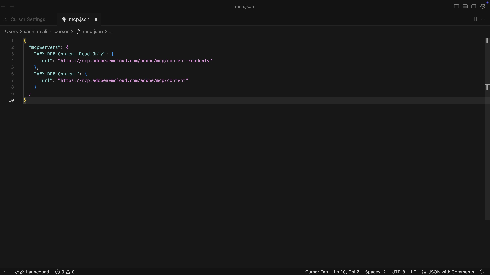
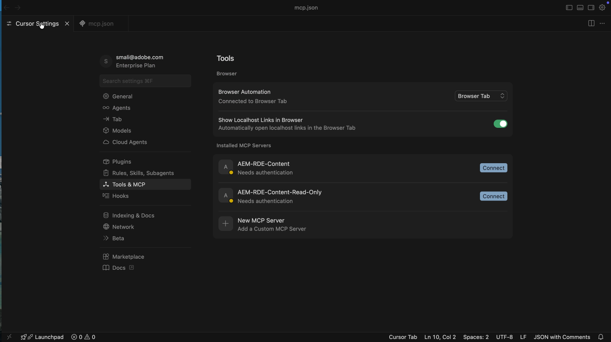
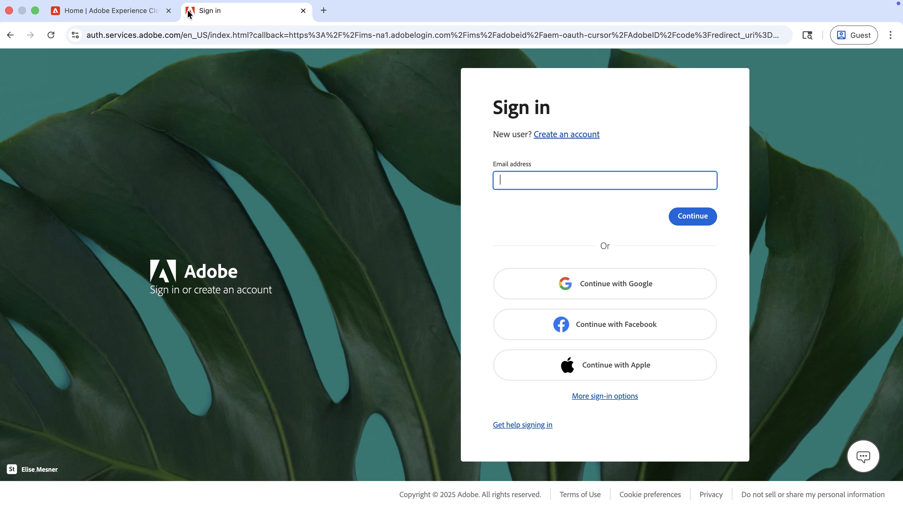
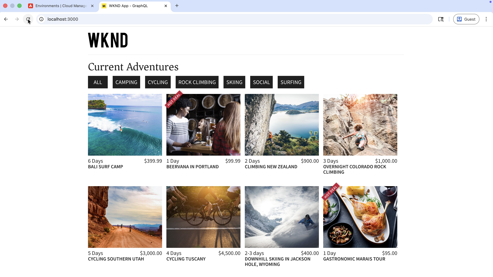

# Content MCP 서버를 사용하여 AEM 컨텐츠 작업 가속화

**커서 IDE**&#x200B;와 같은 AI 기반 IDE의 [콘텐츠 MCP 서버](https://www.cursor.com/)를 사용하여 낮은 수준의 API 코드 또는 UI 탐색 없이 자연어로 된 AEM 콘텐츠로 작업하십시오.

이 자습서에서는 MCP 흐름을 종료하지 않고 _더 낮은 AEM 환경_(RDE 또는 개발)에 대해 IDE에서 조각(예: 모험 가격)을 _검토_, _업데이트_, [WKND 모험 반응 앱](https://github.com/adobe/aem-guides-wknd-graphql/tree/main/react-app)의 변경 사항을 _확인_&#x200B;합니다.

## 개요

AEM as a Cloud Service은 IDE 또는 채팅 앱이 AEM에서 안전하게 작동할 수 있도록 _MCP 서버_&#x200B;를 제공합니다. **콘텐츠 MCP 서버**&#x200B;는 페이지, 조각 및 자산을 지원합니다. 자세한 내용은 [AEM의 MCP 서버](./overview.md)를 참조하십시오.

## 개발자의 사용 방법

[커서 IDE](https://www.cursor.com/)를 Content MCP 서버에 연결하고 아래 시나리오를 실행하십시오.

### 설정 - 커서의 콘텐츠 MCP 서버

다음 단계로 Cursor에 Content MCP 서버를 설정해 보겠습니다.

1. 컴퓨터에서 커서를 엽니다.

1. [커서] 메뉴에서 **설정** > **커서 설정**(으)로 이동하여 설정 창을 엽니다.
   

1. 왼쪽 사이드바에서 **도구 및 MCP**를 클릭하여 해당 패널을 엽니다.
   

1. **사용자 지정 MCP 추가** 또는 **새 MCP 서버**&#x200B;를 클릭하여 `mcp.json`을(를) 연 다음 이 구성에 붙여 넣으십시오.

   ```json
   {
       "mcpServers": {
           // Use this for create, read, update, and delete operations
           "AEM-RDE-Content": {
               "url": "https://mcp.adobeaemcloud.com/adobe/mcp/content"
           },
           //Use this for read-only operations
           "AEM-RDE-Content-Read-Only": {
               "url": "https://mcp.adobeaemcloud.com/adobe/mcp/content-readonly"
           }
       }
   }
   ```

   >[!CAUTION]
   >
   > 자습서를 위해 위의 구성은 이 자습서에 대해 **컨텐츠**&#x200B;와 **컨텐츠(읽기 전용)**&#x200B;를 모두 추가합니다. 실제로 **콘텐츠**&#x200B;에는 이미 모든 **콘텐츠(읽기 전용)** 오퍼와 만들기/업데이트/삭제 도구가 포함되어 있습니다.
   >
   >
   > 콘텐츠를 만들거나 수정하거나 삭제하지 않으려면 **콘텐츠(읽기 전용)**(`/content-readonly`)만 구성하고 **콘텐츠**(`/content`)는 생략하십시오. 그렇게 하면 우발적인 변화를 피할 수 있습니다.

   

1. 커서 설정 창에서 **연결**&#x200B;을 클릭하여 인증 프로세스를 시작합니다. OAuth 2.0 PKCE 흐름을 사용하여 AEM MCP 서버에 액세스할 수 있는 **사용자별 액세스 토큰**을(를) 가져옵니다.
   

1. Adobe ID으로 로그인한 다음 커서 설정 창으로 돌아갑니다.
   

1. **AEM-RDE-Content-Read-Only** 및 **AEM-RDE-Content**&#x200B;이 연결된 상태로 표시되는지 확인하십시오. 각 서버를 확장하여 해당 도구를 볼 수 있습니다.

   

### 설정 - WKND Adventures React 앱

그런 다음 커서에서 [WKND Adventures React App](https://github.com/adobe/aem-guides-wknd-graphql/tree/main/react-app)을(를) 설정합니다.

1. 컴퓨터에서 다음 두 저장소를 복제합니다.

   ```bash
   ## WKND GraphQL repo, the `react-app` folder is the WKND Adventures app
   $ git clone git@github.com:adobe/aem-guides-wknd-graphql.git
   
   ## WKND Site repo, you deploy this to RDE so the app can use its content fragments data via GraphQL
   $ git clone git@github.com:adobe/aem-guides-wknd.git
   ```

1. RDE에 [WKND 사이트](https://github.com/adobe/aem-guides-wknd) 프로젝트를 배포합니다. 자세한 단계는 [빠른 개발 환경 사용 방법](https://experienceleague.adobe.com/en/docs/experience-manager-learn/cloud-service/developing/rde/how-to-use#deploy-aem-artifacts-using-the-aem-rde-plugin)을 참조하세요.

1. IDE에서 `react-app` 폴더를 엽니다.

1. `.env.development`을(를) 편집하고 설정:
   - `REACT_APP_HOST_URI`: RDE 작성자 URL
   - `REACT_APP_AUTH_METHOD`: `basic`이(가) 될 예정
   - `REACT_APP_BASIC_AUTH_USER` 및 `REACT_APP_AEM_AUTH_PASSWORD`: `aem-headless`이(가) 됩니다(RDE에서 이 사용자를 만들고 `administrators` 그룹에 추가).

1. IDE 터미널에서 다음을 실행합니다.

   ```bash
   $ cd aem-guides-wknd-graphql/react-app
   $ npm install
   $ npm start
   ```

1. 브라우저에서 [http://localhost:3000](http://localhost:3000)&#x200B;(으)로 이동하여 WKND Adventures 앱을 봅니다.

   

### 생산성 시나리오 - AEM 콘텐츠 검토 및 업데이트

간단한 규칙이 충족되면 Adventure 카드에 _HOT DEAL_ 배너를 표시해야 한다고 가정합니다. 일반적인 접근 방식은 다음과 같습니다.

- Adventure card 구성 요소 코드 보기
- 배너를 표시할 시기에 대한 논리 추가
- AEM에서 Adventure 콘텐츠 조각 모델 확인
- 하나 이상의 어드벤처 조각 속성을 변경하여 규칙을 테스트합니다.

모험의 가격이 100달러 미만이면 _HOT DEAL_ 배너를 보여드리겠습니다.

React 앱은 RDE 환경에서 데이터를 가져오기 때문에 어드벤처 콘텐츠 조각 모델을 알고 올바른 조각 속성을 업데이트해야 합니다. 바로 AEM Content MCP Server가 도움을 줄 수 있는 내용입니다. 방법은 다음과 같습니다.

1. 커서에서 새 채팅을 열고 다음을 입력합니다.

   ```text
   I want to review my Content Fragment Models from AEM RDE, can you list the Adventure Content Fragment details.
   ```

   


   Content MCP 서버를 호출하기 전에 확인을 요청합니다. 따라서 콘텐츠 작업을 계속 제어할 수 있습니다.

   AI는 콘텐츠 MCP 서버를 사용하여 데이터를 가져온 다음 명확하고 구조화된 방식으로 제공합니다. 여기에는 콘텐츠 조각 모델 세부 정보, 조각 수 및 요약 정보가 포함됩니다.

1. _HOT DEAL_ 배너를 트리거하려면 모험 가격을 업데이트하세요. 동일한 채팅에서 다음을 시도해 보십시오.

   ```text
   Can you update adventure Beervana in Portland's price to 99.99
   ```

   

   마찬가지로 AI는 콘텐츠를 업데이트하기 전에 진행하라는 확인을 요청합니다. 또한 업데이트 전후의 콘텐츠 작업을 요약합니다.

1. React 앱에서 Beervana 카드에 이제 _HOT DEAL_ 배너가 표시되는지 확인합니다.

   

### 추가 프롬프트

IDE(Content MCP Server가 연결되어 있음)에서 이러한 콘텐츠 집중 프롬프트를 시도하여 더 많은 워크플로우와 기능을 탐색합니다.

- 콘텐츠 검색:

  ```text
  List all content fragments in the WKND Adventures folder
  
  List all WKND Site pages from US English site
  
  Can you give me page metadata for Tahoe Skiing English page? 
  
  List assets of Bali Surf camp
  
  What Content Fragment models are available in this environment?
  ```

- 콘텐츠 검색:

  ```text
  Search for content fragments that mention 'cycling'
  
  Do we have a magazine page in US English site with "Camping" in it
  ```

- 콘텐츠 업데이트:

  ```text
  In WKND US English create a copy of Downhill Skiing Wyoming as "Test Downhill Skiing Wyoming"
  
  In newly created "Test Downhill Skiing Wyoming" please change title to "Duplicated Page"
  ```

- 게시 또는 게시 취소:

  ```text
  Can you publish the page at /us/en/adventures/test-downhill-skiing-wyoming and give me publish page URL
  
  Can you unpublish the test-downhill-skiing-wyoming page
  ```

## 요약

Cursor에 AEM Content MCP 서버를 설정하고 이를 RDE(또는 개발) 환경에 연결했습니다. 그런 다음 WKND Adventures React 앱을 사용하고 자연어로 채팅하여 어드벤처 콘텐츠 조각 세부 사항을 검토합니다. 또한 각 콘텐츠 작업 전에 확인을 요청하는 AI로 조각 가격을 업데이트했습니다. 실행 중인 앱의 변경 사항을 확인했습니다. IDE에서 동일한 인간 중심 흐름을 사용하여 AEM UI로 전환하거나 낮은 수준의 API 코드를 작성하지 않고도 AEM 콘텐츠를 검토하고, 업데이트하고, 만들 수 있습니다.
