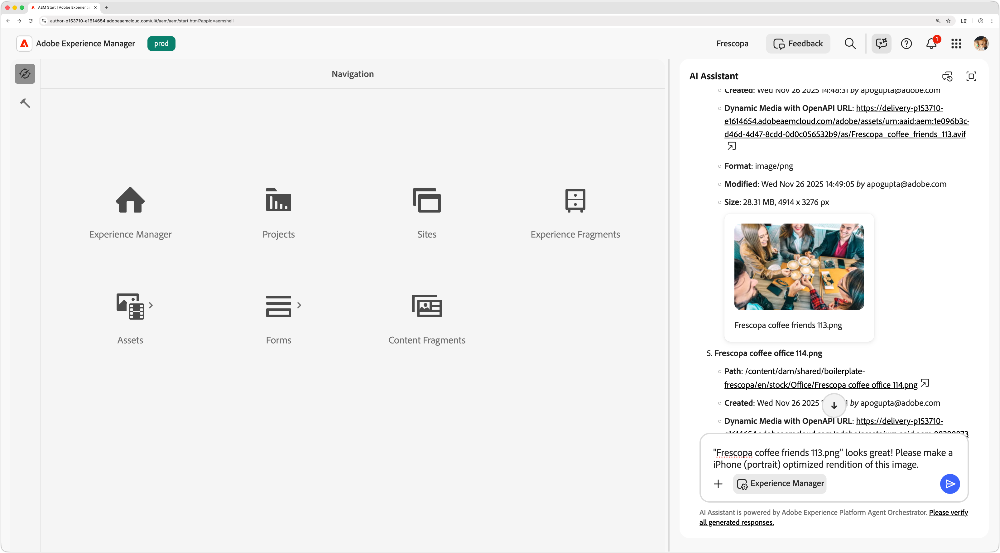

# Experience Manager의 AI

Experience Manager의 

Experience Manager as a Cloud Service은 고급 AI 기능을 제공하여 콘텐츠 관리를 향상시키고, 워크플로를 간소화하며, 사용자 경험을 향상시킵니다. 사용자는 AEM AI Assistant 및 AEM AI 에이전트와 같은 AI 기반 기능을 통합하여 작업을 자동화하고, 통찰력을 얻고, 콘텐츠 전달을 최적화할 수 있습니다.

<!-- CARDS 

* ./ai-assistant/overview.md
    {title = AEM AI Assistant}
    {description = Learn how AI Assistant provides product knowledge and support in AEM.}
    {cta = Learn}

* ./agents/overview.md
    {title = Agents in AEM}
    {description = Discover how AI-powered agents automate tasks and enhance workflows in AEM.}
    {cta = Learn}

* ./mcp/overview.md
    {title = AEM MCP Servers}
    {description = Learn how to extend AEM into your favorite AI-tools.}
    {cta = Learn}    

* ../../sites/generative-ai/generate-variations.md
    {title = Generate Variations}
    {description = Generate Variations in Adobe Experience Manager optimizes text and images for any experiences.}
    {cta = Watch}
    
* ../../assets/search-and-discovery/ai-search.md
    {title = AI Search}
    {description = Learn how AEM Assets AI Search enhances search by intelligently surfacing relevant assets and enabling smarter search experiences.}
    {cta = Watch}
-->
<!-- START CARDS HTML - DO NOT MODIFY BY HAND -->

    

        

            

                <figure class="image x-is-16by9">
                    
                </figure>
            

            

                

                    

                        <a href="./ai-assistant/overview.md" target="_blank" rel="referrer" title="AEM AI 어시스턴트">AEM AI Assistant</a>
                    

                    
AI Assistant가 AEM에서 제품 지식 및 지원을 제공하는 방법을 알아봅니다.

                

                <a href="./ai-assistant/overview.md" target="_blank" rel="referrer" class="spectrum-Button spectrum-Button--outline spectrum-Button--primary spectrum-Button--sizeM" style="align-self: flex-start; margin-top: 1rem;">
                    학습
                </a>
            

        

    

    

        

            

                <figure class="image x-is-16by9">
                    
                </figure>
            

            

                

                    

                        <a href="./mcp/overview.md" target="_blank" rel="referrer" title="AEM MCP 서버">AEM MCP 서버</a>
                    

                    
AEM을 좋아하는 AI 도구로 확장하는 방법을 알아봅니다.

                

                <a href="./mcp/overview.md" target="_blank" rel="referrer" class="spectrum-Button spectrum-Button--outline spectrum-Button--primary spectrum-Button--sizeM" style="align-self: flex-start; margin-top: 1rem;">
                    학습
                </a>
            

        

    

    

        

            

                <figure class="image x-is-16by9">
                    
                </figure>
            

            

                

                    

                        <a href="../../sites/generative-ai/generate-variations.md" target="_blank" rel="referrer" title="변형 생성">변형 생성</a>
                    

                    
Adobe Experience Manager의 변형 생성은 모든 경험에 맞게 텍스트와 이미지를 최적화합니다.

                

                <a href="../../sites/generative-ai/generate-variations.md" target="_blank" rel="referrer" class="spectrum-Button spectrum-Button--outline spectrum-Button--primary spectrum-Button--sizeM" style="align-self: flex-start; margin-top: 1rem;">
                    시청하기
                </a>
            

        

    

    

        

            

                <figure class="image x-is-16by9">
                    
                </figure>
            

            

                

                    

                        <a href="../../assets/search-and-discovery/ai-search.md" target="_blank" rel="referrer" title="AI 검색">AI 검색</a>
                    

                    
AEM Assets AI 검색이 관련 에셋을 지능적으로 표시하고 보다 스마트한 검색 경험을 활성화하여 검색을 향상시키는 방법에 대해 알아봅니다.

                

                <a href="../../assets/search-and-discovery/ai-search.md" target="_blank" rel="referrer" class="spectrum-Button spectrum-Button--outline spectrum-Button--primary spectrum-Button--sizeM" style="align-self: flex-start; margin-top: 1rem;">
                    시청하기
                </a>
            

        

    

<!-- END CARDS HTML - DO NOT MODIFY BY HAND -->
