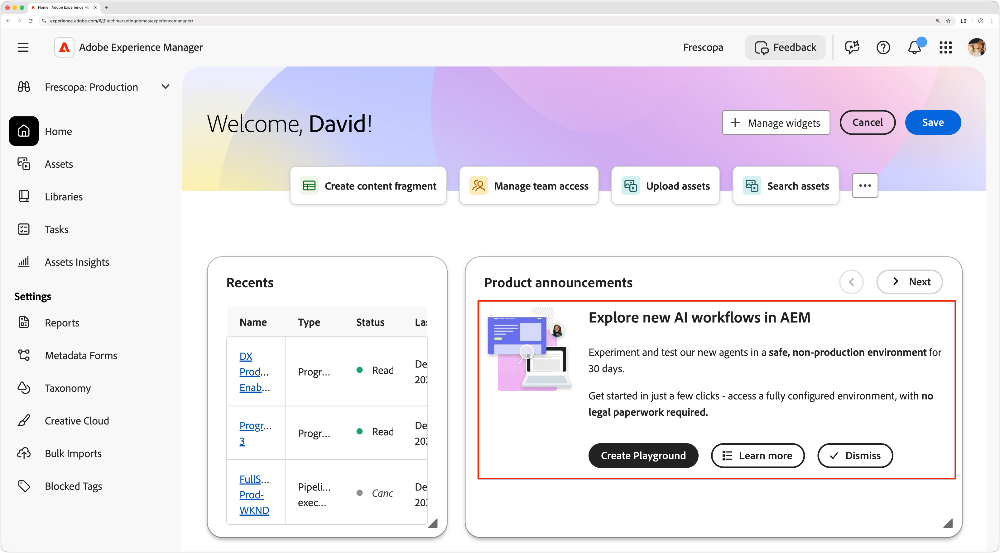

# AEM에서 AI 설정

AEM에서 AEM AI Assistant 및 에이전트를 사용하려면 Adobe Experience Manager 환경에서 액세스 권한을 설정해야 합니다. 이 안내서에서는 이러한 AI 기반 기능을 활성화하는 데 필요한 단계를 설명합니다. 놀이터 환경에서 AI 도우미를 사용하여 실험할 수도 있습니다.

## AEM AI 어시스턴트

[Adobe Admin Console](https://adminconsole.adobe.com)을(를) 사용하여 Adobe Experience Manager에서 AI Assistant에 대한 액세스를 구성하는 방법에 대해 알아봅니다. 이 단계는 사용자가 도우미에서 응답을 얻고 자동 티켓 생성을 활용할 수 있도록 하는 데 필요합니다.

>[!VIDEO](https://video.tv.adobe.com/v/3474066/?learn=on&enablevpops)

### AEM의 에이전트

AEM에서 에이전트를 사용하려면 먼저 [AEM AI Assistant](#aem-ai-assistant) 액세스가 구성되어 있어야 합니다. AEM의 에이전트는 Adobe에서 프로비저닝해야 합니다. AEM의 에이전트에 대한 액세스 권한을 요청하려면 Adobe 담당자 또는 [Adobe 지원](https://experienceleague.adobe.com/ko/support)에 문의하십시오.

## 공간

액세스 권한이 없거나 AEM에서 AEM AI Assistant 또는 에이전트를 설정할 수 없는 경우 놀이터 환경에서 해당 기능을 탐색할 수 있습니다.

AEM은 사용자가 프로덕션 환경에 영향을 주지 않고 AEM의 에이전트를 포함한 AI Assistant의 기능을 실험할 수 있는 플레이그라운드 환경을 제공합니다. 이를 통해 사용자는 안전한 환경에서 AI Assistant의 기능을 숙지할 수 있습니다.

플레이그라운드를 만들려면 [Experience Hub](https://experience.adobe.com/#/@AdobeOrg/experiencemanager/)&#x200B;(으)로 이동하여 **제품 공지** 패널에서 **플레이그라운드 만들기**&#x200B;를 선택하십시오. 플레이그라운드가 설정되면 액세스하기 위한 세부 정보가 포함된 이메일을 받게 됩니다.
