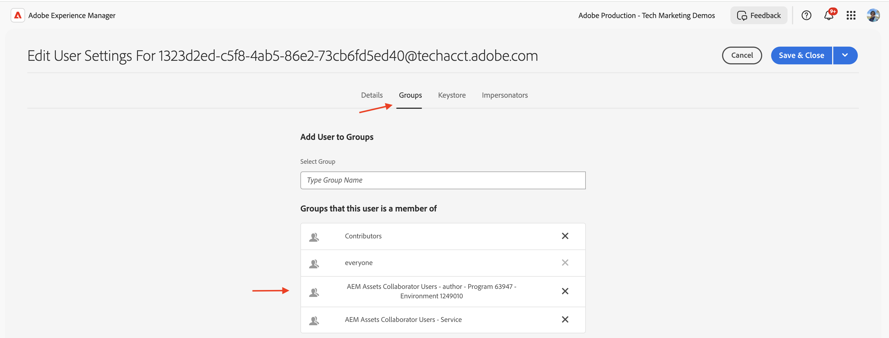

# API 자격 증명 및 제품 프로필 관리

OpenAPI 기반 AEM API에 대한 _자격 증명 및 제품 프로필_&#x200B;을 관리하는 방법을 알아봅니다.

이 자습서에서는 다음을 추가하거나 제거하는 방법을 알아봅니다.

- _자격 증명_: AEM API에 대한 인증을 제공합니다.
- _제품 프로필_: AEM 리소스에 액세스할 수 있는 자격 증명에 대한 권한(또는 권한 부여)을 제공합니다.

## 배경

AEM API를 사용하는 경우 Adobe Developer Console(또는 ADC) 프로젝트에서 _자격 증명_ 및 _제품 프로필_&#x200B;을 정의해야 합니다. 다음 스크린샷에서는 AEM Assets 작성자 API에 대한 _자격 증명_ 및 _제품 프로필_&#x200B;을 볼 수 있습니다.

_자격 증명_&#x200B;은(는) API에 대한 인증 메커니즘을 제공합니다. _제품 프로필_&#x200B;이(가) 자격 증명에 대한 _권한(또는 권한 부여)_&#x200B;을 부여하여 AEM 리소스에 액세스할 수 있도록 합니다. API 요청은 애플리케이션 또는 사용자를 대신하여 수행될 수 있습니다.

제품 프로필이 하나 이상의 _서비스_&#x200B;와(과) 연결되어 있습니다. AEM as a Cloud Service에서 _서비스_&#x200B;는 저장소 노드에 대해 사전 정의된 ACL(액세스 제어 목록)이 있는 사용자 그룹을 나타내므로 세분화된 권한 관리가 가능합니다.

API가 성공적으로 호출되면 ADC 프로젝트의 자격 증명을 나타내는 사용자가 제품 프로필 및 서비스 구성과 일치하는 사용자 그룹과 함께 AEM 작성자 서비스에서 만들어집니다.

위의 시나리오에서 사용자 `1323d2...`은(는) AEM Author 서비스에서 만들어지고 사용자 그룹 `AEM Assets Collaborator Users - Service` 및 `AEM Assets Collaborator Users - author - Program XXX - Environment XXX`의 구성원입니다.

## 자격 증명 추가 또는 제거

AEM API는 인증을 위해 다음 유형의 자격 증명을 지원합니다.

1. **OAuth 서버 간**: 컴퓨터 간 상호 작용을 위해 설계되었습니다.
1. **OAuth 웹 앱**: 클라이언트 애플리케이션에서 백엔드 서버와의 사용자 기반 상호 작용을 위해 설계되었습니다.
1. **OAuth 단일 페이지 앱**: 클라이언트 응용 프로그램에 백엔드 서버 없이 사용자 중심의 상호 작용을 위해 설계되었습니다.

다양한 유형의 자격 증명을 사용하여 다양한 사용 사례를 지원할 수 있습니다.

모든 자격 증명은 ADC 프로젝트에서 관리됩니다.

>[!BEGINTABS]

>[!TAB 자격 증명 추가]

AEM API에 대한 자격 증명을 추가하려면 ADC 프로젝트의 **API** 섹션으로 이동한 다음 **다른 자격 증명 연결**&#x200B;을 클릭합니다. 그런 다음 특정 자격 증명 유형에 대한 지침을 따릅니다.

>[!TAB 자격 증명 제거]

AEM API 자격 증명을 제거하려면 ADC 프로젝트의 **API** 섹션에서 선택한 다음 **자격 증명 삭제**&#x200B;를 클릭합니다.

>[!ENDTABS]

## 제품 프로필 추가 또는 제거

_제품 프로필_&#x200B;은(는) 자격 증명에 대한 _권한(또는 권한 부여)_&#x200B;을 제공하여 AEM 리소스에 액세스합니다. _제품 프로필_&#x200B;에서 제공한 권한은 _제품 프로필_&#x200B;과(와) 연결된 _서비스_&#x200B;을(를) 기반으로 합니다. 대부분의 _서비스_&#x200B;은(는) _서비스_&#x200B;와(과) 같은 이름을 가진 AEM 인스턴스의 사용자 그룹을 통해 AEM 리소스에 _읽기_ 권한을 제공합니다.

자격 증명(기술 계정 사용자)에 AEM 리소스의 _만들기, 업데이트, 삭제_(CUD)와 같은 추가 권한이 필요한 경우가 있습니다. 이러한 경우 필요한 권한을 제공하는 _서비스_&#x200B;와 연결된 새 _제품 프로필_&#x200B;을 추가해야 합니다.

예를 들어 AEM Assets 작성자 API 호출이 GET이 아닌 요청](../use-cases/invoke-api-using-oauth-s2s.md#403-error-for-non-get-requests)에 대해 [403 오류를 받으면 **AEM 관리자 - 작성자 - 프로그램 XXX - 환경 XXX** _제품 프로필_&#x200B;을 추가하여 문제를 해결할 수 있습니다.

>[!CAUTION]
>
>**AEM 관리자** 서비스는 Experience Manager에 대한 _전체_ 관리 액세스 권한을 제공합니다. 또는 [서비스 권한](./services-user-group-permission-management.md)을 업데이트하여 필요한 권한만 제공할 수 있습니다.

>[!BEGINTABS]

>[!TAB 제품 프로필 추가]

AEM API용 제품 프로필을 추가하려면 ADC 프로젝트의 **API** 섹션에서 **제품 프로필 편집**&#x200B;을 클릭하고 **API 구성** 대화 상자에서 원하는 제품 프로필을 선택한 다음 변경 사항을 저장하십시오.

필요한 서비스와 연결된 원하는 제품 프로필(예: **AEM 관리자 - 작성자 - 프로그램 XXX - 환경 XXX**)을 선택한 다음 변경 사항을 저장합니다.

**AEM 관리자 - 작성자 - 프로그램 XXX - 환경 XXX** 제품 프로필은 **AEM 관리자** 서비스 및 **AEM Assets API 사용자** 서비스 모두에 연결되어 있습니다. 후자가 없으면 사용 가능한 제품 프로필 목록에 제품 프로필이 표시되지 않습니다.

이제 자산 메타데이터 업데이트에 대한 **PATCH** 요청이 문제 없이 작동합니다.

>[!TAB 제품 프로필 제거]

AEM API의 제품 프로필을 제거하려면 ADC 프로젝트의 **API** 섹션에서 **제품 프로필 편집**&#x200B;을 클릭하고 **API 구성** 대화 상자에서 원하는 제품 프로필을 선택 취소하고 변경 사항을 저장하십시오.

>[!ENDTABS]

## 요약

Adobe Developer Console(ADC) 프로젝트에서 _자격 증명 및 제품 프로필_&#x200B;을(를) 사용하여 AEM API에 대한 인증 메커니즘과 권한을 변경하는 방법에 대해 알아보았습니다.
