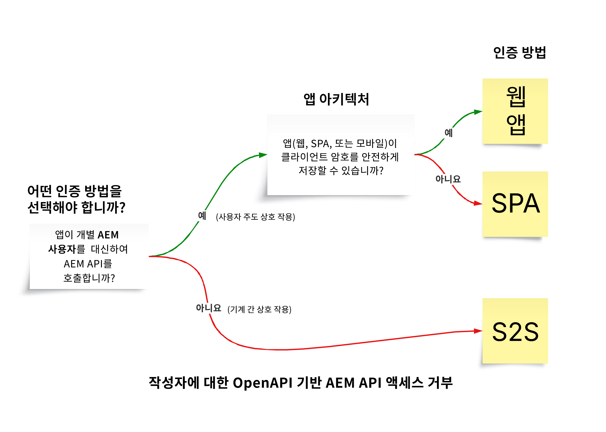
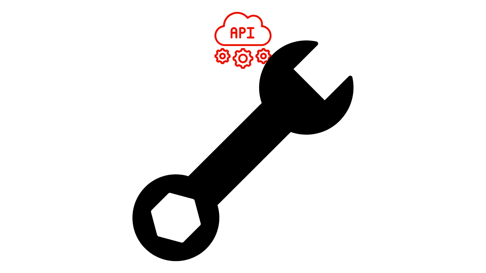

# OpenAPI 기반 AEM API

>[!IMPORTANT]
>
>OpenAPI 기반 AEM API는 AEM as a Cloud Service에서만 사용할 수 있으며 AEM 6.X와 호환되지 않습니다.

인증 지원, 핵심 개념, Adobe API 액세스 방법 등 OpenAPI 기반 AEM API에 대해 알아봅니다.

[OpenAPI 사양](https://swagger.io/specification/)&#x200B;(이전 명칭: Swagger)은 RESTful API를 정의하는 데 널리 사용되는 표준입니다. AEM as a Cloud Service는 여러 가지 OpenAPI 사양 기반 API(또는 간단히 OpenAPI 기반 AEM API)를 제공하므로, AEM의 작성자 또는 게시 서비스 유형과 상호 작용하는 사용자 정의 애플리케이션을 보다 쉽게 만들 수 있습니다. 아래 몇 가지 예가 있습니다.

**Sites**

- [Sites API](https://developer.adobe.com/experience-cloud/experience-manager-apis/api/stable/sites/): 콘텐츠 조각 작업을 위한 API입니다.

**Assets**

- [Folders API](https://developer.adobe.com/experience-cloud/experience-manager-apis/api/experimental/folders/): 폴더 생성, 나열 및 삭제 등 폴더 작업을 위한 API입니다.

- [Assets Author API](https://developer.adobe.com/experience-cloud/experience-manager-apis/api/experimental/assets/author/): 자산 및 해당 메타데이터 작업을 위한 API입니다.

**Forms**

- [Forms Communications API](https://developer.adobe.com/experience-cloud/experience-manager-apis/api/experimental/document/): 양식 및 문서 작업을 위한 API입니다.

향후 릴리스에서는 추가적인 사용 사례를 지원하기 위해 더 많은 OpenAPI 기반 AEM API가 추가될 예정입니다.

## 인증 지원{#authentication-support}

OpenAPI 기반 AEM API는 다음과 같은 부여 유형을 포함하여 OAuth 2.0 인증을 지원합니다.

- **OAuth 서버 간 자격 증명**: 사용자 상호 작용 없이 API 액세스가 필요한 백엔드 서비스에 적합합니다. _client_credentials_ 부여 유형을 사용하며, 서버 수준에서의 안전한 액세스 관리를 가능하게 합니다. 자세한 내용은 [OAuth 서버 간 자격 증명](https://developer.adobe.com/developer-console/docs/guides/authentication/ServerToServerAuthentication/#oauth-server-to-server-credential)을 참조하십시오.

- **OAuth 웹 앱 자격 증명**: 프론트엔드와 _백엔드_ 구성 요소를 모두 갖춘 웹 애플리케이션이 사용자를 대신하여 AEM API에 액세스해야 할 때 적합합니다. _authorization_code_ 부여 유형을 사용하며, 백엔드 서버가 보안 정보와 토큰을 안전하게 관리합니다. 자세한 내용은 [OAuth 웹 앱 자격 증명](https://developer.adobe.com/developer-console/docs/guides/authentication/UserAuthentication/implementation#oauth-web-app-credential)을 참조하십시오.

- **OAuth 단일 페이지 앱 자격 증명**: 백엔드 서버 없이 브라우저에서 실행되는 SPA가 사용자를 대신하여 API에 액세스해야 할 경우를 위해 설계되었습니다. _authorization_code_ 부여 유형을 사용하며, PKCE(Proof Key for Code Exchange)를 사용하는 클라이언트측 보안 메커니즘을 통해 인증 코드 흐름을 보호합니다. 자세한 내용은 [OAuth 단일 페이지 앱 자격 증명](https://developer.adobe.com/developer-console/docs/guides/authentication/UserAuthentication/implementation#oauth-single-page-app-credential)을 참조하십시오.

## 어떤 인증 방법을 사용할 것인가{#auth-method-decision}

어떤 인증 방법을 사용할지 결정할 때는 다음 사항을 고려하십시오.

AEM 사용자 컨텍스트가 관련된 경우 항상 사용자 인증(웹 앱 또는 단일 페이지 앱)을 기본으로 선택해야 합니다. 이를 통해 저장소의 모든 작업이 인증된 사용자에게 적절하게 할당되고 사용자는 자신에게 부여된 권한 내에서만 작업하도록 보장됩니다.
개별 사용자를 대신하여 서버 간 자격 증명 또는 기술 시스템 계정을 사용하여 작업을 수행하면 보안 모델을 우회하고 권한 상승 및 부정확한 감사와 같은 위험이 발생할 수 있습니다.

## OAuth 서버 간 자격 증명, 웹 앱 자격 증명, 단일 페이지 앱 자격 증명 간 차이점{#difference-between-oauth-server-to-server-vs-web-app-vs-single-page-app-credentials}

다음 표는 OpenAPI 기반 AEM API가 지원하는 세 가지 OAuth 인증 방법의 차이점을 요약한 것입니다.

|  | OAuth 서버 간 | OAuth 웹 앱 | OAuth 단일 페이지 앱 (SPA) |
| --- | --- | --- | --- |
| **인증 목적** | 시스템 간 상호 작용 목적으로 설계되었습니다. | _백엔드_&#x200B;가 포함된 웹 앱에서의 사용자 주도 상호 작용을 위해 설계되었습니다. | _클라이언트측 JavaScript 애플리케이션_&#x200B;에서의 사용자 주도 상호 작용을 위해 설계되었습니다. |
| **토큰 동작** | 클라이언트 애플리케이션 자체를 나타내는 액세스 토큰을 발급합니다. | _백엔드를 통해_ 인증된 사용자를 대신하여 액세스 토큰을 발급합니다. | _프론트엔드 전용 흐름을 통해_ 인증된 사용자를 대신하여 액세스 토큰을 발급합니다. |
| **사용 사례** | 사용자 상호 작용 없는 백엔드 서비스의 API 액세스. | 프론트엔드와 백엔드를 갖춘 웹 애플리케이션에서 사용자 대신 API 액세스. | 백엔드 없는 순수 프론트엔드(JavaScript) 앱에서 사용자를 대신하여 API 액세스. |
| **보안 고려 사항** | 백엔드 시스템에 민감한 자격 증명(`client_id`, `client_secret`)을 안전하게 저장합니다. | 사용자 인증 후에 _백엔드 호출을 통해 임시 액세스 토큰_&#x200B;이 부여됩니다. 민감한 자격 증명(`client_id`, `client_secret`)을 백엔드 시스템에 안전하게 저장하여 인증 코드를 액세스 토큰으로 교환합니다. | 사용자 인증 후에 _프론트엔드 호출을 통해 임시 액세스 토큰_&#x200B;이 부여됩니다. 프론트엔드 앱에 저장하는 것은 안전하지 않으므로 `client_secret`를 사용하지 않습니다. PKCE를 사용하여 인증 코드를 액세스 토큰으로 교환합니다. |
| **부여 유형** | _client_credentials_ | _authorization_code_ | **PKCE**&#x200B;를 사용한 _authorization_code_ |
| **Adobe Developer Console 자격 증명 유형** | OAuth 서버 간 | OAuth 웹 앱 | OAuth 단일 페이지 앱 |
| **튜토리얼** | [서버 간 인증을 사용하여 API 호출](./use-cases/invoke-api-using-oauth-s2s.md) | [웹 앱 인증을 사용하여 API 호출](./use-cases/invoke-api-using-oauth-web-app.md) | [단일 페이지 앱 인증을 사용하여 API 호출](./use-cases/invoke-api-using-oauth-single-page-app.md) |

## Adobe API 및 관련 개념 액세스{#accessing-adobe-apis-and-related-concepts}

Adobe API에 액세스하기 전에 다음과 같은 주요 구조를 이해하는 것이 중요합니다.

- **[Adobe Developer Console](https://developer.adobe.com/)**: Adobe API, SDK, 실시간 이벤트, 서버리스 기능 등에 액세스할 수 있는 개발자 허브입니다. AEM 애플리케이션을 디버깅하는 데 사용되는 _AEM_ Developer Console과는 다릅니다.

- **[Adobe Developer Console Project](https://developer.adobe.com/developer-console/docs/guides/projects/)**: API 통합, 이벤트 및 런타임 기능을 관리하는 중앙 허브입니다. 여기에서 API를 구성하고, 인증을 설정하고, 필요한 자격 증명을 생성하게 됩니다.

- **[제품 프로필](https://helpx.adobe.com/kr/enterprise/using/manage-product-profiles.html)**: 제품 프로필은 AEM, Adobe Target, Adobe Analytics 등 Adobe 제품에 대한 사용자 또는 애플리케이션 액세스를 제어할 수 있는 권한 사전 설정을 제공합니다. 모든 Adobe 제품에는 미리 정의된 제품 프로필이 연결되어 있습니다.

- **서비스**: 서비스는 실제 권한을 정의하며 제품 프로필과 연결됩니다. 사전 설정된 권한을 줄이거나 늘리려면 제품 프로필과 연결된 서비스를 선택하거나 선택 해제하면 됩니다. 이렇게 하면 제품 및 해당 API에 대한 액세스 수준을 제어할 수 있습니다. AEM as a Cloud Service에서 서비스는 사용자 그룹을 나타내며, 저장소 노드에 대한 미리 정의된 액세스 제어 목록(ACL)을 통해 세분화된 권한 관리를 가능하게 해 줍니다.

## 시작하기

AEM as a Cloud Service환경을 설정하고 Adobe Developer Console 프로젝트를 통해 OpenAPI 기반 AEM API에 액세스할 수 있도록 하는 방법을 알아보십시오. 또한 브라우저를 통해 AEM API에 액세스하여 설정을 확인하고 요청과 응답을 검토해 보십시오.

<!-- CARDS
{target = _self}

* ./setup.md
  {title = Set up OpenAPI-based AEM APIs}
  {description = Learn how to set up your AEM as a Cloud Service environment to enable access to the OpenAPI-based AEM APIs.}
  {image = ./assets/setup/OpenAPI-Setup.png}
-->
<!-- START CARDS HTML - DO NOT MODIFY BY HAND -->

    

        

            

                <figure class="image x-is-16by9">
                    
                </figure>
            

            

                

                    

                        <a href="./setup.md" target="_self" rel="referrer" title="OpenAPI 기반 AEM API 설정">OpenAPI 기반 AEM API 설정</a>
                    

                    
OpenAPI 기반 AEM API에 액세스할 수 있도록 AEM as a Cloud Service 환경을 설정하는 방법을 알아봅니다.

                

                <a href="./setup.md" target="_self" rel="referrer" class="spectrum-Button spectrum-Button--outline spectrum-Button--primary spectrum-Button--sizeM" style="align-self: flex-start; margin-top: 1rem;">
                    자세히 알아보기
                </a>
            

        

    

<!-- END CARDS HTML - DO NOT MODIFY BY HAND -->

## API 튜토리얼

다양한 OAuth 인증 방법을 사용하여 OpenAPI 기반 AEM API를 사용하는 방법을 알아봅니다.

<!-- CARDS
{target = _self}

* ./use-cases/invoke-api-using-oauth-s2s.md
  {title = Invoke API using Server-to-Server authentication}
  {description = Learn how to invoke OpenAPI-based AEM APIs from a custom NodeJS application using OAuth Server-to-Server authentication.}
  {image = ./assets/s2s/OAuth-S2S.png}
* ./use-cases/invoke-api-using-oauth-web-app.md
  {title = Invoke API using Web App authentication}
  {description = Learn how to invoke OpenAPI-based AEM APIs from a custom web application using OAuth Web App authentication.}
  {image = ./assets/web-app/OAuth-WebApp.png}
* ./use-cases/invoke-api-using-oauth-single-page-app.md
  {title = Invoke API using Single Page App authentication}
  {description = Learn how to invoke OpenAPI-based AEM APIs from a custom Single Page App (SPA) using OAuth Single Page App authentication.}
  {image = ./assets/spa/OAuth-SPA.png}  
-->
<!-- START CARDS HTML - DO NOT MODIFY BY HAND -->

    

        

            

                <figure class="image x-is-16by9">
                    
                </figure>
            

            

                

                    

                        <a href="./use-cases/invoke-api-using-oauth-s2s.md" target="_self" rel="referrer" title="서버 간 인증을 사용하여 API 호출">서버 간 인증을 사용하여 API 호출</a>
                    

                    
OAuth 서버 간 인증을 사용하여 사용자 정의 NodeJS 애플리케이션에서 OpenAPI 기반 AEM API를 호출하는 방법을 알아봅니다.

                

                <a href="./use-cases/invoke-api-using-oauth-s2s.md" target="_self" rel="referrer" class="spectrum-Button spectrum-Button--outline spectrum-Button--primary spectrum-Button--sizeM" style="align-self: flex-start; margin-top: 1rem;">
                    자세히 알아보기
                </a>
            

        

    

    

        

            

                <figure class="image x-is-16by9">
                    
                </figure>
            

            

                

                    

                        <a href="./use-cases/invoke-api-using-oauth-web-app.md" target="_self" rel="referrer" title="웹 앱 인증을 사용하여 API 호출">웹 앱 인증을 사용하여 API 호출</a>
                    

                    
OAuth 웹 앱 인증을 사용하여 사용자 정의 웹 애플리케이션에서 OpenAPI 기반 AEM API를 호출하는 방법을 알아봅니다.

                

                <a href="./use-cases/invoke-api-using-oauth-web-app.md" target="_self" rel="referrer" class="spectrum-Button spectrum-Button--outline spectrum-Button--primary spectrum-Button--sizeM" style="align-self: flex-start; margin-top: 1rem;">
                    자세히 알아보기
                </a>
            

        

    

    

        

            

                <figure class="image x-is-16by9">
                    
                </figure>
            

            

                

                    

                        <a href="./use-cases/invoke-api-using-oauth-single-page-app.md" target="_self" rel="referrer" title="단일 페이지 앱 인증을 사용하여 API 호출">단일 페이지 앱 인증을 사용하여 API 호출</a>
                    

                    
OAuth 단일 페이지 앱 인증을 사용하여 사용자 정의 단일 페이지 앱(SPA)에서 OpenAPI 기반 AEM API를 호출하는 방법을 알아봅니다.

                

                <a href="./use-cases/invoke-api-using-oauth-single-page-app.md" target="_self" rel="referrer" class="spectrum-Button spectrum-Button--outline spectrum-Button--primary spectrum-Button--sizeM" style="align-self: flex-start; margin-top: 1rem;">
                    자세히 알아보기
                </a>
            

        

    

<!-- END CARDS HTML - DO NOT MODIFY BY HAND -->
