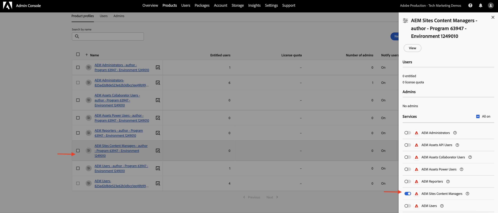

# OpenAPI 기반 AEM API 설정

OpenAPI 기반 AEM API에 액세스할 수 있도록 AEM as a Cloud Service 환경을 설정하는 방법에 대해 알아봅니다.

>[!AVAILABILITY]
>
>OpenAPI 기반 AEM API는 조기 액세스 프로그램의 일부로 사용할 수 있습니다. 액세스하는 데 관심이 있는 경우 사용 사례에 대한 설명을 포함하여 [aem-apis@adobe.com](mailto:aem-apis@adobe.com)에 전자 메일을 보내는 것이 좋습니다.

>[!VIDEO](https://video.tv.adobe.com/v/3457510?quality=12&learn=on)


상위 레벨 설정 프로세스에는 다음 단계가 포함됩니다.

1. AEM as a Cloud Service 환경의 현대화.
1. AEM API 액세스를 활성화합니다.
1. Adobe Developer Console(ADC) 프로젝트를 만듭니다.
1. ADC 프로젝트를 구성합니다.
1. ADC 프로젝트 통신을 사용하도록 AEM 인스턴스를 구성합니다.

## AEM as a Cloud Service 환경 현대화{#modernization-of-aem-as-a-cloud-service-environment}

AEM as a Cloud Service 환경 현대화는 다음 단계를 포함하는 환경당 1회 활동입니다.

- AEM 릴리스 **2024.10.18459.20241031T210302Z** 이상으로 업데이트합니다.
- 릴리스 2024.10.18459.20241031T210302Z 전에 환경이 생성된 경우 새 제품 프로필을 추가합니다.

### AEM 인스턴스 업데이트{#update-aem-instance}

AEM 인스턴스를 업데이트하려면 Adobe [Cloud Manager](https://my.cloudmanager.adobe.com/)의 _환경_ 섹션에서 환경 이름 옆에 있는 _줄임표_ 아이콘을 선택한 다음 **업데이트** 옵션을 선택하십시오.


그런 다음 **제출** 단추를 클릭하고 _제안_ Fullstack 파이프라인을 실행합니다.


Fullstack 파이프라인의 이름은 **Dev :: Fullstack-Deploy**&#x200B;이고 AEM 환경의 이름은 **wknd-program-dev**&#x200B;입니다. 이름이 다를 수 있습니다.

### 새 제품 프로필 추가{#add-new-product-profiles}

AEM 인스턴스에 새 제품 프로필을 추가하려면 Adobe [Cloud Manager](https://my.cloudmanager.adobe.com/)의 _환경_ 섹션에서 환경 이름 옆에 있는 _줄임표_ 아이콘을 선택하고 **제품 프로필 추가** 옵션을 선택합니다.


환경 이름 옆에 있는 _줄임표_ 아이콘을 클릭하고 **액세스 관리** > **작성자 프로필**&#x200B;을 선택하여 새로 추가된 제품 프로필을 검토할 수 있습니다.

_Admin Console_ 창에 새로 추가된 제품 프로필이 표시됩니다.


위의 단계는 AEM as a Cloud Service 환경의 현대화를 완료합니다.

## AEM API 액세스 활성화{#enable-aem-apis-access}

_새 제품 프로필_&#x200B;이 있으면 ADC(Adobe Developer Console)에서 OpenAPI 기반 AEM API 액세스가 가능합니다. [Adobe Developer Console(ADC)](./overview.md#accessing-adobe-apis-and-related-concepts)은(는) Adobe API, SDK, 실시간 이벤트, 서버리스 기능 등에 액세스하기 위한 개발자 허브입니다.

새로 추가된 제품 프로필은 미리 정의된 ACL(액세스 제어 목록)이 있는 _AEM 사용자 그룹_&#x200B;을 나타내는 _서비스_&#x200B;와(과) 연결되어 있습니다. _서비스_&#x200B;를 사용하여 AEM API에 대한 액세스 수준을 제어합니다.

제품 프로필과 연결된 _서비스_&#x200B;를 선택하거나 선택 해제하여 액세스 수준을 줄이거나 늘릴 수도 있습니다.

제품 프로필 이름 옆에 있는 _세부 정보 보기_ 아이콘을 클릭하여 연결을 검토하십시오.



기본적으로 **AEM Assets API 사용자** 서비스는 제품 프로필과 연결되어 있지 않습니다. 새로 추가된 **AEM Assets Collaborator 사용자 - 작성자 - 프로그램 XXX - 환경 XXX** 제품 프로필과 연결합니다. 이 연결 후에 ADC 프로젝트 _자산 작성자 API_&#x200B;에서 원하는 서버 간 인증을 설정하고 ADC 프로젝트(다음 단계에서 생성)의 인증 계정을 제품 프로필과 연결할 수 있습니다.


>[!IMPORTANT]
>
>위의 단계는 AEM Assets API에 대해 서버 간 인증을 활성화하는 데 중요합니다. 이 연결이 없으면 AEM Assets API를 서버 간 인증 방법과 함께 사용할 수 없습니다.

## Adobe Developer Console(ADC) 프로젝트 만들기{#adc-project}

ADC 프로젝트는 원하는 API를 추가하고, 인증을 설정하고, 인증 계정을 제품 프로필과 연결하는 데 사용됩니다.

ADC 프로젝트를 만들려면 다음을 수행하십시오.

1. Adobe ID을 사용하여 [Adobe Developer Console](https://developer.adobe.com/console)에 로그인합니다.

   

1. _빠른 시작_ 섹션에서 **새 프로젝트 만들기** 단추를 클릭합니다.

   

1. 기본 이름으로 새 프로젝트를 만듭니다.

   

1. 오른쪽 상단의 **프로젝트 편집** 단추를 클릭하여 프로젝트 이름을 편집합니다. 의미 있는 이름을 입력하고 **저장**&#x200B;을 클릭합니다.

   

## ADC 프로젝트 구성{#configure-adc-project}

ADC 프로젝트를 만든 후 원하는 AEM API를 추가하고, 인증을 설정하고, 인증 계정을 제품 프로필과 연결해야 합니다.

1. AEM API를 추가하려면 **API 추가** 단추를 클릭합니다.

   

1. _API 추가_ 대화 상자에서 _Experience Cloud_&#x200B;을(를) 기준으로 필터링하고 원하는 AEM API를 선택합니다. 예를 들어 이 경우 _자산 작성자 API_&#x200B;가 선택됩니다.

   

1. 그런 다음 _API 구성_ 대화 상자에서 원하는 인증 옵션을 선택합니다. 예를 들어 이 경우 **서버 간** 인증 옵션이 선택됩니다.

   

   서버 간 인증은 사용자 상호 작용 없이 API 액세스가 필요한 백엔드 서비스에 이상적입니다. 웹 앱 및 단일 페이지 앱 인증 옵션은 사용자를 대신하여 API 액세스가 필요한 애플리케이션에 적합합니다. 자세한 내용은 [OAuth 서버 간 자격 증명과 웹 앱 간 자격 증명 및 단일 페이지 앱 자격 증명 간의 차이점](./overview.md#difference-between-oauth-server-to-server-vs-web-app-vs-single-page-app-credentials)을 참조하십시오.

1. 필요한 경우 보다 쉽게 식별할 수 있도록 API의 이름을 변경할 수 있습니다. 데모 목적으로 기본 이름이 사용됩니다.

   

1. 이 경우 인증 방법은 **OAuth 서버 간**&#x200B;이므로 인증 계정을 제품 프로필과 연결해야 합니다. **AEM Assets Collaborator 사용자 - 작성자 - 프로그램 XXX - 환경 XXX** 제품 프로필을 선택하고 **저장**&#x200B;을 클릭합니다.

   

1. AEM API 및 인증 구성을 검토하십시오.

   

   

**OAuth 웹 앱** 또는 **OAuth 단일 페이지 앱** 인증 방법을 선택하는 경우 제품 프로필 연결 메시지가 표시되지 않지만 응용 프로그램 리디렉션 URI가 필요합니다. 응용 프로그램 리디렉션 URI는 인증 코드로 인증한 후 사용자를 응용 프로그램으로 리디렉션하는 데 사용됩니다. 관련 사용 사례 튜토리얼에서는 이러한 인증 특정 구성을 간략하게 설명합니다.

## ADC 프로젝트 통신을 사용하도록 AEM 인스턴스 구성{#configure-aem-instance}

ADC 프로젝트의 ClientID가 AEM 인스턴스와 통신할 수 있도록 하려면 AEM 인스턴스를 구성해야 합니다.

이 작업은 의 `config.yaml` 파일에서 API 구성을 정의하여 수행됩니다.
AEM 프로젝트 를 참조하고 Cloud Manager에서 구성 파이프라인을 사용하여 배포합니다.

1. AEM 프로젝트에서 `config` 폴더에서 `config.yaml` 파일을 찾거나 만듭니다.

   

1. `config.yaml` 파일에 다음 구성을 추가합니다.

   ```yaml
   kind: "API"
   version: "1.0"
   metadata: 
       envTypes: ["dev", "stage", "prod"]
   data:
       allowedClientIDs:
           author:
           - "<ADC Project's Credentials ClientID>"
   ```

   `<ADC Project's Credentials ClientID>`을(를) ADC 프로젝트의 자격 증명 값의 실제 ClientID로 바꿉니다. 이 자습서에서 사용되는 API 끝점은 작성자 계층에서만 사용할 수 있지만 다른 API의 경우 yaml 구성에는 _publish_ 또는 _미리보기_ 노드도 있을 수 있습니다.

   >[!CAUTION]
   >
   > 데모 목적으로 모든 환경에 동일한 ClientID가 사용됩니다. 더 나은 보안 및 제어를 위해 환경(개발, 단계, 프로덕션)별로 별도의 ClientID를 사용하는 것이 좋습니다.

1. 구성 변경 사항을 커밋하고 Cloud Manager 파이프라인이 연결된 원격 Git 저장소에 변경 사항을 푸시합니다.

1. Cloud Manager의 구성 파이프라인 을 사용하여 위의 변경 사항을 배포합니다. 명령줄 도구를 사용하여 RDE에 `config.yaml` 파일을 설치할 수도 있습니다.

   

## 다음 단계

AEM 인스턴스가 ADC 프로젝트 통신을 활성화하도록 구성되면 OpenAPI 기반 AEM API를 사용할 수 있습니다. 다양한 OAuth 인증 방법을 사용하여 OpenAPI 기반 AEM API를 사용하는 방법에 대해 알아봅니다.

<!-- CARDS
{target = _self}

* ./use-cases/invoke-api-using-oauth-s2s.md
  {title = Invoke API using Server-to-Server authentication}
  {description = Learn how to invoke OpenAPI-based AEM APIs from a custom NodeJS application using OAuth Server-to-Server authentication.}
  {image = ./assets/s2s/OAuth-S2S.png}
* ./use-cases/invoke-api-using-oauth-web-app.md
  {title = Invoke API using Web App authentication}
  {description = Learn how to invoke OpenAPI-based AEM APIs from a custom web application using OAuth Web App authentication.}
  {image = ./assets/web-app/OAuth-WebApp.png}
* ./use-cases/invoke-api-using-oauth-single-page-app.md
  {title = Invoke API using Single Page App authentication}
  {description = Learn how to invoke OpenAPI-based AEM APIs from a custom Single Page App (SPA) using OAuth 2.0 PKCE flow.}
  {image = ./assets/spa/OAuth-SPA.png}  
-->
<!-- START CARDS HTML - DO NOT MODIFY BY HAND -->
<div class="columns">
    <div class="column is-half-tablet is-half-desktop is-one-third-widescreen" aria-label="Invoke API using Server-to-Server authentication">
        <div class="card" style="height: 100%; display: flex; flex-direction: column; height: 100%;">
            <div class="card-image">
                <figure class="image x-is-16by9">
                    <a href="./use-cases/invoke-api-using-oauth-s2s.md" title="서버 간 인증을 사용하여 API 호출" target="_self" rel="referrer">
                        
                    </a>
                </figure>
            </div>
            <div class="card-content is-padded-small" style="display: flex; flex-direction: column; flex-grow: 1; justify-content: space-between;">
                <div class="top-card-content">
                    <p class="headline is-size-6 has-text-weight-bold">
                        <a href="./use-cases/invoke-api-using-oauth-s2s.md" target="_self" rel="referrer" title="서버 간 인증을 사용하여 API 호출">서버 간 인증을 사용하여 API 호출</a>
                    </p>
                    <p class="is-size-6">OAuth 서버 간 인증을 사용하여 사용자 지정 NodeJS 애플리케이션에서 OpenAPI 기반 AEM API를 호출하는 방법에 대해 알아봅니다.</p>
                </div>
                <a href="./use-cases/invoke-api-using-oauth-s2s.md" target="_self" rel="referrer" class="spectrum-Button spectrum-Button--outline spectrum-Button--primary spectrum-Button--sizeM" style="align-self: flex-start; margin-top: 1rem;">
                    <span class="spectrum-Button-label has-no-wrap has-text-weight-bold">자세히 알아보기</span>
                </a>
            </div>
        </div>
    </div>
    <div class="column is-half-tablet is-half-desktop is-one-third-widescreen" aria-label="Invoke API using Web App authentication">
        <div class="card" style="height: 100%; display: flex; flex-direction: column; height: 100%;">
            <div class="card-image">
                <figure class="image x-is-16by9">
                    <a href="./use-cases/invoke-api-using-oauth-web-app.md" title="웹 앱 인증을 사용하여 API 호출" target="_self" rel="referrer">
                        
                    </a>
                </figure>
            </div>
            <div class="card-content is-padded-small" style="display: flex; flex-direction: column; flex-grow: 1; justify-content: space-between;">
                <div class="top-card-content">
                    <p class="headline is-size-6 has-text-weight-bold">
                        <a href="./use-cases/invoke-api-using-oauth-web-app.md" target="_self" rel="referrer" title="웹 앱 인증을 사용하여 API 호출">웹 앱 인증을 사용하여 API 호출</a>
                    </p>
                    <p class="is-size-6">OAuth 웹 앱 인증을 사용하여 사용자 지정 웹 애플리케이션에서 OpenAPI 기반 AEM API를 호출하는 방법에 대해 알아봅니다.</p>
                </div>
                <a href="./use-cases/invoke-api-using-oauth-web-app.md" target="_self" rel="referrer" class="spectrum-Button spectrum-Button--outline spectrum-Button--primary spectrum-Button--sizeM" style="align-self: flex-start; margin-top: 1rem;">
                    <span class="spectrum-Button-label has-no-wrap has-text-weight-bold">자세히 알아보기</span>
                </a>
            </div>
        </div>
    </div>
    <div class="column is-half-tablet is-half-desktop is-one-third-widescreen" aria-label="Invoke API using Single Page App authentication">
        <div class="card" style="height: 100%; display: flex; flex-direction: column; height: 100%;">
            <div class="card-image">
                <figure class="image x-is-16by9">
                    <a href="./use-cases/invoke-api-using-oauth-single-page-app.md" title="단일 페이지 앱 인증을 사용하여 API 호출" target="_self" rel="referrer">
                        
                    </a>
                </figure>
            </div>
            <div class="card-content is-padded-small" style="display: flex; flex-direction: column; flex-grow: 1; justify-content: space-between;">
                <div class="top-card-content">
                    <p class="headline is-size-6 has-text-weight-bold">
                        <a href="./use-cases/invoke-api-using-oauth-single-page-app.md" target="_self" rel="referrer" title="단일 페이지 앱 인증을 사용하여 API 호출">단일 페이지 앱 인증을 사용하여 API 호출</a>
                    </p>
                    <p class="is-size-6">OAuth 2.0 PKCE 흐름을 사용하여 사용자 지정 SPA(단일 페이지 앱)에서 OpenAPI 기반 AEM API를 호출하는 방법에 대해 알아봅니다.</p>
                </div>
                <a href="./use-cases/invoke-api-using-oauth-single-page-app.md" target="_self" rel="referrer" class="spectrum-Button spectrum-Button--outline spectrum-Button--primary spectrum-Button--sizeM" style="align-self: flex-start; margin-top: 1rem;">
                    <span class="spectrum-Button-label has-no-wrap has-text-weight-bold">자세히 알아보기</span>
                </a>
            </div>
        </div>
    </div>
</div>
<!-- END CARDS HTML - DO NOT MODIFY BY HAND -->
