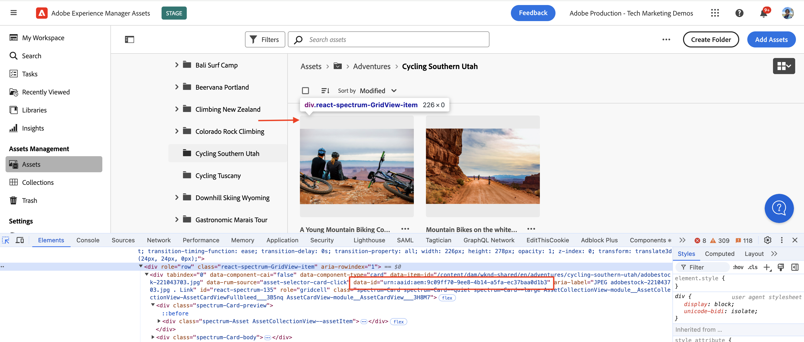
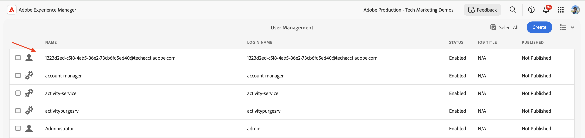

# OAuth 서버 간 인증을 사용하여 OpenAPI 기반 AEM API 호출

_OAuth 서버 간_ 인증을 사용하여 사용자 지정 애플리케이션에서 AEM as a Cloud Service의 OpenAPI 기반 AEM API를 호출하는 방법에 대해 알아봅니다.

OAuth 서버 간 인증은 사용자 상호 작용 없이 API 액세스가 필요한 백엔드 서비스에 이상적입니다. 클라이언트 응용 프로그램을 인증하기 위해 OAuth 2.0 _client_credentials_ 권한 유형을 사용합니다.

## 학습 내용{#what-you-learn}

이 튜토리얼에서는 다음 방법을 알아봅니다.

- _OAuth 서버 간 인증_&#x200B;을 사용하여 Assets 작성자 API에 액세스하도록 Adobe Developer Console(ADC) 프로젝트를 구성합니다.

- 특정 에셋에 대한 메타데이터를 검색하기 위해 Assets 작성자 API를 호출하는 샘플 NodeJS 애플리케이션을 개발합니다.

시작하기 전에 다음을 검토했는지 확인하십시오.

- [Adobe API 및 관련 개념 액세스](../overview.md#accessing-adobe-apis-and-related-concepts) 섹션.
- [OpenAPI 기반 AEM API 설정](../setup.md) 문서.

## 사전 요구 사항

이 자습서를 완료하려면 다음이 필요합니다.

- 다음을 사용하여 현대화된 AEM as a Cloud Service 환경:
   - AEM 릴리스 `2024.10.18459.20241031T210302Z` 이상
   - 새 스타일 제품 프로필(2024년 11월 이전에 환경이 생성된 경우)

  자세한 내용은 [OpenAPI 기반 AEM API 설정](../setup.md) 문서를 참조하십시오.

- 샘플 [WKND Sites](https://github.com/adobe/aem-guides-wknd?#aem-wknd-sites-project) 프로젝트를 여기에 배포해야 합니다.

- [Adobe Developer Console](https://developer.adobe.com/developer-console/docs/guides/getting-started)에 액세스

- 로컬 컴퓨터에 [Node.js](https://nodejs.org/en/)을(를) 설치하여 샘플 NodeJS 응용 프로그램을 실행합니다.

## 개발 단계

높은 수준의 개발 단계는 다음과 같습니다.

1. ADC 프로젝트 구성
   1. Assets 작성자 API 추가
   1. OAuth 서버 간 인증 방법으로 인증 방법 구성
   1. 제품 프로필을 인증 구성과 연결
1. ADC 프로젝트 통신을 사용하도록 AEM 인스턴스 구성
1. 샘플 NodeJS 애플리케이션 개발
1. 엔드 투 엔드 흐름 확인

## ADC 프로젝트 구성

_Setup OpenAPI 기반 AEM API_&#x200B;에서 ADC 프로젝트 구성 단계가 [반복](../setup.md)됩니다. Assets 작성자 API를 추가하고 해당 인증 방법을 OAuth 서버 간 서비스로 구성하는 작업이 반복됩니다.

>[!TIP]
>
>**OpenAPI 기반 AEM API 설정** 문서에서 [AEM API 액세스 활성화](../setup.md#enable-aem-apis-access) 단계를 완료했는지 확인하십시오. 이 옵션이 없으면 서버 간 인증 옵션을 사용할 수 없습니다.


1. [Adobe Developer Console](https://developer.adobe.com/console/projects)에서 원하는 프로젝트를 엽니다.

1. AEM API를 추가하려면 **API 추가** 단추를 클릭합니다.

   

1. _API 추가_ 대화 상자에서 _Experience Cloud_&#x200B;별로 필터링하고 **AEM Assets 작성자 API** 카드를 선택한 후 **다음**을 클릭합니다.
다른 OpenAPI 기반 AEM API가 필요한 경우 [Adobe Developer 설명서](https://developer.adobe.com/experience-cloud/experience-manager-apis/#openapi-based-apis)를 참조하여 사용 사례와 일치하는 API를 찾으십시오.

   아래 예제는 **AEM Assets 작성자 API**&#x200B;를 추가하는 방법을 안내합니다.

   

   >[!TIP]
   >
   >원하는 **AEM API 카드**&#x200B;가 비활성화되어 있고 _비활성화된 이유는 무엇입니까?_ 정보에 **라이선스 필요** 메시지가 표시되어 있습니다. 그 이유 중 하나는 AEM as a Cloud Service 환경을 현대화하지 않았기 때문일 수 있습니다. 자세한 내용은 [AEM as a Cloud Service 환경 현대화](../setup.md#modernization-of-aem-as-a-cloud-service-environment)를 참조하십시오.

1. 그런 다음 _API 구성_ 대화 상자에서 **서버 간** 인증 옵션을 선택하고 **다음**&#x200B;을(를) 클릭합니다. 서버 간 인증은 사용자 상호 작용 없이 API 액세스가 필요한 백엔드 서비스에 이상적입니다.

   

   >[!TIP]
   >
   >서버 간 인증 옵션이 표시되지 않으면 통합을 설정하는 사용자가 서비스가 연결된 제품 프로필에 개발자로 추가되지 않은 것입니다. 자세한 내용은 [서버 간 인증 사용](../setup.md#enable-server-to-server-authentication)을 참조하십시오.

1. 보다 쉽게 식별할 수 있도록 자격 증명의 이름을 바꾸고 **다음**&#x200B;을 클릭합니다. 데모 목적으로 기본 이름이 사용됩니다.

   

1. **AEM Assets Collaborator 사용자 - 작성자 - 프로그램 XXX - 환경 XXX** 제품 프로필을 선택하고 **저장**&#x200B;을 클릭합니다. 알 수 있듯이 AEM Assets API 사용자 서비스와 연결된 제품 프로필만 선택할 수 있습니다.

   

1. AEM API 및 인증 구성을 검토하십시오.

   

   

## ADC 프로젝트 통신을 사용하도록 AEM 인스턴스 구성

[OpenAPI 기반 AEM API 설정](../setup.md#configure-the-aem-instance-to-enable-adc-project-communication) 문서의 지침에 따라 ADC 프로젝트 통신을 사용하도록 AEM 인스턴스를 구성하십시오.

## 샘플 NodeJS 애플리케이션 개발

Assets Author API를 호출하는 샘플 NodeJS 애플리케이션을 개발해 보겠습니다.

Java, Python 등의 다른 프로그래밍 언어를 사용하여 응용 프로그램을 개발할 수 있습니다.

테스트 목적으로 [Postman](https://www.postman.com/), [curl](https://curl.se/) 또는 기타 REST 클라이언트를 사용하여 AEM API를 호출할 수 있습니다.

### API 검토

응용 프로그램을 개발하기 전에 [Assets 작성자 API](https://developer.adobe.com/experience-cloud/experience-manager-apis/api/experimental/assets/author/#operation/getAssetMetadata)에서 _지정된 에셋의 메타데이터 배달_ 끝점을 검토해 보겠습니다. API 구문은 다음과 같습니다.

```http
GET https://{bucket}.adobeaemcloud.com/adobe/../assets/{assetId}/metadata
```

특정 자산의 메타데이터를 검색하려면 `bucket` 및 `assetId` 값이 필요합니다. `bucket`은(는) Adobe 도메인 이름(.adobeaemcloud.com)이 없는 AEM 인스턴스 이름입니다(예: `author-p63947-e1420428`).

`assetId`은(는) 접두사가 `urn:aaid:aem:`인 자산의 JCR UUID입니다(예: `urn:aaid:aem:a200faf1-6d12-4abc-bc16-1b9a21f870da`). `assetId`을(를) 가져오는 방법은 여러 가지가 있습니다.

- 자산 메타데이터를 가져오려면 AEM 자산 경로 `.json` 확장을 추가하십시오. 예를 들어 `https://author-p63947-e1420429.adobeaemcloud.com/content/dam/wknd-shared/en/adventures/cycling-southern-utah/adobestock-221043703.jpg.json`을(를) 선택하고 `jcr:uuid` 속성을 찾습니다.

- 또는 브라우저의 요소 관리자에서 자산을 검사하여 `assetId`을(를) 가져올 수 있습니다. `data-id="urn:aaid:aem:..."` 특성을 찾습니다.

  

### 브라우저를 사용하여 API 호출

응용 프로그램을 개발하기 전에 **API 설명서**&#x200B;의 [시도](https://developer.adobe.com/experience-cloud/experience-manager-apis/api/stable/assets/author/) 기능을 사용하여 API를 호출해 보겠습니다.

1. 브라우저에서 [Assets 작성자 API 설명서](https://developer.adobe.com/experience-cloud/experience-manager-apis/api/stable/assets/author/)를 엽니다.

1. _메타데이터_ 섹션을 확장하고 **지정된 자산의 메타데이터 배달** 옵션을 클릭합니다.

1. 오른쪽 창에서 **다시 시도** 단추를 클릭합니다.
   

1. 다음 값을 입력합니다.

   | 섹션 | 매개변수 | 값 |
   | --- | --- | --- |
   |  | 버킷 | Adobe 도메인 이름(.adobeaemcloud.com)이 없는 AEM 인스턴스 이름(예: `author-p63947-e1420428`)입니다. |
   | **보안** | 전달자 토큰 | ADC 프로젝트의 OAuth 서버 간 자격 증명에서 액세스 토큰을 사용합니다. |
   | **보안** | X-Api-Key | ADC 프로젝트의 OAuth 서버 간 자격 증명에서 `ClientID` 값을 사용합니다. |
   | **매개변수** | assetId | AEM의 에셋에 대한 고유 식별자(예: `urn:aaid:aem:a200faf1-6d12-4abc-bc16-1b9a21f870da`) |
   | **매개변수** | X-Adobe-Accept-Experimental | 1 |

   

   

1. API를 호출하고 **응답** 탭에서 응답을 검토하려면 **보내기**&#x200B;를 클릭하십시오.

   

위의 단계에서는 AEM as a Cloud Service 환경의 현대화를 확인하여 AEM API 액세스를 활성화합니다. 또한 ADC 프로젝트의 성공적인 구성과 AEM 작성자 인스턴스와의 OAuth 서버 간 자격 증명 ClientID 통신을 확인합니다.

### 샘플 NodeJS 애플리케이션

샘플 NodeJS 응용 프로그램을 개발해 보겠습니다.

응용 프로그램을 개발하려면 _샘플 응용 프로그램 실행_ 또는 _단계별 개발_ 지침을 사용합니다.

>[!BEGINTABS]

>[!TAB 샘플 응용 프로그램 실행]

1. 샘플 [demo-nodejs-app-to-invoke-aem-openapi](../assets/s2s/demo-nodejs-app-to-invoke-aem-openapi.zip) 응용 프로그램 zip 파일을 다운로드하고 압축을 풉니다.

1. 추출된 폴더로 이동하고 종속성을 설치합니다.

   ```bash
   $ npm install
   ```

1. `.env` 파일의 자리 표시자를 ADC 프로젝트의 OAuth 서버 간 자격 증명의 실제 값으로 바꿉니다.

1. `<BUCKETNAME>` 파일의 `<ASSETID>` 및 `src/index.js`을(를) 실제 값으로 바꾸십시오.

1. NodeJS 응용 프로그램을 실행합니다.

   ```bash
   $ node src/index.js
   ```

>[!TAB 단계별 개발]

1. 새 NodeJS 프로젝트를 만듭니다.

   ```bash
   $ mkdir demo-nodejs-app-to-invoke-aem-openapi
   $ cd demo-nodejs-app-to-invoke-aem-openapi
   $ npm init -y
   ```

1. _fetch_ 및 _dotenv_ 라이브러리를 설치하여 HTTP 요청을 수행하고 환경 변수를 각각 읽습니다.

   ```bash
   $ npm install node-fetch
   $ npm install dotenv
   ```

1. 즐겨 찾는 코드 편집기에서 프로젝트를 열고 `package.json` 파일을 업데이트하여 `type`을(를) `module`에 추가합니다.

   ```json
   {
       ...
       "version": "1.0.0",
       "type": "module",
       "main": "index.js",
       ...
   }
   ```

1. `.env` 파일을 만들고 다음 구성을 추가합니다. 자리 표시자를 ADC 프로젝트의 OAuth 서버 간 자격 증명의 실제 값으로 바꿉니다.

   ```properties
   CLIENT_ID=<ADC Project OAuth Server-to-Server credential ClientID>
   CLIENT_SECRET=<ADC Project OAuth Server-to-Server credential Client Secret>
   SCOPES=<ADC Project OAuth Server-to-Server credential Scopes>
   ```

1. `src/index.js` 파일을 만들고 다음 코드를 추가하고 `<BUCKETNAME>` 및 `<ASSETID>`을(를) 실제 값으로 바꿉니다.

   ```javascript
   // Import the dotenv configuration to load environment variables from the .env file
   import "dotenv/config";
   
   // Import the fetch function to make HTTP requests
   import fetch from "node-fetch";
   
   // REPLACE THE FOLLOWING VALUES WITH YOUR OWN
   const bucket = "<BUCKETNAME>"; // Bucket name is the AEM instance name (e.g. author-p63947-e1420428)
   const assetId = "<ASSETID>"; // Asset ID is the unique identifier for the asset in AEM (e.g. urn:aaid:aem:a200faf1-6d12-4abc-bc16-1b9a21f870da). You can get it by inspecting the asset in browser's element inspector, look for data-id="urn:aaid:aem:..."
   
   // Load environment variables for authentication
   const clientId = process.env.CLIENT_ID; // Adobe IMS client ID
   const clientSecret = process.env.CLIENT_SECRET; // Adobe IMS client secret
   const scopes = process.env.SCOPES; // Scope for the API access
   
   // Adobe IMS endpoint for obtaining an access token
   const adobeIMSV3TokenEndpointURL =
   "https://ims-na1.adobelogin.com/ims/token/v3";
   
   // Function to obtain an access token from Adobe IMS
   const getAccessToken = async () => {
       console.log("Getting access token from IMS"); // Log process initiation
       //console.log("Client ID: " + clientId); // Display client ID for debugging purposes
   
       // Configure the HTTP POST request to fetch the access token
       const options = {
           method: "POST",
           headers: {
           "Content-Type": "application/x-www-form-urlencoded", // Specify form data content type
           },
           // Send client ID, client secret, and scopes as the request body
           body: `grant_type=client_credentials&client_id=${clientId}&client_secret=${clientSecret}&scope=${scopes}`,
       };
   
       // Make the HTTP request to fetch the access token
       const response = await fetch(adobeIMSV3TokenEndpointURL, options);
   
       //console.log("Response status: " + response.status); // Log the HTTP status for debugging
   
       const responseJSON = await response.json(); // Parse the JSON response
   
       console.log("Access token received"); // Log success message
   
       // Return the access token
       return responseJSON.access_token;
   };
   
   // Function to retrieve metadata for a specific asset from AEM
   const getAssetMetadat = async () => {
       // Fetch the access token using the getAccessToken function
       const accessToken = await getAccessToken();
   
       console.log("Getting asset metadata from AEM");
   
       // Invoke the Assets Author API to retrieve metadata for a specific asset
       const resp = await fetch(
           `https://${bucket}.adobeaemcloud.com/adobe/../assets/${assetId}/metadata`, // Construct the URL with bucket and asset ID
           {
           method: "GET",
           headers: {
               "If-None-Match": "string", // Header to handle caching (not critical for this tutorial)
               "X-Adobe-Accept-Experimental": "1", // Header to enable experimental Adobe API features
               Authorization: "Bearer " + accessToken, // Provide the access token for authorization
               "X-Api-Key": clientId, // Include the OAuth S2S ClientId for identification
           },
           }
       );
   
       const data = await resp.json(); // Parse the JSON response
   
       console.log("Asset metadata received"); // Log success message
       console.log(data); // Display the retrieved metadata
   };
   
   // Call the getAssets function to start the process
   getAssetMetadat();
   ```

1. NodeJS 응용 프로그램을 실행합니다.

   ```bash
   $ node src/index.js
   ```

>[!ENDTABS]

### API 응답

실행이 성공하면 API 응답이 콘솔에 표시됩니다. 응답에 지정된 자산의 메타데이터가 포함되어 있습니다.

```json
{
  "assetId": "urn:aaid:aem:9c09ff70-9ee8-4b14-a5fa-ec37baa0d1b3",
  "assetMetadata": {    
    ...
    "dc:title": "A Young Mountain Biking Couple Takes A Minute To Take In The Scenery",
    "xmp:CreatorTool": "Adobe Photoshop Lightroom Classic 7.5 (Macintosh)",
    ...
  },
  "repositoryMetadata": {
    ...
    "repo:name": "adobestock-221043703.jpg",
    "repo:path": "/content/dam/wknd-shared/en/adventures/cycling-southern-utah/adobestock-221043703.jpg",
    "repo:state": "ACTIVE",
    ...
  }
}
```

축하합니다! OAuth 서버 간 인증을 사용하여 사용자 지정 애플리케이션에서 OpenAPI 기반 AEM API를 성공적으로 호출했습니다.

### 애플리케이션 코드 검토

샘플 NodeJS 애플리케이션 코드의 주요 콜아웃은 다음과 같습니다.

1. **IMS 인증**: ADC 프로젝트에서 OAuth 서버 간 자격 증명 설정을 사용하여 액세스 토큰을 가져옵니다.

   ```javascript
   // Function to obtain an access token from Adobe IMS
   const getAccessToken = async () => {
   
       // Configure the HTTP POST request to fetch the access token
       const options = {
           method: "POST",
           headers: {
           "Content-Type": "application/x-www-form-urlencoded", // Specify form data content type
           },
           // Send client ID, client secret, and scopes as the request body
           body: `grant_type=client_credentials&client_id=${clientId}&client_secret=${clientSecret}&scope=${scopes}`,
       };
   
       // Make the HTTP request to fetch the access token from Adobe IMS token endpoint https://ims-na1.adobelogin.com/ims/token/v3
       const response = await fetch(adobeIMSV3TokenEndpointURL, options);
   
       const responseJSON = await response.json(); // Parse the JSON response
   
       // Return the access token
       return responseJSON.access_token;
   };
   ...
   ```

1. **API 호출**: 인증용 액세스 토큰을 제공하여 특정 에셋에 대한 메타데이터를 검색하도록 Assets 작성자 API를 호출합니다.

   ```javascript
   // Function to retrieve metadata for a specific asset from AEM
   const getAssetMetadat = async () => {
       // Fetch the access token using the getAccessToken function
       const accessToken = await getAccessToken();
   
       console.log("Getting asset metadata from AEM");
   
       // Invoke the Assets Author API to retrieve metadata for a specific asset
       const resp = await fetch(
           `https://${bucket}.adobeaemcloud.com/adobe/../assets/${assetId}/metadata`, // Construct the URL with bucket and asset ID
           {
           method: "GET",
           headers: {
               "If-None-Match": "string", // Header to handle caching (not critical for this tutorial)
               "X-Adobe-Accept-Experimental": "1", // Header to enable experimental Adobe API features
               Authorization: "Bearer " + accessToken, // Provide the access token for authorization
               "X-Api-Key": clientId, // Include the OAuth S2S ClientId for identification
           },
           }
       );
   
       const data = await resp.json(); // Parse the JSON response
   
       console.log("Asset metadata received"); // Log success message
       console.log(data); // Display the retrieved metadata
   };
   ...
   ```

## 후드 아래

API가 성공적으로 호출되면 ADC 프로젝트의 OAuth 서버 간 자격 증명을 나타내는 사용자가 제품 프로필 및 서비스 구성과 일치하는 사용자 그룹과 함께 AEM 작성자 서비스에 생성됩니다. _기술 계정 사용자_&#x200B;는 제품 프로필 및 _서비스_ 사용자 그룹에 연결되어 있으며, 자산 메타데이터는 _읽기_&#x200B;하는 데 필요한 권한이 있습니다.

기술 계정 사용자 및 사용자 그룹 생성을 확인하려면 다음 단계를 수행하십시오.

- ADC 프로젝트에서 **OAuth 서버 간** 자격 증명 구성으로 이동합니다. **기술 계정 전자 메일** 값을 참고하십시오.

  

- AEM 작성자 서비스에서 **도구** > **보안** > **사용자**(으)로 이동하여 **기술 계정 전자 메일** 값을 검색합니다.

  

- **그룹** 멤버십과 같은 사용자 세부 정보를 보려면 기술 계정 사용자를 클릭하십시오. 아래 표시된 대로 기술 계정 사용자는 **AEM Assets Collaborator 사용자 - 작성자 - 프로그램 XXX - 환경 XXX** 및 **AEM Assets Collaborator 사용자 - 서비스** 사용자 그룹과 연결되어 있습니다.

  

- 기술 계정 사용자는 **AEM Assets Collaborator 사용자 - 작성자 - 프로그램 XXX - 환경 XXX** 제품 프로필과 연결되어 있습니다. 제품 프로필은 **AEM Assets API 사용자** 및 **AEM Assets Collaborator 사용자** 서비스에 연결되어 있습니다.

  

- 제품 프로필 및 기술 계정 사용자 연결은 **제품 프로필**&#x200B;의 **API 자격 증명** 탭에서 확인할 수 있습니다.

  

## 비 GET 요청에 대한 403 오류

에셋 메타데이터를 _읽기_&#x200B;하려면 OAuth 서버 간 자격 증명에 대해 만든 기술 계정 사용자가 서비스 사용자 그룹(예: AEM Assets Collaborator 사용자 - 서비스)을 통해 필요한 권한을 갖습니다.

그러나 에셋 메타데이터를 _만들기, 업데이트, 삭제_(CUD)하려면 기술 계정 사용자에게 추가 권한이 필요합니다. GET이 아닌 요청(예: PATCH, DELETE)으로 API를 호출하여 확인하고 403 오류 응답을 확인할 수 있습니다.

자산 메타데이터를 업데이트하고 403 오류 응답을 관찰하기 위해 _PATCH_ 요청을 호출해 보겠습니다.

- 브라우저에서 [Assets 작성자 API 설명서](https://developer.adobe.com/experience-cloud/experience-manager-apis/api/experimental/assets/author/)를 엽니다.

- 다음 값을 입력합니다.

  | 섹션 | 매개변수 | 값 |
  | --- | --- | --- |
  | **버킷** |  | Adobe 도메인 이름(.adobeaemcloud.com)이 없는 AEM 인스턴스 이름(예: `author-p63947-e1420428`)입니다. |
  | **보안** | 전달자 토큰 | ADC 프로젝트의 OAuth 서버 간 자격 증명에서 액세스 토큰을 사용합니다. |
  | **보안** | X-Api-Key | ADC 프로젝트의 OAuth 서버 간 자격 증명에서 `ClientID` 값을 사용합니다. |
  | **본문** |  | `[{ "op": "add", "path": "foo","value": "bar"}]` |
  | **매개변수** | assetId | AEM의 에셋에 대한 고유 식별자(예: `urn:aaid:aem:a200faf1-6d12-4abc-bc16-1b9a21f870da`) |
  | **매개변수** | X-Adobe-Accept-Experimental | * |
  | **매개변수** | X-Adobe-Accept-Experimental | 1 |

- **보내기**&#x200B;를 클릭하여 _PATCH_ 요청을 호출하고 403 오류 응답을 확인합니다.

  

403 오류를 수정하려면 다음 두 가지 옵션이 필요합니다.

- ADC 프로젝트에서 OAuth 서버 간 자격 증명의 관련 제품 프로필을 _만들기, 업데이트, 삭제_(CUD)에 필요한 권한이 있는 적절한 제품 프로필로 업데이트하십시오(예: **AEM 관리자 - 작성자 - 프로그램 XXX - 환경 XXX**). 자세한 내용은 [방법 - API의 연결된 자격 증명 및 제품 프로필 관리](../how-to/credentials-and-product-profile-management.md) 문서를 참조하십시오.

- AEM Project를 사용하여 연결된 AEM 서비스 사용자 그룹(예: AEM Assets Collaborator Users - Service)의 AEM 작성자 권한을 업데이트하여 _CUD(자산 메타데이터 만들기, 업데이트, 삭제_)를 허용합니다. 자세한 내용은 [방법 - AEM 서비스 사용자 그룹 권한 관리](../how-to/services-user-group-permission-management.md) 문서를 참조하십시오.

## 요약

이 자습서에서는 사용자 지정 애플리케이션에서 OpenAPI 기반 AEM API를 호출하는 방법에 대해 알아보았습니다. AEM API 액세스를 활성화하고 ADC(Adobe Developer Console) 프로젝트를 만들고 구성했습니다.
ADC 프로젝트에서 AEM API를 추가하고, 인증 유형을 구성하고, 제품 프로필을 연결했습니다. 또한 ADC 프로젝트 통신을 사용할 수 있도록 AEM 인스턴스를 구성하고 Assets 작성자 API를 호출하는 샘플 NodeJS 애플리케이션을 개발했습니다.

## 추가 리소스

- [OAuth 서버 간 자격 증명 구현 안내서](https://developer.adobe.com/developer-console/docs/guides/authentication/ServerToServerAuthentication/implementation)

