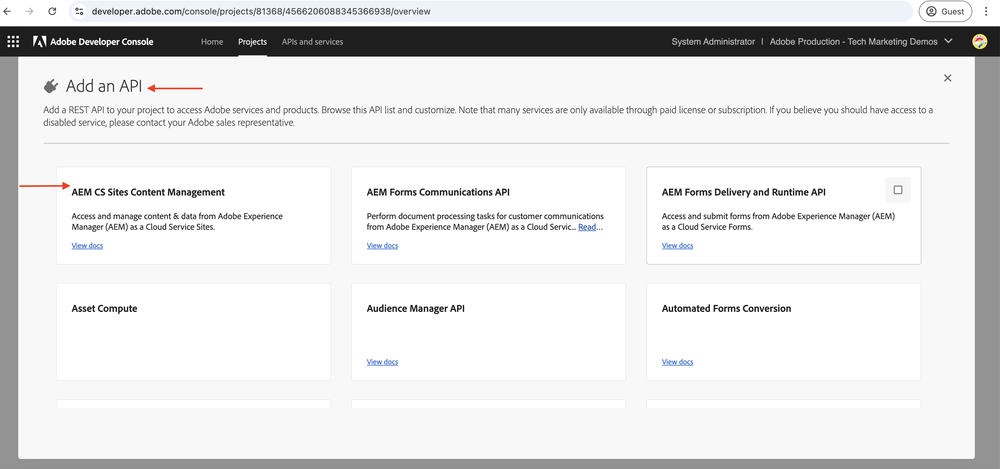

# OAuth 단일 페이지 앱을 사용하여 OpenAPI 기반 AEM API 호출

**OAuth 단일 페이지 앱 인증**&#x200B;을 사용하여 AEM as a Cloud Service에서 OpenAPI 기반 AEM API를 호출하는 방법을 알아봅니다. SPA(단일 페이지 애플리케이션)에서 사용자 기반 인증을 위한 OAuth 2.0 PKCE(Proof Key for Code Exchange) 흐름을 따릅니다.

OAuth 단일 페이지 앱 인증은 브라우저에서 실행되는 JavaScript 기반 애플리케이션에 이상적입니다. 백엔드 서버가 없거나 사용자 대신 AEM API와 상호 작용하기 위해 액세스 토큰을 가져와야 하는지 여부.

PKCE 흐름은 OAuth 2.0 _authorization_code_ 부여 유형을 확장하여 인증 코드 차단을 방지하여 보안을 강화합니다. 자세한 내용은 [OAuth 서버 대 서버 및 웹 앱과 단일 페이지 앱 자격 증명 간의 차이점](../overview.md#difference-between-oauth-server-to-server-vs-web-app-vs-single-page-app-credentials) 섹션을 참조하십시오.

## 학습 내용{#what-you-learn}

이 튜토리얼에서는 다음 방법을 알아봅니다.

- _OAuth 단일 페이지 앱_ 인증 또는 일반적으로 _OAuth 2.0 PKCE 흐름_&#x200B;으로 알려진 OAuth 단일 페이지 앱을 사용하여 OpenAPI 기반 AEM API에 액세스하도록 Adobe Developer Console(ADC) 프로젝트를 구성하십시오.

- 사용자 지정 SPA에서 OAuth 단일 페이지 앱 인증 플로우를 구현합니다.
   - IMS 사용자 인증 및 앱 권한 부여.
   - OAuth 2.0 PKCE 플로우를 사용하여 토큰 검색에 액세스합니다.
   - 액세스 토큰을 사용하여 OpenAPI 기반 AEM API를 호출합니다.

시작하기 전에 다음을 검토했는지 확인하십시오.

- [Adobe API 및 관련 개념 액세스](../overview.md#accessing-adobe-apis-and-related-concepts) 섹션.
- [OpenAPI 기반 AEM API 설정](../setup.md) 문서.

## WKND SPA 개요 및 기능 흐름{#wknd-spa-overview-and-functional-flow}

WKND SPA가 무엇인지, 어떻게 구축되고 어떻게 작동하는지 살펴보겠습니다.

WKND SPA는 사용자별 액세스 토큰을 안전하게 획득하고 클라이언트측에서 직접 AEM API와 상호 작용하는 방법을 보여 주는 **React 기반 단일 페이지 애플리케이션**&#x200B;입니다. Adobe IMS를 통해 OAuth 2.0 PKCE 인증 흐름을 구현하고 두 개의 주요 AEM API와 통합됩니다.

1. **사이트 API**: 콘텐츠 조각 모델에 액세스하기 위한
1. **Assets API**: DAM 폴더 관리용

Adobe Developer Console(ADC) 프로젝트가 OAuth 단일 페이지 앱 인증을 사용하도록 구성되어 있으므로 OAuth 2.0 PKCE 흐름을 시작하는 데 필요한 **client_id**&#x200B;을(를) 제공할 수 있습니다.

>[!IMPORTANT]
>
>ADC 프로젝트가 _client_secret_&#x200B;을(를) 제공하지 않습니다. 대신 SPA는 _액세스 토큰_&#x200B;에 대한 인증 코드를 안전하게 교환하기 위해 _code_verifier_ 및 _code_challenge_&#x200B;을(를) 생성합니다. 클라이언트 측에 클라이언트 암호를 저장할 필요가 없으므로 보안이 강화됩니다.


>[!VIDEO](https://video.tv.adobe.com/v/3456964?quality=12&learn=on)


다음 다이어그램은 WKND SPA _OpenAPI 기반 AEM API를 호출하기 위해 사용자별 액세스 토큰을 가져오는_&#x200B;의 기능 흐름을 보여 줍니다.


1. SPA는 인증 요청을 통해 사용자를 Adobe Identity Management System(IMS)으로 안내하여 인증 흐름을 시작합니다.
1. 인증 요청의 일부로 SPA는 OAuth 2.0 PKCE 흐름에 따라 _client_id_, _redirect_uri_ 및 _code_challenge_&#x200B;를 IMS로 보냅니다. SPA는 임의의 _code_verifier_&#x200B;을 생성하고 SHA-256을 사용하여 해시하며 Base64는 결과를 인코딩하여 _code_challenge_&#x200B;을(를) 만듭니다.
1. IMS는 사용자를 인증하고, 인증에 성공하면 _authorization_code_&#x200B;을(를) 발행하며, 이 코드는 _redirect_uri_&#x200B;을(를) 통해 SPA로 다시 전송됩니다.
1. SPA가 IMS 토큰 끝점에 POST 요청을 전송하여 _액세스 토큰_&#x200B;에 대해 _authorization_code_&#x200B;을(를) 교환합니다. 이전에 전송된 _code_challenge_&#x200B;의 유효성을 검사하기 위한 요청에 _code_verifier_&#x200B;이(가) 포함되어 있습니다. 이렇게 하면 인증 요청(2단계) 및 토큰 요청(4단계)이 동일한 인증 흐름에 연결되어 차단 공격을 방지할 수 있습니다.
1. IMS는 _code_verifier_&#x200B;의 유효성을 검사하고 사용자별 _액세스 토큰_&#x200B;을 반환합니다.
1. SPA는 사용자별 콘텐츠를 인증하고 검색하기 위해 AEM에 대한 API 요청에 _액세스 토큰_&#x200B;을(를) 포함합니다.

WKND SPA는 [React](https://react.dev/) 기반 애플리케이션이며 인증 상태 관리에 [React 컨텍스트](https://react.dev/reference/react/createContext), 탐색에 [React 라우터](https://reactrouter.com/home)를 사용합니다.

Angular, Vue 또는 vanilla JavaScript과 같은 다른 SPA 프레임워크를 사용하여 이 자습서에 나와 있는 접근 방식을 사용하여 Adobe API와 통합하는 SPA를 만들 수 있습니다.

## 이 자습서를 사용하는 방법{#how-to-use-this-tutorial}

다음 두 가지 방법으로 이 자습서에 액세스할 수 있습니다.

- [SPA 키 코드 조각 검토](#review-spa-key-code-snippets): OAuth 단일 페이지 앱 인증 흐름을 이해하고 WKND SPA의 주요 API 호출 구현을 살펴봅니다.
- [SPA를 설정하고 실행](#setup-and-run-the-spa): 단계별 지침에 따라 로컬 컴퓨터에서 WKND SPA를 구성하고 실행합니다.

필요에 가장 적합한 경로를 선택하십시오!

## SPA 키 코드 조각 검토{#review-spa-key-code-snippets}

다음을 수행하는 방법을 보여 주는 WKND SPA의 주요 코드 조각에 대해 알아보겠습니다.

- OAuth 단일 페이지 앱 인증 플로우를 사용하여 사용자별 액세스 토큰을 얻습니다.

- 클라이언트측에서 직접 OpenAPI 기반 AEM API를 호출합니다.

이러한 코드 조각은 SPA 내의 인증 프로세스 및 API 상호 작용을 이해하는 데 도움이 됩니다.

### SPA 코드 다운로드{#download-the-spa-code}

1. [WKND SPA 및 AEM API - 데모 앱](../assets/spa/wknd-spa-with-aemapis-demo.zip) zip 파일을 다운로드하고 압축을 풉니다.

1. 추출된 폴더로 이동하여 즐겨 찾는 코드 편집기에서 `.env.example` 파일을 엽니다. 필요한 구성 매개 변수를 검토합니다.

   ```plaintext
   ########################################################################
   # Adobe IMS, Adobe Developer Console (ADC), and AEM as a Cloud Service Information
   ########################################################################
   # Adobe IMS OAuth endpoints
   REACT_APP_ADOBE_IMS_AUTHORIZATION_ENDPOINT=https://ims-na1.adobelogin.com/ims/authorize/v2
   REACT_APP_ADOBE_IMS_TOKEN_ENDPOINT=https://ims-na1.adobelogin.com/ims/token/v3
   
   # Adobe Developer Console (ADC) Project's OAuth Single-Page App credential
   REACT_APP_ADC_CLIENT_ID=<ADC Project OAuth Single-Page App credential ClientID>
   REACT_APP_ADC_SCOPES=<ADC Project OAuth Single-Page App credential Scopes>
   
   # AEM Assets Information
   REACT_APP_AEM_ASSET_HOSTNAME=<AEMCS Hostname, e.g., https://author-p63947-e1502138.adobeaemcloud.com/>
   
   ################################################
   # Single Page Application Information
   ################################################
   
   # Enable HTTPS for local development
   HTTPS=true
   PORT=3001
   
   # SSL Certificate and Key for local development 
   SSL_CRT_FILE=./ssl/server.crt
   SSL_KEY_FILE=./ssl/server.key
   
   # The URL to which the user will be redirected after the OAuth flow is complete
   REACT_APP_REDIRECT_URI=https://localhost:3000/callback
   ```

   자리 표시자를 Adobe Developer Console(ADC) 프로젝트 및 AEM as a Cloud Service Assets 인스턴스의 실제 값으로 바꿔야 합니다.

### IMS 사용자 인증 및 SPA 인증{#ims-user-authentication-and-spa-authorization}

IMS 사용자 인증 및 SPA 권한 부여를 처리하는 코드를 살펴보겠습니다. 콘텐츠 조각 모델 및 DAM 폴더를 검색하려면 사용자는 Adobe IMS를 인증하고 WKND SPA에 자신을 대신하여 AEM API에 액세스할 수 있는 권한을 부여해야 합니다.

초기 로그인 동안 WKND SPA가 필요한 리소스에 안전하게 액세스할 수 있도록 사용자에게 동의를 제공하라는 메시지가 표시됩니다.


1. `src/context/IMSAuthContext.js` 파일에서 `login` 함수는 IMS 사용자 인증 및 앱 권한 부여 흐름을 시작합니다. 액세스 토큰으로 `code_verifier`을(를) 안전하게 교환하기 위해 임의의 `code_challenge` 및 `code`을(를) 생성합니다. `code_verifier`은(는) 나중에 사용할 수 있도록 로컬 저장소에 저장됩니다. 앞에서 언급했듯이 SPA는 `client_secret`을(를) 저장하거나 사용하지 않으며, 즉시 생성하여 `authorize` 및 `token` 요청의 두 단계로 사용합니다.

   ```javascript
   ...
   const login = async () => {
       try {
           const codeVerifier = generateCodeVerifier();
           const codeChallenge = generateCodeChallenge(codeVerifier);
   
           localStorage.setItem(STORAGE_KEYS.CODE_VERIFIER, codeVerifier);
   
           const params = new URLSearchParams(
               getAuthParams(AUTH_METHODS.S256, codeChallenge, codeVerifier)
           );
   
           window.location.href = `${
               APP_CONFIG.adobe.ims.authorizationEndpoint //https://ims-na1.adobelogin.com/ims/authorize/v2
           }?${params.toString()}`;
       } catch (error) {
           console.error("Login initialization failed:", error);
           throw error;
       }
   };
   ...
   
   // Generate a random code verifier
   export function generateCodeVerifier() {
       const array = new Uint8Array(32);
       window.crypto.getRandomValues(array);
       const wordArray = CryptoJS.lib.WordArray.create(array);
       return base64URLEncode(wordArray);
   }
   
   // Generate code challenge using SHA-256
   export function generateCodeChallenge(codeVerifier) {
       const hash = CryptoJS.SHA256(codeVerifier);
       return base64URLEncode(hash);
   }
   
   // Get authorization URL parameters
   const getAuthParams = useCallback((method, codeChallenge, codeVerifier) => {
       const baseParams = {
           client_id: APP_CONFIG.adobe.adc.clientId, // ADC Project OAuth Single-Page App credential ClientID
           scope: APP_CONFIG.adobe.adc.scopes, // ADC Project OAuth Single-Page App credential Scopes
           response_type: "code",
           redirect_uri: APP_CONFIG.adobe.spa.redirectUri, // SPA redirect URI https://localhost:3000/callback
           code_challenge_method: method, // S256 or plain
       };
   
       return {
           ...baseParams,
           code_challenge:
               method === AUTH_METHODS.S256 ? codeChallenge : codeVerifier,
           };
   }, []);    
   ...
   ```

   사용자가 Adobe IMS에 대해 인증되지 않은 경우 사용자에게 인증을 요청하도록 Adobe ID 로그인 페이지가 표시됩니다.

   이미 인증된 경우 사용자는 _authorization_code_&#x200B;을(를) 사용하여 WKND SPA의 지정된 _redirect_uri_(으)로 다시 리디렉션됩니다.

### OAuth 2.0 PKCE 플로우를 사용하여 토큰 검색 액세스{#access-token-retrieval-using-oauth-20-pkce-flow}

WKND SPA는 _client_id_ 및 _code_verifier_&#x200B;를 사용하여 사용자별 액세스 토큰을 위해 _authorization_code_&#x200B;을(를) Adobe IMS와 안전하게 교환합니다.

1. `src/context/IMSAuthContext.js` 파일에서 `exchangeCodeForToken` 함수는 사용자별 액세스 토큰에 대해 _authorization_code_&#x200B;을(를) 바꿉니다.

   ```javascript
   ...
   // Handle the callback from the Adobe IMS authorization endpoint
   const handleCallback = async (code) => {
       if (authState.isProcessingCallback) return;
   
       try {
           updateAuthState({ isProcessingCallback: true });
   
           const data = await exchangeCodeForToken(code);
   
           if (data.access_token) {
               handleStorageToken(data.access_token);
               localStorage.removeItem(STORAGE_KEYS.CODE_VERIFIER);
           }
       } catch (error) {
           console.error("Error exchanging code for token:", error);
           throw error;
       } finally {
           updateAuthState({ isProcessingCallback: false });
       }
   };
   
   ...
   // Exchange the authorization code for an access token
   const exchangeCodeForToken = useCallback(async (code) => {
       const codeVerifier = localStorage.getItem(STORAGE_KEYS.CODE_VERIFIER);
   
       if (!codeVerifier) {
           throw new Error("No code verifier found");
       }
   
       //https://ims-na1.adobelogin.com/ims/token/v3
       const response = await fetch(APP_CONFIG.adobe.ims.tokenEndpoint, {
           method: "POST",
           headers: { "Content-Type": "application/x-www-form-urlencoded" },
           body: new URLSearchParams({
               grant_type: "authorization_code",
               client_id: APP_CONFIG.adobe.adc.clientId, // ADC Project OAuth Single-Page App credential ClientID
               code_verifier: codeVerifier, // Code verifier generated during login
               code, // Authorization code received from the IMS
               redirect_uri: `${window.location.origin}/callback`,
           }),
       });
   
       if (!response.ok) {
           throw new Error("Token request failed");
       }
   
       return response.json();
   }, []);
   
   const handleStorageToken = useCallback(
       (token) => {
           if (token) {
               localStorage.setItem(STORAGE_KEYS.ACCESS_TOKEN, token);
               updateAuthState({ isLoggedIn: true, accessToken: token });
           }
       },
       [updateAuthState]
   );
   ...
   ```

   액세스 토큰은 브라우저의 로컬 저장소에 저장되고 AEM API에 대한 후속 API 호출에 사용됩니다.

### 액세스 토큰을 사용하여 OpenAPI 기반 AEM API에 액세스{#accessing-openapi-based-aem-apis-using-the-access-token}

WKND SPA는 사용자별 액세스 토큰을 사용하여 콘텐츠 조각 모델 및 DAM 폴더 API 엔드포인트를 호출합니다.

`src/components/InvokeAemApis.js` 파일에서 `fetchContentFragmentModels` 함수는 액세스 토큰을 사용하여 클라이언트측에서 OpenAPI 기반 AEM API를 호출하는 방법을 보여 줍니다.

```javascript
    ...
  // Fetch Content Fragment Models
  const fetchContentFragmentModels = useCallback(async () => {
    try {
      updateState({ isLoading: true, error: null });
      const data = await makeApiRequest({
        endpoint: `${API_PATHS.CF_MODELS}?cursor=0&limit=10&projection=summary`,
      });
      updateState({ cfModels: data.items });
    } catch (err) {
      updateState({ error: err.message });
      console.error("Error fetching CF models:", err);
    } finally {
      updateState({ isLoading: false });
    }
  }, [makeApiRequest, updateState]);

  // Common API request helper
  const makeApiRequest = useCallback(
    async ({ endpoint, method = "GET", passAPIKey = false, body = null }) => {
    
      // Get the access token from the local storage
      const token = localStorage.getItem("adobe_ims_access_token");
      if (!token) {
        throw new Error("No access token available. Please login again.");
      }

      const headers = {
        Authorization: `Bearer ${token}`,
        "Content-Type": "application/json",
        ...(passAPIKey && { "x-api-key": APP_CONFIG.adobe.adc.clientId }),
      };

      const response = await fetch(
        `${APP_CONFIG.adobe.aem.hostname}${endpoint}`,
        {
          method,
          headers,
          ...(body && { body: JSON.stringify(body) }),
        }
      );

      if (!response.ok) {
        throw new Error(`API request failed: ${response.statusText}`);
      }

      return method === "DELETE" ? null : response.json();
    },
    []
  );
  ...
```

## SPA 설정 및 실행{#setup-and-run-the-spa}

로컬 컴퓨터에서 WKND SPA를 구성 및 실행하여 OAuth 단일 페이지 앱 인증 흐름 및 API 호출을 이해하겠습니다.

### 사전 요구 사항{#prerequisites}

이 자습서를 완료하려면 다음이 필요합니다.

- 다음을 사용하여 현대화된 AEM as a Cloud Service 환경:
   - AEM 릴리스 `2024.10.18459.20241031T210302Z` 이상
   - 새 스타일 제품 프로필(2024년 11월 이전에 환경이 생성된 경우)

  자세한 내용은 [OpenAPI 기반 AEM API 설정](../setup.md) 문서를 참조하십시오.

- 샘플 [WKND Sites](https://github.com/adobe/aem-guides-wknd?#aem-wknd-sites-project) 프로젝트를 여기에 배포해야 합니다.

- [Adobe Developer Console](https://developer.adobe.com/developer-console/docs/guides/getting-started)에 액세스

- 로컬 컴퓨터에 [Node.js](https://nodejs.org/en/)을(를) 설치하여 샘플 NodeJS 응용 프로그램을 실행합니다.

### 개발 단계{#development-steps}

높은 수준의 개발 단계는 다음과 같습니다.

1. ADC 프로젝트 구성
   1. Assets 및 Sites API를 추가합니다.
   1. OAuth 단일 페이지 앱 자격 증명을 구성합니다.
1. AEM 인스턴스 구성
   1. ADC 프로젝트 통신을 활성화하려면
   1. CORS 설정을 구성하여 SPA가 AEM API에 액세스할 수 있도록 허용합니다.
1. 로컬 컴퓨터에서 WKND SPA 구성 및 실행
1. 엔드 투 엔드 흐름 확인

### ADC 프로젝트 구성{#configure-adc-project}

_Setup OpenAPI 기반 AEM API_&#x200B;에서 ADC 프로젝트 구성 단계가 [반복](../setup.md)됩니다. Assets, Sites API를 추가하고 해당 인증 방법을 OAuth 단일 페이지 앱으로 구성하는 작업이 반복됩니다.

1. [Adobe Developer Console](https://developer.adobe.com/console/projects)에서 원하는 프로젝트를 엽니다.

1. AEM API를 추가하려면 **API 추가** 단추를 클릭합니다.

   

1. _API 추가_ 대화 상자에서 _Experience Cloud_&#x200B;별로 필터링하고 **AEM CS 사이트 콘텐츠 관리** 카드를 선택한 후 **다음**&#x200B;을 클릭합니다.

   

   >[!TIP]
   >
   >원하는 **AEM API 카드**&#x200B;가 비활성화되어 있고 _비활성화된 이유는 무엇입니까?_ 정보에 **라이선스 필요** 메시지가 표시되어 있습니다. 그 이유 중 하나는 AEM as a Cloud Service 환경을 현대화하지 않았기 때문일 수 있습니다. 자세한 내용은 [AEM as a Cloud Service 환경 현대화](../setup.md#modernization-of-aem-as-a-cloud-service-environment)를 참조하십시오.

1. 그런 다음 _API 구성_ 대화 상자에서 **사용자 인증** 인증 옵션을 선택하고 **다음**&#x200B;을 클릭합니다.

   

1. 다음 _API 구성_ 대화 상자에서 **OAuth 단일 페이지 앱** 인증 옵션을 선택하고 **다음**&#x200B;을(를) 클릭합니다.

   

1. _OAuth 단일 페이지 앱 구성_ 대화 상자에서 다음 세부 정보를 입력하고 **다음**&#x200B;을 클릭합니다.
   - 기본 리디렉션 URI: `https://localhost:3001/callback`
   - 리디렉션 URI 패턴: `https://localhost:3001/callback`

   

1. 사용 가능한 범위를 검토하고 **구성된 API 저장**&#x200B;을 클릭합니다.

   

1. **AEM Assets 작성자 API**&#x200B;를 추가하려면 위의 단계를 반복합니다.

1. AEM API 및 인증 구성을 검토하십시오.

   

   

### ADC 프로젝트 통신을 사용하도록 AEM 인스턴스 구성{#configure-aem-instance-to-enable-adc-project-communication}

[OpenAPI 기반 AEM API 설정](../setup.md#configure-the-aem-instance-to-enable-adc-project-communication) 문서의 지침에 따라 ADC 프로젝트 통신을 사용하도록 AEM 인스턴스를 구성하십시오.

### AEM CORS 구성{#aem-cors-configuration}

AEM as a Cloud Service의 CORS(원본 간 리소스 공유)를 사용하면 AEM 이외 웹 속성을 사용하여 AEM API에 대한 브라우저 기반 클라이언트측 호출을 할 수 있습니다.

1. AEM 프로젝트에서 `com.adobe.granite.cors.impl.CORSPolicyImpl~wknd-graphql.cfg.json` 폴더에서 `/ui.config/src/main/content/jcr_root/apps/wknd/osgiconfig/config.author/` 파일을 찾거나 만듭니다.

   

1. 다음 구성을 파일에 추가합니다.

   ```json
   {
       "alloworigin":[
         ""
       ],
       "alloworiginregexp":[
         "https://localhost:.*",
         "http://localhost:.*"
       ],
       "allowedpaths": [
         "/adobe/sites/.*",
         "/graphql/execute.json.*",
         "/content/_cq_graphql/wknd-shared/endpoint.json",
         "/content/experience-fragments/.*"
       ],
       "supportedheaders": [
         "Origin",
         "Accept",
         "X-Requested-With",
         "Content-Type",
         "Access-Control-Request-Method",
         "Access-Control-Request-Headers",
         "Authorization"
       ],
       "supportedmethods":[
         "GET",
         "HEAD",
         "POST"
       ],
       "maxage:Integer": 1800,
       "supportscredentials": true,
       "exposedheaders":[ "" ]
   }
   ```

1. 구성 변경 사항을 커밋하고 Cloud Manager 파이프라인이 연결된 원격 Git 저장소에 변경 사항을 푸시합니다.

1. Cloud Manager에서 FullStack 파이프라인을 사용하여 위의 변경 사항을 배포합니다.

### SPA 구성 및 실행{#configure-and-run-the-spa}

1. [WKND SPA 및 AEM API - 데모 앱](../assets/spa/wknd-spa-with-aemapis-demo.zip) zip 파일을 다운로드하고 압축을 풉니다.

1. 추출된 폴더로 이동하여 `.env.example` 파일을 `.env`에 복사합니다.

1. Adobe Developer Console(ADC) 프로젝트 및 AEM as a Cloud Service 환경에서 필요한 구성 매개 변수로 `.env` 파일을 업데이트합니다. 예:

   ```plaintext
   ########################################################################
   # Adobe IMS, Adobe Developer Console (ADC), and AEM as a Cloud Service Information
   ########################################################################
   # Adobe IMS OAuth endpoints
   REACT_APP_ADOBE_IMS_AUTHORIZATION_ENDPOINT=https://ims-na1.adobelogin.com/ims/authorize/v2
   REACT_APP_ADOBE_IMS_TOKEN_ENDPOINT=https://ims-na1.adobelogin.com/ims/token/v3
   REACT_APP_ADOBE_IMS_USERINFO_ENDPOINT=https://ims-na1.adobelogin.com/ims/userinfo/v2
   
   # Adobe Developer Console (ADC) Project's OAuth Single-Page App credential
   REACT_APP_ADC_CLIENT_ID=ddsfs455a4a440c48c7474687c96945d
   REACT_APP_ADC_SCOPES=AdobeID,openid,aem.folders,aem.assets.author,aem.fragments.management
   
   # AEM Assets Information
   REACT_APP_AEM_ASSET_HOSTNAME=https://author-p69647-e1453424.adobeaemcloud.com/
   
   ################################################
   # Single Page Application Information
   ################################################
   
   # Enable HTTPS for local development
   HTTPS=true
   PORT=3001
   
   # SSL Certificate and Key for local development 
   SSL_CRT_FILE=./ssl/server.crt
   SSL_KEY_FILE=./ssl/server.key
   
   # The URL to which the user will be redirected after the OAuth flow is complete
   REACT_APP_REDIRECT_URI=https://localhost:3000/callback
   ```

1. 터미널을 열고 추출된 폴더로 이동합니다. 필요한 종속성을 설치하고 다음 명령을 사용하여 WKND SPA를 시작합니다.

   ```bash
   $ npm install
   $ npm start
   ```

### 엔드 투 엔드 흐름 확인{#verify-the-end-to-end-flow}

1. 브라우저를 열고 `https://localhost:3001`(으)로 이동하여 WKND SPA에 액세스합니다. 자체 서명된 인증서 경고를 수락합니다.

   

1. **Adobe IMS 로그인** 단추를 클릭하여 OAuth 단일 페이지 앱 인증 흐름을 시작합니다.

1. Adobe IMS에 대해 인증하고 WKND SPA가 귀하를 대신하여 리소스에 액세스할 수 있도록 동의하는 메시지를 제공합니다.

1. 인증에 성공하면 WKND SPA의 `/invoke-aem-apis` 경로로 다시 리디렉션되고 액세스 토큰이 브라우저의 로컬 저장소에 저장됩니다.

   

1. `https://localhost:3001/invoke-aem-apis` 경로에서 **콘텐츠 조각 모델 가져오기** 단추를 클릭하여 콘텐츠 조각 모델 API를 호출합니다. SPA에 콘텐츠 조각 모델 목록이 표시됩니다.

   

1. 마찬가지로 **Assets - 폴더 API** 탭에서 DAM 폴더를 나열하고 만들고 삭제할 수 있습니다.

   

1. 브라우저의 개발자 도구에서 네트워크 요청 및 응답을 검사하여 API 호출을 이해할 수 있습니다.

   

>[!IMPORTANT]
>
>인증된 사용자가 AEM 리소스를 나열, 만들기 또는 삭제하는 데 필요한 권한이 없는 경우 API 호출이 실패하고 403 금지됨 오류가 발생합니다. 이렇게 하면 사용자가 인증되고 유효한 IMS 액세스 토큰을 보유한 경우에도 필요한 권한 없이 AEM 리소스에 액세스할 수 없습니다.

### SPA 코드 검토{#review-the-spa-code}

WKND SPA의 높은 수준의 코드 구조 및 주요 진입점을 살펴보겠습니다. SPA는 React 프레임워크를 사용하여 구축되며 인증 및 상태 관리를 위해 React Context API를 사용합니다.

1. `src/App.js` 파일은 WKND SPA의 주 진입점입니다. App 구성 요소는 전체 응용 프로그램을 래핑하고 `IMSAuthProvider` 컨텍스트를 초기화합니다.

1. `src/context/IMSAuthContext.js`은(는) 하위 구성 요소에 인증 상태를 제공하기 위해 Adobe IMSAuthContext를 만듭니다. 여기에는 OAuth 단일 페이지 앱 인증 흐름을 시작하는 로그인, 로그아웃 및 handleCallback 함수가 포함되어 있습니다.

1. `src/components` 폴더에는 AEM API에 대한 API 호출을 보여 주는 다양한 구성 요소가 포함되어 있습니다. `InvokeAemApis.js` 구성 요소는 액세스 토큰을 사용하여 AEM API를 호출하는 방법을 보여 줍니다.

1. `src/config/config.js` 파일은 `.env` 파일에서 환경 변수를 로드하고 응용 프로그램에서 사용할 수 있도록 내보냅니다.

1. `src/utils/auth.js` 파일에는 OAuth 2.0 PKCE 흐름에 대한 코드 검증기 및 코드 챌린지를 생성하는 유틸리티 함수가 포함되어 있습니다.

1. `ssl` 폴더에는 자체 서명된 인증서와 로컬 SSL HTTP 프록시를 실행할 키 파일이 포함되어 있습니다.

이 자습서에 설명된 접근 방식을 사용하여 기존 SPA를 Adobe API와 개발하거나 통합할 수 있습니다.

## 요약{#summary}

이 자습서에서는 OAuth 2.0 PKCE 흐름을 통해 SPA(단일 페이지 앱)에서 사용자 기반 인증을 사용하여 AEM as a Cloud Service에서 OpenAPI 기반 AEM API를 호출하는 방법에 대해 알아보았습니다.

## 추가 리소스{#additional-resources}

- [Adobe Experience Manager as a Cloud Service API](https://developer.adobe.com/experience-cloud/experience-manager-apis/)
- [사용자 인증 구현 안내서](https://developer.adobe.com/developer-console/docs/guides/authentication/UserAuthentication/implementation)
- [요청 승인](https://developer.adobe.com/developer-console/docs/guides/authentication/UserAuthentication/ims#authorize-request)
- [액세스 토큰을 가져오는 중](https://developer.adobe.com/developer-console/docs/guides/authentication/UserAuthentication/ims#fetching-access-tokens)
