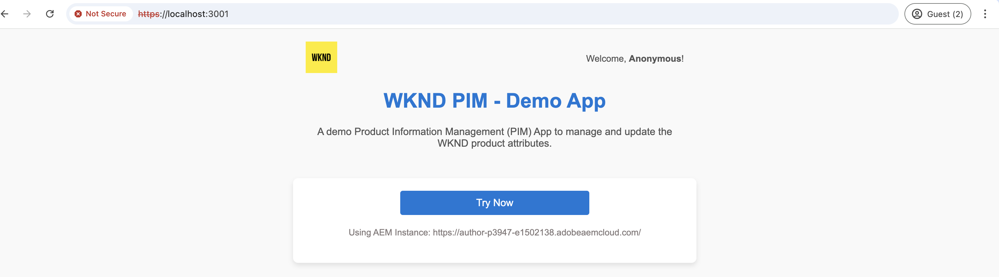

# OAuth 웹 앱 인증을 사용하여 OpenAPI 기반 AEM API 호출

OAuth 웹 앱을 사용하는 사용자 지정 웹 앱의 사용자 기반 인증을 사용하여 AEM as a Cloud Service에서 OpenAPI 기반 AEM API를 호출하는 방법에 대해 알아봅니다.

OAuth 웹 앱 인증은 **사용자를 대신하여 AEM API에 액세스**&#x200B;해야 하는 프론트엔드 및 _백엔드_ 구성 요소가 있는 웹 애플리케이션에 이상적입니다. OAuth 2.0 _authorization_code_ 권한 유형을 사용하여 AEM API에 액세스할 수 있는 사용자 대신 액세스 토큰을 가져옵니다. 자세한 내용은 [OAuth 서버 간 자격 증명과 OAuth 웹 앱/단일 페이지 앱 자격 증명 간의 차이점](../overview.md#difference-between-oauth-server-to-server-and-oauth-web-appsingle-page-app-credentials)을 참조하십시오.

>[!AVAILABILITY]
>
>OpenAPI 기반 AEM API는 조기 액세스 프로그램의 일부로 사용할 수 있습니다. 액세스하는 데 관심이 있는 경우 사용 사례에 대한 설명을 포함하여 [aem-apis@adobe.com](mailto:aem-apis@adobe.com)에 전자 메일을 보내는 것이 좋습니다.

## 학습 내용{#what-you-learn}

이 튜토리얼에서는 다음 방법을 알아봅니다.

- _OAuth 웹 앱_ 인증을 사용하여 Assets 작성자 API에 액세스하도록 Adobe Developer Console(ADC) 프로젝트를 구성합니다.

- 사용자 지정 웹 앱에서 OAuth 웹 앱 인증 플로우를 구현합니다.
   - IMS 사용자 인증 및 앱 권한 부여.
   - 사용자별 액세스 토큰 검색.
   - 사용자별 액세스 토큰을 사용하여 OpenAPI 기반 AEM API에 액세스

시작하기 전에 다음을 검토했는지 확인하십시오.

- [Adobe API 및 관련 개념 액세스](../overview.md#accessing-adobe-apis-and-related-concepts) 섹션.
- [OpenAPI 기반 AEM API 설정](../setup.md) 문서.

## 샘플 웹 앱: WKND-PIM 개요 및 기능 흐름

샘플 웹 앱, WKND PIM(제품 정보 관리) 및 기능 흐름에 대해 알아보겠습니다.

WKND PIM 앱은 AEM as a Cloud Service 내에 저장된 제품 속성 및 자산 메타데이터를 관리하도록 설계된 샘플 웹 애플리케이션입니다. 이 예에서는 웹 앱을 Adobe API와 원활하게 통합하여 사용자 중심의 효율적인 워크플로우를 제공하는 방법을 보여 줍니다.

Adobe Developer Console(ADC) 프로젝트가 OAuth 웹 앱 인증을 사용하여 Assets 작성자 API에 액세스하도록 구성되어 있습니다. _authorization_code_ 권한 부여 흐름을 시작하는 데 필요한 _client_id_ 및 _client_secret_&#x200B;을(를) WKND-PIM 웹 앱에 제공합니다.

>[!VIDEO](https://video.tv.adobe.com/v/3442757?quality=12&learn=on)


다음 다이어그램은 WKND-PIM 웹 앱 _Assets 작성자 API와 상호 작용하기 위한 사용자별 액세스 토큰을 가져오는 중_&#x200B;의 기능 흐름을 보여 줍니다.


1. 웹 앱은 인증을 위해 사용자를 Adobe IMS(Identity Management System)로 리디렉션하여 프로세스를 시작합니다.
1. 리디렉션과 함께 웹 앱은 필수 _client_id_ 및 _redirect_uri_&#x200B;을(를) IMS에 전달합니다.
1. IMS는 사용자를 인증하고 _authorization_code_&#x200B;과(와) 함께 지정된 _redirect_uri_(으)로 다시 보냅니다.
1. 웹 앱은 _client_id_ 및 _client_secret_&#x200B;을(를) 사용하여 사용자별 액세스 토큰에 대해 _authorization_code_&#x200B;을(를) IMS와 교환합니다.
1. 유효성 검사에 성공하면 IMS에서 사용자별 _액세스 토큰_&#x200B;을(를) 발행합니다.
1. 웹 앱은 _액세스 토큰_&#x200B;을(를) 안전하게 사용하여 Assets 작성자 API와 상호 작용하여 사용자가 제품 자산 메타데이터를 검색하거나 업데이트할 수 있도록 합니다.

WKND-PIM 웹 앱은 [Node.js](https://nodejs.org/en) 및 [Express](https://expressjs.com/)을(를) 사용하여 개발되었습니다. Express는 개인 비밀과 사용자별 액세스 토큰을 안전하게 관리하는 서버 역할을 합니다.

이 자습서에 설명된 접근 방식을 사용하여 Adobe API와 통합하는 웹 앱을 만드는 데 다른 웹 스택(Java, Python, .NET 기반 등)을 사용할 수 있습니다.

## 이 자습서를 사용하는 방법{#how-to-use-this-tutorial}

[웹 앱 키 코드 조각 검토](#review-web-app-key-code-snippets) 섹션을 통해 WKND-PIM 웹 앱에서 사용되는 OAuth 웹 앱 인증 흐름 및 API 호출 코드 조각을 이해할 수 있습니다. 또는 [웹 앱 설정 및 실행](#setup-run-web-app) 섹션으로 직접 이동하여 로컬 컴퓨터에서 WKND-PIM 웹 앱을 설정 및 실행하여 OAuth 웹 앱 인증 흐름 및 API 호출을 이해합니다.

## 웹 앱 키 코드 조각 검토{#review-web-app-key-code-snippets}

WKND-PIM 웹 앱에서 사용되는 키 코드 조각을 검토하여 OAuth 웹 앱 인증 흐름 및 API 호출을 이해하겠습니다.

### WKND-PIM 웹 앱 코드 다운로드

1. [WKND-PIM 웹 앱](../assets/web-app/wknd-pim-demo-web-app.zip) zip 파일을 다운로드하고 압축을 풉니다.

1. 추출된 폴더로 이동하여 즐겨 찾는 코드 편집기에서 `.env.example` 파일을 엽니다. 필요한 구성 매개 변수를 검토합니다.

   ```plaintext
   ########################################################################
   # Adobe IMS, Adobe Developer Console (ADC), and AEM Assets Information
   ########################################################################
   # Adobe IMS OAuth endpoints
   ADOBE_IMS_AUTHORIZATION_ENDPOINT=https://ims-na1.adobelogin.com/ims/authorize/v2
   ADOBE_IMS_TOKEN_ENDPOINT=https://ims-na1.adobelogin.com/ims/token/v3
   ADOBE_IMS_USERINFO_ENDPOINT=https://ims-na1.adobelogin.com/ims/userinfo/v2
   
   # Adobe Developer Console (ADC) Project's OAuth Web App credential
   ADC_CLIENT_ID=<ADC Project OAuth Web App credential ClientID>
   ADC_CLIENT_SECRET=<ADC Project OAuth Web App credential Client Secret>
   ADC_SCOPES=<ADC Project OAuth Web App credential credential Scopes>
   
   # AEM Assets Information
   AEM_ASSET_HOSTNAME=<AEM Assets Hostname, e.g., https://author-p63947-e1502138.adobeaemcloud.com/>
   AEM_ASSET_IDS=< AEM Asset IDs Comma Seperated, e.g., urn:aaid:aem:9f20a8ce-934a-4560-8720-250e529fbb17,urn:aaid:aem:6e0123cd-8a67-4d1f-b721-1b3da987d831>
   
   ################################################
   # Web App Information
   ################################################
   # The port number on which this server (web app) will run
   PORT = 3000
   
   # The URL to which the user will be redirected after the OAuth flow is complete
   REDIRECT_URI=https://localhost:3001/callback
   
   # The Express (express-session) uses this secret to encrypt and verify the authenticity of that cookie
   EXPRESS_SESSION_SECRET=<Express Session Secret>
   ```

   자리 표시자를 Adobe Developer Console(ADC) 프로젝트 및 AEM as a Cloud Service Assets 인스턴스의 실제 값으로 바꿔야 합니다.

### IMS 사용자 인증 및 앱 권한 부여

IMS 사용자 인증 및 앱 인증을 시작하는 코드를 검토해 보겠습니다. 에셋 메타데이터를 검토하거나 업데이트하려면 사용자는 Adobe IMS에 대해 인증하고 WKND-PIM 웹 앱이 자신 대신 Assets 작성자 API에 액세스하도록 승인해야 합니다.

첫 번째 로그인 시도에서 사용자는 WKND-PIM 웹 앱이 자신을 대신하여 Assets 작성자 API에 액세스할 수 있도록 하는 동의를 제공해야 합니다.


1. `routes/update-product-attributes.js` 파일은 사용자의 [빠른 세션](https://www.npmjs.com/package/express-session)에 액세스 토큰이 있는지 확인합니다. 그렇지 않으면 사용자를 `/auth` 경로로 리디렉션합니다.

   ```javascript
   ...
   // The update-product-attributes route, shows the product attributes form with tabs
   router.get("/update-product-attributes", async (req, res) => {
     // Check if the user is authenticated, if not redirect to the auth route
     if (!req.session.accessToken) {
         return res.redirect("/auth");
     }
     ...
   });
   ```

1. `routes/adobe-ims-auth.js` 파일에서 `/auth` 경로는 IMS 사용자 인증 및 앱 권한 부여 흐름을 시작합니다. Adobe IMS 인증 끝점에 전달된 _client_id_, _redirect_uri_ 및 _response_type_ 매개 변수를 참고하십시오.

   ```javascript
   ...
   // Route to initiate Adobe IMS user authentication
   router.get("/auth", (req, res) => {
     // Redirect user to Adobe IMS authorization endpoint
     try {
         // Constructing the authorization URL
         const params = new URLSearchParams({
         client_id: adobeADCConfig.clientId,
         redirect_uri: redirectUri,
         response_type: "code",
         });
   
         // Append scopes if defined in configuration
         if (adobeADCConfig?.scopes) params.append("scope", adobeADCConfig.scopes);
   
         // Redirect user to Adobe IMS authorization URL
         const imsAuthorizationUrl = `${
         adobeIMSConfig.authorizationEndpoint
         }?${params.toString()}`;
   
         res.redirect(imsAuthorizationUrl);
     } catch (error) {
         console.error("Error initiating Adobe IMS authentication:", error);
         res.status(500).send("Unable to initiate authentication");
     }
   });
   ...
   ```

사용자가 Adobe IMS에 대해 인증되지 않은 경우 사용자에게 인증을 요청하도록 Adobe ID 로그인 페이지가 표시됩니다.

이미 인증된 경우 사용자는 _authorization_code_&#x200B;을(를) 사용하여 WKND-PIM 웹 앱의 지정된 _redirect_uri_(으)로 다시 리디렉션됩니다.

### 액세스 토큰 검색

WKND-PIM 웹 앱은 ADC 프로젝트의 OAuth 웹 앱 자격 증명의 _client_id_ 및 _client_secret_&#x200B;을(를) 사용하여 사용자별 액세스 토큰에 대해 _authorization_code_&#x200B;을(를) Adobe IMS와 안전하게 교환합니다.

`routes/adobe-ims-auth.js` 파일에서 `/callback` 경로는 사용자별 액세스 토큰에 대해 Adobe IMS와 _authorization_code_&#x200B;을(를) 교환합니다.

```javascript
...
// Callback route to exchange authorization code for access token
router.get("/callback", async (req, res) => {
  // Extracting authorization code from the query parameters
  const authorizationCode = req.query.code;

  if (!authorizationCode) {
    return res.status(400).send("Missing authorization code");
  }

  // Exchange authorization code for access token
  try {
    // Fetch access token from Adobe IMS token endpoint
    const response = await fetch(adobeIMSConfig.tokenEndpoint, {
      method: "POST",
      headers: {
        "Content-Type": "application/x-www-form-urlencoded",
        Authorization: `Basic ${Buffer.from(
          `${adobeADCConfig.clientId}:${adobeADCConfig.clientSecret}`
        ).toString("base64")}`,
      },
      body: new URLSearchParams({
        code: authorizationCode,
        grant_type: "authorization_code",
      }),
    });

    if (!response.ok) {
      console.error("Failed to fetch access token:", response.statusText);
      return res.status(500).send("Failed to fetch access token");
    }

    const data = await response.json();

    if (!data.access_token) {
      console.error("Access token missing in the response:", data);
      return res.status(500).send("Invalid response from token endpoint");
    }

    // For debugging purposes
    console.log("Access token:", data.access_token);

    // Store the access token in the session
    req.session.accessToken = data.access_token;

    // Redirect user to update product attributes
    res.redirect("/update-product-attributes");
  } catch (error) {
    console.error("Error exchanging authorization code:", error);
    res.status(500).send("Error during token exchange");
  }
});
```

액세스 토큰은 Assets 작성자 API에 대한 후속 요청을 위해 [빠른 세션](https://www.npmjs.com/package/express-session)에 저장됩니다.

### 액세스 토큰을 사용하여 OpenAPI 기반 AEM API에 액세스

WKND-PIM 웹 앱은 사용자별 액세스 토큰을 안전하게 사용하여 Assets 작성자 API와 상호 작용함으로써 사용자가 제품 에셋 메타데이터를 검색하거나 업데이트할 수 있습니다.

`routes/invoke-aem-apis.js` 파일에서 `/api/getAEMAssetMetadata` 및 `/api/updateAEMAssetMetadata` 경로는 액세스 토큰을 사용하여 Assets 작성자 API를 호출합니다.

```javascript
...
// API Route: Get AEM Asset Metadata
router.get("/api/getAEMAssetMetadata", async (req, res) => {
  const assetId = req.query.assetId;
  const bucketName = getBucketName(aemAssetsConfig.hostname);

  if (!assetId || !bucketName) {
    return res.status(400).json({ error: "Missing AEM Information" });
  }

  // Get the access token from the session
  const accessToken = req.session.accessToken;

  if (!accessToken) {
    return res.status(401).json({ error: "Not Authenticated with Adobe IMS" });
  }

  try {
    const assetMetadata = await invokeGetAssetMetadataAPI(
      bucketName,
      assetId,
      accessToken
    );

    const filteredMetadata = getFilteredMetadata(JSON.parse(assetMetadata));
    res.status(200).json(filteredMetadata);
  } catch (error) {
    console.error("Error getting asset metadata:", error.message);
    res.status(500).json({ error: `Internal Server Error: ${error.message}` });
  }
});

// Helper function to invoke the AEM API to get asset metadata
async function invokeGetAssetMetadataAPI(bucketName, assetId, accessToken) {
  const apiUrl = `https://${bucketName}.adobeaemcloud.com/adobe/assets/${assetId}/metadata`;


  // For debugging purposes
  console.log("API URL:", apiUrl);
  console.log("Access Token:", accessToken);
  console.log("API Key:", adobeADCConfig.clientId);

  try {
    const response = await fetch(apiUrl, {
      method: "GET",
      headers: {
        "If-None-Match": "string",
        "X-Adobe-Accept-Experimental": "1",
        Authorization: `Bearer ${accessToken}`,
        "X-Api-Key": adobeADCConfig.clientId,
      },
    });

    console.log("Response Status:", response.status);

    if (!response.ok) {
      throw new Error(`AEM API Error: ${response.statusText}`);
    }

    return await response.text();
  } catch (error) {
    throw new Error(`Failed to fetch asset metadata: ${error.message}`);
  }
}

// Helper function to filter the metadata properties like pim: and dc:
function getFilteredMetadata(data) {
  if (!data || !data.assetMetadata) {
    throw new Error("Invalid metadata structure received from API");
  }

  const properties = data.assetMetadata;
  return Object.keys(properties).reduce((filtered, key) => {
    if (
      key.startsWith("pim:") ||
      key === "dc:title" ||
      key === "dc:description"
    ) {
      filtered[key] = properties[key];
    }
    return filtered;
  }, {});
}

// API Route: Update AEM Asset Metadata
router.post("/api/updateAEMAssetMetadata", async (req, res) => {
  const { assetId, metadata } = req.body;

  if (!assetId || !metadata || typeof metadata !== "object") {
    return res.status(400).json({ error: "Invalid or Missing Metadata" });
  }

  const bucketName = getBucketName(aemAssetsConfig.hostname);
  if (!bucketName) {
    return res.status(400).json({ error: "Missing AEM Information" });
  }

  const accessToken = req.session.accessToken;
  if (!accessToken) {
    return res.status(401).json({ error: "Not Authenticated with Adobe IMS" });
  }

  try {
    const updatedMetadata = await invokePatchAssetMetadataAPI(
      bucketName,
      assetId,
      metadata,
      accessToken
    );
    res.status(200).json(updatedMetadata);
  } catch (error) {
    console.error("Error updating asset metadata:", error.message);
    res.status(500).json({ error: `Internal Server Error: ${error.message}` });
  }
});

// Helper function to invoke the AEM API to update asset metadata
async function invokePatchAssetMetadataAPI(
  bucketName,
  assetId,
  metadata,
  accessToken
) {
  const apiUrl = `https://${bucketName}.adobeaemcloud.com/adobe/assets/${assetId}/metadata`;
  const headers = {
    "Content-Type": "application/json-patch+json",
    "If-Match": "*",
    "X-Adobe-Accept-Experimental": "1",
    Authorization: `Bearer ${accessToken}`,
    "X-Api-Key": adobeADCConfig.clientId,
  };

  try {
    const response = await fetch(apiUrl, {
      method: "PATCH",
      headers,
      body: JSON.stringify(getTransformedMetadata(metadata)),
    });

    if (!response.ok) {
      throw new Error(`AEM API Error: ${response.statusText}`);
    }

    return await response.json();
  } catch (error) {
    throw new Error(`Failed to update asset metadata: ${error.message}`);
  }
}

// Helper function to transform metadata into JSON Patch format, e.g. [{ op: "add", path: "dc:title", value: "New Title" }]
function getTransformedMetadata(metadata) {
  return Object.keys(metadata).map((key) => ({
    op: "add",
    path: `/${key}`,
    value: metadata[key],
  }));
}
```

OpenAPI 기반 AEM API 호출은 액세스 토큰이 안전하게 관리되고 클라이언트측에 노출되지 않도록 하기 위해 클라이언트측(브라우저)이 아닌 서버측(익스프레스 미들웨어)에서 수행됩니다.

### 액세스 토큰 새로 고침

액세스 토큰이 만료되기 전에 새로 고치려면 새로 고침 토큰 플로우를 구현할 수 있습니다. 그러나 자습서를 단순화하기 위해 WKND-PIM 웹 앱은 새로 고침 토큰 플로우를 구현하지 않습니다.


>[!TIP]
>
>다음 섹션에 따라 로컬 컴퓨터에서 WKND-PIM 웹 앱을 테스트하고 OAuth 웹 앱 인증 흐름 및 API 호출을 통해 실습 경험을 얻을 수 있습니다.

## 웹 앱 설정 및 실행

로컬 컴퓨터에서 WKND-PIM 웹 앱을 구성 및 실행하여 OAuth 웹 앱 인증 흐름 및 API 호출을 이해하겠습니다.

### 사전 요구 사항

이 자습서를 완료하려면 다음이 필요합니다.

- 다음을 사용하여 현대화된 AEM as a Cloud Service 환경:
   - AEM 릴리스 `2024.10.18459.20241031T210302Z` 이상
   - 새 스타일 제품 프로필(2024년 11월 이전에 환경이 생성된 경우)

  자세한 내용은 [OpenAPI 기반 AEM API 설정](../setup.md) 문서를 참조하십시오.

- 샘플 [WKND Sites](https://github.com/adobe/aem-guides-wknd?#aem-wknd-sites-project) 프로젝트를 여기에 배포해야 합니다.

- [Adobe Developer Console](https://developer.adobe.com/developer-console/docs/guides/getting-started/)에 액세스

- 로컬 컴퓨터에 [Node.js](https://nodejs.org/en/)을(를) 설치하여 샘플 NodeJS 응용 프로그램을 실행합니다.

- 자체 서명된 인증서를 사용하여 로컬 SSL HTTP 프록시를 만들려면 로컬 컴퓨터에 [local-ssl-proxy](https://www.npmjs.com/package/local-ssl-proxy#local-ssl-proxy)을 설치하십시오.


### 개발 단계

높은 수준의 개발 단계는 다음과 같습니다.

1. ADC 프로젝트 구성
   1. Assets 작성자 API 추가
   1. OAuth 웹 앱 자격 증명 구성
1. ADC 프로젝트 통신을 사용하도록 AEM 인스턴스 구성
1. AEM에서 에셋 메타데이터 스키마를 만들고 적용합니다
1. WKND-PIM 웹 앱 구성 및 실행
1. 엔드 투 엔드 흐름 확인

### ADC 프로젝트 구성

[Setup OpenAPI 기반 AEM API](../setup.md)에서 ADC 프로젝트 구성 단계가 _반복_&#x200B;됩니다. Assets 작성자 API를 추가하고 해당 인증 방법을 OAuth 웹 앱으로 구성하는 작업이 반복됩니다.

1. [Adobe Developer Console](https://developer.adobe.com/console/projects)에서 원하는 프로젝트를 엽니다.

1. AEM API를 추가하려면 **API 추가** 단추를 클릭합니다.

   

1. _API 추가_ 대화 상자에서 _Experience Cloud_&#x200B;별로 필터링하고 **AEM Assets 작성자 API** 카드를 선택한 후 **다음**&#x200B;을 클릭합니다.

   

1. 그런 다음 _API 구성_ 대화 상자에서 **사용자 인증** 인증 옵션을 선택하고 **다음**&#x200B;을 클릭합니다.

   

1. 다음 _API 구성_ 대화 상자에서 **OAuth 웹 앱** 인증 옵션을 선택하고 **다음**&#x200B;을(를) 클릭합니다.

   

1. _OAuth 웹 앱 구성_ 대화 상자에서 다음 세부 정보를 입력하고 **다음**&#x200B;을 클릭합니다.
   - 기본 리디렉션 URI: `https://localhost:3001/callback`
   - 리디렉션 URI 패턴: `https://localhost:3001/callback`

   

1. 사용 가능한 범위를 검토하고 **구성된 API 저장**&#x200B;을 클릭합니다.

   

1. AEM API 및 인증 구성을 검토하십시오.

   

   

### ADC 프로젝트 통신을 사용하도록 AEM 인스턴스 구성

[OpenAPI 기반 AEM API 설정](../setup.md#configure-the-aem-instance-to-enable-adc-project-communication) 문서의 지침에 따라 ADC 프로젝트 통신을 사용하도록 AEM 인스턴스를 구성하십시오.

### 자산 메타데이터 스키마 만들기 및 적용

기본적으로 WKND Sites 프로젝트에는 제품 속성을 표시하는 데 필요한 에셋 메타데이터 스키마가 없습니다. AEM 인스턴스의 에셋 폴더에 에셋 메타데이터 스키마를 만들고 적용해 보겠습니다.

1. AEM as a Cloud Service 자산 인스턴스에 로그인합니다. [자산 보기](https://experienceleague.adobe.com/en/docs/experience-manager-learn/assets/authoring/switch-views)를 사용하여 `/content/dam/wknd-shared/en` 폴더로 이동합니다.

   

1. **PIM**&#x200B;을(를) 만들고 **Camping** 폴더를 만든 다음 **Camping** 폴더에서 [샘플 이미지](../assets/web-app/camping-gear-imgs.zip)를 업로드하십시오.

   

이제 PIM 특성 관련 메타데이터 스키마를 만들어 **PIM** 폴더에 적용해 보겠습니다.

1. 왼쪽 레일에서 **설정** > **메타데이터 Forms** 옵션으로 이동하고 **만들기** 단추를 클릭합니다.

1. **메타데이터 양식 만들기** 대화 상자에서 다음 세부 정보를 입력하고 **만들기**&#x200B;를 클릭합니다.
   - 이름: `PIM`
   - 기존 양식 구조를 템플릿으로 사용: `Check`
   - 다음 중에서 선택: `default`

   

1. **+** 아이콘을 클릭하여 새 **PIM** 탭을 추가하고 **한 줄 텍스트** 구성 요소를 추가합니다. 메타데이터 속성 이름은 `pim:` 접두사로 시작해야 합니다.

   

   | 레이블 | 플레이스홀더 | 메타데이터 속성 |
   | --- | --- | --- |
   | SKU | SKU ID 입력 | `pim:sku` |
   | 제품 유형 | 예 : 배낭, 텐트, 자켓 | `pim:productType` |
   | 제품 범주 | 예 : 캠핑, 하이킹, 클라이밍 | `pim:productCategory` |
   | 제조업체 | 제조업체 이름 입력 | `pim:manufacturer` |
   | 모델 | 모델 이름 입력 | `pim:model` |
   | 브랜드 이름 | 브랜드 이름 입력 | `pim:brandName` |

1. 메타데이터 양식을 저장하려면 **저장** 및 **닫기**&#x200B;를 클릭하십시오.

1. 마지막으로 **PIM** 메타데이터 스키마를 **PIM** 폴더에 적용합니다.

   

위의 단계를 수행하면 **PIM** 폴더의 자산이 제품 특성 메타데이터를 저장할 준비가 되었습니다.

### WKND-PIM 웹 앱 구성 및 실행

1. [WKND-PIM 웹 앱](../assets/web-app/wknd-pim-demo-web-app.zip) zip 파일을 다운로드하고 압축을 풉니다.

1. 추출된 폴더로 이동하여 `.env.example` 파일을 `.env`에 복사합니다.

1. Adobe Developer Console(ADC) 프로젝트 및 AEM as a Cloud Service Assets 인스턴스의 필수 구성 매개 변수로 `.env` 파일을 업데이트합니다.

   ```plaintext
   ########################################################################
   # Adobe IMS, Adobe Developer Console (ADC), and AEM Assets Information
   ########################################################################
   # Adobe IMS OAuth endpoints
   ADOBE_IMS_AUTHORIZATION_ENDPOINT=https://ims-na1.adobelogin.com/ims/authorize/v2
   ADOBE_IMS_TOKEN_ENDPOINT=https://ims-na1.adobelogin.com/ims/token/v3
   ADOBE_IMS_USERINFO_ENDPOINT=https://ims-na1.adobelogin.com/ims/userinfo/v2
   
   # Adobe Developer Console (ADC) Project OAuth Web App credential
   ADC_CLIENT_ID=e1adsfsd59384320bbe4f9298f00b7ab
   ADC_CLIENT_SECRET=p8e-Mdfgfdsg43RHugVRTEOyWlmEU5m
   ADC_SCOPES=AdobeID,openid,aem.folders,aem.assets.author
   
   # AEM Assets Information
   AEM_ASSET_HOSTNAME=https://author-p3947-e1542138.adobeaemcloud.com/
   AEM_ASSET_IDS=urn:aaid:aem:aa689a9f-04da-4fbb-b460-74a5b6a69090,urn:aaid:aem:e4fdb6f6-1007-4e84-9726-a9522931786a
   
   ################################################
   # Web App Information
   ################################################
   # The port number on which this server (web app) will run
   PORT = 3000
   
   # The URL to which the user will be redirected after the OAuth flow is complete
   REDIRECT_URI=http://localhost:3000/auth/callback
   
   # The Express (express-session) uses this secret to encrypt and verify the authenticity of that cookie
   # For demonstration purposes, this is a simple secret. In production, you should use a strong secret
   EXPRESS_SESSION_SECRET=1234554321
   ```

   `AEM_ASSET_IDS`은(는) **Camping** 폴더에 있는 업로드된 이미지의 `jcr:uuid` 속성 값입니다. 자세한 내용은 이 [섹션](./invoke-api-using-oauth-s2s.md#review-the-api)을 참조하세요.

1. 터미널을 열고 추출된 폴더로 이동합니다. 다음 명령을 사용하여 필요한 종속성을 설치합니다.

   ```bash
   $ npm install
   ```

1. 다음 명령을 사용하여 WKND-PIM 웹 앱을 시작합니다.

   ```bash
   $ npm start
   ```

1. 다음 명령을 사용하여 로컬 SSL HTTP 프록시를 실행합니다.

   ```bash
   $ local-ssl-proxy --source 3001 --target 3000 --cert ./ssl/server.crt --key ./ssl/server.key
   ```

   로컬 SSL HTTP 프록시가 IMS로 사용되려면 리디렉션 URI가 HTTPS여야 합니다.

### 엔드 투 엔드 흐름 확인

1. 브라우저를 열고 `https://localhost:3001`(으)로 이동하여 WKND-PIM 웹 앱에 액세스합니다. 자체 서명된 인증서 경고를 수락합니다.

   

1. 제품 특성 메타데이터를 검토하고 업데이트하려면 **지금 시도**&#x200B;를 클릭하세요. IMS 사용자 인증 및 앱 권한 부여 플로우를 시작합니다.

1. Adobe ID 자격 증명으로 로그인하고 WKND-PIM 웹 앱이 사용자를 대신하여 Assets 작성자 API에 액세스할 수 있도록 동의하는 권한을 제공합니다.

1. `https://localhost:3001/update-product-attributes` 경로/페이지에서 **AEM 자산 특성** 탭을 클릭합니다. **자산 ID** 드롭다운에서 자산 메타데이터를 볼 자산 ID를 선택합니다.

   

1. 에셋 메타데이터를 업데이트하고 **AEM 에셋 특성 업데이트**&#x200B;를 클릭하여 에셋 메타데이터를 업데이트합니다.

   

>[!IMPORTANT]
>
>인증된 사용자가 자산 메타데이터를 검토하거나 업데이트하는 데 필요한 권한이 없는 경우 OpenAPI 기반 AEM API는 403 금지 오류를 반환합니다. 이렇게 하면 사용자가 인증되고 유효한 IMS 액세스 토큰을 보유한 경우에도 필요한 권한 없이 AEM 리소스에 액세스할 수 없습니다.


### 애플리케이션 코드 검토

WKND-PIM 웹 앱의 높은 수준의 코드 구조 및 주요 진입점을 검토해 보겠습니다. 애플리케이션은 Node.js + Express를 사용하여 개발됩니다.

1. `app.js`은(는) 응용 프로그램의 주 진입점입니다. Express 앱을 초기화하고 세션을 설정하고 경로를 마운트합니다.

1. `public` 폴더에는 CSS, JavaScript 및 이미지와 같은 정적 자산이 포함되어 있습니다. `script.js` 파일에는 Express `/api/getAEMAssetMetadata` 및 `/api/updateAEMAssetMetadata` 경로와 상호 작용하는 클라이언트측 JavaScript 코드가 포함되어 있습니다.

1. `routes` 폴더에 빠른 경로가 있습니다.
   1. `index.js`: 홈 페이지를 렌더링하는 기본 경로입니다.
   1. `update-product-attributes.js`: 탭으로 제품 특성 양식을 렌더링하는 경로이며 액세스 토큰에 대한 빠른 세션도 확인합니다.
   1. `adobe-ims-auth.js`: Adobe IMS 사용자 인증 및 앱 권한 부여 흐름을 시작하는 경로입니다.
   1. `invoke-aem-apis.js`: 사용자별 액세스 토큰을 사용하여 OpenAPI 기반 AEM API를 호출하는 경로입니다.

1. `views` 폴더에는 HTML 페이지를 렌더링할 EJS 템플릿이 들어 있습니다.

1. `utils` 폴더에 유틸리티 함수가 있습니다.

1. `ssl` 폴더에는 자체 서명된 인증서와 로컬 SSL HTTP 프록시를 실행할 키 파일이 포함되어 있습니다.

Java, Python 또는 .NET과 같은 다른 서버측 기술을 사용하여 기존 웹 앱을 Adobe API와 개발하거나 통합할 수 있습니다.

## 요약

이 자습서에서는 OAuth 웹 앱 인증을 사용하여 사용자 지정 웹 앱에서 AEM as a Cloud Service에서 OpenAPI 기반 AEM API를 호출하는 방법에 대해 알아보았습니다. WKND-PIM 웹 앱에 사용된 키 코드 조각을 검토하여 OAuth 웹 앱 인증 흐름을 이해했습니다.

자습서를 참조하여 OpenAPI 기반 AEM API를 사용자 지정 웹 애플리케이션과 통합하여 효율적인 사용자 중심 워크플로우를 제공할 수 있습니다.

## 추가 리소스

- [사용자 인증 구현 안내서](https://developer.adobe.com/developer-console/docs/guides/authentication/UserAuthentication/implementation/)
- [요청 승인](https://developer.adobe.com/developer-console/docs/guides/authentication/UserAuthentication/IMS/#authorize-request)
- [액세스 토큰을 가져오는 중](https://developer.adobe.com/developer-console/docs/guides/authentication/UserAuthentication/IMS/#fetching-access-tokens)
- [액세스 토큰을 새로 고치는 중](https://developer.adobe.com/developer-console/docs/guides/authentication/UserAuthentication/IMS/#refreshing-access-tokens)
