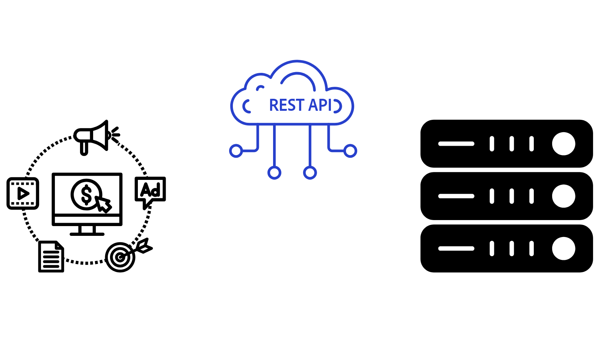

# AEM API 개요{#aem-apis-overview}

Adobe Experience Manager(AEM)의 다양한 API 유형에 대해 알아보고 통합을 위해 선택할 API를 이해합니다.

AEM에서 컨텐츠, 자산 및 양식을 만들고, 읽고, 업데이트하고, 삭제하기 위해 개발자는 다양한 API를 사용할 수 있습니다. 이러한 API를 통해 개발자는 AEM과 상호 작용하는 사용자 지정 애플리케이션을 만들 수 있습니다.

AEM의 다양한 API 유형을 살펴보고 통합을 위해 선택할 API를 이해해 보겠습니다.

## AEM API 유형{#types-of-aem-apis}

AEM은 작성자 및 게시 서비스 유형과 상호 작용하기 위한 다음 API를 제공합니다.

| AEM API 유형 | 설명 | 사용 가능 | 사용 사례 | API 예 |
| --- | --- | --- | --- | --- |
| OpenAPI 기반 AEM API | Assets, Sites 및 Forms에 대해 표준화되고 기계가 읽을 수 있는 API입니다. | **AEM as a Cloud Service 전용** | API 우선 개발, 최신 애플리케이션 | [Assets 작성자 API](https://developer.adobe.com/experience-cloud/experience-manager-apis/api/experimental/assets/author/), [폴더 API](https://developer.adobe.com/experience-cloud/experience-manager-apis/api/experimental/folders/), [AEM Sites API](https://developer.adobe.com/experience-cloud/experience-manager-apis/api/stable/sites/), [Forms 문서 서비스 API](https://developer.adobe.com/experience-cloud/experience-manager-apis/api/experimental/document/) 및 기타 |
| RESTful API | AEM 리소스와 상호 작용하기 위한 기존 REST 엔드포인트입니다. | AEM 6.X, AEM as a Cloud Service | CRUD 작업, 최신 애플리케이션 | [Assets HTTP API](https://experienceleague.adobe.com/ko/docs/experience-manager-cloud-service/content/assets/admin/mac-api-assets), [워크플로 REST API](https://experienceleague.adobe.com/ko/docs/experience-manager-65/content/implementing/developing/extending-aem/extending-workflows/workflows-program-interaction#using-the-workflow-rest-api), [콘텐츠 서비스용 JSON 내보내기](https://experienceleague.adobe.com/ko/docs/experience-manager-cloud-service/content/implementing/developing/full-stack/components-templates/json-exporter) 및 기타 |
| GRAPHQL API | 유연한 쿼리를 통해 구조화된 콘텐츠를 효율적으로 검색할 수 있도록 최적화되었습니다. | AEM 6.X, AEM as a Cloud Service | 헤드리스 CMS, SPA, 모바일 앱 | [GraphQL API](https://experienceleague.adobe.com/ko/docs/experience-manager-cloud-service/content/headless/graphql-api/content-fragments) |
| 기존(비 RESTful) API | JCR, Sling 모델, 쿼리 빌더 등과 같은 이전 API입니다. | AEM 6.X, AEM as a Cloud Service | 이전 통합, 이전 버전과의 호환성 | [Query Builder API](https://experienceleague.adobe.com/ko/docs/experience-manager-cloud-service/content/implementing/developing/full-stack/search/query-builder-api) 외 |

자세한 내용은 [Adobe Experience Manager as a Cloud Service API](https://developer.adobe.com/experience-cloud/experience-manager-apis/) 페이지를 참조하십시오.

## 선택할 API{#which-api-to-choose}

통합을 위한 API를 선택할 때 다음 요소를 고려하십시오.

- **사용 사례**: AEM API에서 사용 사례를 지원하는지 여부를 결정합니다. 가능한 경우 _OpenAPI 기반 AEM API를 사용_&#x200B;하십시오. OpenAPI는 AEM과 상호 작용하는 표준화된 최신 접근 방식을 제공합니다. OpenAPI 기반 API를 사용할 수 없는 경우 RESTful API 또는 GraphQL API 및 최후의 수단으로 기존 API를 사용하는 것이 좋습니다.

- **호환성**: 선택한 API가 AEM 버전과 호환되는지 확인하십시오. 예를 들어 _OpenAPI 기반 AEM API는 AEM as a Cloud Service에만 해당되며_ AEM 6.X에서는 사용할 수 없습니다.

- **AEM 서비스 유형: 작성자와 게시 비교**: API의 액세스 모델은 서로 다르기 때문에 작성자 또는 게시 서비스에서 API를 실행하는지에 따라 API의 선택 여부도 달라집니다. AEM 작성자 서비스는 콘텐츠 작성에 사용되며 항상 인증이 필요합니다. AEM Publish 서비스는 컨텐츠 전달에 사용되며 사용 사례에 따라 인증이 필요하지 않을 수 있습니다.

- **인증**: API에서 사용할 인증 방법을 지원하는지 확인하십시오. 예:
   - **OpenAPI 기반 AEM API**: 클라이언트 자격 증명(서버 간), 인증 코드(웹 앱) 및 코드 교환(단일 페이지 앱) 권한 유형을 위한 증명 키를 포함하여 OAuth 2.0 인증을 지원합니다. 다른 AEM API는 OAuth 2.0 인증을 지원하지 않습니다.
   - **RESTful API**: JSON 웹 토큰(JWT) 인증을 지원하며 토큰 기반 인증으로도 알려져 있습니다.

## JSON 웹 토큰(JWT)과 OAuth 2.0 간의 차이점{#difference-between-jwt-and-oauth}

AEM API에 사용되는 두 가지 일반적인 인증 메커니즘인 JSON 웹 토큰(JWT)과 OAuth 2.0을 비교해봅시다.

| 기능 | JSON 웹 토큰(JWT) | OAuth 2.0 |
| --- | --- | --- |
| 다음에서 사용됨 | RESTful API | OpenAPI 기반 AEM API(RESTful 또는 기타 API에서 지원되지 않음) |
| 목적 | 서비스 인증 | 사용자 또는 서비스 인증 |
| 사용자 상호 작용 | 사용자 상호 작용이 필요하지 않음 | 인증 코드 및 단일 페이지 앱 부여 유형에 필요한 사용자 상호 작용 |
| 최적의 대상 | 서버 간 API 호출 | 앱 및 사용자에 대한 안전하고 허가된 액세스 |
| 필수 정보 | JWT 서명을 위한 개인 키 | OAuth 2.0용 클라이언트 ID 및 클라이언트 암호 |
| 토큰 만료 | 단기간, 종종 새로 고침이 필요함 | 액세스 토큰은 수명이 짧습니다. 새로 고침 토큰은 오래 지속되며 새 액세스 토큰을 가져오는 데 사용됩니다 |
| 자격 증명 관리 | [AEM Developer Console](https://experienceleague.adobe.com/ko/docs/experience-manager-learn/cloud-service/debugging/debugging-aem-as-a-cloud-service/developer-console) | [Adobe Developer Console](https://developer.adobe.com/developer-console/) |

## OpenAPI 기반 AEM API

OpenAPI 기반 AEM API에 대한 자세한 내용 및 [OpenAPI 기반 AEM API](./openapis/overview.md) 안내서에서 Adobe API에 액세스하는 중요한 개념에 대해 알아봅니다.

### 사용 사례

<!-- CARDS
{target = _self}

* ./openapis/use-cases/invoke-api-using-oauth-s2s.md
  {title = Invoke API using Server-to-Server authentication}
  {description = Learn how to invoke OpenAPI-based AEM APIs from a custom NodeJS application using OAuth Server-to-Server authentication.}
  {image = ./openapis/assets/s2s/OAuth-S2S.png}
* ./openapis/use-cases/invoke-api-using-oauth-web-app.md
  {title = Invoke API using Web App authentication}
  {description = Learn how to invoke OpenAPI-based AEM APIs from a custom web application using OAuth Web App authentication.}
  {image = ./openapis/assets/web-app/OAuth-WebApp.png} 
* ./openapis/use-cases/invoke-api-using-oauth-single-page-app.md
  {title = Invoke API using OAuth Single Page App}
  {description = Learn how to invoke OpenAPI-based AEM APIs from a custom Single Page App (SPA) using OAuth 2.0 PKCE flow.}
  {image = ./openapis/assets/spa/OAuth-SPA.png}
-->
<!-- START CARDS HTML - DO NOT MODIFY BY HAND -->

    

        

            

                <figure class="image x-is-16by9">
                    
                </figure>
            

            

                

                    

                        <a href="./openapis/use-cases/invoke-api-using-oauth-s2s.md" target="_self" rel="referrer" title="서버 간 인증을 사용하여 API 호출">서버 간 인증을 사용하여 API 호출</a>
                    

                    
OAuth 서버 간 인증을 사용하여 사용자 정의 NodeJS 애플리케이션에서 OpenAPI 기반 AEM API를 호출하는 방법을 알아봅니다.

                

                <a href="./openapis/use-cases/invoke-api-using-oauth-s2s.md" target="_self" rel="referrer" class="spectrum-Button spectrum-Button--outline spectrum-Button--primary spectrum-Button--sizeM" style="align-self: flex-start; margin-top: 1rem;">
                    자세히 알아보기
                </a>
            

        

    

    

        

            

                <figure class="image x-is-16by9">
                    
                </figure>
            

            

                

                    

                        <a href="./openapis/use-cases/invoke-api-using-oauth-web-app.md" target="_self" rel="referrer" title="웹 앱 인증을 사용하여 API 호출">웹 앱 인증을 사용하여 API 호출</a>
                    

                    
OAuth 웹 앱 인증을 사용하여 사용자 정의 웹 애플리케이션에서 OpenAPI 기반 AEM API를 호출하는 방법을 알아봅니다.

                

                <a href="./openapis/use-cases/invoke-api-using-oauth-web-app.md" target="_self" rel="referrer" class="spectrum-Button spectrum-Button--outline spectrum-Button--primary spectrum-Button--sizeM" style="align-self: flex-start; margin-top: 1rem;">
                    자세히 알아보기
                </a>
            

        

    

    

        

            

                <figure class="image x-is-16by9">
                    
                </figure>
            

            

                

                    

                        <a href="./openapis/use-cases/invoke-api-using-oauth-single-page-app.md" target="_self" rel="referrer" title="OAuth 단일 페이지 앱을 사용하여 API 호출">OAuth 단일 페이지 앱을 사용하여 API 호출</a>
                    

                    
OAuth 2.0 PKCE 흐름을 사용하여 사용자 지정 SPA(단일 페이지 앱)에서 OpenAPI 기반 AEM API를 호출하는 방법에 대해 알아봅니다.

                

                <a href="./openapis/use-cases/invoke-api-using-oauth-single-page-app.md" target="_self" rel="referrer" class="spectrum-Button spectrum-Button--outline spectrum-Button--primary spectrum-Button--sizeM" style="align-self: flex-start; margin-top: 1rem;">
                    자세히 알아보기
                </a>
            

        

    

<!-- END CARDS HTML - DO NOT MODIFY BY HAND -->

## GraphQL API - 예

[GraphQL Headless 시작하기 - GraphQL](https://experienceleague.adobe.com/ko/docs/experience-manager-learn/getting-started-with-aem-headless/graphql/overview)에서 AEM API와 이를 사용하는 방법에 대해 자세히 알아보세요.

### 사용 사례

<!-- CARDS
{target = _self}

* https://experienceleague.adobe.com/ko/docs/experience-manager-learn/getting-started-with-aem-headless/deployments/spa#example-single-page-app
  {title = Single Page Application (SPA)}
  {description = Learn how to build a Single Page Application (SPA) that fetches content from AEM using GraphQL APIs.}
  {image = ./assets/react-app-card.png}
* https://experienceleague.adobe.com/ko/docs/experience-manager-learn/getting-started-with-aem-headless/deployments/mobile#example-mobile-apps
  {title = Mobile App}
  {description = Learn how to build a mobile app that fetches content from AEM using GraphQL APIs.}
  {image = ./assets/ios-app-card.png}
* https://experienceleague.adobe.com/ko/docs/experience-manager-learn/getting-started-with-aem-headless/deployments/web-component#example-web-component
  {title = Web Component}
  {description = Learn how to build a web component that fetches content from AEM using GraphQL APIs.}
  {image = ./assets/web-component-card.png}
-->
<!-- START CARDS HTML - DO NOT MODIFY BY HAND -->

    

        

            

                <figure class="image x-is-16by9">
                    
                </figure>
            

            

                

                    

                        <a href="https://experienceleague.adobe.com/ko/docs/experience-manager-learn/getting-started-with-aem-headless/deployments/spa#example-single-page-app" target="_self" rel="referrer" title="SPA(단일 페이지 애플리케이션)">단일 페이지 응용 프로그램(SPA)</a>
                    

                    
GraphQL API를 사용하여 AEM에서 콘텐츠를 가져오는 SPA(단일 페이지 애플리케이션)를 구축하는 방법을 알아봅니다.

                

                <a href="https://experienceleague.adobe.com/ko/docs/experience-manager-learn/getting-started-with-aem-headless/deployments/spa#example-single-page-app" target="_self" rel="referrer" class="spectrum-Button spectrum-Button--outline spectrum-Button--primary spectrum-Button--sizeM" style="align-self: flex-start; margin-top: 1rem;">
                    자세히 알아보기
                </a>
            

        

    

    

        

            

                <figure class="image x-is-16by9">
                    
                </figure>
            

            

                

                    

                        <a href="https://experienceleague.adobe.com/ko/docs/experience-manager-learn/getting-started-with-aem-headless/deployments/mobile#example-mobile-apps" target="_self" rel="referrer" title="모바일 앱">모바일 앱</a>
                    

                    
GraphQL API를 사용하여 AEM에서 콘텐츠를 가져오는 모바일 앱을 빌드하는 방법을 알아봅니다.

                

                <a href="https://experienceleague.adobe.com/ko/docs/experience-manager-learn/getting-started-with-aem-headless/deployments/mobile#example-mobile-apps" target="_self" rel="referrer" class="spectrum-Button spectrum-Button--outline spectrum-Button--primary spectrum-Button--sizeM" style="align-self: flex-start; margin-top: 1rem;">
                    자세히 알아보기
                </a>
            

        

    

    

        

            

                <figure class="image x-is-16by9">
                    
                </figure>
            

            

                

                    

                        <a href="https://experienceleague.adobe.com/ko/docs/experience-manager-learn/getting-started-with-aem-headless/deployments/web-component#example-web-component" target="_self" rel="referrer" title="웹 구성 요소">웹 구성 요소</a>
                    

                    
GraphQL API를 사용하여 AEM에서 콘텐츠를 가져오는 웹 구성 요소를 빌드하는 방법을 알아봅니다.

                

                <a href="https://experienceleague.adobe.com/ko/docs/experience-manager-learn/getting-started-with-aem-headless/deployments/web-component#example-web-component" target="_self" rel="referrer" class="spectrum-Button spectrum-Button--outline spectrum-Button--primary spectrum-Button--sizeM" style="align-self: flex-start; margin-top: 1rem;">
                    자세히 알아보기
                </a>
            

        

    

<!-- END CARDS HTML - DO NOT MODIFY BY HAND -->

## RESTful API - 예

[Assets HTTP API](https://experienceleague.adobe.com/ko/docs/experience-manager-cloud-service/content/assets/admin/mac-api-assets) 및 [JSON 내보내기](https://experienceleague.adobe.com/ko/docs/experience-manager-cloud-service/content/implementing/developing/full-stack/components-templates/json-exporter)와 같은 RESTful API에 대해 자세히 알아보세요.

### 사용 사례

<!-- CARDS
{target = _self}

* https://experienceleague.adobe.com/ko/docs/experience-manager-learn/getting-started-with-aem-headless/content-services/overview
  {title = Using Content Services for Headless App}
  {description = Learn how to build a native mobile app that fetches content from AEM using Content Services RESTful APIs.}
  {image = ./assets/RESTful-Content-Service.png}
* https://experienceleague.adobe.com/ko/docs/experience-manager-learn/getting-started-with-aem-headless/authentication/overview
  {title = Token-based Authentication for RESTful APIs}
  {description = Learn how to invoke RESTful APIs using JSON Web Token (JWT) authentication.}
  {image = ./assets/RESTful-TokenAuth.png}
-->
<!-- START CARDS HTML - DO NOT MODIFY BY HAND -->

    

        

            

                <figure class="image x-is-16by9">
                    
                </figure>
            

            

                

                    

                        <a href="https://experienceleague.adobe.com/ko/docs/experience-manager-learn/getting-started-with-aem-headless/content-services/overview" target="_self" rel="referrer" title="Headless 앱용 Content Services 사용">Headless 앱용 Content Services 사용</a>
                    

                    
Content Services RESTful API를 사용하여 AEM에서 콘텐츠를 가져오는 기본 모바일 앱을 빌드하는 방법을 알아봅니다.

                

                <a href="https://experienceleague.adobe.com/ko/docs/experience-manager-learn/getting-started-with-aem-headless/content-services/overview" target="_self" rel="referrer" class="spectrum-Button spectrum-Button--outline spectrum-Button--primary spectrum-Button--sizeM" style="align-self: flex-start; margin-top: 1rem;">
                    자세히 알아보기
                </a>
            

        

    

    

        

            

                <figure class="image x-is-16by9">
                    
                </figure>
            

            

                

                    

                        <a href="https://experienceleague.adobe.com/ko/docs/experience-manager-learn/getting-started-with-aem-headless/authentication/overview" target="_self" rel="referrer" title="RESTful API에 대한 토큰 기반 인증">RESTful API에 대한 토큰 기반 인증</a>
                    

                    
JSON 웹 토큰(JWT) 인증을 사용하여 RESTful API를 호출하는 방법에 대해 알아봅니다.

                

                <a href="https://experienceleague.adobe.com/ko/docs/experience-manager-learn/getting-started-with-aem-headless/authentication/overview" target="_self" rel="referrer" class="spectrum-Button spectrum-Button--outline spectrum-Button--primary spectrum-Button--sizeM" style="align-self: flex-start; margin-top: 1rem;">
                    자세히 알아보기
                </a>
            

        

    

<!-- END CARDS HTML - DO NOT MODIFY BY HAND -->

