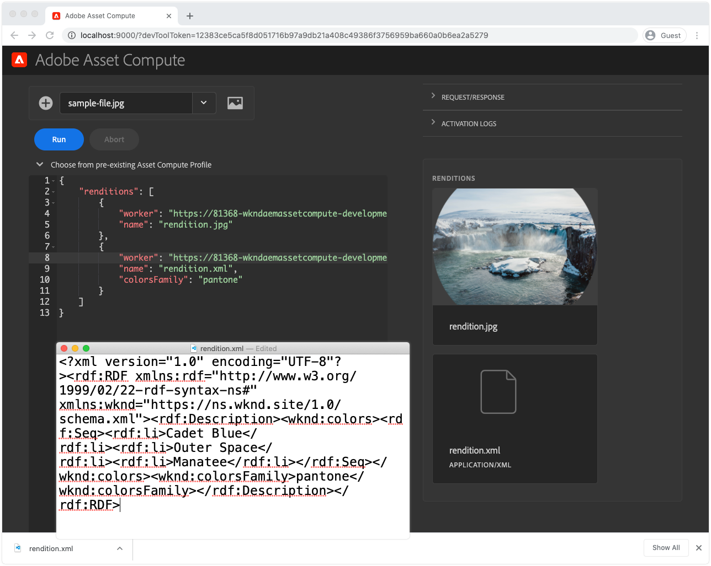

# asset compute 메타데이터 작업자 개발

사용자 지정 Asset compute 작업자는 XMP(XML) 데이터를 생성하여 AEM으로 다시 보내고 자산에 메타데이터로 저장할 수 있습니다.

일반적인 사용 사례는 다음과 같습니다.

+ PIM(제품 정보 관리 시스템)과 같은 타사 시스템과 통합하며, 자산에서 추가 메타데이터를 검색하고 저장해야 합니다
+ Content 및 Commerce AI와 같은 Adobe 서비스와 통합하여 자산 메타데이터를 추가 기계 학습 속성으로 보강합니다
+ 자산에 대한 메타데이터를 바이너리에서 유도하고 AEM as a Cloud Service에 자산 메타데이터로 저장합니다

## 무엇을 할 것인가

>[!VIDEO](https://video.tv.adobe.com/v/327313?quality=12&learn=on)

이 자습서에서는 이미지 자산에서 가장 일반적으로 사용되는 색상을 파생하고 색상 이름을 AEM의 자산 메타데이터에 다시 쓰는 Asset compute 메타데이터 작업자를 만듭니다. 작업자 자체는 기본적이지만 이 자습서에서는 Asset compute 작업자가 AEM as a Cloud Service의 자산에 메타데이터를 다시 쓰는 데 사용할 수 있는 방법을 살펴봅니다.

## asset compute 메타데이터 작업자 호출의 논리 흐름

asset compute 메타데이터 작업자의 호출은 [이진 표현물 생성 작업자](../develop/worker.md)를 설정하는 경우, 반환 유형의 주요 차이점은 자산의 메타데이터에도 값이 기록되는 XMP(XML) 표현물입니다.

asset compute 작업자는 Asset compute SDK 작업자 API 계약에 `renditionCallback(...)` 함수 위에 있어야 합니다.

+ __입력:__ AEM 자산의 원래 이진 및 처리 프로필 매개 변수
+ __출력:__ AEM 자산에 표현물로 사용되고 자산의 메타데이터로 지속되는 XMP(XML) 표현물


1. AEM 작성자 서비스는 Asset compute 메타데이터 작업자를 호출하여 자산의 __(1a)__ 원본 이진 및 __(1b)__ 처리 프로필에 정의된 모든 매개 변수.
1. asset compute SDK는 사용자 지정 Asset compute 메타데이터 작업자의 실행을 오케스트레이션합니다 `renditionCallback(...)` 자산의 바이너리를 기반으로 XMP(XML) 표현물을 도출하는 함수 __(1a)__ 및 모든 처리 프로필 매개 변수 __(1b)__.
1. asset compute 작업자는 XMP(XML) 표현을 `rendition.path`.
1. 에 작성된 XMP(XML) 데이터 `rendition.path` 는 Asset compute SDK를 통해 AEM 작성자 서비스로 전송되고, 다음과 같이 표시합니다 __(4) 가__ 텍스트 표현물과 __(4b)__ 를 자산의 메타데이터 노드로 지속합니다.

## manifest.html 구성{#manifest}

모든 Asset compute 작업자는 [manifest.html](../develop/manifest.md).

프로젝트의 `manifest.yml` 새 작업자를 구성하는 작업자 항목을 추가합니다(이 경우) `metadata-colors`.

_기억 `.yml` 는 공백을 구분합니다._

```
packages:
  __APP_PACKAGE__:
    license: Apache-2.0
    actions: 
      worker:
        function: actions/worker/index.js 
        web: 'yes' 
        runtime: 'nodejs:12'
        limits:
          timeout: 60000 # in ms
          memorySize: 512 # in MB
          concurrency: 10 
        annotations:
          require-adobe-auth: true
      metadata-colors:
        function: actions/metadata-colors/index.js 
        web: 'yes' 
        runtime: 'nodejs:12'
        limits:
          memorySize: 512 # in MB   
```

`function` 에서 생성된 작업자 구현을 가리킵니다. [다음 단계](#metadata-worker). 자세한 내용은 `actions/worker/index.js` 이름이 `actions/rendition-circle/index.js`)에 대해 자세히 알아보십시오. [작업자 URL](#deploy) 그리고 [작업자의 테스트 세트 폴더 이름](#test).

다음 `limits` 및 `require-adobe-auth` 는 작업자별로 정확하게 구성됩니다. 이 직원에서는 `512 MB` 대용량 이진 이미지 데이터를 검사(잠재적으로)하는 코드로 메모리의 크기가 할당됩니다. 다른 `limits` 기본값을 사용하도록 가 제거됩니다.

## 메타데이터 작업자 개발{#metadata-worker}

경로 의 Asset compute 프로젝트에서 새 메타데이터 작업자 JavaScript 파일을 만듭니다. [새 작업자에 대해 manifest.html이 정의됨](#manifest), at `/actions/metadata-colors/index.js`

### npm 모듈 설치

추가 npm 모듈 설치([@adobe/asset-compute-xmp](https://www.npmjs.com/package/@adobe/asset-compute-xmp?activeTab=versions), [이미지 색상 가져오기](https://www.npmjs.com/package/get-image-colors), 및 [색상 이름](https://www.npmjs.com/package/color-namer))가 있어야 합니다.

```
$ npm install @adobe/asset-compute-xmp
$ npm install get-image-colors
$ npm install color-namer
```

### 메타데이터 작업자 코드

이 인부는 그 인부와 아주 비슷해 보인다 [변환 생성 작업자](../develop/worker.md)를 지정하는 경우, XML(XMP) 데이터를 `rendition.path` 을 입력하여 AEM에 다시 저장합니다.


```javascript
"use strict";

const { worker, SourceCorruptError } = require("@adobe/asset-compute-sdk");
const fs = require("fs").promises;

// Require the @adobe/asset-compute-xmp module to create XMP 
const { serializeXmp } = require("@adobe/asset-compute-xmp");

// Require supporting npm modules to derive image colors from image data
const getColors = require("get-image-colors");
// Require supporting npm modules to convert image colors to color names
const namer = require("color-namer");

exports.main = worker(async (source, rendition, params) => {
  // Perform any necessary source (input) checks
  const stats = await fs.stat(source.path);
  if (stats.size === 0) {
    // Throw appropriate errors whenever an erring condition is met
    throw new SourceCorruptError("source file is empty");
  }
  const MAX_COLORS = 10;
  const DEFAULT_COLORS_FAMILY = 'basic';

  // Read the color family parameter to use to derive the color names
  let colorsFamily = rendition.instructions.colorsFamily || DEFAULT_COLORS_FAMILY;

  if (['basic', 'hex', 'html', 'ntc', 'pantone', 'roygbiv'].indexOf(colorsFamily) === -1) { 
      colorsFamily = DEFAULT_COLORS_FAMILY;
  }
  
  // Use the `get-image-colors` module to derive the most common colors from the image
  let colors = await getColors(source.path, { options: MAX_COLORS });

  // Convert the color Chroma objects to their closest names
  let colorNames = colors.map((color) => getColorName(colorsFamily, color));

  // Serialize the data to XMP metadata
  // These properties are written to the [dam:Asset]/jcr:content/metadata resource
  // This stores
  // - The list of color names is stored in a JCR property named `wknd:colors`
  // - The colors family used to derive the color names is stored in a JCR property named `wknd:colorsFamily`
  const xmp = serializeXmp({
      // Use a Set to de-duplicate color names
      "wknd:colors": [...new Set(colorNames)],
      "wknd:colorsFamily": colorsFamily
    }, {
      // Define any property namespaces used in the above property/value definition
      // These namespaces are automatically registered in AEM if they do not yet exist
      namespaces: {
        wknd: "https://wknd.site/assets/1.0/",
      },
    }
  );

  // Save the XMP metadata to be written back to the asset's metadata node
  await fs.writeFile(rendition.path, xmp, "utf-8");
});

/**
 * Helper function that derives the closest color name for the color, based on the colors family
 * 
 * @param {*} colorsFamily the colors name family to use
 * @param {*} color the color to convert to a name
 */
function getColorName(colorsFamily, color) {
    if ('hex' === colorsFamily) {  return color; }

    let names = namer(color.rgb())[colorsFamily];

    if (names.length >= 1) { return names[0].name; }
}
```

## 로컬에서 메타데이터 작업자 실행{#development-tool}

작업자 코드가 완료되면 로컬 Asset compute 개발 도구를 사용하여 실행할 수 있습니다.

asset compute 프로젝트에 두 명의 직원이 포함되어 있으므로 [원 표현물](../develop/worker.md) 그리고 `metadata-colors` 작업자), [asset compute 개발 도구](../develop/development-tool.md) 프로파일 정의에는 두 작업자에 대한 실행 프로파일이 나열됩니다. 두 번째 프로필 정의는 새 프로필을 가리킵니다 `metadata-colors` 작업자.



1. asset compute 프로젝트의 루트에서
1. 실행 `aio app run` asset compute 개발 도구를 시작하려면
1. 에서 __파일 선택...__ 드롭다운, 선택 [샘플 이미지](../assets/samples/sample-file.jpg) 처리
1. 두 번째 프로필 정의 구성에서 다음을 가리키는 `metadata-colors` 작업자, 업데이트 `"name": "rendition.xml"` 이 작업자는 XMP(XML) 변환을 생성합니다. 선택적으로, `colorsFamily` 매개 변수(지원되는 값) `basic`, `hex`, `html`, `ntc`, `pantone`, `roygbiv`).

   ```json
   {
       "renditions": [
           {
               "worker": "...",
               "name": "rendition.xml",
               "colorsFamily": "pantone"
           }
       ]
   }
   ```

1. 탭 __실행__ XML 변환이 생성될 때까지 기다립니다.
   + 두 작업자가 모두 프로필 정의에 나열되므로 두 변환이 모두 생성됩니다. 선택적으로, [원 렌디션 작업자](../develop/worker.md) 개발 도구에서 실행하지 않도록 삭제할 수 있습니다.
1. 다음 __표현물__ 섹션에서 생성된 렌디션을 미리 봅니다. 탭하기 `rendition.xml` 다운로드하여 VS 코드(또는 즐겨찾는 XML/텍스트 편집기)에서 열어 검토합니다.

## 작업자 테스트{#test}

메타데이터 작업자는 [이진 표현물과 동일한 Asset compute 테스트 프레임워크](../test-debug/test.md). 유일한 차이점은 `rendition.xxx` 테스트 케이스의 파일은 예상 XMP(XML) 표현물이어야 합니다.

1. asset compute 프로젝트에서 다음 구조를 만듭니다.

   ```
   /test/asset-compute/metadata-colors/success-pantone/
   
       file.jpg
       params.json
       rendition.xml
   ```

2. 를 사용하십시오 [샘플 파일](../assets/samples/sample-file.jpg) 테스트 케이스의 `file.jpg`.
3. 다음 JSON을 에 추가합니다 `params.json`.

   ```
   {
       "fmt": "xml",
       "colorsFamily": "pantone"
   }
   ```

   참고 사항 `"fmt": "xml"` 는 테스트 세트에 다음을 생성하도록 지시하는 데 필요합니다 `.xml` 텍스트 기반 표현물.

4. 에 필요한 XML을 제공합니다. `rendition.xml` 파일. 다음 방법으로 가져올 수 있습니다.
   + 개발 도구를 통해 테스트 입력 파일을 실행하고 (검증된) XML 변환을 저장합니다.

   ```
   <?xml version="1.0" encoding="UTF-8"?><rdf:RDF xmlns:rdf="http://www.w3.org/1999/02/22-rdf-syntax-ns#" xmlns:wknd="https://wknd.site/assets/1.0/"><rdf:Description><wknd:colors><rdf:Seq><rdf:li>Silver</rdf:li><rdf:li>Black</rdf:li><rdf:li>Outer Space</rdf:li></rdf:Seq></wknd:colors><wknd:colorsFamily>pantone</wknd:colorsFamily></rdf:Description></rdf:RDF>
   ```

5. 실행 `aio app test` asset compute 프로젝트의 루트에서 모든 테스트 세트를 실행합니다.

### Adobe I/O Runtime에 작업자 배포{#deploy}

AEM Assets에서 이 새 메타데이터 작업자를 호출하려면 명령을 사용하여 Adobe I/O Runtime에 배포해야 합니다.

```
$ aio app deploy
```


이렇게 하면 프로젝트에 있는 모든 작업자가 배포됩니다. 를 검토합니다. [배포 지침 개요](../deploy/runtime.md) 스테이지 및 프로덕션 작업 공간에 배포하는 방법에 대해 설명합니다.

### AEM 처리 프로필과 통합{#processing-profile}

AEM에서 작업자를 불러옵니다. 새 작업자를 생성하거나 이 배치된 작업자를 호출하는 기존 사용자 정의 처리 프로필 서비스를 수정하여 작업자를 호출합니다.


1. AEM as a Cloud Service 작성자 서비스에 로그인하십시오. __AEM 관리자__
1. 다음으로 이동 __도구 > 자산 > 처리 프로필__
1. __만들기__ 신규 또는 __편집__ 및 기존, 처리 프로필
1. 탭하기 __사용자 지정__ 탭, 탭 __새로 추가__
1. 새 서비스 정의
   + __메타데이터 렌디션 만들기__: 활성으로 전환
   + __끝점:__ `https://...adobeioruntime.net/api/v1/web/wkndAemAssetCompute-0.0.1/metadata-colors`
      + 이는 작업 중에 가져온 작업자의 URL입니다 [배포](#deploy) 또는 명령 사용 `aio app get-url`. AEM as a Cloud Service 환경을 기반으로 올바른 작업 영역에서 URL을 가리키는지 확인합니다.
   + __서비스 매개 변수__
      + 탭 __매개 변수 추가__
         + 키: `colorFamily`
         + 값: `pantone`
            + 지원되는 값: `basic`, `hex`, `html`, `ntc`, `pantone`, `roygbiv`
   + __MIME 유형__
      + __다음을 포함합니다.__ `image/jpeg`, `image/png`, `image/gif`, `image/svg`
         + 이러한 유형은 색상을 파생하는 데 사용되는 타사 npm 모듈에서 지원하는 유일한 MIME 유형입니다.
      + __제외:__ `Leave blank`
1. 탭 __저장__ 오른쪽 상단에서
1. 아직 처리하지 않았다면 AEM Assets 폴더에 처리 프로필 적용

### 메타데이터 스키마 업데이트{#metadata-schema}

색상 메타데이터를 검토하려면 이미지의 메타데이터 스키마에 있는 두 개의 새 필드를 작업자가 채우는 새 메타데이터 데이터 속성에 매핑합니다.


1. AEM 작성자 서비스에서 다음 위치로 이동합니다. __도구 > 자산 > 메타데이터 스키마__
1. 로 이동 __기본__ 선택 및 편집 __이미지__ 읽기 전용 양식 필드를 추가하여 생성된 색상 메타데이터를 표시합니다
1. 추가 __단일 행 텍스트__
   + __필드 레이블__: `Colors Family`
   + __속성에 매핑__: `./jcr:content/metadata/wknd:colorsFamily`
   + __규칙 > 필드 > 편집 비활성화__: 선택됨
1. 추가 __다중 값 텍스트__
   + __필드 레이블__: `Colors`
   + __속성에 매핑__: `./jcr:content/metadata/wknd:colors`
1. 탭 __저장__ 오른쪽 상단에서

## 자산 처리


1. AEM 작성자 서비스에서 다음 위치로 이동합니다. __자산 > 파일__
1. 처리 프로필이 적용되는 폴더 또는 하위 폴더로 이동합니다.
1. 새 이미지(JPEG, PNG, GIF 또는 SVG)을 폴더에 업로드하거나 업데이트된 이미지를 사용하여 기존 이미지를 다시 처리합니다 [처리 프로필](#processing-profile)
1. 처리가 완료되면 자산을 선택하고 탭합니다 __속성__ 맨 위 작업 표시줄에서 해당 메타데이터를 표시합니다
1. 를 검토합니다. `Colors Family` 및 `Colors` [메타데이터 필드](#metadata-schema) 사용자 지정 Asset compute 메타데이터 작업자로부터 다시 작성된 메타데이터의 경우.

자산의 메타데이터에 작성된 색상 메타데이터를 사용( `[dam:Asset]/jcr:content/metadata` 리소스, 이 메타데이터는 검색을 통해 이러한 용어를 사용하여 자산 검색 기능이 증가된 자산이며, 그런 경우 해당 자산의 바이너리에 다시 쓸 수도 있습니다 __DAM 메타데이터 원본에 쓰기__ 워크플로우가 이 워크플로우에서 호출됩니다.

### AEM Assets의 메타데이터 렌디션


asset compute 메타데이터 작업자가 생성한 실제 XMP 파일도 자산에 대한 개별 변환으로 저장됩니다. 이 파일은 일반적으로 사용되지 않으며, 자산의 메타데이터 노드에 적용된 값이 사용되지만 작업자의 원시 XML 출력은 AEM에서 사용할 수 있습니다.

## Github의 메타데이터 색상 작업자 코드

마지막 `metadata-colors/index.js` 은 Github에서 사용할 수 있는 위치:

+ [aem-guides-wknd-asset-compute/actions/metadata-colors/index.js](https://github.com/adobe/aem-guides-wknd-asset-compute/blob/master/actions/metadata-colors/index.js)

마지막 `test/asset-compute/metadata-colors` 테스트 세트는 Github에서 사용할 수 있는 위치:

+ [aem-guides-wknd-asset-compute/test/asset-compute/metadata-colors](https://github.com/adobe/aem-guides-wknd-asset-compute/blob/master/test/asset-compute/metadata-colors)
