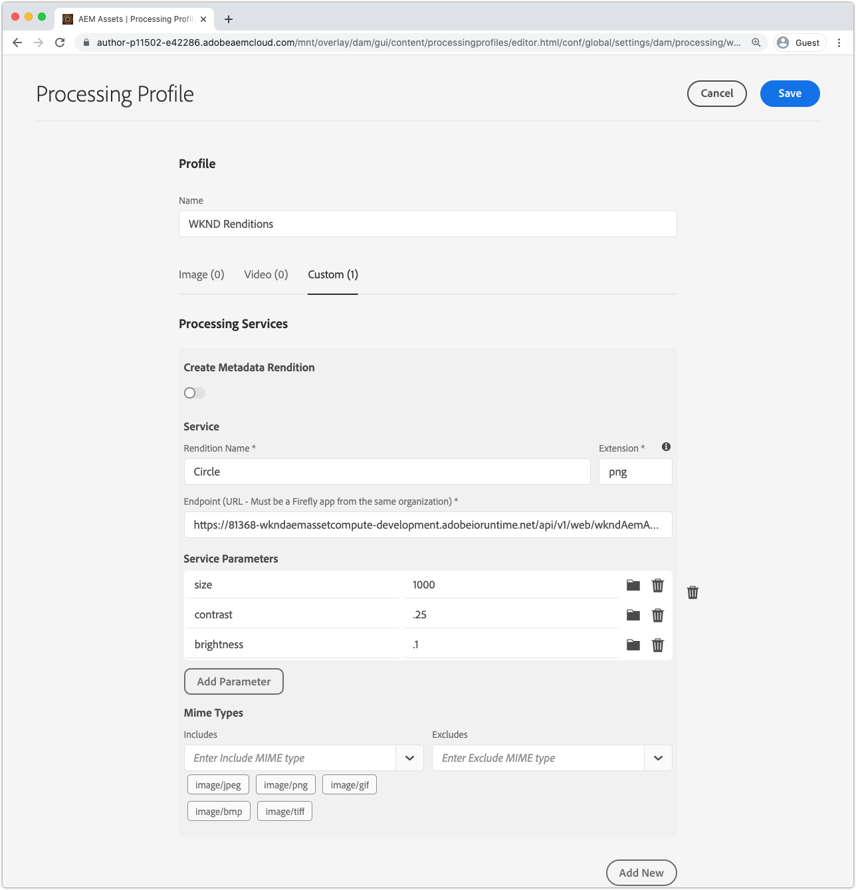

# AEM 처리 프로필과 통합

asset compute 작업자가 AEM에서 사용자 정의 변환을 Cloud Service으로 생성하려면 처리 프로필을 통해 AEM에 Cloud Service 작성자 서비스로 등록해야 합니다. 해당 처리 프로필의 모든 자산은 작업자가 업로드 또는 재처리 시 호출되고, 사용자 지정 변환이 생성되어 자산의 변환을 통해 사용 가능하게 됩니다.

## 처리 프로필 정의

먼저 구성 가능한 매개 변수와 함께 작업자를 호출하는 새 처리 프로파일을 생성합니다.

1. Cloud Service 작성자 서비스로 AEM에 로그인하면 __AEM 관리자__ 이 자습서이므로 샌드박스의 개발 환경 또는 환경을 사용하는 것이 좋습니다.
1. __도구 > 자산 > 처리 프로필__&#x200B;으로 이동합니다.
1. __만들기__ 단추를 누릅니다.
1. 처리 프로필의 이름을 `WKND Asset Renditions` 지정합니다.
1. __사용자 지정__ 탭을 누르고 __새로 추가__&#x200B;를 누릅니다.
1. 새 서비스 정의
   + __변환 이름:__ `Circle`
      + AEM Assets에서 이 변환을 식별하는 데 사용할 파일 이름 변환
   + __확장:__ `png`
      + 생성할 변환의 확장. 작업자 웹 서비스에서 지원하는 출력 형식이므로 `png`으로 설정하면 원 뒤에 투명한 배경이 잘립니다.
   + __끝점:__ `https://...adobeioruntime.net/api/v1/web/wkndAemAssetCompute-0.0.1/worker`
      + 이 URL은 `aio app get-url`을 통해 얻은 작업자의 URL입니다. AEM을 기준으로 올바른 작업 영역에서 URL을 Cloud Service 환경으로 확인합니다.
      + 작업자 URL이 올바른 작업 영역을 가리키는지 확인합니다. CLOUD SERVICE 스테이지로 AEM은 스테이지 작업 공간 URL을 사용하고, Cloud Service 프로덕션으로 AEM은 프로덕션 작업 공간 URL을 사용해야 합니다.
   + __서비스 매개 변수__
      + __매개 변수 추가__&#x200B;를 누릅니다.
         + 키: `size`
         + 값: `1000`
      + __매개 변수 추가__&#x200B;를 누릅니다.
         + 키: `contrast`
         + 값: `0.25`
      + __매개 변수 추가__&#x200B;를 누릅니다.
         + 키: `brightness`
         + 값: `0.10`
      + 이러한 키/값 쌍은 Asset compute 작업자로 전달되고 `rendition.instructions` JavaScript 개체를 통해 사용할 수 있습니다.
   + __MIME 유형__
      + __포함:__ `image/jpeg`,  `image/png`,  `image/gif`,  `image/bmp`  `image/tiff`
         + 이러한 MIME 유형은 작업자의 npm 모듈만 해당합니다. 이 목록은 사용자 지정 근로자가 처리할 자산을 제한합니다.
      + __제외:__ `Leave blank`
         + 이 서비스 구성을 사용하여 MIME 형식을 사용하여 자산을 처리하지 마십시오. 이 경우 허용 목록만 사용합니다.
1. 오른쪽 상단의 __저장__&#x200B;을 누릅니다.

## 처리 프로필 적용 및 호출

1. 새로 만든 처리 프로필 `WKND Asset Renditions` 선택
1. 상단 작업 표시줄의 __폴더에 프로필 적용__&#x200B;을 탭합니다.
1. 처리 프로필을 적용할 폴더(예: `WKND`)를 선택하고 __적용__&#x200B;을 탭합니다.
1. __AEM > 자산 > 파일__&#x200B;을 통해 처리 프로필이 적용되지 않은 폴더로 이동하고 `WKND`를 누릅니다.
1. 처리 프로필이 적용된 폴더의 모든 폴더에 있는 새 이미지 자산([sample-1.jpg](../assets/samples/sample-1.jpg), [sample-2.jpg](../assets/samples/sample-2.jpg) 및 [sample-3.jpg](../assets/samples/sample-3.jpg))을 업로드하고 업로드된 자산이 처리될 때까지 기다립니다.
1. 자산을 탭하여 세부 정보 열기
   + 기본 변환은 사용자 정의 변환보다 AEM에서 보다 빠르게 생성되어 나타날 수 있습니다.
1. 왼쪽 사이드바에서 __변환__ 보기를 엽니다.
1. `Circle.png`이라는 자산을 누르고 생성된 변환을 검토합니다.

   

## 완료됨!

축하합니다! AEM을 Cloud Service Asset compute 마이크로서비스로 확장하는 방법에 대한 [tutorial](../overview.md)을(를) 완료했습니다. 이제 Cloud Service 작성자 서비스로 AEM에서 사용할 사용자 정의 Asset compute 작업자를 설정, 개발, 테스트, 디버그 및 배포할 수 있습니다.

### Github에서 전체 프로젝트 소스 코드 검토

최종 Asset compute 프로젝트는 다음 위치의 Github에서 사용할 수 있습니다.

+ [aem-guides-wknd-asset-compute](https://github.com/adobe/aem-guides-wknd-asset-compute)

_Github contains is the final state of the project, fully built with the worker and test cases, but does not contain any credentials, ie. `.env`,  `.config.json` or  `.aio`._

## 문제 해결

+ [AEM의 자산에서 사용자 지정 변환이 없습니다.](../troubleshooting.md#custom-rendition-missing-from-asset)
+ [AEM에서 자산 처리 실패](../troubleshooting.md#asset-processing-fails)
