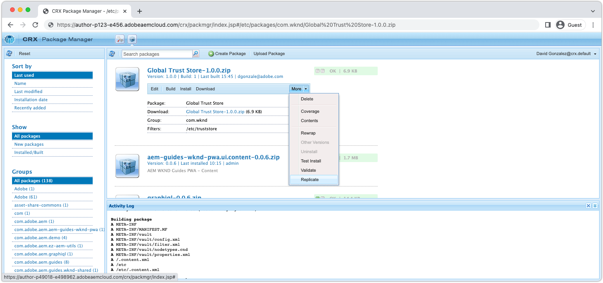

# SAML 2.0 인증{#saml-2-0-authentication}

선택한 SAML 2.0 호환 IDP에 최종 사용자(AEM 작성자가 아님)를 설정하고 인증하는 방법을 알아봅니다.

## AEM as a Cloud Service에 대한 SAML은 무엇입니까?

AEM 게시(또는 미리 보기)와 SAML 2.0을 통합하여 AEM 기반 웹 경험의 최종 사용자가 Adobe이 아닌 IDP(ID 공급자)를 인증하고 AEM에 명명된, 인증된 사용자로 액세스할 수 있도록 합니다.

|  | AEM Author | AEM 게시 |
|-----------------------|:----------:|:-----------:|
| SAML 2.0 지원 | ✘ | ✔ |

+++ AEM을 사용하여 SAML 2.0 흐름 이해

AEM 게시 SAML 통합의 일반적인 흐름은 다음과 같습니다.

1. 사용자가 AEM Publish에 요청을 수행하면 인증이 필요하다는 것을 나타냅니다.
   + 사용자가 CUG/ACL 보호 리소스를 요청합니다.
   + 사용자가 인증 요구 사항을 따르는 리소스를 요청합니다.
   + 사용자가 AEM 로그인 종단점(예: `/system/sling/login`)에 대해 로그인 작업을 명시적으로 요청합니다.
1. AEM에서는 IDP에 AuthnRequest를 만들어 IDP에 인증 프로세스를 시작하도록 요청합니다.
1. 사용자가 IDP에 대해 인증됩니다.
   + IDP에서 자격 증명을 입력하라는 메시지가 표시됩니다.
   + 사용자는 이미 IDP로 인증되며 추가 자격 증명을 제공할 필요가 없습니다.
1. IDP는 사용자의 데이터를 포함하는 SAML 검증을 생성하고 IDP의 개인 인증서를 사용하여 서명합니다.
1. IDP는 HTTP POST을 통해 사용자의 웹 브라우저를 통해 AEM Publish로 SAML 검증을 전송합니다.
1. AEM Publish는 SAML 어설션을 수신하고 IDP 공개 인증서를 사용하여 SAML 확인의 무결성 및 신뢰도를 확인합니다.
1. AEM 게시는 SAML 2.0 OSGi 구성 및 SAML 확정의 컨텐츠를 기반으로 AEM 사용자 레코드를 관리합니다.
   + 사용자 만들기
   + 사용자 특성 동기화
   + AEM 사용자 그룹 멤버십 업데이트
1. AEM Publish에서 AEM을 설정합니다. `login-token` AEM Publish에 대한 후속 요청을 인증하는 데 사용되는 HTTP 응답의 쿠키입니다.
1. AEM 게시 는 사용자가 `saml_request_path` 쿠키 .

+++

## 구성 둘러보기

>[!VIDEO](https://video.tv.adobe.com/v/343040/?quality=12&learn=on)

이 비디오에서는 AEM as a Cloud Service 게시 서비스와의 SAML 2.0 통합을 설정하고 Okta를 IDP로 사용하는 과정을 안내합니다.

## 사전 요구 사항

SAML 2.0 인증을 설정할 때에는 다음 항목이 필요합니다.

+ Cloud Manager에 대한 배포 관리자 액세스
+ AEM as a Cloud Service 환경에 대한 AEM 관리자 액세스 권한
+ IDP에 대한 관리자 액세스
+ 선택적으로, SAML 페이로드를 암호화하는 데 사용되는 공개/개인 키패어에 액세스할 수 있습니다

SAML 2.0은 AEM 게시 또는 미리 보기에 대한 사용을 인증하는 경우에만 지원됩니다. 및 IDP를 사용하여 AEM 작성자의 인증을 관리하려면, [adobe IMS와 IDP를 통합합니다.](https://helpx.adobe.com/kr/enterprise/using/set-up-identity.html).


## AEM에 IDP 공개 인증서 설치

IDP의 공개 인증서가 AEM 전역 트러스트 저장소에 추가되었으며 IDP에서 보낸 SAML 어설션의 유효성을 검사하는 데 사용됩니다.

+++SAML 어설션 서명 흐름


1. 사용자가 IDP에 대해 인증됩니다.
1. IDP는 사용자의 데이터를 포함하는 SAML 검증을 생성합니다.
1. IDP는 IDP의 개인 인증서를 사용하여 SAML 검증에 서명합니다.
1. IDP는 AEM 게시의 SAML 엔드포인트( )에 클라이언트측 HTTP POST을 시작합니다`.../saml_login`) 서명된 SAML 검증을 포함합니다.
1. AEM Publish는 서명된 SAML 검증이 포함된 HTTP POST을 수신하고 IDP 공개 인증서를 사용하여 서명을 확인할 수 있습니다.

+++


1. 를 얻습니다. __공개 인증서__ 파일을 IDP에서 가져옵니다. 이 인증서를 사용하면 AEM에서 IDP에서 AEM에 제공한 SAML 어설션의 유효성을 검사할 수 있습니다.

   인증서는 PEM 포맷이며, 다음과 유사해야 합니다.

   ```
   -----BEGIN CERTIFICATE-----
   MIIC4jCBAcoCCQC33wnybT5QZDANBgkqhkiG9w0BAQsFADAyMQswCQYDVQQGEwJV
   ...
   m0eo2USlSRTVl7QHRTuiuSThHpLKQQ==
   -----END CERTIFICATE-----
   ```

1. AEM 관리자로 AEM 작성자에 로그인합니다.
1. 다음으로 이동 __도구 > 보안 > Trust Store__.
1. 글로벌 신뢰 저장소를 만들거나 엽니다. Global Trust Store를 만드는 경우 암호를 안전한 곳에 보관하십시오.
1. 확장 __CER 파일에서 인증서 추가__.
1. 선택 __인증서 파일 선택__, 그리고 IDP에서 제공한 인증서 파일을 업로드합니다.
1. Leave __사용자에게 인증서 매핑__ 비어 있습니다.
1. 선택 __제출__.
1. 새로 추가된 인증서는 __CRT 파일에서 인증서 추가__ 섹션을 참조하십시오.
1. 다음 사항에 주의하십시오. __별칭__&#x200B;에 이 값이 사용되면 [SAML 2.0 인증 핸들러 OSGi 구성](#saml-2-0-authentication-handler-osgi-configuration).
1. 선택 __저장 및 닫기__.

글로벌 트러스트 저장소는 AEM 작성자에 대한 IDP의 공개 인증서로 구성되지만 SAML은 AEM 게시에서만 사용하므로 IDP 공개 인증서에 액세스할 수 있도록 글로벌 신뢰 저장소를 AEM 게시에 복제해야 합니다.



1. __도구 > 배포 > 패키지__&#x200B;로 이동합니다.
1. 패키지 만들기
   + 패키지 이름: `Global Trust Store`
   + 버전: `1.0.0`
   + 그룹: `com.your.company`
1. 새 항목 편집 __글로벌 트러스트 저장소__ 패키지.
1. 을(를) 선택합니다 __필터__ 탭을 선택하고 루트 경로에 대한 필터를 추가합니다 `/etc/truststore`.
1. 선택 __완료__ 그리고 __저장__.
1. 을(를) 선택합니다 __빌드__ 버튼 __글로벌 트러스트 저장소__ 패키지.
1. 빌드했으면 을 선택합니다 __자세히__ > __복제__ 글로벌 신뢰 저장소 노드를 활성화하려면(`/etc/truststore`)을 AEM Publish에 게시하는 경우.

## 인증 서비스 키 저장소 만들기{#authentication-service-keystore}

_를 만들 때 [SAML 2.0 인증 핸들러 OSGi 구성 속성 `handleLogout` 가 로 설정되어 있습니다. `true`](#saml-20-authenticationsaml-2-0-authentication) 또는 [인증 요청 서명/SAML 검증 암호화](#install-aem-public-private-key-pair) 필수 여부_

1. 개인 키를 업로드하려면 AEM Author as a AEM Administrator에 로그인합니다.
1. 다음으로 이동 __도구 > 보안 > Trust Store__, 을(를) 선택하고 을(를) 선택합니다. __인증 서비스__ 사용자 및 선택 __속성__ 를 클릭합니다.
1. 다음으로 이동 __도구 > 보안 > 사용자__, 을(를) 선택하고 을(를) 선택합니다. __인증 서비스__ 사용자 및 선택 __속성__ 를 클릭합니다.
1. 을(를) 선택합니다 __키 저장소__ 탭.
1. 키 저장소를 만들거나 엽니다. 키 저장소를 만들 경우 암호를 안전하게 유지합니다.
   + A [공용/개인 키 저장소가 이 키 저장소에 설치되어 있습니다.](#install-aem-public-private-key-pair) AuthnRequest 서명/SAML 검증 암호화가 필요한 경우에만 가능합니다.
   + 이 SAML 통합이 로그아웃을 지원하지만 AuthnRequest 서명/SAML 검증이 아닌 경우 빈 키 저장소가 충분합니다.
1. 선택 __저장 및 닫기__.
1. 선택 __인증 서비스__ 사용자 및 선택 __활성화__ 를 클릭합니다.


## AEM 공개/개인 키 쌍 설치{#install-aem-public-private-key-pair}

_AEM 공개/개인 키 쌍 설치는 선택 사항입니다_

AEM 게시는 AuthnRequests(IDP에 대해)에 서명하고 SAML 어설션을 암호화(AEM에)하도록 구성할 수 있습니다. 이 작업은 AEM Publish에 개인 키를 제공하여 달성하고 IDP에 대한 공개 키와 일치합니다.

+++ AuthnRequest 서명 흐름 이해(선택 사항)

AEM Publish에서 작성 요청(로그인 프로세스를 시작하는 AEM Publish의 IDP에 대한 요청)에 서명할 수 있습니다. 이를 위해 AEM Publish는 개인 키를 사용하여 AuthRequest에 서명하며 IDP가 공개 키를 사용하여 서명의 유효성을 검사합니다. 이렇게 하면 AuthnRequest 가 시작되었으며, AEM Publish에서 요청했으며, 악의적인 제3자가 아닌 IDP에 보장됩니다.


1. 사용자는 IDP에 대한 SAML 인증 요청을 생성하는 AEM 게시에 HTTP 요청을 수행합니다.
1. AEM Publish는 IDP에 전송할 SAML 요청을 생성합니다.
1. AEM 게시는 AEM 개인 키를 사용하여 SAML 요청에 서명합니다.
1. AEM Publish는 서명된 SAML 요청이 포함된 IDP로 HTTP 클라이언트측 리디렉션인 AuthnRequest를 시작합니다.
1. IDP는 AuthnRequest를 수신하고 AEM 공개 키를 사용하여 서명을 확인하여 AuthnRequest가 시작된 AEM Publish를 보장합니다.
1. 그런 다음 AEM Publish에서 IDP 공개 인증서를 사용하여 해독된 SAML 검증에 대한 무결성 및 신뢰성의 유효성을 검사합니다.

+++

+++ SAML 검증 암호화 흐름 이해(선택 사항)

IDP와 AEM 게시 간의 모든 HTTP 통신은 HTTPS를 통해 전송되어야 하며 따라서 기본적으로 안전합니다. 그러나 HTTPS에서 제공한 요청 외에 별도의 기밀성이 필요한 경우 필요에 따라 SAML 어설션을 암호화할 수 있습니다. 이를 위해 IDP는 개인 키를 사용하여 SAML 검증 데이터를 암호화하고 AEM 게시는 개인 키를 사용하여 SAML 어설션의 암호를 해독합니다.


1. 사용자가 IDP에 대해 인증됩니다.
1. IDP는 사용자의 데이터를 포함하는 SAML 검증을 생성하고 IDP의 개인 인증서를 사용하여 서명합니다.
1. 그런 다음 IDP는 AEM 공개 키로 SAML 검증을 암호화합니다. 이 암호를 해독하려면 AEM 개인 키가 필요합니다.
1. 암호화된 SAML 어설션은 사용자의 웹 브라우저를 통해 AEM Publish로 전송됩니다.
1. AEM 게시는 SAML 어설션을 수신하고 AEM 개인 키를 사용하여 암호를 해독합니다.
1. IDP는 사용자에게 인증을 요청하라는 메시지를 표시합니다.

+++

AuthnRequest 서명 및 SAML 검증 암호화는 모두 선택 사항이지만, 둘 다 [SAML 2.0 인증 핸들러 OSGi 구성 속성 `useEncryption`](#saml-20-authenticationsaml-2-0-authentication)은(는) 둘 다 사용하거나 둘 다 사용할 수 없음을 의미합니다.


1. AuthnRequest에 서명하고 SAML 어설션을 암호화하는 데 사용되는 공개 키, 개인 키(PKCS#8 DER 형식) 및 인증서 체인 파일(공개 키일 수 있음)을 얻습니다. 키는 일반적으로 IT 조직의 보안 팀에서 제공합니다.

   + 자체 서명된 키 쌍은 __openssl__:

   ```
   $ openssl req -x509 -sha256 -days 365 -newkey rsa:4096 -keyout aem-private.key -out aem-public.crt
   
   # Provide a password (keep in safe place), and other requested certificate information
   
   # Convert the keys to AEM's required format 
   $ openssl rsa -in aem-private.key -outform der -out aem-private.der
   $ openssl pkcs8 -topk8 -inform der -nocrypt -in aem-private.der -outform der -out aem-private-pkcs8.der
   ```

1. 공개 키를 IDP에 업로드합니다.
   + 사용 `openssl` 위의 메서드, 공개 키는 `aem-public.crt` 파일.
1. 개인 키를 업로드하려면 AEM Author as a AEM Administrator에 로그인합니다.
1. 다음으로 이동 __도구 > 보안 > Trust Store__, 을(를) 선택하고 을(를) 선택합니다. __인증 서비스__ 사용자 및 선택 __속성__ 를 클릭합니다.
1. 다음으로 이동 __도구 > 보안 > 사용자__, 을(를) 선택하고 을(를) 선택합니다. __인증 서비스__ 사용자 및 선택 __속성__ 를 클릭합니다.
1. 을(를) 선택합니다 __키 저장소__ 탭.
1. 키 저장소를 만들거나 엽니다. 키 저장소를 만들 경우 암호를 안전하게 유지합니다.
1. 선택 __DER 파일에서 개인 키 추가__&#x200B;를 클릭하고 개인 키 및 체인 파일을 AEM에 추가합니다.
   + __별칭__: IDP의 이름인 의미 있는 이름을 제공합니다.
   + __개인 키 파일__: 개인 키 파일(PKCS#8)을 DER 형식으로 업로드합니다.
      + 사용 `openssl` 위의 방법, 다음과 같습니다. `aem-private-pkcs8.der` 파일
   + __인증서 체인 파일 선택__: 함께 제공되는 체인 파일을 업로드합니다(공개 키일 수 있음).
      + 사용 `openssl` 위의 방법, 다음과 같습니다. `aem-public.crt` 파일
   + 선택 __제출__
1. 새로 추가된 인증서는 __CRT 파일에서 인증서 추가__ 섹션을 참조하십시오.
   + 다음 사항에 주의하십시오. __별칭__ 다음에서 사용 [SAML 2.0 인증 핸들러 OSGi 구성](#saml-20-authentication-handler-osgi-configuration)
1. 선택 __저장 및 닫기__.
1. 선택 __인증 서비스__ 사용자 및 선택 __활성화__ 를 클릭합니다.

## SAML 2.0 인증 핸들러 구성{#configure-saml-2-0-authentication-handler}

AEM SAML 구성은 __Adobe Granite SAML 2.0 인증 핸들러__ OSGi 구성.
구성은 OSGi 출하 시 구성입니다. 즉, 단일 AEM as a Cloud Service 게시 서비스에는 리포지토리의 개별 리소스 트리를 다루는 여러 SAML 구성의 경우 사용할 수 있습니다. 이 기능은 다중 사이트 AEM 배포에 유용합니다.

+++ SAML 2.0 인증 핸들러 OSGi 구성 용어집

### Adobe Granite SAML 2.0 인증 핸들러 OSGi 구성{#configure-saml-2-0-authentication-handler-osgi-configuration}

|  | OSGi 속성 | 필수 | 값 형식 | 기본값 | 설명 |
|-----------------------------------|-------------------------------|:--------:|:---------------------:|---------------------------|-------------|
| 경로 | `path` | ✔ | 문자열 배열 | `/` | 이 인증 처리기가 사용되는 AEM 경로 |
| IDP URL | `idpUrl` | ✔ | 문자열 |  | SAML 인증 요청이 전송되는 IDP URL입니다. |
| IDP 인증서 별칭 | `idpCertAlias` | ✔ | 문자열 |  | AEM 전역 트러스트 저장소에 있는 IDP 인증서의 별칭 |
| IDP HTTP 리디렉션 | `idpHttpRedirect` | ✘ | 부울 | `false` | AuthnRequest를 전송하는 대신 IDP URL로 HTTP 리디렉션을 수행하는지 여부를 나타냅니다. 을 로 설정합니다. `true` IDP에서 인증을 시작했습니다. |
| IDP 식별자 | `idpIdentifier` | ✘ | 문자열 |  | AEM 사용자 및 그룹 고유성을 위한 고유 IDP ID입니다. 비어 있으면 `serviceProviderEntityId` 이 대신 사용됩니다. |
| 어설션 소비자 서비스 URL | `assertionConsumerServiceURL` | ✘ | 문자열 |  | 다음 `AssertionConsumerServiceURL` AuthnRequest에서 `<Response>` 메시지를 AEM에 보내야 합니다. |
| SP 엔티티 ID | `serviceProviderEntityId` | ✔ | 문자열 |  | IDP에 AEM을 고유하게 식별합니다. 일반적으로 AEM 호스트 이름입니다. |
| SP 암호화 | `useEncryption` | ✘ | 부울 | `true` | IDP가 SAML 어설션을 암호화하는지 여부를 나타냅니다. 필요한 경우 `spPrivateKeyAlias` 및 `keyStorePassword` 설정되어야 합니다. |
| SP 개인 키 별칭 | `spPrivateKeyAlias` | ✘ | 문자열 |  | 에서 개인 키의 별칭 `authentication-service` 사용자의 키 저장소입니다. 필요한 경우 `useEncryption` 가 로 설정되어 있습니다. `true`. |
| SP 키 저장소 암호 | `keyStorePassword` | ✘ | 문자열 |  | &#39;authentication-service&#39; 사용자 키 저장소의 암호입니다. 필요한 경우 `useEncryption` 가 로 설정되어 있습니다. `true`. |
| 기본 리디렉션 | `defaultRedirectUrl` | ✘ | 문자열 | `/` | 인증 성공 후의 기본 리디렉션 URL입니다. AEM 호스트에 대해 상대적일 수 있습니다(예: `/content/wknd/us/en/html`). |
| 사용자 Id 속성 | `userIDAttribute` | ✘ | 문자열 | `uid` | AEM 사용자의 사용자 ID를 포함하는 SAML 검증 속성의 이름입니다. 를 사용하려면 비워 둡니다. `Subject:NameId`. |
| AEM 사용자 자동 만들기 | `createUser` | ✘ | 부울 | `true` | AEM 사용자가 인증에 성공했는지 여부를 나타냅니다. |
| AEM 사용자 중간 경로 | `userIntermediatePath` | ✘ | 문자열 |  | AEM 사용자를 만들 때 이 값이 중간 경로로 사용됩니다(예: `/home/users/<userIntermediatePath>/jane@wknd.com`). 필요한 경우 `createUser` 로 설정됨 `true`. |
| AEM 사용자 속성 | `synchronizeAttributes` | ✘ | 문자열 배열 |  | AEM 사용자에게 저장할 SAML 속성 매핑 목록(형식) `[ "saml-attribute-name=path/relative/to/user/node" ]` (예: `[ "firstName=profile/givenName" ]`). 자세한 내용은 [기본 AEM 속성의 전체 목록](#aem-user-attributes). |
| AEM 그룹에 사용자 추가 | `addGroupMemberships` | ✘ | 부울 | `true` | 성공적인 인증 후 AEM 사용자가 AEM 사용자 그룹에 자동으로 추가되는지 여부를 나타냅니다. |
| AEM 그룹 멤버십 속성 | `groupMembershipAttribute` | ✘ | 문자열 | `groupMembership` | 사용자가 추가되어야 하는 AEM 사용자 그룹 목록이 포함된 SAML 검증 속성의 이름입니다. 필요한 경우 `addGroupMemberships` 로 설정됨 `true`. |
| 기본 AEM 그룹 | `defaultGroups` | ✘ | 문자열 배열 |  | 인증된 사용자 AEM 사용자 그룹 목록이 항상 (예: `[ "wknd-user" ]`). 필요한 경우 `addGroupMemberships` 로 설정됨 `true`. |
| NameIDPolicy 형식 | `nameIdFormat` | ✘ | 문자열 | `urn:oasis:names:tc:SAML:2.0:nameid-format:transient` | AuthnRequest 메시지에서 전송할 NameIDPolicy 형식 매개 변수의 값입니다. |
| SAML 응답 저장 | `storeSAMLResponse` | ✘ | 부울 | `false` | 다음을 `samlResponse` 값은 AEM에 저장됩니다. `cq:User` 노드 아래에 있어야 합니다. |
| 처리 로그아웃 | `handleLogout` | ✘ | 부울 | `false` | 로그아웃 요청이 이 SAML 인증 처리기에서 처리되는지 여부를 나타냅니다. 필요한 경우 `logoutUrl` 설정되어야 합니다. |
| 로그아웃 URL | `logoutUrl` | ✘ | 문자열 |  | SAML 로그아웃 요청이 전송되는 IDP의 URL입니다. 필요한 경우 `handleLogout` 가 로 설정되어 있습니다. `true`. |
| 클럭 허용치 | `clockTolerance` | ✘ | 정수 | `60` | SAML 어설션의 유효성을 검사할 때 IDP 및 AEM(SP) 클럭 기울이기 허용치. |
| 다이제스트 메서드 | `digestMethod` | ✘ | 문자열 | `http://www.w3.org/2001/04/xmlenc#sha256` | IDP가 SAML 메시지에 서명할 때 사용하는 다이제스트 알고리즘. |
| 서명 메서드 | `signatureMethod` | ✘ | 문자열 | `http://www.w3.org/2001/04/xmldsig-more#rsa-sha256` | IDP가 SAML 메시지에 서명할 때 사용하는 서명 알고리즘. |
| ID 동기화 유형 | `identitySyncType` | ✘ | `default` 또는 `idp` | `default` | 변경하지 마십시오 `from` AEM as a Cloud Service 기본값. |
| 서비스 등급 | `service.ranking` | ✘ | 정수 | `5002` | 동일한 항목에 대해 높은 등급 구성이 선호됩니다 `path`. |

### AEM 사용자 속성{#aem-user-attributes}

AEM에서는 다음 사용자 속성을 사용하며, 이 속성은 `synchronizeAttributes` Granite SAML 2.0 인증 핸들러 OSGi 구성의 Adobe 속성.  모든 IDP 속성은 모든 AEM 사용자 속성에 동기화될 수 있지만 AEM에 속성 속성 속성(아래에 나열됨)을 매핑하면 AEM에서 자연스럽게 사용할 수 있습니다.

| 사용자 특성 | 의 상대 속성 경로 `rep:User` 노드 |
|--------------------------------|--------------------------|
| 제목(예: `Mrs`) | `profile/title` |
| 지정된 이름(예: 이름) | `profile/givenName` |
| 가족 이름(즉, 성) | `profile/familyName` |
| 직함 | `profile/jobTitle` |
| 이메일 주소 | `profile/email` |
| 상세 주소 | `profile/street` |
| 도시 | `profile/city` |
| 우편 번호 | `profile/postalCode` |
| 국가 | `profile/country` |
| 전화 번호 | `profile/phoneNumber` |
| 내 정보 | `profile/aboutMe` |

+++

1. 프로젝트에서 OSGi 구성 파일을 만듭니다. `/ui.config/src/main/content/jcr_root/wknd-examples/osgiconfig/config.publish/com.adobe.granite.auth.saml.SamlAuthenticationHandler~saml.cfg.json` IDE에서 를 엽니다.
   + 변경 `/wknd-examples/` 아래와 같이 `/<project name>/`
   + 다음 뒤의 식별자입니다 `~` 파일 이름에서 이 구성을 고유하게 식별해야 하므로 IDP의 이름일 수 있습니다. `...~okta.cfg.json`. 값은 하이픈을 포함한 영숫자여야 합니다.
1. 다음 JSON을 `com.adobe.granite.auth.saml.SamlAuthenticationHandler~...cfg.json` 파일을 업데이트하고 `wknd` 필요한 경우 를 참조합니다.

   ```json
   {
       "path": [ "/content/wknd", "/content/dam/wknd" ], 
       "idpCertAlias": "$[env:SAML_IDP_CERT_ALIAS;default=certalias___1652125559800]",
       "idpIdentifier": "$[env:SAML_IDP_ID;default=http://www.okta.com/exk4z55r44Jz9C6am5d7]",
       "idpUrl": "$[env:SAML_IDP_URL;default=https://dev-5511372.okta.com/app/dev-5511372_aemasacloudservice_1/exk4z55r44Jz9C6am5d7/sso/saml]",
       "serviceProviderEntityId": "$[env:SAML_AEM_ID;default=https://publish-p123-e456.adobeaemcloud.com]",
       "useEncryption": false,
       "createUser": true,
       "userIntermediatePath": "wknd/idp",
       "synchronizeAttributes":[
           "firstName=profile/givenName"
       ],
       "addGroupMemberships": true,
       "defaultGroups": [ 
           "wknd-users"
       ]
   }
   ```

1. 프로젝트에 필요한 값을 업데이트합니다. 자세한 내용은 __SAML 2.0 인증 핸들러 OSGi 구성 용어집__ 구성 속성 설명 위의
1. 값이 릴리스 주기와 동기화되지 않거나 유사한 환경 유형/서비스 계층 간에 값이 다른 경우 OSGi 환경 변수 및 암호를 사용하는 것이 좋지만 필수는 아닙니다. 기본값은 `$[env:..;default=the-default-value]"` 위에 표시된 구문입니다.

환경당 OSGi 구성(`config.publish.dev`, `config.publish.stage`, 및 `config.publish.prod`)은 SAML 구성이 환경에 따라 다른 경우 특정 속성으로 정의할 수 있습니다.

### 암호화 사용

When [인증 요청 및 SAML 어설션 암호화](#encrypting-the-authnrequest-and-saml-assertion), 다음 속성이 필요합니다. `useEncryption`, `spPrivateKeyAlias`, 및 `keyStorePassword`. 다음 `keyStorePassword` 에는 암호가 포함되어 있으므로 이 값은 OSGi 구성 파일에 저장되지 않고 를 사용하여 삽입해야 합니다 [암호 구성 값](https://experienceleague.adobe.com/docs/experience-manager-cloud-service/content/implementing/deploying/configuring-osgi.html#secret-configuration-values)

+++선택적으로 암호화를 사용하도록 OSGi 구성을 업데이트합니다

1. 열기 `/ui.config/src/main/content/jcr_root/wknd-examples/osgiconfig/config.publish/com.adobe.granite.auth.saml.SamlAuthenticationHandler~saml.cfg.json` IDE에서
1. 세 개의 속성을 추가합니다 `useEncryption`, `spPrivateKeyAlias`, 및 `keyStorePassword` 아래와 같이 표시됩니다.

   ```json
   {
   "path": [ "/content/wknd", "/content/dam/wknd" ], 
   "idpCertAlias": "$[env:SAML_IDP_CERT_ALIAS;default=certalias___1234567890]",
   "idpIdentifier": "$[env:SAML_IDP_ID;default=http://www.okta.com/abcdef1235678]",
   "idpUrl": "$[env:SAML_IDP_URL;default=https://dev-5511372.okta.com/app/dev-123567890_aemasacloudservice_1/abcdef1235678/sso/saml]",
   "serviceProviderEntityId": "$[env:SAML_AEM_ID;default=https://publish-p123-e456.adobeaemcloud.com]",
   "useEncryption": true,
   "spPrivateKeyAlias": "$[env:SAML_AEM_KEYSTORE_ALIAS;default=aem-saml-encryption]",
   "keyStorePassword": "$[secret:SAML_AEM_KEYSTORE_PASSWORD]",
   "createUser": true,
   "userIntermediatePath": "wknd/idp"
   "synchronizeAttributes":[
       "firstName=profile/givenName"
   ],
   "addGroupMemberships": true,
   "defaultGroups": [ 
       "wknd-users"
   ]
   }
   ```

1. 암호화에 필요한 세 가지 OSGi 구성 속성은 다음과 같습니다.

+ `useEncryption` 설정 `true`
+ `spPrivateKeyAlias` SAML 통합에 사용되는 개인 키에 대한 키 저장소 항목 별칭을 포함합니다.
+ `keyStorePassword` 다음 포함 [OSGi 암호 구성 변수](https://experienceleague.adobe.com/docs/experience-manager-cloud-service/content/implementing/deploying/configuring-osgi.html#secret-configuration-values) 포함 `authentication-service` 사용자 키 저장소 암호

+++

## 레퍼러 필터 구성

SAML 인증 프로세스 동안 IDP는 AEM Publish의 클라이언트측 HTTP POST을 시작합니다 `.../saml_login` 끝점 IDP 및 AEM 게시가 다른 원본에 있는 경우 AEM 게시의 __레퍼러 필터__ 는 IDP 원본에서 HTTP POST를 허용하도록 OSGi 구성을 통해 구성됩니다.

1. 프로젝트에서 OSGi 구성 파일을 만들거나 편집합니다. 위치 `/ui.config/src/main/content/jcr_root/wknd-examples/osgiconfig/config.publish/org.apache.sling.security.impl.ReferrerFilter.cfg.json`.
   + 변경 `/wknd-examples/` 아래와 같이 `/<project name>/`
1. 다음을 확인합니다. `allow.empty` 값이 `true`, `allow.hosts` (또는 원하는 경우) `allow.hosts.regexp`)에는 IDP의 원본 및 `filter.methods` include `POST`. OSGi 구성은 다음과 유사해야 합니다.

   ```json
   {
       "allow.empty": true,
       "allow.hosts.regexp": [ ],
       "allow.hosts": [ 
           "$[env:SAML_IDP_REFERRER;default=dev-123567890.okta.com]"
       ],
       "filter.methods": [
           "POST",
       ],
       "exclude.agents.regexp": [ ]
   }
   ```

AEM 게시는 단일 레퍼러 필터 구성을 지원하므로 SAML 구성 요구 사항을 기존 구성과 병합하십시오.

환경당 OSGi 구성(`config.publish.dev`, `config.publish.stage`, 및 `config.publish.prod`)은 다음과 같은 경우 특정 속성으로 정의할 수 있습니다 `allow.hosts` 또는 `allow.hosts.regex`)는 환경에 따라 다릅니다.

## CORS(원본 간 리소스 공유) 구성

SAML 인증 프로세스 동안 IDP는 AEM Publish의 클라이언트측 HTTP POST을 시작합니다 `.../saml_login` 끝점 IDP 및 AEM 게시가 다른 호스트/도메인에 존재하는 경우 AEM 게시의 __CORS(CRoss 원본 리소스 공유)__ IDP의 호스트/도메인에서 HTTP POST를 허용하도록 구성해야 합니다.

이 HTTP POST 요청의 `Origin` 헤더는 일반적으로 AEM 게시 호스트와 다른 값을 가지므로 CORS 구성이 필요합니다.

로컬 AEM SDK에서 SAML 인증을 테스트할 때 (`localhost:4503`) IDP가 `Origin` 헤더 대상 `null`. 그럴 경우 을 추가합니다. `"null"` 변환 후 `alloworigin` 목록.

1. 프로젝트에서 OSGi 구성 파일을 만듭니다. `/ui.config/src/main/content/jcr_root/wknd-examples/osgiconfig/config.publish/com.adobe.granite.cors.impl.CORSPolicyImpl~saml.cfg.json`
   + 변경 `/wknd-examples/` 프로젝트 이름으로
   + 다음 뒤의 식별자입니다 `~` 파일 이름에서 이 구성을 고유하게 식별해야 하므로 IDP의 이름일 수 있습니다. `...CORSPolicyImpl~okta.cfg.json`. 값은 하이픈을 포함한 영숫자여야 합니다.
1. 다음 JSON을 `com.adobe.granite.cors.impl.CORSPolicyImpl~...cfg.json` 파일.

```json
{
    "alloworigin": [ 
        "$[env:SAML_IDP_ORIGIN;default=https://dev-1234567890.okta.com]", 
        "null"
    ],
    "allowedpaths": [ 
        ".*/saml_login"
    ],
    "supportedmethods": [ 
        "POST"
    ]
}
```

환경당 OSGi 구성(`config.publish.dev`, `config.publish.stage`, 및 `config.publish.prod`)은 다음과 같은 경우 특정 속성으로 정의할 수 있습니다 `alloworigin` 및 `allowedpaths` 환경에 따라 다릅니다.

## SAML HTTP POST를 허용하도록 AEM Dispatcher 구성

IDP에 대한 인증이 성공하면 IDP는 HTTP POST을 다시 등록된 AEM에 오케스트레이션합니다 `/saml_login` 끝점(IDP에서 구성) 이 HTTP POST 대상 `/saml_login` 은 기본적으로 Dispatcher에서 차단되므로 다음 Dispatcher 규칙을 사용하여 명시적으로 허용해야 합니다.

1. 열기 `dispatcher/src/conf.dispatcher.d/filters/filters.any` IDE에서
1. 파일 하단에 를 추가하고 `/saml_login`.

```
...

# Allow SAML HTTP POST to ../saml_login end points
/0190 { /type "allow" /method "POST" /url "*/saml_login" }
```

Apache 웹 서버에서 URL이 재작성되도록 구성된 경우(`dispatcher/src/conf.d/rewrites/rewrite.rules`)에 대한 요청이 `.../saml_login` 엔드포인트는 실수로 망쳐지지 않습니다.

## 데이터 동기화 및 캡슐화 토큰 활성화

SAML 인증 플로우가 AEM 게시에서 사용자를 만들면 AEM 사용자 노드는 AEM 게시 서비스 계층에서 인증될 수 있습니다.
이를 위해서는 [데이터 동기화](https://experienceleague.adobe.com/docs/experience-manager-cloud-service/content/sites/authoring/personalization/user-and-group-sync-for-publish-tier.html#data-synchronization) 및 [캡슐화된 토큰](https://experienceleague.adobe.com/docs/experience-manager-cloud-service/content/sites/authoring/personalization/user-and-group-sync-for-publish-tier.html#sticky-sessions-and-encapsulated-tokens) AEM 게시 서비스의 Adobe 지원 을 통해 활성화될 예정입니다.

고객 지원 Adobe(을 통해)에 요청 보내기 [AdminConsole](https://adminconsole.adobe.com) > 지원) 요청:

> 데이터 동기화 및 캡슐화된 토큰은 프로그램 X 및 환경 Y용 AEM 게시 서비스에서 활성화됩니다.

## SAML 구성 배포

OSGi 구성은 Git에 커밋되고 Cloud Manager를 사용하여 AEM as a Cloud Service에 배포해야 합니다.

```
$ git remote -v            
adobe   https://git.cloudmanager.adobe.com/myOrg/myCloudManagerGit/ (fetch)
adobe   https://git.cloudmanager.adobe.com/myOrg/myCloudManagerGit/ (push)
$ git add .
$ git commit -m "SAML 2.0 configurations"
$ git push adobe saml-auth:develop
```

target Cloud Manager Git 분기 배포(이 예제에서는 `develop`), 전체 스택 배포 파이프라인을 사용합니다.
