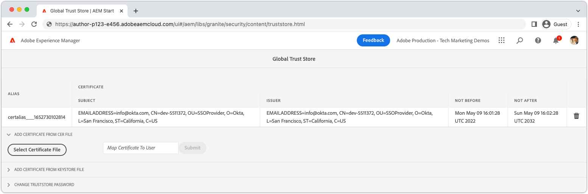
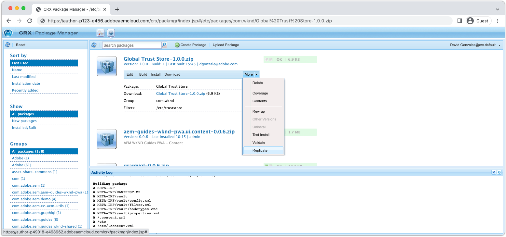
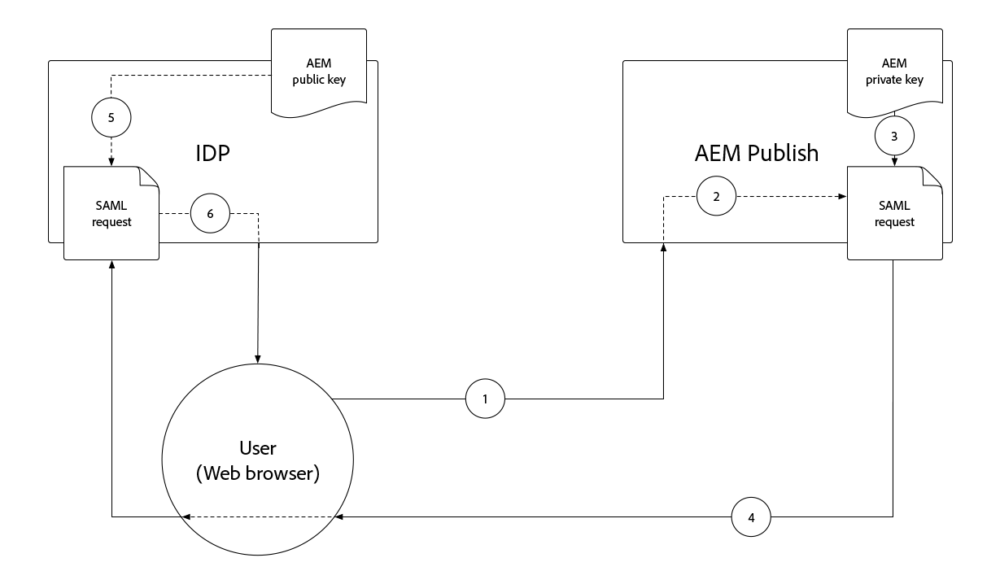
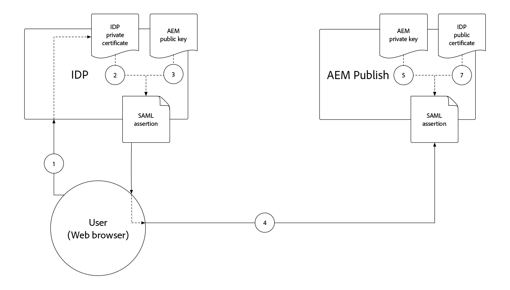
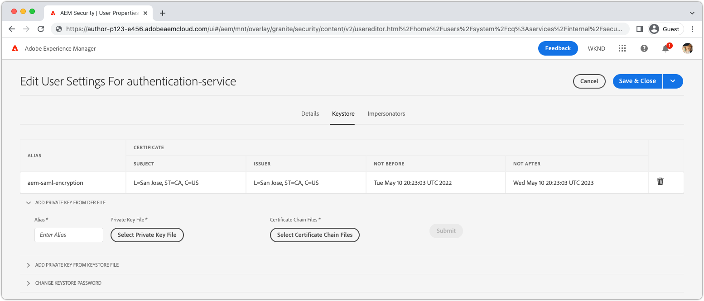

# SAML 2.0 인증{#saml-2-0-authentication}

선택한 SAML 2.0 호환 IDP에 대해 최종 사용자(AEM 작성자가 아님)를 설정하고 인증하는 방법에 대해 알아보십시오.

## AEM as a Cloud Service을 위한 SAML은 무엇입니까?

SAML 2.0을 AEM Publish(또는 미리보기)와 통합하면 AEM 기반 웹 경험의 최종 사용자가 Adobe이 아닌 IDP(ID 공급자)에 인증하고 지정된 승인된 사용자로 AEM에 액세스할 수 있습니다.

|                       | AEM Author | AEM 게시 인스턴스 |
|-----------------------|:----------:|:-----------:|
| SAML 2.0 지원 | ✘ | ✔ |

+++ AEM의 SAML 2.0 흐름 이해

AEM Publish SAML 통합의 일반적인 흐름은 다음과 같습니다.

1. 사용자가 인증이 필요함을 나타내는 AEM 게시를 요청합니다.
   + 사용자가 CUG/ACL 보호 리소스를 요청합니다.
   + 사용자가 인증 요구 사항이 적용되는 리소스를 요청합니다.
   + 사용자가 로그인 작업을 명시적으로 요청하는 AEM의 로그인 끝점(즉, `/system/sling/login`)에 대한 링크를 따라갑니다.
1. AEM은 IDP에 AuthnRequest를 만들어 IDP에 인증 프로세스를 시작하도록 요청합니다.
1. 사용자가 IDP를 인증합니다.
   + IDP에서 자격 증명을 입력하라는 메시지가 표시됩니다.
   + 사용자가 이미 IDP로 인증되었으므로 추가 자격 증명을 제공할 필요가 없습니다.
1. IDP는 사용자의 데이터가 포함된 SAML 어설션을 생성하고 IDP의 개인 인증서를 사용하여 서명합니다.
1. IDP는 사용자의 웹 브라우저(EACH_PROTECTED_PATH/saml_login)를 통해 HTTP POST를 통해 SAML 어설션을 AEM Publish로 보냅니다.
1. AEM Publish는 SAML 어설션을 수신하고 IDP 공개 인증서를 사용하여 SAML 어설션의 무결성 및 신뢰성을 확인합니다.
1. AEM Publish는 SAML 2.0 OSGi 구성 및 SAML 어설션의 컨텐츠를 기반으로 AEM 사용자 레코드를 관리합니다.
   + 사용자 만들기
   + 사용자 속성 동기화
   + AEM 사용자 그룹 구성원 업데이트
1. AEM Publish는 HTTP 응답에 AEM `login-token` 쿠키를 설정합니다. 이 쿠키는 AEM Publish에 대한 후속 요청을 인증하는 데 사용됩니다.
1. AEM 게시는 `saml_request_path` 쿠키에 지정된 대로 사용자를 AEM 게시의 URL로 리디렉션합니다.

+++

## 구성 연습

>[!VIDEO](https://video.tv.adobe.com/v/343040?quality=12&learn=on)

이 비디오는 AEM as a Cloud Service Publish 서비스와 SAML 2.0 통합을 설정하고 Okta를 IDP로 사용하는 방법에 대해 안내합니다.

## 사전 요구 사항

SAML 2.0 인증을 설정할 때 필요한 사항은 다음과 같습니다.

+ Cloud Manager에 대한 배포 관리자 액세스
+ AEM as a Cloud Service 환경에 대한 AEM 관리자 액세스
+ IDP에 대한 관리자 액세스
+ 필요한 경우 SAML 페이로드를 암호화하는 데 사용되는 공개/개인 키 쌍에 액세스
+ AEM Sites 페이지(또는 페이지 트리), AEM Publish에 게시되고 [폐쇄형 사용자 그룹(CUG)으로 보호됨](https://experienceleague.adobe.com/en/docs/experience-manager-cloud-service/content/sites/authoring/sites-console/page-properties#permissions)

SAML 2.0은 AEM 게시 또는 미리보기에 대한 사용을 인증하는 데만 지원됩니다. 및 IDP를 사용하여 AEM 작성자의 인증을 관리하려면 [IDP를 Adobe IMS와 통합](https://helpx.adobe.com/kr/enterprise/using/set-up-identity.html)하십시오.


## AEM에 IDP 공개 인증서 설치

IDP의 공개 인증서가 AEM의 Global Trust Store에 추가되고, IDP에서 보낸 SAML 어설션이 유효한지 확인하는 데 사용됩니다.

+++SAML 어설션 서명 흐름


1. 사용자가 IDP를 인증합니다.
1. IDP는 사용자의 데이터를 포함하는 SAML 어설션을 생성합니다.
1. IDP는 IDP의 개인 인증서를 사용하여 SAML 어설션에 서명합니다.
1. IDP는 서명된 SAML 어설션이 포함된 AEM 게시의 SAML 끝점(`.../saml_login`)에 대한 클라이언트측 HTTP POST를 시작합니다.
1. AEM 게시는 서명된 SAML 어설션이 포함된 HTTP POST를 수신하며 IDP 공개 인증서를 사용하여 서명의 유효성을 검사할 수 있습니다.

+++



1. IDP에서 __공개 인증서__ 파일을 가져옵니다. 이 인증서를 사용하면 AEM에서 IDP가 AEM에 제공한 SAML 어설션의 유효성을 검사할 수 있습니다.

   인증서는 PEM 형식이며 다음과 유사해야 합니다.

   ```
   -----BEGIN CERTIFICATE-----
   MIIC4jCBAcoCCQC33wnybT5QZDANBgkqhkiG9w0BAQsFADAyMQswCQYDVQQGEwJV
   ...
   m0eo2USlSRTVl7QHRTuiuSThHpLKQQ==
   -----END CERTIFICATE-----
   ```

1. AEM 작성자에 AEM 관리자로 로그인합니다.
1. __도구 > 보안 > Trust Store__(으)로 이동합니다.
1. 글로벌 Trust Store를 만들거나 엽니다. 글로벌 Trust Store를 만드는 경우 암호를 안전한 곳에 저장합니다.
1. __CER 파일에서 인증서 추가__&#x200B;를 확장합니다.
1. __인증서 파일 선택__&#x200B;을 선택하고 IDP에서 제공한 인증서 파일을 업로드하십시오.
1. __사용자에게 인증서 매핑__&#x200B;을 비워 둡니다.
1. __제출__&#x200B;을 선택합니다.
1. 새로 추가된 인증서는 __CRT 파일에서 인증서 추가__ 섹션 위에 표시됩니다.
1. 이 값은 __SAML 2.0 인증 처리기 OSGi 구성__&#x200B;에서 사용되므로 [alias](#saml-2-0-authentication-handler-osgi-configuration)을(를) 메모해 두십시오.
1. __저장 후 닫기__&#x200B;를 선택합니다.

글로벌 Trust Store는 AEM 작성자의 IDP 공개 인증서로 구성되지만 SAML은 AEM 게시에서만 사용되므로 IDP 공개 인증서에 액세스하려면 글로벌 Trust Store를 AEM 게시로 복제해야 합니다.



1. __도구 > 배포 > 패키지__(으)로 이동합니다.
1. 패키지 만들기
   + 패키지 이름: `Global Trust Store`
   + 버전: `1.0.0`
   + 그룹: `com.your.company`
1. 새 __글로벌 Trust Store__ 패키지를 편집합니다.
1. __필터__ 탭을 선택하고 루트 경로 `/etc/truststore`에 대한 필터를 추가하십시오.
1. __완료__&#x200B;를 선택한 다음 __저장__&#x200B;을 선택합니다.
1. __전역 Trust Store__ 패키지에 대한 __빌드__ 단추를 선택하십시오.
1. 빌드되면 __자세히__ > __복제__&#x200B;를 선택하여 AEM 게시의 전역 Trust Store 노드(`/etc/truststore`)를 활성화합니다.

## 인증 서비스 키 저장소 만들기{#authentication-service-keystore}

_인증 서비스에 대한 키 저장소를 만들려면 [SAML 2.0 인증 처리기 OSGi 구성 속성 `handleLogout`이(가) `true`](#saml-20-authenticationsaml-2-0-authentication)(으)로 설정되어 있거나 [AuthnRequest 서명/SAML 어설션 암호화](#install-aem-public-private-key-pair)가 필요한 경우_

1. AEM 작성자에 AEM 관리자로 로그인하여 개인 키를 업로드합니다.
1. __도구 > 보안 > 사용자__(으)로 이동하고 __인증 서비스__ 사용자를 선택한 다음 상단 작업 표시줄에서 __속성__&#x200B;을 선택합니다.
1. __키 저장소__ 탭을 선택합니다.
1. 키 저장소를 생성하거나 엽니다. 키 저장소를 만드는 경우 암호를 안전하게 유지합니다.
   + AuthnRequest 서명/SAML 어설션 암호화가 필요한 경우에만 [공용/개인 키 저장소가 이 키 저장소에 설치됩니다](#install-aem-public-private-key-pair).
   + 이 SAML 통합이 로그아웃은 지원하지만 AuthnRequest 서명/SAML 어설션은 지원하지 않는 경우 빈 키 저장소로 충분합니다.
1. __저장 후 닫기__&#x200B;를 선택합니다.
1. 업데이트된 __authentication-service__ 사용자가 포함된 패키지를 만듭니다.

   패키지를 사용하여 다음 임시 해결 방법 사용(_U):_

   1. __도구 > 배포 > 패키지__(으)로 이동합니다.
   1. 패키지 만들기
      + 패키지 이름: `Authentication Service`
      + 버전: `1.0.0`
      + 그룹: `com.your.company`
   1. 새 __인증 서비스 키 저장소__ 패키지를 편집합니다.
   1. __필터__ 탭을 선택하고 루트 경로 `/home/users/system/cq:services/internal/security/<AUTHENTICATION SERVICE UUID>/keystore`에 대한 필터를 추가하십시오.
      + `<AUTHENTICATION SERVICE UUID>`은(는) __도구 > 보안 > 사용자__(으)로 이동한 다음 __인증 서비스__ 사용자를 선택하여 찾을 수 있습니다. UUID는 URL의 마지막 부분입니다.
   1. __완료__&#x200B;를 선택한 다음 __저장__&#x200B;을 선택합니다.
   1. __인증 서비스 키 저장소__ 패키지의 __빌드__ 단추를 선택하십시오.
   1. 빌드되면 __자세히__ > __복제__&#x200B;를 선택하여 AEM 게시로 인증 서비스 키 저장소를 활성화합니다.

## AEM 공개/개인 키 쌍 설치{#install-aem-public-private-key-pair}

_AEM 공개/개인 키 쌍 설치는 선택 사항입니다_

AEM Publish는 AuthnRequests(IDP)에 서명하고 SAML 어설션(AEM)을 암호화하도록 구성할 수 있습니다. 이 작업은 AEM Publish에 개인 키를 제공함으로써 수행되며 이는 IDP에 대한 공개 키와 일치합니다.

+++ AuthnRequest 서명 흐름 이해(선택 사항)

AuthnRequest(로그인 프로세스를 시작하는 AEM Publish에서 IDP에 대한 요청)는 AEM Publish에서 서명할 수 있습니다. 이를 위해 AEM Publish는 개인 키를 사용하여 AuthnRequest에 서명한 다음 IDP가 공개 키를 사용하여 서명의 유효성을 검사합니다. 이렇게 하면 AuthnRequest가 시작되었고 AEM Publish에 의해 요청되었으며 악의적인 서드파티가 아님을 IDP에 보장할 수 있습니다.



1. 사용자가 AEM Publish에 대한 HTTP 요청을 하여 IDP에 대한 SAML 인증 요청을 생성합니다.
1. AEM Publish는 IDP로 전송할 SAML 요청을 생성합니다.
1. AEM Publish는 AEM의 개인 키를 사용하여 SAML 요청에 서명합니다.
1. AEM Publish는 서명된 SAML 요청이 포함된 IDP에 대한 HTTP 클라이언트측 리디렉션인 AuthnRequest를 시작합니다.
1. IDP는 AuthnRequest를 수신하고 AEM의 공개 키를 사용하여 서명을 확인하며 AEM 게시가 AuthnRequest를 시작했는지 확인합니다.
1. 그런 다음 AEM Publish는 IDP 공개 인증서를 사용하여 복호화된 SAML 어설션의 무결성 및 신뢰성을 확인합니다.

+++

+++ SAML 어설션 암호화 흐름 이해(선택 사항)

IDP와 AEM Publish 간의 모든 HTTP 통신은 HTTPS를 통해 전송되어야 하므로 기본적으로 안전해야 합니다. 그러나 필요에 따라 SAML 어설션은 HTTPS에서 제공하는 것 위에 추가 기밀성이 필요한 경우 암호화될 수 있습니다. 이를 위해 IDP는 개인 키를 사용하여 SAML 어설션 데이터를 암호화하고 AEM 게시는 개인 키를 사용하여 SAML 어설션의 암호를 해독합니다.



1. 사용자가 IDP를 인증합니다.
1. IDP는 사용자의 데이터가 포함된 SAML 어설션을 생성하고 IDP의 개인 인증서를 사용하여 서명합니다.
1. 그런 다음 IDP는 AEM의 공개 키로 SAML 어설션을 암호화하며, 이를 위해 AEM 개인 키가 해독되어야 합니다.
1. 암호화된 SAML 어설션은 사용자의 웹 브라우저를 통해 AEM Publish로 전송됩니다.
1. AEM Publish는 SAML 어설션을 수신하고 AEM의 개인 키를 사용하여 어설션을 해독합니다.
1. IDP는 사용자에게 인증하라는 메시지를 표시합니다.

+++

AuthnRequest 서명 및 SAML 어설션 암호화는 모두 선택 사항이지만 [SAML 2.0 인증 처리기 OSGi 구성 속성 `useEncryption`](#saml-20-authenticationsaml-2-0-authentication)을(를) 사용하여 둘 다 활성화되었습니다. 즉, 둘 다 사용하거나 둘 다 사용할 수 없습니다.



1. AuthnRequest 서명에 사용되는 공개 키, 개인 키(DER 형식의 PKCS#8) 및 인증서 체인 파일(공개 키일 수 있음)을 가져오고 SAML 어설션을 암호화합니다. 키는 일반적으로 IT 조직의 보안 팀에서 제공합니다.

   + __openssl__&#x200B;을 사용하여 자체 서명된 키 쌍을 생성할 수 있습니다.

   ```
   $ openssl req -x509 -sha256 -days 365 -newkey rsa:4096 -keyout aem-private.key -out aem-public.crt
   
   # Provide a password (keep in safe place), and other requested certificate information
   
   # Convert the keys to AEM's required format 
   $ openssl rsa -in aem-private.key -outform der -out aem-private.der
   $ openssl pkcs8 -topk8 -inform der -nocrypt -in aem-private.der -outform der -out aem-private-pkcs8.der
   ```

1. 공개 키를 IDP에 업로드합니다.
   + 위의 `openssl` 메서드를 사용하면 공개 키는 `aem-public.crt` 파일입니다.
1. AEM 작성자에 AEM 관리자로 로그인하여 개인 키를 업로드합니다.
1. __도구 > 보안 > Trust Store__(으)로 이동한 다음 __인증 서비스__ 사용자를 선택하고 맨 위의 작업 표시줄에서 __속성__&#x200B;을 선택합니다.
1. __도구 > 보안 > 사용자__(으)로 이동하고 __인증 서비스__ 사용자를 선택한 다음 상단 작업 표시줄에서 __속성__&#x200B;을 선택합니다.
1. __키 저장소__ 탭을 선택합니다.
1. 키 저장소를 생성하거나 엽니다. 키 저장소를 만드는 경우 암호를 안전하게 유지합니다.
1. __DER 파일에서 개인 키 추가__&#x200B;를 선택하고 개인 키와 체인 파일을 AEM에 추가하십시오.
   + __별칭__: 의미 있는 이름(종종 IDP 이름)을 입력하십시오.
   + __개인 키 파일__: 개인 키 파일(DER 형식의 PKCS#8)을 업로드합니다.
      + 위의 `openssl` 메서드를 사용하면 `aem-private-pkcs8.der` 파일입니다.
   + __인증서 체인 파일 선택__: 함께 제공되는 체인 파일을 업로드합니다(공개 키일 수 있음).
      + 위의 `openssl` 메서드를 사용하면 `aem-public.crt` 파일입니다.
   + __제출__ 선택
1. 새로 추가된 인증서는 __CRT 파일에서 인증서 추가__ 섹션 위에 표시됩니다.
   + __SAML 2.0 인증 처리기 OSGi 구성__&#x200B;에서 사용되므로 [alias](#saml-20-authentication-handler-osgi-configuration)을(를) 메모하십시오.
1. __저장 후 닫기__&#x200B;를 선택합니다.
1. 업데이트된 __authentication-service__ 사용자가 포함된 패키지를 만듭니다.

   패키지를 사용하여 다음 임시 해결 방법 사용(_U):_

   1. __도구 > 배포 > 패키지__(으)로 이동합니다.
   1. 패키지 만들기
      + 패키지 이름: `Authentication Service`
      + 버전: `1.0.0`
      + 그룹: `com.your.company`
   1. 새 __인증 서비스 키 저장소__ 패키지를 편집합니다.
   1. __필터__ 탭을 선택하고 루트 경로 `/home/users/system/cq:services/internal/security/<AUTHENTICATION SERVICE UUID>/keystore`에 대한 필터를 추가하십시오.
      + `<AUTHENTICATION SERVICE UUID>`은(는) __도구 > 보안 > 사용자__(으)로 이동한 다음 __인증 서비스__ 사용자를 선택하여 찾을 수 있습니다. UUID는 URL의 마지막 부분입니다.
   1. __완료__&#x200B;를 선택한 다음 __저장__&#x200B;을 선택합니다.
   1. __인증 서비스 키 저장소__ 패키지의 __빌드__ 단추를 선택하십시오.
   1. 빌드되면 __자세히__ > __복제__&#x200B;를 선택하여 AEM 게시로 인증 서비스 키 저장소를 활성화합니다.

## SAML 2.0 인증 처리기 구성{#configure-saml-2-0-authentication-handler}

AEM의 SAML 구성은 __Adobe Granite SAML 2.0 Authentication Handler__ OSGi 구성을 통해 수행됩니다.
이 구성은 OSGi 공장 구성입니다. 즉, 단일 AEM as a Cloud Service 게시 서비스에는 저장소의 개별 리소스 트리에 적용되는 여러 SAML 구성이 있을 수 있습니다. 이는 다중 사이트 AEM 배포에 유용합니다.

+++ SAML 2.0 Authentication Handler OSGi 구성 용어

### Adobe Granite SAML 2.0 Authentication Handler OSGi 구성{#configure-saml-2-0-authentication-handler-osgi-configuration}

|                                   | OSGi 속성 | 필수 | 값 형식 | 기본 값 | 설명 |
|-----------------------------------|-------------------------------|:--------:|:---------------------:|---------------------------|-------------|
| 경로 | `path` | ✔ | 문자열 배열 | `/` | AEM은 이 인증 핸들러가 사용되는 경로를 지정합니다. |
| IDP URL | `idpUrl` | ✔ | 문자열 |                           | IDP URL SAML 인증 요청이 전송됩니다. |
| IDP 인증서 별칭 | `idpCertAlias` | ✔ | 문자열 |                           | AEM의 글로벌 Trust Store에 있는 IDP 인증서의 별칭 |
| IDP HTTP 리디렉션 | `idpHttpRedirect` | ✘ | 부울 | `false` | AuthnRequest를 보내는 대신 IDP URL로 HTTP 리디렉션을 수행할지 여부를 나타냅니다. IDP 시작 인증을 위해 `true`(으)로 설정합니다. |
| IDP 식별자 | `idpIdentifier` | ✘ | 문자열 |                           | AEM 사용자 및 그룹의 고유성을 보장하는 고유 IDP ID. 비어 있으면 대신 `serviceProviderEntityId`이(가) 사용됩니다. |
| 어설션 소비자 서비스 URL | `assertionConsumerServiceURL` | ✘ | 문자열 |                           | AuthnRequest의 `AssertionConsumerServiceURL` URL 특성으로 `<Response>` 메시지를 AEM으로 보내야 하는 위치를 지정합니다. |
| SP 엔티티 ID | `serviceProviderEntityId` | ✔ | 문자열 |                           | IDP에 대한 AEM(일반적으로 AEM 호스트 이름)를 고유하게 식별합니다. |
| SP 암호화 | `useEncryption` | ✘ | 부울 | `true` | IDP가 SAML 어설션을 암호화하는지 여부를 나타냅니다. `spPrivateKeyAlias` 및 `keyStorePassword`을(를) 설정해야 합니다. |
| SP 개인 키 별칭 | `spPrivateKeyAlias` | ✘ | 문자열 |                           | `authentication-service` 사용자의 키 저장소에 있는 개인 키의 별칭입니다. `useEncryption`이(가) `true`(으)로 설정된 경우 필요합니다. |
| SP 키 저장소 암호 | `keyStorePassword` | ✘ | 문자열 |                           | &#39;authentication-service&#39; 사용자 키 저장소의 암호입니다. `useEncryption`이(가) `true`(으)로 설정된 경우 필요합니다. |
| 기본 리디렉션 | `defaultRedirectUrl` | ✘ | 문자열 | `/` | 인증 성공 후 기본 리디렉션 URL. AEM 호스트에 상대적일 수 있습니다(예: `/content/wknd/us/en/html`). |
| 사용자 ID 속성 | `userIDAttribute` | ✘ | 문자열 | `uid` | AEM 사용자의 사용자 ID를 포함하는 SAML 어설션 속성의 이름입니다. `Subject:NameId`을(를) 사용하려면 비워 둡니다. |
| AEM 사용자 자동 만들기 | `createUser` | ✘ | 부울 | `true` | 인증 성공 시 AEM 사용자가 만들어졌는지 여부를 나타냅니다. |
| AEM 사용자 중간 경로 | `userIntermediatePath` | ✘ | 문자열 |                           | AEM 사용자를 만들 때 이 값은 중간 경로로 사용됩니다(예: `/home/users/<userIntermediatePath>/jane@wknd.com`). `createUser`을(를) `true`(으)로 설정해야 합니다. |
| AEM 사용자 특성 | `synchronizeAttributes` | ✘ | 문자열 배열 |                           | AEM 사용자에 저장할 SAML 특성 매핑 목록입니다(예: `[ "saml-attribute-name=path/relative/to/user/node" ]` 형식). `[ "firstName=profile/givenName" ]` [기본 AEM 특성 전체 목록](#aem-user-attributes)을 참조하세요. |
| AEM 그룹에 사용자 추가 | `addGroupMemberships` | ✘ | 부울 | `true` | 인증 성공 후 AEM 사용자가 AEM 사용자 그룹에 자동으로 추가되는지 여부를 나타냅니다. |
| AEM 그룹 멤버십 속성 | `groupMembershipAttribute` | ✘ | 문자열 | `groupMembership` | 사용자를 추가해야 하는 AEM 사용자 그룹 목록을 포함하는 SAML 어설션 속성의 이름입니다. `addGroupMemberships`을(를) `true`(으)로 설정해야 합니다. |
| 기본 AEM 그룹 | `defaultGroups` | ✘ | 문자열 배열 |                           | 인증된 AEM 사용자 그룹 목록이 항상 추가됩니다(예: `[ "wknd-user" ]`). `addGroupMemberships`을(를) `true`(으)로 설정해야 합니다. |
| NameIDPolicy 형식 | `nameIdFormat` | ✘ | 문자열 | `urn:oasis:names:tc:SAML:2.0:nameid-format:transient` | AuthnRequest 메시지에서 보낼 NameIDPolicy 형식 매개 변수의 값입니다. |
| SAML 응답 저장 | `storeSAMLResponse` | ✘ | 부울 | `false` | `samlResponse` 값이 AEM `cq:User` 노드에 저장되어 있는지 여부를 나타냅니다. |
| 로그아웃 처리 | `handleLogout` | ✘ | 부울 | `false` | 로그아웃 요청이 이 SAML 인증 핸들러에 의해 처리되는지 여부를 나타냅니다. `logoutUrl`을(를) 설정해야 합니다. |
| 로그아웃 URL | `logoutUrl` | ✘ | 문자열 |                           | SAML 로그아웃 요청이 전송되는 IDP의 URL입니다. `handleLogout`이(가) `true`(으)로 설정된 경우 필요합니다. |
| 클럭 허용치 | `clockTolerance` | ✘ | 정수 | `60` | SAML 어설션을 검증할 때 IDP 및 AEM(SP) 클록 스큐 허용치. |
| 다이제스트 메서드 | `digestMethod` | ✘ | 문자열 | `http://www.w3.org/2001/04/xmlenc#sha256` | SAML 메시지에 서명할 때 IDP가 사용하는 다이제스트 알고리즘입니다. |
| 서명 방법 | `signatureMethod` | ✘ | 문자열 | `http://www.w3.org/2001/04/xmldsig-more#rsa-sha256` | SAML 메시지에 서명할 때 IDP가 사용하는 서명 알고리즘입니다. |
| ID 동기화 유형 | `identitySyncType` | ✘ | `default` 또는 `idp` | `default` | AEM as a Cloud Service의 `from` 기본값을 변경하지 마십시오. |
| 서비스 순위 | `service.ranking` | ✘ | 정수 | `5002` | 동일한 `path`에 더 높은 순위 구성이 선호됩니다. |

### AEM 사용자 특성{#aem-user-attributes}

AEM에서는 Adobe Granite SAML 2.0 Authentication Handler OSGi 구성에서 `synchronizeAttributes` 속성을 통해 채울 수 있는 다음 사용자 특성을 사용합니다.  모든 IDP 속성은 모든 AEM 사용자 속성에 동기화할 수 있지만 AEM 사용 속성 속성(아래 나열됨)에 매핑하면 AEM에서 자연스럽게 사용할 수 있습니다.

| 사용자 속성 | `rep:User` 노드의 상대 속성 경로 |
|--------------------------------|--------------------------|
| 제목(예: `Mrs`) | `profile/title` |
| 이름(예: 이름) | `profile/givenName` |
| 성(예: 성) | `profile/familyName` |
| 직위 | `profile/jobTitle` |
| 이메일 주소 | `profile/email` |
| 상세 주소 | `profile/street` |
| 도시 | `profile/city` |
| 우편번호 | `profile/postalCode` |
| 국가 | `profile/country` |
| 전화 번호 | `profile/phoneNumber` |
| 내 정보 | `profile/aboutMe` |

+++

1. `/ui.config/src/main/content/jcr_root/wknd-examples/osgiconfig/config.publish/com.adobe.granite.auth.saml.SamlAuthenticationHandler~saml.cfg.json`의 프로젝트에서 OSGi 구성 파일을 만들고 IDE에서 엽니다.
   + `/wknd-examples/`을(를) `/<project name>/`(으)로 변경
   + 파일 이름의 `~` 뒤에 있는 식별자는 이 구성을 고유하게 식별해야 하므로 `...~okta.cfg.json`과(와) 같은 IDP의 이름일 수 있습니다. 값은 하이픈이 있는 영숫자여야 합니다.
1. `com.adobe.granite.auth.saml.SamlAuthenticationHandler~...cfg.json` 파일에 다음 JSON을 붙여 넣고 필요에 따라 `wknd` 참조를 업데이트합니다.

   ```json
   {
       "path": [ "/content/wknd", "/content/dam/wknd" ], 
       "idpCertAlias": "$[env:SAML_IDP_CERT_ALIAS;default=certalias___1652125559800]",
       "idpIdentifier": "$[env:SAML_IDP_ID;default=http://www.okta.com/exk4z55r44Jz9C6am5d7]",
       "idpUrl": "$[env:SAML_IDP_URL;default=https://dev-5511372.okta.com/app/dev-5511372_aemasacloudservice_1/exk4z55r44Jz9C6am5d7/sso/saml]",
       "serviceProviderEntityId": "$[env:SAML_AEM_ID;default=https://publish-p123-e456.adobeaemcloud.com]",
       "useEncryption": false,
       "createUser": true,
       "userIntermediatePath": "wknd/idp",
       "synchronizeAttributes":[
           "firstName=profile/givenName"
       ],
       "addGroupMemberships": true,
       "defaultGroups": [ 
           "wknd-users"
       ]
   }
   ```

1. 프로젝트에 필요한 값을 업데이트합니다. 구성 속성 설명은 위의 __SAML 2.0 인증 처리기 OSGi 구성 용어집__&#x200B;을 참조하십시오. `path`은(는) CUG(폐쇄형 사용자 그룹)로 보호되고 인증이 필요한 콘텐츠 트리를 포함해야 하며 이 인증 처리기는 보호를 담당해야 합니다.
1. 값이 릴리스 주기와 동기화되지 않을 수 있을 때 또는 유사한 환경 유형/서비스 계층 간에 값이 다를 때 OSGi 환경 변수 및 암호를 사용하는 것이 좋지만 필수는 아닙니다. 위와 같이 `$[env:..;default=the-default-value]"` 구문을 사용하여 기본값을 설정할 수 있습니다.

SAML 구성이 환경마다 다른 경우 환경당 OSGi 구성(`config.publish.dev`, `config.publish.stage` 및 `config.publish.prod`)을 특정 특성으로 정의할 수 있습니다.

### 암호화 사용

[AuthnRequest 및 SAML 어설션 암호화](#encrypting-the-authnrequest-and-saml-assertion)할 때 `useEncryption`, `spPrivateKeyAlias` 및 `keyStorePassword` 속성이 필요합니다. `keyStorePassword`에 암호가 포함되어 있으므로 값을 OSGi 구성 파일에 저장하지 말고 [비밀 구성 값](https://experienceleague.adobe.com/docs/experience-manager-cloud-service/content/implementing/deploying/configuring-osgi.html#secret-configuration-values)을 사용하여 삽입해야 합니다.

+++필요한 경우 암호화를 사용하도록 OSGi 구성을 업데이트합니다

1. IDE에서 `/ui.config/src/main/content/jcr_root/wknd-examples/osgiconfig/config.publish/com.adobe.granite.auth.saml.SamlAuthenticationHandler~saml.cfg.json`을(를) 엽니다.
1. 아래와 같이 세 개의 속성 `useEncryption`, `spPrivateKeyAlias` 및 `keyStorePassword`을(를) 추가합니다.

   ```json
   {
   "path": [ "/content/wknd", "/content/dam/wknd" ], 
   "idpCertAlias": "$[env:SAML_IDP_CERT_ALIAS;default=certalias___1234567890]",
   "idpIdentifier": "$[env:SAML_IDP_ID;default=http://www.okta.com/abcdef1235678]",
   "idpUrl": "$[env:SAML_IDP_URL;default=https://dev-5511372.okta.com/app/dev-123567890_aemasacloudservice_1/abcdef1235678/sso/saml]",
   "serviceProviderEntityId": "$[env:SAML_AEM_ID;default=https://publish-p123-e456.adobeaemcloud.com]",
   "useEncryption": true,
   "spPrivateKeyAlias": "$[env:SAML_AEM_KEYSTORE_ALIAS;default=aem-saml-encryption]",
   "keyStorePassword": "$[secret:SAML_AEM_KEYSTORE_PASSWORD]",
   "createUser": true,
   "userIntermediatePath": "wknd/idp"
   "synchronizeAttributes":[
       "firstName=profile/givenName"
   ],
   "addGroupMemberships": true,
   "defaultGroups": [ 
       "wknd-users"
   ]
   }
   ```

1. 암호화에 필요한 세 가지 OSGi 구성 속성은 다음과 같습니다.

+ `useEncryption`이(가) `true`(으)로 설정됨
+ `spPrivateKeyAlias`에 SAML 통합에서 사용하는 개인 키에 대한 키 저장소 항목 별칭이 포함되어 있습니다.
+ `keyStorePassword`에 [ 사용자 키 저장소의 암호를 포함하는 ](https://experienceleague.adobe.com/docs/experience-manager-cloud-service/content/implementing/deploying/configuring-osgi.html#secret-configuration-values)OSGi 비밀 구성 변수`authentication-service`이(가) 있습니다.

+++

## 레퍼러 필터 구성

SAML 인증 프로세스 중에 IDP는 AEM 게시의 `.../saml_login` 끝점에 대한 클라이언트측 HTTP POST를 시작합니다. IDP와 AEM 게시가 다른 원본에 있는 경우 IDP 원본의 HTTP POST를 허용하도록 OSGi 구성을 통해 AEM 게시의 __레퍼러 필터__&#x200B;가 구성됩니다.

1. `/ui.config/src/main/content/jcr_root/wknd-examples/osgiconfig/config.publish/org.apache.sling.security.impl.ReferrerFilter.cfg.json`의 프로젝트에서 OSGi 구성 파일을 만들거나 편집합니다.
   + `/wknd-examples/`을(를) `/<project name>/`(으)로 변경
1. `allow.empty` 값이 `true`(으)로 설정되어 있는지, `allow.hosts`(또는 원하는 경우 `allow.hosts.regexp`)에 IDP의 원본이 포함되어 있는지, `filter.methods`에 `POST`이(가) 포함되어 있는지 확인하십시오. OSGi 구성은 다음과 유사해야 합니다.

   ```json
   {
       "allow.empty": true,
       "allow.hosts.regexp": [ ],
       "allow.hosts": [ 
           "$[env:SAML_IDP_REFERRER;default=dev-123567890.okta.com]"
       ],
       "filter.methods": [
           "POST",
       ],
       "exclude.agents.regexp": [ ]
   }
   ```

AEM Publish는 단일 레퍼러 필터 구성을 지원하므로 SAML 구성 요구 사항을 기존 구성과 병합합니다.

환경마다 `config.publish.dev`(또는 `config.publish.stage`)이 다른 경우 환경당 OSGi 구성(`config.publish.prod`, `allow.hosts` 및 `allow.hosts.regex`)을 특정 특성으로 정의할 수 있습니다.

## CORS(원본 간 리소스 공유) 구성

SAML 인증 프로세스 중에 IDP는 AEM 게시의 `.../saml_login` 끝점에 대한 클라이언트측 HTTP POST를 시작합니다. IDP와 AEM 게시가 다른 호스트/도메인에 있는 경우 AEM 게시의 __CRoss-Origin Resource Sharing(CORS)__&#x200B;이(가) IDP의 호스트/도메인에서 HTTP POST를 허용하도록 구성되어 있어야 합니다.

이 HTTP POST 요청의 `Origin` 헤더에 일반적으로 AEM 게시 호스트와 다른 값이 있으므로 CORS 구성이 필요합니다.

로컬 AEM SDK(`localhost:4503`)에서 SAML 인증을 테스트할 때 IDP가 `Origin` 헤더를 `null`(으)로 설정할 수 있습니다. `"null"` 목록에 `alloworigin`을(를) 추가합니다.

1. `/ui.config/src/main/content/jcr_root/wknd-examples/osgiconfig/config.publish/com.adobe.granite.cors.impl.CORSPolicyImpl~saml.cfg.json`의 프로젝트에서 OSGi 구성 파일 만들기
   + `/wknd-examples/`을(를) 프로젝트 이름으로 변경
   + 파일 이름의 `~` 뒤에 있는 식별자는 이 구성을 고유하게 식별해야 하므로 `...CORSPolicyImpl~okta.cfg.json`과(와) 같은 IDP의 이름일 수 있습니다. 값은 하이픈이 있는 영숫자여야 합니다.
1. `com.adobe.granite.cors.impl.CORSPolicyImpl~...cfg.json` 파일에 다음 JSON을 붙여 넣습니다.

```json
{
    "alloworigin": [ 
        "$[env:SAML_IDP_ORIGIN;default=https://dev-1234567890.okta.com]", 
        "null"
    ],
    "allowedpaths": [ 
        ".*/saml_login"
    ],
    "supportedmethods": [ 
        "POST"
    ]
}
```

`config.publish.dev` 및 `config.publish.stage`이(가) 환경마다 다른 경우 환경당 OSGi 구성(`config.publish.prod`, `alloworigin` 및 `allowedpaths`)을 특정 특성으로 정의할 수 있습니다.

## SAML HTTP POST를 허용하도록 AEM Dispatcher 구성

IDP에 성공적으로 인증되면 IDP는 AEM의 등록된 `/saml_login` 끝점(IDP에 구성됨)으로 HTTP POST를 다시 오케스트레이션합니다. `/saml_login`에 대한 이 HTTP POST는 Dispatcher에서 기본적으로 차단되므로 다음 Dispatcher 규칙을 사용하여 명시적으로 허용해야 합니다.

1. IDE에서 `dispatcher/src/conf.dispatcher.d/filters/filters.any`을(를) 엽니다.
1. `/saml_login`(으)로 끝나는 URL에 대한 HTTP POST 허용 규칙을 파일의 맨 아래에 추가합니다.

```
...

# Allow SAML HTTP POST to ../saml_login end points
/0190 { /type "allow" /method "POST" /url "*/saml_login" }
```

>[!NOTE]
>다양한 보호 경로 및 개별 IDP 끝점을 위해 AEM에서 여러 SAML 구성을 배포할 때 IDP가 ANGULAR_PROTECTED_PATH/saml_login 끝점에 게시하여 AEM 측에서 적절한 SAML 구성을 선택해야 합니다. 동일한 보호된 경로에 대해 중복 SAML 구성이 있는 경우 SAML 구성을 선택하면 임의로 선택됩니다.

Apache 웹 서버에서 URL 재작성이 구성(`dispatcher/src/conf.d/rewrites/rewrite.rules`)된 경우 `.../saml_login` 끝점에 대한 요청이 실수로 손상되지 않았는지 확인하십시오.

## 동적 그룹 멤버십

동적 그룹 멤버십은 그룹 평가 및 프로비저닝의 성능을 향상시키는 [Apache Jackrabbit Oak](https://jackrabbit.apache.org/oak/docs/security/authentication/external/dynamic.html)의 기능입니다. 이 섹션에서는 이 기능을 활성화할 때 사용자와 그룹이 저장되는 방법과 SAML 인증 핸들러의 구성을 수정하여 신규 또는 기존 환경에 대해 활성화하는 방법에 대해 설명합니다.

### 새 환경에서 SAML 사용자에 대해 동적 그룹 멤버십을 활성화하는 방법

새 AEM as a Cloud Service 환경에서 그룹 평가 성능을 크게 향상시키려면 새 환경에서 동적 그룹 멤버십 기능을 활성화하는 것이 좋습니다.
또한 데이터 동기화가 활성화될 때 필요한 단계입니다. 자세한 내용은 [여기](https://experienceleague.adobe.com/en/docs/experience-manager-cloud-service/content/sites/authoring/personalization/user-and-group-sync-for-publish-tier)를 참조하세요.
이렇게 하려면 OSGI 구성 파일에 다음 속성을 추가합니다.

`/apps/example/osgiconfig/config.publish/com.adobe.granite.auth.saml.SamlAuthenticationHandler~example.cfg.json`

이 구성을 통해 사용자 및 그룹은 [Oak 외부 사용자](https://jackrabbit.apache.org/oak/docs/security/authentication/identitymanagement.html)&#x200B;(으)로 만들어집니다. AEM에서 외부 사용자 및 그룹에는 `rep:principalName` 또는 `[user name];[idp]`(으)로 구성된 기본 `[group name];[idp]`이(가) 있습니다.
ACL(액세스 제어 목록)이 사용자 또는 그룹의 PrincipalName과 연결되어 있음을 나타냅니다.
이전에 `identitySyncType`이(가) 지정되지 않았거나 `default`(으)로 설정된 기존 배포에서 이 구성을 배포하는 경우 새 사용자 및 그룹이 만들어지고 이러한 새 사용자 및 그룹에 ACL을 적용해야 합니다. 외부 그룹은 로컬 사용자를 포함할 수 없습니다. [Repoinit](https://sling.apache.org/documentation/bundles/repository-initialization.html)은(는) 사용자가 로그인을 수행할 때만 만들어지더라도 SAML 외부 그룹에 대한 ACL을 만드는 데 사용할 수 있습니다.
ACL에서 이 리팩터링을 방지하기 위해 표준 [마이그레이션 기능](#automatic-migration-to-dynamic-group-membership-for-existing-environments)이 구현되었습니다.

### 동적 그룹 멤버십을 사용하여 로컬 및 외부 그룹에 멤버십을 저장하는 방법

로컬 그룹에서 그룹 구성원이 oak 특성에 저장됩니다. `rep:members`. 속성에는 그룹의 모든 멤버에 대한 uid 목록이 포함됩니다. 추가 정보는 [여기](https://jackrabbit.apache.org/oak/docs/security/user/membership.html#member-representation-in-the-repository)에서 찾을 수 있습니다.
예:

```
{
  "jcr:primaryType": "rep:Group",
  "rep:principalName": "operators",
  "rep:managedByIdp": "SAML",
  "rep:members": [
    "635afa1c-beeb-3262-83c4-38ea31e5549e",
    "5e496093-feb6-37e9-a2a1-7c87b1cec4b0",
    ...
  ],
   ...
}
```

동적 그룹 멤버십이 있는 외부 그룹은 그룹 항목에 멤버를 저장하지 않습니다.
그룹 멤버십은 대신 사용자 항목에 저장됩니다. 추가 설명서는 [여기](https://jackrabbit.apache.org/oak/docs/security/authentication/external/dynamic.html)에서 찾을 수 있습니다. 예를 들어 이것은 그룹의 OAK 노드입니다.

```
{
  "jcr:primaryType": "rep:Group",
  "jcr:mixinTypes": [
    "rep:AccessControllable"
  ],
  "jcr:createdBy": "",
  "jcr:created": "Tue Jul 16 2024 08:58:47 GMT+0000",
  "rep:principalName": "GROUP_1;aem-saml-idp-1",
  "rep:lastSynced": "Tue Jul 16 2024 08:58:47 GMT+0000",
  "jcr:uuid": "d9c6af8a-35c0-3064-899a-59af55455cd0",
  "rep:externalId": "GROUP_1;aem-saml-idp-1",
  "rep:authorizableId": "GROUP_1;aem-saml-idp-1"
}
```

해당 그룹의 사용자 멤버에 대한 노드입니다.

```
{
  "jcr:primaryType": "rep:User",
  "jcr:mixinTypes": [
    "rep:AccessControllable"
  ],
  "surname": "Test",
  "rep:principalName": "testUser",
  "rep:externalId": "test;aem-saml-idp-1",
  "rep:authorizableId": "test",
  "rep:externalPrincipalNames": [
    "projects-users;aem-saml-idp-1",
    "GROUP_2;aem-saml-idp-1",
    "GROUP_1;aem-saml-idp-1",
    "operators;aem-saml-idp-1"
  ],
  ...
}
```

### 기존 환경에서 SAML 사용자에 대해 동적 그룹 멤버십을 활성화하는 방법

앞의 절에서 설명했듯이 외부 사용자 및 그룹의 형식은 로컬 사용자 및 그룹에 사용되는 형식과 약간 다르다. 외부 그룹에 대한 새 ACL을 정의하고 새 외부 사용자를 프로비저닝하거나 아래에 설명된 대로 마이그레이션 도구를 사용할 수 있습니다.

#### 외부 사용자가 있는 기존 환경에 대한 동적 그룹 멤버십 활성화

다음 속성이 지정되면 SAML 인증 처리기가 외부 사용자를 만듭니다. `"identitySyncType": "idp"`. 이 경우 `"identitySyncType": "idp_dynamic"`(으)로 이 속성을 수정하여 동적 그룹 구성원을 사용하도록 설정할 수 있습니다. 마이그레이션이 필요하지 않습니다.

#### 로컬 사용자가 있는 기존 환경의 동적 그룹 멤버십으로 자동 마이그레이션

다음 속성이 지정되면 SAML 인증 처리기에서 로컬 사용자를 만듭니다. `"identitySyncType": "default"`. 이 값은 속성을 지정하지 않은 경우에도 기본값입니다. 이 섹션에서는 자동 마이그레이션 절차에 의해 수행되는 단계에 대해 설명합니다.

이 마이그레이션이 활성화되면 사용자 인증 중에 수행되며 다음 단계로 구성됩니다.
1. 로컬 사용자는 원래 사용자 이름을 유지하면서 외부 사용자로 마이그레이션됩니다. 이는 이제 외부 사용자로 기능하는 마이그레이션된 로컬 사용자가 이전 섹션에서 언급한 명명 구문을 따르는 대신 원래 사용자 이름을 유지함을 의미합니다. 값이 `rep:externalId`인 속성 `[user name];[idp]`이(가) 한 개 더 추가됩니다. `PrincipalName` 사용자가 수정되지 않았습니다.
2. SAML 어설션에 수신된 각 외부 그룹에 대해 외부 그룹이 생성됩니다. 해당 로컬 그룹이 존재하는 경우, 외부 그룹은 로컬 그룹에 멤버로 추가됩니다.
3. 사용자가 외부 그룹의 구성원으로 추가됩니다.
4. 그런 다음 로컬 사용자는 자신이 멤버로 있던 모든 Saml 로컬 그룹에서 제거됩니다. Saml 로컬 그룹은 OAK 속성으로 식별됩니다. `rep:managedByIdp`. `syncType` 특성이 지정되지 않았거나 `default`(으)로 설정된 경우 Saml Authentication 처리기에서 이 속성을 설정합니다.

예를 들어 마이그레이션 `user1`이(가) 로컬 사용자이고 로컬 그룹 `group1`의 멤버인 경우 마이그레이션 후 다음 변경 사항이 발생합니다.
`user1`이(가) 외부 사용자가 됩니다. `rep:externalId` 특성이 이 프로필에 추가되었습니다.
`user1`이(가) 외부 그룹 `group1;idp`의 구성원이 됩니다.
`user1`은(는) 더 이상 로컬 그룹의 직접 구성원이 아닙니다. `group1`
`group1;idp`은(는) 로컬 그룹 `group1`의 구성원입니다.
`user1`은(는) 상속을 통해 로컬 그룹 `group1`의 멤버입니다.

외부 그룹의 그룹 구성원이 속성 `rep:externalPrincipalNames`의 사용자 프로필에 저장되어 있습니다.

### 동적 그룹 멤버십으로 자동 마이그레이션을 구성하는 방법

1. SAML OSGi 구성 파일 `"identitySyncType": "idp_dynamic_simplified_id"`에서 `com.adobe.granite.auth.saml.SamlAuthenticationHandler~...cfg.json` 속성을 사용하도록 설정합니다.
2. `com.adobe.granite.auth.saml.migration.SamlDynamicGroupMembershipMigration~`(으)로 시작하는 공장 PID로 새 OSGi 서비스를 구성합니다. 예를 들어 PID는 `com.adobe.granite.auth.saml.migration.SamlDynamicGroupMembershipMigration~myIdP`일 수 있습니다. 다음 속성을 설정합니다.

```
{
  "idpIdentifier": "<value of IDP Identifier (idpIdentifier)" property from the "com.adobe.granite.auth.saml.SamlAuthenticationHandler" configuration to be migrated>"
}
```

여러 SAML 구성을 마이그레이션하려면 `com.adobe.granite.auth.saml.migration.SamlDynamicGroupMembershipMigration`에 대한 여러 OSGi 팩토리 구성을 만들어야 하며, 각 구성은 마이그레이션할 `idpIdentifier`을(를) 지정합니다.

## 고급 사용 사례에 대한 사용자 정의 SAML 후크

IDP가 SAML 어설션의 사용자 프로필 데이터 및 사용자 그룹 멤버십을 전송할 수 없거나 AEM에 동기화하기 전에 데이터를 변환해야 하는 경우 SAML 인증 프로세스를 확장하기 위해 사용자 지정 SAML 후크를 구현할 수 있습니다. SAML 후크를 사용하면 그룹 멤버십 할당을 사용자 지정하고, 사용자 프로필 속성을 수정하고, 인증 흐름 동안 사용자 지정 비즈니스 논리를 추가할 수 있습니다.

>[!NOTE]
>사용자 지정 SAML 후크는 **AEM as a Cloud Service** 및 **AEM LTS**&#x200B;에서 지원됩니다. 이 기능은 이전 AEM 버전에서는 사용할 수 없습니다.

### 사용자 정의 SAML 후크를 사용해야 하는 경우

사용자 정의 SAML 후크는 다음 작업을 수행해야 할 때 유용합니다.

+ SAML 어설션에 제공된 것 이상으로 사용자 지정 비즈니스 논리에 따라 그룹 멤버십을 동적으로 할당
+ AEM에 동기화되기 전에 사용자 프로필 데이터 변형 또는 보강
+ 복잡한 SAML 속성 구조를 AEM 사용자 속성에 매핑
+ 사용자 지정 권한 부여 규칙 또는 조건부 그룹 할당 구현
+ SAML 인증 중에 사용자 정의 로깅 또는 감사 추가
+ 인증 프로세스 중에 외부 시스템과 통합

### SamlHook 인터페이스 이해

`com.adobe.granite.auth.saml.spi.SamlHook` 인터페이스는 SAML 인증 프로세스의 여러 단계에서 호출되는 두 개의 후크 메서드를 제공합니다.

#### 1. postSamlValidationProcess

이 메서드는 SAML 응답의 유효성을 검사했지만 사용자 동기화 프로세스가 시작되는 **이전**&#x200B;에 **이후**&#x200B;라고 합니다. 속성 추가 또는 변형과 같이 SAML 어설션 데이터를 수정하기에 이상적인 위치입니다.

```java
public void postSamlValidationProcess(
    HttpServletRequest request, 
    Assertion assertion, 
    Message samlResponse)
```

**사용 사례:**
+ 어설션에 추가 그룹 멤버십 추가
+ 속성 값을 동기화하기 전에 변환
+ 외부 소스의 데이터로 어설션 보강
+ 사용자 정의 비즈니스 규칙 유효성 검사

#### 2. postSyncUserProcess

이 메서드는 사용자 동기화 프로세스가 완료된 후 **after**&#x200B;에 호출됩니다. 이 후크는 AEM 사용자가 생성되거나 업데이트된 후 추가 작업을 수행하는 데 사용할 수 있습니다.

```java
public void postSyncUserProcess(
    HttpServletRequest request, 
    HttpServletResponse response, 
    Assertion assertion,
    AuthenticationInfo authenticationInfo, 
    String samlResponse)
```

**사용 사례:**
+ 표준 동기화에서 다루지 않는 추가 사용자 프로필 속성 업데이트
+ AEM에서 사용자 지정 사용자 관련 리소스 만들기 또는 업데이트
+ 사용자 인증 후 워크플로우 또는 알림 트리거
+ 사용자 지정 인증 이벤트 기록

**중요:** 리포지토리에서 사용자 속성을 수정하려면 후크를 구현해야 합니다.
+ `SlingRepository`을(를) 통해 `@Reference` 참조가 삽입됨
+ 적절한 권한이 있는 구성된 [서비스 사용자](https://experienceleague.adobe.com/en/docs/experience-manager-learn/cloud-service/developing/advanced/service-users)&#x200B;(&quot;Apache Sling 서비스 사용자 매퍼 서비스 수정&quot;에 구성됨)
+ try-catch-finally 블록을 사용한 적절한 세션 관리

### 사용자 정의 SAML 후크 구현

다음 단계에서는 사용자 정의 SAML 후크를 만들고 배포하는 방법에 대해 간략히 설명합니다.

#### 1단계: SAML 후크 구현 만들기

`com.adobe.granite.auth.saml.spi.SamlHook` 인터페이스를 구현하는 AEM 프로젝트에서 새 Java 클래스를 만듭니다.

```java
package com.mycompany.aem.saml;

import com.adobe.granite.auth.saml.spi.Assertion;
import com.adobe.granite.auth.saml.spi.Attribute;
import com.adobe.granite.auth.saml.spi.Message;
import com.adobe.granite.auth.saml.spi.SamlHook;
import org.apache.jackrabbit.api.JackrabbitSession;
import org.apache.jackrabbit.api.security.user.Authorizable;
import org.apache.jackrabbit.api.security.user.UserManager;
import org.apache.sling.auth.core.spi.AuthenticationInfo;
import org.apache.sling.jcr.api.SlingRepository;
import org.osgi.service.component.annotations.Component;
import org.osgi.service.component.annotations.Reference;
import org.osgi.service.component.annotations.ReferenceCardinality;
import org.osgi.service.metatype.annotations.AttributeDefinition;
import org.osgi.service.metatype.annotations.Designate;
import org.osgi.service.metatype.annotations.ObjectClassDefinition;
import org.slf4j.Logger;
import org.slf4j.LoggerFactory;

import javax.annotation.Nonnull;
import javax.jcr.RepositoryException;
import javax.jcr.Session;
import javax.jcr.ValueFactory;
import javax.servlet.http.HttpServletRequest;
import javax.servlet.http.HttpServletResponse;

@Component
@Designate(ocd = SampleImpl.Configuration.class, factory = true)
public class SampleImpl implements SamlHook {
    @ObjectClassDefinition(name = "Saml Sample Authentication Handler Hook Configuration")
    @interface Configuration {
        @AttributeDefinition(
                name = "idpIdentifier",
                description = "Identifier of SAML Idp. Match the idpIdentifier property's value configured in the SAML Authentication Handler OSGi factory configuration (com.adobe.granite.auth.saml.SamlAuthenticationHandler~<unique-id>) this SAML hook will hook into"
        )
        String idpIdentifier();

    }

    private static final String SAMPLE_SERVICE_NAME = "sample-saml-service";
    private static final String CUSTOM_LOGIN_COUNT = "customLoginCount";

    private final Logger log = LoggerFactory.getLogger(getClass());

    private SlingRepository repository;

    @SuppressWarnings("UnusedDeclaration")
    @Reference(name = "repository", cardinality = ReferenceCardinality.MANDATORY)
    public void bindRepository(SlingRepository repository) {
        this.repository = repository;
    }

    /**
     * This method is called after the user sync process is completed.
     * At this point, the user has already been synchronized in OAK (created or updated).
     * Example: Track login count by adding custom attributes to the user in the repository
     *
     * @param request
     * @param response
     * @param assertion
     * @param authenticationInfo
     * @param samlResponse
     */
    @Override
    public void postSyncUserProcess(HttpServletRequest request, HttpServletResponse response, Assertion assertion,
                                    AuthenticationInfo authenticationInfo, String samlResponse) {
        log.info("Custom Audit Log: user {} successfully logged in", authenticationInfo.getUser());

        // This code executes AFTER the user has been synchronized in OAK
        // The user object already exists in the repository at this point
        Session serviceSession = null;
        try {
            // Get a service session - requires "sample-saml-service" to be configured as system user
            // Configure in: "Apache Sling Service User Mapper Service Amendment"
            serviceSession = repository.loginService(SAMPLE_SERVICE_NAME, null);

            // Get the UserManager to work with users and groups
            UserManager userManager = ((JackrabbitSession) serviceSession).getUserManager();

            // Get the authorizable (user) that just logged in
            Authorizable user = userManager.getAuthorizable(authenticationInfo.getUser());

            if (user != null && !user.isGroup()) {
                ValueFactory valueFactory = serviceSession.getValueFactory();

                // Increment login count
                long loginCount = 1;
                if (user.hasProperty(CUSTOM_LOGIN_COUNT)) {
                    loginCount = user.getProperty(CUSTOM_LOGIN_COUNT)[0].getLong() + 1;
                }
                user.setProperty(CUSTOM_LOGIN_COUNT, valueFactory.createValue(loginCount));
                log.debug("Set {} property to {} for user {}", CUSTOM_LOGIN_COUNT, loginCount, user.getID());

                // Save all changes to the repository
                if (serviceSession.hasPendingChanges()) {
                    serviceSession.save();
                    log.debug("Successfully saved custom attributes for user {}", user.getID());
                }
            } else {
                log.warn("User {} not found or is a group", authenticationInfo.getUser());
            }

        } catch (RepositoryException e) {
            log.error("Error adding custom attributes to user repository for user: {}",
                     authenticationInfo.getUser(), e);
        } finally {
            if (serviceSession != null) {
                serviceSession.logout();
            }
        }
    }

    /**
     * This method is called after the SAML response is validated but before the user sync process starts.
     * We can modify the assertion here to add custom attributes.
     *
     * @param request
     * @param assertion
     * @param samlResponse
     */
    @Override
    public void postSamlValidationProcess(@Nonnull HttpServletRequest request, @Nonnull Assertion assertion, @Nonnull Message samlResponse) {
        // Add the attribute "memberOf" with value "sample-group" to the assertion
        // In this example "memberOf" is a multi-valued attribute that contains the groups from the Saml Idp
        log.debug("Inside postSamlValidationProcess");
        Attribute groupsAttr = assertion.getAttributes().get("groups");
        if (groupsAttr != null) {
            groupsAttr.addAttributeValue("sample-group-from-hook");
        } else {
            groupsAttr = new Attribute();
            groupsAttr.setName("groups");
            groupsAttr.addAttributeValue("sample-group-from-hook");
            assertion.getAttributes().put("groups", groupsAttr);
        }
    }

}
```

#### 2단계: SAML 후크 구성

SAML 후크는 OSGi 구성을 사용하여 적용할 IDP를 지정합니다. 다음 프로젝트의 OSGi 구성 파일을 만듭니다.

`/ui.config/src/main/content/jcr_root/wknd-examples/osgiconfig/config.publish/com.mycompany.aem.saml.CustomSamlHook~okta.cfg.json`

```json
{
  "idpIdentifier": "$[env:SAML_IDP_ID;default=http://www.okta.com/exk4z55r44Jz9C6am5d7]",
  "service.ranking": 100
}
```

`idpIdentifier`은(는) 해당 SAML 인증 처리기 OSGi 팩터리 구성(PID: `idpIdentifier`)에 구성된 `com.adobe.granite.auth.saml.SamlAuthenticationHandler~<unique-id>.cfg.json` 값과 일치해야 합니다. 이 일치는 중요합니다. SAML 후크는 동일한 `idpIdentifier` 값을 갖는 SAML 인증 처리기 인스턴스에 대해서만 호출됩니다. SAML 인증 처리기는 팩터리 구성입니다. 즉, 여러 인스턴스(예: `com.adobe.granite.auth.saml.SamlAuthenticationHandler~okta.cfg.json`, `com.adobe.granite.auth.saml.SamlAuthenticationHandler~azure.cfg.json`)가 있을 수 있으며 각 후크는 `idpIdentifier`을(를) 통해 특정 처리기에 연결되어 있습니다. `service.ranking` 속성은 여러 후크를 구성할 때 실행 순서를 제어합니다(높은 값이 먼저 실행됨).

#### 3단계: Maven 종속성 추가

AEM Maven 핵심 프로젝트 `pom.xml`에 필요한 SAML SPI 종속성을 추가합니다.

**AEM as a Cloud Service 프로젝트의 경우** SAML 인터페이스를 포함하는 AEM SDK API 종속성을 사용하십시오.

```xml
<dependency>
    <groupId>com.adobe.aem</groupId>
    <artifactId>aem-sdk-api</artifactId>
    <version>${aem.sdk.api}</version>
    <scope>provided</scope>
</dependency>
```

`aem-sdk-api` 아티팩트에 `com.adobe.granite.auth.saml.spi.SamlHook`을(를) 포함하여 필요한 모든 Adobe Granite SAML 인터페이스가 포함되어 있습니다.

#### 4단계: 서비스 사용자 구성(저장소를 수정하는 경우)

`postSyncUserProcess` 예에 표시된 대로 SAML 후크에서 리포지토리의 사용자 속성을 수정해야 하는 경우 [서비스 사용자](https://experienceleague.adobe.com/en/docs/experience-manager-learn/cloud-service/developing/advanced/service-users)를 구성해야 합니다.

1. `/ui.config/src/main/content/jcr_root/apps/myproject/osgiconfig/config/org.apache.sling.serviceusermapping.impl.ServiceUserMapperImpl.amended~saml.cfg.json`의 프로젝트에서 서비스 사용자 매핑을 만듭니다.

```json
{
  "user.mapping": [
    "com.mycompany.aem.core:sample-saml-service=saml-hook-service"
  ]
}
```

1. `/ui.config/src/main/content/jcr_root/apps/myproject/osgiconfig/config/org.apache.sling.jcr.repoinit.RepositoryInitializer~saml.cfg.json`에서 서비스 사용자 및 권한을 정의하는 Repoinit 스크립트를 만듭니다.

```
create service user saml-hook-service with path system/saml

set ACL for saml-hook-service
    allow jcr:read,rep:write,rep:userManagement on /home/users
end
```

이렇게 하면 서비스 사용자에게 저장소의 사용자 속성을 읽고 수정할 수 있는 권한이 부여됩니다.

#### 5단계: AEM에 배포

사용자 지정 SAML 후크를 AEM as a Cloud Service에 배포합니다.

1. AEM 프로젝트 빌드
1. Cloud Manager Git 저장소에 코드를 커밋합니다.
1. 전체 스택 배포 파이프라인을 사용하여 배포
1. 사용자가 SAML을 통해 인증하면 SAML 후크가 자동으로 활성화됩니다


### 중요한 고려 사항

+ **IDP 식별자 일치**: SAML 후크에 구성된 `idpIdentifier`은(는) SAML 인증 처리기 팩터리 구성(`idpIdentifier`)의 `com.adobe.granite.auth.saml.SamlAuthenticationHandler~<unique-id>`과(와) 정확히 일치해야 합니다.
+ **특성 이름**: 후크에서 참조된 특성 이름(예: `groupMembership`)이 SAML 인증 처리기에 구성된 특성과 일치하는지 확인하십시오.
+ **성능**: 모든 SAML 인증 중에 실행될 때 후크 구현을 가볍게 유지하십시오.
+ **오류 처리**: 인증에 실패하는 심각한 오류가 발생하면 SAML 후크 구현에서 `com.adobe.granite.auth.saml.spi.SamlHookException`을(를) throw해야 합니다. SAML 인증 처리기가 이러한 예외를 catch하고 `AuthenticationInfo.FAIL_AUTH`을(를) 반환합니다. 저장소 작업의 경우 항상 `RepositoryException`을(를) catch하고 오류를 적절하게 기록합니다. try-catch-finally 블록을 사용하여 리소스를 올바르게 정리합니다.
+ **테스트**: 프로덕션에 배포하기 전에 낮은 환경에서 사용자 지정 후크를 철저하게 테스트합니다.
+ **여러 후크**: 여러 SAML 후크 구현을 구성할 수 있습니다. 일치하는 모든 후크가 실행됩니다. OSGi 구성 요소에서 `service.ranking` 속성을 사용하여 실행 순서를 제어합니다(높은 순위 값이 먼저 실행됨). 여러 SAML 인증 처리기 팩터리 구성(`com.adobe.granite.auth.saml.SamlAuthenticationHandler~<unique-id>`)에서 SAML 후크를 다시 사용하려면 각 SAML 인증 처리기와 일치하는 다른 `idpIdentifier`을(를) 사용하여 여러 후크 구성(OSGi 팩터리 구성)을 만드십시오
+ **보안**: 비즈니스 논리에 사용하기 전에 SAML 어설션의 모든 데이터를 확인하고 정리합니다.
+ **저장소 액세스**: `postSyncUserProcess`에서 사용자 속성을 수정할 때는 관리 세션이 아닌 적절한 권한이 있는 [서비스 사용자](https://experienceleague.adobe.com/en/docs/experience-manager-learn/cloud-service/developing/advanced/service-users)를 항상 사용하십시오
+ **서비스 사용자 권한**: [서비스 사용자](https://experienceleague.adobe.com/en/docs/experience-manager-learn/cloud-service/developing/advanced/service-users)에게 필요한 최소 권한을 부여합니다(예: `jcr:read`의 `rep:write` 및 `/home/users`만, 전체 관리자 권한이 아님).
+ **세션 관리**: 예외가 발생하더라도 항상 try-catch-finally 블록을 사용하여 저장소 세션이 올바르게 닫히도록 하십시오
+ **사용자 동기화 시간**: 사용자가 OAK에 동기화된 후 `postSyncUserProcess` 후크가 실행되므로 이 시점에는 사용자 개체가 저장소에 존재할 수 있습니다

## SAML 구성 배포

OSGi 구성은 Git에 커밋하고 Cloud Manager을 사용하여 AEM as a Cloud Service에 배포해야 합니다.

```
$ git remote -v            
adobe   https://git.cloudmanager.adobe.com/myOrg/myCloudManagerGit/ (fetch)
adobe   https://git.cloudmanager.adobe.com/myOrg/myCloudManagerGit/ (push)
$ git add .
$ git commit -m "SAML 2.0 configurations"
$ git push adobe saml-auth:develop
```

전체 스택 배포 파이프라인을 사용하여 대상 Cloud Manager Git 분기(이 예에서는 `develop`)를 배포합니다.

## SAML 인증 호출

SAML 인증 흐름은 특별히 제작된 링크나 단추를 만들어 AEM 사이트 웹 페이지에서 호출할 수 있습니다. 아래 설명된 매개 변수는 필요에 따라 프로그래밍 방식으로 설정할 수 있으므로, 예를 들어 로그인 단추는 단추의 컨텍스트에 따라 SAML 인증이 성공하면 사용자가 받는 위치인 `saml_request_path`을(를) 다른 AEM 페이지로 설정할 수 있습니다.

## SAML을 사용하는 동안 보안 캐싱

AEM 게시 인스턴스에서는 대부분의 페이지가 일반적으로 캐시됩니다. 그러나 SAML로 보호된 경로의 경우 캐싱은 비활성화되거나 auth_checker 구성을 사용하여 보안 캐싱을 활성화해야 합니다. 자세한 내용은 제공된 세부 정보를 참조하십시오[여기](https://experienceleague.adobe.com/ko/docs/experience-manager-dispatcher/using/configuring/permissions-cache)

auth_checker를 활성화하지 않고 보호된 경로를 캐시하는 경우 예기치 않은 동작이 발생할 수 있습니다.

### GET 요청

SAML 인증은 다음 형식으로 HTTP GET 요청을 만들어 호출할 수 있습니다.

`HTTP GET /system/sling/login`

쿼리 매개 변수를 제공하는 방법:

| 쿼리 매개 변수 이름 | 쿼리 매개 변수 값 |
|----------------------|-----------------------|
| `resource` | SAML 인증 핸들러인 모든 JCR 경로 또는 하위 경로는 [Adobe Granite SAML 2.0 Authentication Handler OSGi 구성의 ](#configure-saml-2-0-authentication-handler) `path` 속성에 정의된 대로 수신합니다. |
| `saml_request_path` | SAML 인증이 성공한 후 사용자가 이동해야 하는 URL 경로입니다. |

예를 들어 이 HTML 링크는 SAML 로그인 흐름을 트리거하고 성공 시 사용자를 `/content/wknd/us/en/protected/page.html`(으)로 이동합니다. 이러한 쿼리 매개 변수는 필요에 따라 프로그래밍 방식으로 설정할 수 있습니다.

```html
<a href="/system/sling/login?resource=/content/wknd&saml_request_path=/content/wknd/us/en/protected/page.html">
    Log in using SAML
</a>
```

## POST 요청

SAML 인증은 다음 형식으로 HTTP POST 요청을 만들어 호출할 수 있습니다.

`HTTP POST /system/sling/login`

및 양식 데이터 제공:

| 양식 데이터 이름 | 양식 데이터 값 |
|----------------------|-----------------------|
| `resource` | SAML 인증 핸들러인 모든 JCR 경로 또는 하위 경로는 [Adobe Granite SAML 2.0 Authentication Handler OSGi 구성의 ](#configure-saml-2-0-authentication-handler) `path` 속성에 정의된 대로 수신합니다. |
| `saml_request_path` | SAML 인증이 성공한 후 사용자가 이동해야 하는 URL 경로입니다. |


예를 들어 이 HTML 단추는 HTTP POST를 사용하여 SAML 로그인 흐름을 트리거하고 성공 시 사용자를 `/content/wknd/us/en/protected/page.html`(으)로 안내합니다. 이러한 양식 데이터 매개 변수는 필요에 따라 프로그래밍 방식으로 설정할 수 있습니다.

```html
<form action="/system/sling/login" method="POST">
    <input type="hidden" name="resource" value="/content/wknd">
    <input type="hidden" name="saml_request_path" value="/content/wknd/us/en/protected/page.html">
    <input type="submit" value="Log in using SAML">
</form>
```

### Dispatcher 구성

HTTP GET 및 POST 메서드를 모두 사용하려면 클라이언트가 AEM의 `/system/sling/login` 끝점에 액세스해야 하므로 AEM Dispatcher을 통해 이를 허용해야 합니다.

GET 또는 POST의 사용 여부를 기준으로 필요한 URL 패턴 허용

```
# Allow GET-based SAML authentication invocation
/0191 { /type "allow" /method "GET" /url "/system/sling/login" /query "*" }

# Allow POST-based SAML authentication invocation
/0192 { /type "allow" /method "POST" /url "/system/sling/login" }
```
