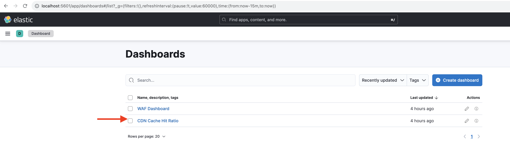

# CDN 캐시 적중률 분석

CDN에서 캐시된 컨텐츠는 요청이 Apache/dispatcher 또는 AEM 게시로 돌아올 때까지 기다릴 필요가 없는 웹 사이트 사용자가 경험하는 지연을 줄입니다. 이를 고려하여 CDN 캐시 적중률을 최적화하여 CDN에서 캐시할 수 있는 컨텐츠의 양을 최대화하는 것이 좋습니다.

최적화를 위해 AEM as a Cloud Service에서 제공한 **CDN 로그**&#x200B;를 분석하고 **캐시 적중률**, **MISS _및_PASS _캐시 유형_의 상위 URL을 얻는 방법에 대해 알아봅니다.**

CDN 로그는 `url`, `cache`을(를) 포함한 다양한 필드가 포함된 JSON 형식으로 사용할 수 있습니다. 자세한 내용은 [CDN 로그 형식](https://experienceleague.adobe.com/docs/experience-manager-cloud-service/content/implementing/developing/logging.html?lang=ko#cdn-log:~:text=Toggle%20Text%20Wrapping-,Log%20Format,-The%20CDN%20logs)을 참조하십시오. `cache` 필드는 캐시의 _상태_&#x200B;에 대한 정보를 제공하며 가능한 값은 HIT, MISS 또는 PASS입니다. 가능한 값에 대한 세부 사항을 검토해 보겠습니다.

| 캐시 상태   가능한 값 | 설명 |
|------------------------------------|:-----------------------------------------------------:|
| 히트 | 요청한 데이터는 CDN 캐시에서 _찾으며 AEM 서버에 대한 fetch_ 요청을 수행할 필요가 없습니다. |
| 미스 | 요청한 데이터가 CDN 캐시에서 _없습니다. AEM 서버에서_&#x200B;을(를) 요청해야 합니다. |
| 통과 | 요청한 데이터는 _캐시되지 않도록 명시적으로 설정_&#x200B;되어 있으며 항상 AEM 서버에서 검색됩니다. |

이 자습서에서는 [AEM WKND 프로젝트](https://github.com/adobe/aem-guides-wknd)가 AEM as a Cloud Service 환경에 배포되고 [Apache JMeter](https://jmeter.apache.org/)를 사용하여 소규모 성능 테스트가 트리거됩니다.

이 튜토리얼은 다음 프로세스를 안내하도록 구성되어 있습니다.

1. Cloud Manager을 통해 CDN 로그 다운로드
1. 이러한 CDN 로그를 분석하려면 로컬로 설치된 대시보드나 원격으로 액세스하는 Splunk 또는 Jupityer Notebook(Adobe Experience Platform의 라이선스를 구입한 사용자용)의 두 가지 접근 방식을 사용하여 수행할 수 있습니다
1. CDN 캐시 구성 최적화

## CDN 로그 다운로드

CDN 로그를 다운로드하려면 다음 단계를 수행합니다.

1. [my.cloudmanager.adobe.com](https://my.cloudmanager.adobe.com/)에서 Cloud Manager에 로그인한 다음 조직과 프로그램을 선택합니다.

1. 원하는 AEMCS 환경의 경우 줄임표 메뉴에서 **로그 다운로드**&#x200B;를 선택하십시오.

   {width="500" zoomable="yes"}

1. **로그 다운로드** 대화 상자의 드롭다운 메뉴에서 **Publish** 서비스를 선택한 다음 **CDN** 행 옆에 있는 다운로드 아이콘을 클릭합니다.

   {width="500" zoomable="yes"}

다운로드한 로그 파일이 _today_&#x200B;에서 온 경우 파일 확장명은 `.log`이고, 이전 로그 파일의 경우 확장명은 `.log.gz`입니다.

## 다운로드한 CDN 로그 분석

캐시 적중률, MISS 및 PASS 캐시 유형의 상위 URL과 같은 통찰력을 얻으려면 다운로드된 CDN 로그 파일을 분석하십시오. 이러한 통찰력을 통해 [CDN 캐시 구성](https://experienceleague.adobe.com/ko/docs/experience-manager-cloud-service/content/implementing/content-delivery/caching)을 최적화하고 사이트 성능을 향상시킬 수 있습니다.

CDN 로그를 분석하기 위해 이 자습서에서는 다음 세 가지 옵션을 제공합니다.

1. **Elasticsearch, Logstash 및 ELK(Kibana)**: [ELK 대시보드 도구](https://github.com/adobe/AEMCS-CDN-Log-Analysis-Tooling/blob/main/ELK/README.md)를 로컬에 설치할 수 있습니다.
1. **Splunk**: [Splunk 대시보드 도구](https://github.com/adobe/AEMCS-CDN-Log-Analysis-Tooling/blob/main/Splunk/README.md)를 사용하려면 Splunk에 액세스해야 하며 CDN 로그를 수집하려면 [AEMCS 로그 전달이 활성화되어야 합니다](https://experienceleague.adobe.com/ko/docs/experience-manager-cloud-service/content/implementing/developing/logging#splunk-logs).
1. **Jupyter Notebook**: Adobe Experience Platform 라이선스가 부여된 고객의 경우 추가 소프트웨어를 설치하지 않고도 [Adobe Experience Platform](https://experienceleague.adobe.com/ko/docs/experience-platform/data-science-workspace/jupyterlab/analyze-your-data)의 일부로 원격으로 액세스할 수 있습니다.

### 옵션 1: ELK 대시보드 도구 사용

[ELK 스택](https://www.elastic.co/elastic-stack)은(는) 데이터를 검색, 분석 및 시각화할 수 있는 확장 가능한 솔루션을 제공하는 도구 집합입니다. Elasticsearch, 로스타시, 키바나 등으로 구성되어 있다.

주요 세부 정보를 식별하려면 [AEMCS-CDN-Log-Analysis-Tooling](https://github.com/adobe/AEMCS-CDN-Log-Analysis-Tooling) 프로젝트를 사용합니다. 이 프로젝트는 ELK 스택의 도커 컨테이너와 CDN 로그를 분석하기 위해 사전 구성된 Kibana 대시보드를 제공합니다.

1. [ELK Docker 컨테이너를 설정하는 방법](https://github.com/adobe/AEMCS-CDN-Log-Analysis-Tooling/blob/main/ELK/README.md#how-to-set-up-the-elk-docker-containerhow-to-setup-the-elk-docker-container)의 단계에 따라 **CDN 캐시 적중률** Kibana 대시보드를 가져오십시오.

1. CDN 캐시 적중률 및 상위 URL을 식별하려면 다음 단계를 수행합니다.

   1. 다운로드한 CDN 로그 파일을 환경별 로그 폴더(예: `ELK/logs/stage`) 내에 복사합니다.

   1. 왼쪽 상단 모서리 **탐색 메뉴 > Analytics > 대시보드 > CDN 캐시 적중률**&#x200B;을 클릭하여 _CDN 캐시 적중률_ 대시보드를 엽니다.

      {width="500" zoomable="yes"}

   1. 오른쪽 상단에서 원하는 시간 범위를 선택합니다.

      {width="500" zoomable="yes"}

   1. **CDN 캐시 적중률** 대시보드는 설명이 따로 필요하지 않습니다.

   1. _총 요청 분석_ 섹션에는 다음 세부 정보가 표시됩니다.
      - 캐시 유형별 캐시 비율
      - 캐시 유형별 캐시 카운트

      {width="500" zoomable="yes"}

   1. _요청 또는 MIME 유형별 분석_&#x200B;에는 다음 세부 정보가 표시됩니다.
      - 캐시 유형별 캐시 비율
      - 캐시 유형별 캐시 카운트
      - 상위 누락 및 URL 전달

      {width="500" zoomable="yes"}

#### 환경 이름 또는 프로그램 ID별 필터링

수집된 로그를 환경 이름별로 필터링하려면 아래 단계를 수행합니다.

1. CDN 캐시 적중률 대시보드에서 **필터 추가** 아이콘을 클릭합니다.

   {width="500" zoomable="yes"}

1. **필터 추가** 모달의 드롭다운 메뉴에서 `aem_env_name.keyword` 필드를 선택하고 `is` 연산자와 다음 필드에 대해 원하는 환경 이름을 선택한 다음 _필터 추가_&#x200B;를 클릭합니다.

   {width="500" zoomable="yes"}

#### 호스트 이름으로 필터링

호스트 이름별로 수집된 로그를 필터링하려면 아래 단계를 따르십시오.

1. CDN 캐시 적중률 대시보드에서 **필터 추가** 아이콘을 클릭합니다.

   {width="500" zoomable="yes"}

1. **필터 추가** 모달의 드롭다운 메뉴에서 `host.keyword` 필드를 선택하고, 다음 필드에 대해 `is` 연산자와 원하는 호스트 이름을 선택한 다음, _필터 추가_&#x200B;를 클릭하십시오.

   {width="500" zoomable="yes"}

마찬가지로 분석 요구 사항에 따라 대시보드에 필터를 더 추가합니다.

### 옵션 2: Splunk 대시보드 도구 사용

[Splunk](https://www.splunk.com/)은(는) 로그를 집계하고 분석하고 모니터링 및 문제 해결을 위한 시각화를 만드는 데 도움이 되는 인기 있는 로그 분석 도구입니다.

주요 세부 정보를 식별하려면 [AEMCS-CDN-Log-Analysis-Tooling](https://github.com/adobe/AEMCS-CDN-Log-Analysis-Tooling) 프로젝트를 사용합니다. 이 프로젝트는 CDN 로그를 분석하는 Splunk 대시보드를 제공합니다.

1. [AEMCS CDN 로그 분석용 Splunk 대시보드](https://github.com/adobe/AEMCS-CDN-Log-Analysis-Tooling/blob/main/Splunk/README.md)의 단계에 따라 **CDN 캐시 적중률** Splunk 대시보드를 가져오십시오.
1. 필요한 경우 Splunk 대시보드에서 _인덱스, Source 유형 및 기타_ 필터 값을 업데이트하십시오.

   {width="500" zoomable="yes"}

>[!NOTE]
>
>splunk 대시보드의 UI 및 그래프는 ELK 대시보드와 다르지만 주요 세부 정보는 유사합니다.

### 옵션 3: Jupyter Notebook 사용

로컬로 소프트웨어를 설치하지 않으려는 사용자(즉, 이전 섹션의 ELK 대시보드 도구)에게는 다른 옵션이 있지만 Adobe Experience Platform에 대한 라이센스가 필요합니다.

[Jupyter Notebook](https://jupyter.org/)은(는) 코드, 텍스트 및 시각화가 포함된 문서를 만들 수 있는 오픈 소스 웹 응용 프로그램입니다. 데이터 변환, 시각화 및 통계 모델링에 사용됩니다. Adobe Experience Platform의 일부로 [원격으로 액세스할 수 있습니다](https://experienceleague.adobe.com/ko/docs/experience-platform/data-science-workspace/jupyterlab/analyze-your-data).

#### 대화형 Python Notebook 파일 다운로드

먼저 CDN 로그 분석에 도움이 되는 [AEM-as-a-CloudService - CDN 로그 분석 - Jupyter Notebook](./assets/cdn-logs-analysis/aemcs_cdn_logs_analysis.ipynb) 파일을 다운로드합니다. 이 &quot;대화형 Python Notebook&quot; 파일은 설명이 가능하지만, 각 섹션의 주요 사항은 다음과 같습니다.

- **추가 라이브러리 설치**: `termcolor` 및 `tabulate` Python 라이브러리를 설치합니다.
- **CDN 로그 로드**: `log_file` 변수 값을 사용하여 CDN 로그 파일을 로드합니다. 해당 값을 업데이트하십시오. 또한 이 CDN 로그를 [Pandas DataFrame](https://pandas.pydata.org/docs/reference/frame.html)&#x200B;(으)로 변환합니다.
- **분석 수행**: 첫 번째 코드 블록은 _총, HTML, JS/CSS 및 이미지 요청에 대한 분석 결과 표시_입니다. 캐시 적중률, 막대 및 원형 차트를 제공합니다.
두 번째 코드 블록은 _HTML, JS/CSS 및 이미지에 대한 상위 5개 MISS 및 PASS 요청 URL_&#x200B;입니다. URL 및 해당 카운트를 테이블 형식으로 표시합니다.

#### Jupyter Notebook 실행

다음 단계를 수행하여 Adobe Experience Platform에서 Jupyter Notebook을 실행합니다.

1. 홈 페이지 > [빠른 액세스](https://experience.adobe.com/) 섹션에서 **Adobe Experience Cloud**&#x200B;에 로그인하고 **Experience Platform**&#x200B;을(를) 클릭합니다.

   {width="500" zoomable="yes"}

1. Adobe Experience Platform 홈 페이지 > 데이터 과학 섹션에서 **전자 필기장** 메뉴 항목을 클릭합니다. Jupyter Notebooks 환경을 시작하려면 **JupyterLab** 탭을 클릭합니다.

   {width="500" zoomable="yes"}

1. JupyterLab 메뉴에서 **파일 업로드** 아이콘을 사용하여 다운로드한 CDN 로그 파일 및 `aemcs_cdn_logs_analysis.ipynb` 파일을 업로드합니다.

   {width="500" zoomable="yes"}

1. `aemcs_cdn_logs_analysis.ipynb` 파일을 두 번 클릭하여 엽니다.

1. 전자 필기장의 **CDN 로그 파일 로드** 섹션에서 `log_file` 값을 업데이트하십시오.

   {width="500" zoomable="yes"}

1. 선택한 셀을 실행하고 진행하려면 **재생** 아이콘을 클릭하세요.

   {width="500" zoomable="yes"}

1. **총, HTML, JS/CSS 및 이미지 요청에 대한 분석 결과 표시** 코드 셀을 실행하면 출력에 캐시 적중률 비율, 막대 및 원형 차트가 표시됩니다.

   {width="500" zoomable="yes"}

1. HTML, JS/CSS 및 Image **코드 셀에 대한**&#x200B;상위 5개 MISS 및 PASS 요청 URL을 실행한 후 출력에 상위 5개 MISS 및 PASS 요청 URL이 표시됩니다.

   {width="500" zoomable="yes"}

요구 사항에 따라 CDN 로그를 분석하도록 Jupyter Notebook을 향상시킬 수 있습니다.

## CDN 캐시 구성 최적화

CDN 로그를 분석한 후에는 CDN 캐시 구성을 최적화하여 사이트 성능을 향상시킬 수 있습니다. AEM 우수 사례는 캐시 적중률이 90% 이상인 것입니다.

자세한 내용은 [CDN 캐시 구성 최적화](https://experienceleague.adobe.com/ko/docs/experience-manager-cloud-service/content/implementing/content-delivery/caching)를 참조하십시오.

AEM WKND 프로젝트에 참조 CDN 구성이 있습니다. 자세한 내용은 [&#x200B; 파일의 &#x200B;](https://github.com/adobe/aem-guides-wknd/blob/main/dispatcher/src/conf.d/available_vhosts/wknd.vhost#L137-L190)CDN 구성`wknd.vhost`을(를) 참조하십시오.
