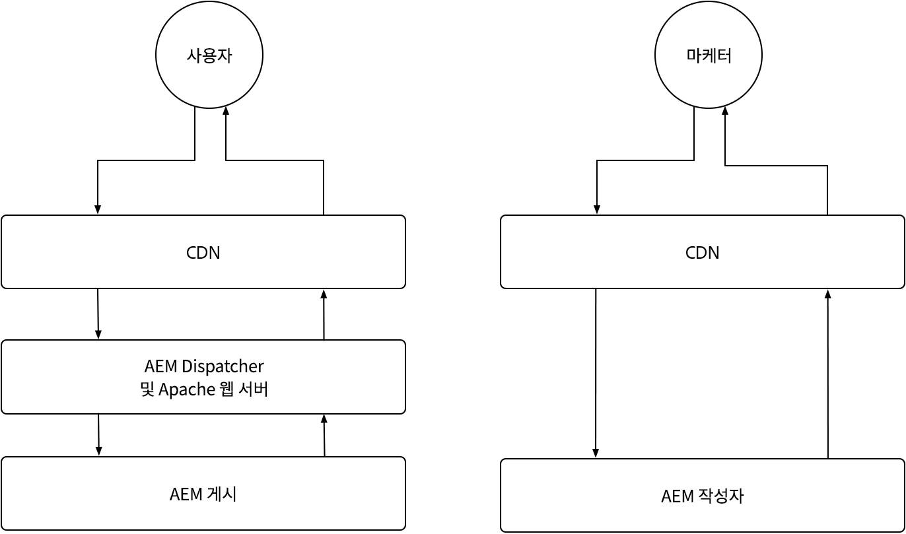
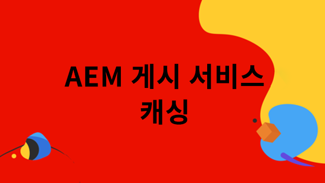
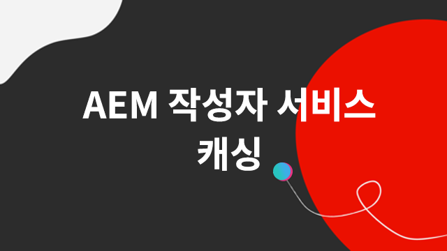

# AEM as a Cloud Service 캐싱

In AEM as a Cloud Service에서는 캐싱을 이해하는 것이 매우 중요합니다. 캐싱은 이전에 가져온 데이터를 저장하고 재사용하여 시스템 효율성을 높이고 로드 시간을 줄이는 것을 말합니다. 이 메커니즘은 콘텐츠 게재를 크게 가속화하고, 웹 사이트 성능을 높이고, 사용자 경험을 최적화합니다.

AEM as a Cloud Service는 여러 캐싱 계층과 작성자 서비스와 게시 서비스 간에 차별화된 캐싱 전략을 가지고 있습니다.

{align="center"}

## AEM 캐싱

AEM as a Cloud Service는 CDN, AEM Dispatcher 및 선택적으로 고객 관리 CDN을 포함한 강력하고 구성 가능한 다중 계층 캐싱 전략을 갖추고 있습니다. 여러 계층의 캐싱을 미세하게 조정하여 성능을 최적화하고 AEM이 최상의 환경만 제공하도록 할 수 있습니다. AEM 작성자 서비스와 게시 서비스는 각각 서로 다른 캐싱 고려 사항을 가지고 있습니다. 아래에서 각 서비스에 대한 캐싱 전략을 살펴보십시오.

    

    

        

          <figure class="image is-16by9">
            
          </figure>
        

        

          

            
<a href="./publish.md" title="AEM 게시 서비스 캐싱">AEM 게시 서비스 캐싱</a>

            
AEM 게시 서비스는 관리형 CDN과 AEM Dispatcher를 사용하여 최종 사용자 웹 경험을 최적화합니다.

            <a href="./publish.md" class="spectrum-Button spectrum-Button--outline spectrum-Button--primary spectrum-Button--sizeM">
              알아보기
            </a>
          

        

      

    

    

        

            

            <figure class="image is-16by9">
                
            </figure>
            

            

            

                
<a href="./author.md" title="AEM 작성자 서비스 캐싱">AEM 작성자 서비스 캐싱</a>

                
AEM 작성자 서비스는 관리형 CDN을 사용하여 최적화된 작성 경험을 제공합니다.

                <a href="./author.md" class="spectrum-Button spectrum-Button--outline spectrum-Button--primary spectrum-Button--sizeM">
                알아보기
                </a>
            

            

        

    

