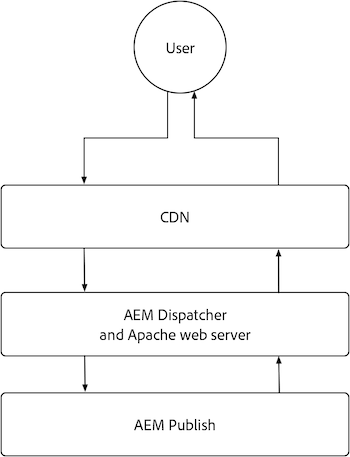

# AEM 게시

AEM AEM Publish 서비스에는 두 개의 기본 캐싱 계층인 as a Cloud Service CDN 및 AEM Dispatcher가 있습니다. 필요한 경우 고객 관리 CDN을 AEM as a Cloud Service CDN 앞에 배치할 수 있습니다. AEM as a Cloud Service CDN은 콘텐츠의 에지 전달을 제공하여 전 세계 사용자에게 지연 시간이 짧은 경험을 전달합니다. AEM Dispatcher는 AEM Publish 바로 앞에 캐싱을 제공하며 AEM Publish 자체에 대한 불필요한 로드를 완화하는 데 사용됩니다.

{align="center"}

## CDN

AEM as a Cloud Service의 CDN 캐싱은 HTTP 응답 캐시 헤더에 의해 제어되며, 콘텐츠를 캐시하여 신선도와 성능 간의 균형을 최적화하기 위한 것입니다. CDN은 최종 사용자와 AEM Dispatcher 사이에 위치하며 가능한 한 최종 사용자에게 가까운 콘텐츠를 캐시하는 데 사용되므로 성능이 향상됩니다.

{align="center"}

CDN이 콘텐츠를 캐시하는 방법을 구성하는 것은 HTTP 응답에 대한 캐시 헤더를 설정하는 것으로 제한됩니다. 이러한 캐시 헤더는 일반적으로 다음을 사용하여 AEM Dispatcher vhost 구성에서 설정됩니다. `mod_headers`: 그러나 AEM Publish 자체에서 실행되는 사용자 지정 Java™ 코드에서도 설정할 수 있습니다.

### HTTP 요청/응답은 언제 캐시됩니까?

AEM as a Cloud Service CDN은 HTTP 응답만 캐시하며, 다음 기준을 모두 충족해야 합니다.

+ HTTP 요청 상태: `2xx` 또는 `3xx`
+ HTTP 요청 메서드는 `GET` 또는 `HEAD`
+ 다음 HTTP 응답 헤더 중 하나 이상이 있습니다. `Cache-Control`, `Surrogate-Control`, 또는  `Expires`
+ HTTP 응답은 HTML, JSON, CSS, JS 및 이진 파일을 포함한 모든 콘텐츠 유형일 수 있습니다.

기본적으로 HTTP 응답은에 의해 캐시되지 않습니다. [AEM 디스패처](#aem-dispatcher) cdn에서 캐싱을 방지하기 위해 자동으로 모든 HTTP 응답 캐시 헤더가 제거됩니다. 이 동작은 다음을 사용하여 신중하게 재정의할 수 있습니다. `mod_headers` (으)로 `Header always set ...` 필요한 경우 지시문입니다.

### 캐시된 항목

AEM as a Cloud Service CDN은 다음을 캐싱합니다.

+ HTTP 응답 본문
+ HTTP 응답 헤더

일반적으로 단일 URL에 대한 HTTP 요청/응답은 단일 개체로 캐시됩니다. 그러나 CDN은 다음과 같은 경우 단일 URL에 대해 여러 개체를 캐싱하는 것을 처리할 수 있습니다. `Vary` 헤더가 HTTP 응답에 설정됩니다. 지정하지 마십시오. `Vary` 값이 엄격하게 제어된 값 세트를 가지지 않는 헤더에서는 많은 캐시 누락을 초래하여 캐시 적중률을 줄일 수 있습니다. AEM Dispatcher에서 다양한 요청의 캐싱을 지원하려면 [변형 캐싱 설명서 검토](https://experienceleague.adobe.com/docs/experience-manager-learn/cloud-service/developing/advanced/variant-caching.html).

### 캐시 수명{#cdn-cache-life}

AEM Publish CDN은 TTL(time-to-live) 기반입니다. 즉, 캐시 수명은 `Cache-Control`, `Surrogate-Control`, 또는 `Expires` HTTP 응답 헤더. 프로젝트에서 HTTP 응답 캐싱 헤더를 설정하지 않은 경우 [자격 기준](#when-are-http-requestsresponses-cached) 충족되면 Adobe은 기본 캐시 수명을 10분(600초)으로 설정합니다.

캐시 헤더가 CDN 캐시 수명에 미치는 영향은 다음과 같습니다.

+ [`Cache-Control`](https://developer.fastly.com/reference/http/http-headers/Cache-Control/) HTTP 응답 헤더는 웹 브라우저 및 CDN에 응답을 캐시하는 시간을 지시합니다. 값은 초 단위입니다. 예를 들어, `Cache-Control: max-age=3600` 웹 브라우저에서 1시간 동안 응답을 캐시하도록 지시합니다. 이 값은 CDN에서 무시되는 `Surrogate-Control` HTTP 응답 헤더도 있습니다.
+ [`Surrogate-Control`](https://developer.fastly.com/reference/http/http-headers/Surrogate-Control/) HTTP 응답 헤더는 AEM CDN에 응답을 캐시하는 시간을 지시합니다. 값은 초 단위입니다. 예를 들어, `Surrogate-Control: max-age=3600` cdn에 1시간 동안 응답을 캐시하도록 지시합니다.
+ [`Expires`](https://developer.fastly.com/reference/http/http-headers/Expires/) HTTP 응답 헤더는 캐시된 응답이 유효한 기간을 AEM CDN(및 웹 브라우저)에 지시합니다. 값은 날짜입니다. 예를 들어, `Expires: Sat, 16 Sept 2023 09:00:00 EST` 지정된 날짜 및 시간까지 응답을 캐시하도록 웹 브라우저에 지시합니다.

사용 `Cache-Control` 브라우저와 CDN 모두에 대해 동일한 캐시 수명을 제어합니다. 사용 `Surrogate-Control` 웹 브라우저가 CDN이 아닌 다른 기간 동안 응답을 캐시해야 하는 경우입니다.

#### 기본 캐시 수명

HTTP 응답이 AEM Dispatcher 캐싱에 적합한 경우 [위 한정자에 따라](#when-are-http-requestsresponses-cached)사용자 지정 구성이 없는 경우 기본값은 다음과 같습니다.

| 컨텐츠 유형 | 기본 CDN 캐시 수명 |
|:------------ |:---------- |
| [HTML/JSON/XML](https://experienceleague.adobe.com/docs/experience-manager-cloud-service/content/implementing/content-delivery/caching.html#html-text) | 5분 |
| [에셋(이미지, 비디오, 문서 등)](https://experienceleague.adobe.com/docs/experience-manager-cloud-service/content/implementing/content-delivery/caching.html#images) | 10분 |
| [지속 쿼리(JSON)](https://experienceleague.adobe.com/docs/experience-manager-cloud-service/content/headless/graphql-api/persisted-queries.html?publish-instances) | 2시간 |
| [클라이언트 라이브러리(JS/CSS)](https://experienceleague.adobe.com/docs/experience-manager-cloud-service/content/implementing/content-delivery/caching.html#client-side-libraries) | 30일 |
| [기타](https://experienceleague.adobe.com/docs/experience-manager-cloud-service/content/implementing/content-delivery/caching.html#other-content) | 캐시되지 않음 |

### 캐시 규칙을 사용자 지정하는 방법

[CDN이 콘텐츠를 캐시하는 방법 구성](https://experienceleague.adobe.com/docs/experience-manager-cloud-service/content/implementing/content-delivery/caching.html#disp) 은 HTTP 응답에서 캐시 헤더를 설정하도록 제한됩니다. 이러한 캐시 헤더는 일반적으로 AEM Dispatcher에서 설정됩니다 `vhost` 을 사용한 구성 `mod_headers`: 그러나 AEM Publish 자체에서 실행되는 사용자 지정 Java™ 코드에서도 설정할 수 있습니다.

## AEM Dispatcher

{align="center"}

### HTTP 요청/응답은 언제 캐시됩니까?

다음 기준을 모두 충족하면 해당 HTTP 요청에 대한 HTTP 응답이 캐시됩니다.

+ HTTP 요청 메서드는 `GET` 또는 `HEAD`
   + `HEAD` HTTP 요청은 HTTP 응답 헤더만 캐시합니다. 응답 본문이 없습니다.
+ HTTP 응답 상태: `200`
+ 이진 파일에 대한 HTTP 응답이 없습니다.
+ HTTP 요청 URL 경로가 확장으로 끝납니다. 예: `.html`, `.json`, `.css`, `.js`등
+ HTTP 요청은 인증을 포함하지 않으며 AEM에 의해 인증되지 않습니다.
   + 하지만 인증된 요청의 캐싱 [전역적으로 활성화할 수 있음](https://experienceleague.adobe.com/docs/experience-manager-dispatcher/using/configuring/dispatcher-configuration.html#caching-when-authentication-is-used) 또는 다음을 통해 선택적으로 [권한 구분 캐싱](https://experienceleague.adobe.com/docs/experience-manager-dispatcher/using/configuring/permissions-cache.html?lang=ko-KR).
+ HTTP 요청에 쿼리 매개 변수가 포함되어 있지 않습니다.
   + 단, 구성 [무시된 쿼리 매개 변수](https://experienceleague.adobe.com/docs/experience-manager-dispatcher/using/configuring/dispatcher-configuration.html?lang=en#ignoring-url-parameters) 무시된 쿼리 매개 변수를 사용하는 HTTP 요청을 캐시에서 캐시하거나 제공할 수 있습니다.
+ HTTP 요청 경로 [은 허용 Dispatcher 규칙과 일치하고 거부 규칙과 일치하지 않습니다](https://experienceleague.adobe.com/docs/experience-manager-dispatcher/using/configuring/dispatcher-configuration.html#specifying-the-documents-to-cache).
+ HTTP 응답에는 AEM Publish에서 설정한 다음 HTTP 응답 헤더가 없습니다.

   + `no-cache`
   + `no-store`
   + `must-revalidate`

### 캐시된 항목

AEM Dispatcher는 다음을 캐시합니다.

+ HTTP 응답 본문
+ Dispatcher에 지정된 HTTP 응답 헤더 [캐시 헤더 구성](https://experienceleague.adobe.com/docs/experience-manager-dispatcher/using/configuring/dispatcher-configuration.html#caching-http-response-headers). 와 함께 제공되는 기본 구성 보기 [AEM Project Archetype](https://github.com/adobe/aem-project-archetype/blob/develop/src/main/archetype/dispatcher.cloud/src/conf.dispatcher.d/available_farms/default.farm#L106-L113).
   + `Cache-Control`
   + `Content-Disposition`
   + `Content-Type`
   + `Expires`
   + `Last-Modified`
   + `X-Content-Type-Options`

### 캐시 수명

AEM Dispatcher는 다음 접근 방식을 사용하여 HTTP 응답을 캐시합니다.

+ 콘텐츠 게시 또는 게시 취소와 같은 메커니즘을 통해 무효화가 트리거될 때까지.
+ 명시적으로 TTL(time-to-live) [dispatcher 구성에서 구성됨](https://experienceleague.adobe.com/docs/experience-manager-dispatcher/using/configuring/dispatcher-configuration.html#configuring-time-based-cache-invalidation-enablettl). 에서 기본 구성 보기 [AEM Project Archetype](https://github.com/adobe/aem-project-archetype/blob/develop/src/main/archetype/dispatcher.cloud/src/conf.dispatcher.d/available_farms/default.farm#L122-L127) 을(를) 검토하여 `enableTTL` 구성.

#### 기본 캐시 수명

HTTP 응답이 AEM Dispatcher 캐싱에 적합한 경우 [위 한정자에 따라](#when-are-http-requestsresponses-cached-1)사용자 지정 구성이 없는 경우 기본값은 다음과 같습니다.

| 컨텐츠 유형 | 기본 CDN 캐시 수명 |
|:------------ |:---------- |
| [HTML/JSON/XML](https://experienceleague.adobe.com/docs/experience-manager-cloud-service/content/implementing/content-delivery/caching.html#html-text) | 무효화될 때까지 |
| [에셋(이미지, 비디오, 문서 등)](https://experienceleague.adobe.com/docs/experience-manager-cloud-service/content/implementing/content-delivery/caching.html#images) | 사용 안함 |
| [지속 쿼리(JSON)](https://experienceleague.adobe.com/docs/experience-manager-cloud-service/content/headless/graphql-api/persisted-queries.html?publish-instances) | 1분 |
| [클라이언트 라이브러리(JS/CSS)](https://experienceleague.adobe.com/docs/experience-manager-cloud-service/content/implementing/content-delivery/caching.html#client-side-libraries) | 30일 |
| [기타](https://experienceleague.adobe.com/docs/experience-manager-cloud-service/content/implementing/content-delivery/caching.html#other-content) | 무효화될 때까지 |

### 캐시 규칙을 사용자 지정하는 방법

AEM Dispatcher의 캐시는 [Dispatcher 구성](https://experienceleague.adobe.com/docs/experience-manager-dispatcher/using/configuring/dispatcher-configuration.html?lang=en#configuring-the-dispatcher-cache-cache) 포함:

+ 캐시된 항목
+ 게시/게시 취소 시 무효화되는 캐시의 일부
+ 캐시를 평가할 때 무시되는 HTTP 요청 쿼리 매개 변수
+ 캐시된 HTTP 응답 헤더
+ TTL 캐싱 활성화 또는 비활성화
+ ... and much more

사용 `mod_headers` 캐시 헤더를 설정하려면 `vhost` 구성은 AEM Dispatcher가 응답을 처리한 후 HTTP 응답에 추가되므로 Dispatcher 캐싱(TTL 기반)에 영향을 주지 않습니다. HTTP 응답 헤더를 통해 Dispatcher 캐싱에 영향을 주려면 적절한 HTTP 응답 헤더를 설정하는 AEM Publish에서 실행되는 사용자 지정 Java™ 코드가 필요합니다.
