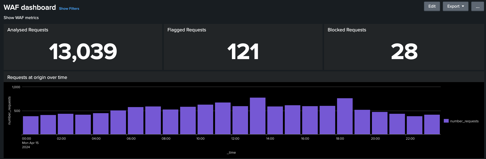

# CDN 로그 분석 도구

Adobe에서 제공하는 _AEM Cloud Service CDN 로그 분석 도구_와 이 도구를 통해 CDN 성능과 AEM 구현에 대한 통찰력을 얻는 방법에 대해 알아봅니다.
 
>[!VIDEO](https://video.tv.adobe.com/v/3429177?quality=12&learn=on)

## 개요

[AEM as a Cloud Service CDN 로그 분석 도구](https://github.com/adobe/AEMCS-CDN-Log-Analysis-Tooling)는 CDN 로그의 실시간 모니터링 및 분석을 위해 [Splunk](https://www.splunk.com/en_us/products/observability-cloud.html) 또는 [ELK 스택](https://www.elastic.co/elastic-stack)과 통합할 수 있는 미리 빌드된 대시보드를 제공합니다.

이 도구를 사용하면 실시간 모니터링 및 사전 예방적 문제 감지를 수행할 수 있습니다. 따라서 DoS(Denial of Service) 및 DDoS(Distributed Denial of Service) 공격에 대해 최적화된 컨텐츠 전달 및 적절한 보안 조치를 보장할 수 있습니다.

## 주요 기능

- 능률화된 로그 분석
- 실시간 모니터링
- 원활한 통합
- 다음에 대한 대시보드
   - 잠재적인 보안 위협 요소 파악
   - 더 빠른 최종 사용자 경험

## 대시보드 개요

로그 분석을 신속하게 시작하기 위해 Adobe은 Splunk 및 ELK 스택 모두에 대해 사전 설치된 대시보드를 제공합니다.

- **CDN 캐시 적중률**: 적중, 통과 및 실패 상태별로 총 캐시 적중률과 총 요청 수에 대한 인사이트를 제공합니다. 또한 최상위 HIT, PASS 및 MISS URL도 제공합니다.

  

- **CDN 트래픽 대시보드**: CDN 및 Origin 요청 속도, 4xx 및 5xx 오류율 및 캐시되지 않은 요청을 통해 트래픽에 대한 인사이트를 제공합니다. 또한 클라이언트 IP 주소당 초당 최대 CND 및 Origin 요청 수와 CDN 구성을 최적화하는 더 많은 통찰력을 제공합니다.

  

- **WAF 대시보드**: 분석, 플래그 지정 및 차단된 요청을 통해 통찰력을 제공합니다. 또한 WAF 플래그 ID별 상위 공격, 클라이언트 IP, 국가 및 사용자 에이전트별 상위 100개 공격자 및 WAF 구성을 최적화하는 더 많은 통찰력을 제공합니다.

  

## Splunk 통합

[Splunk](https://www.splunk.com/en_us/products/observability-cloud.html)을 활용하고 Splunk 인스턴스로 AEMCS 로그 전달을 활성화한 조직의 경우 사전 빌드된 대시보드를 빠르게 가져올 수 있습니다. 이 설정을 통해 가속화된 로그 분석을 용이하게 하여 AEM 구현을 최적화하고 DOS 공격과 같은 보안 위협을 완화하는 실행 가능한 통찰력을 제공합니다.

AEMCS CDN 로그 분석용 [Splunk 대시보드](https://github.com/adobe/AEMCS-CDN-Log-Analysis-Tooling/blob/main/Splunk/README.md#splunk-dashboards-for-aemcs-cdn-log-analysis) 가이드를 사용하여 시작할 수 있습니다.

## ELK 통합

Elasticsearch, Logstash 및 Kibana로 구성된 [ELK 스택](https://www.elastic.co/elastic-stack)은 로그 분석을 위한 또 다른 강력한 옵션입니다. 이 차원은 Splunk 설정 또는 로그 전달 기능에 대한 액세스 권한이 없는 조직에 유용합니다. ELK 스택을 로컬로 설정하는 것은 간단하며, 툴은 Docker Compose 파일을 제공하여 빠르게 시작할 수 있도록 합니다. 그런 다음 미리 빌드된 대시보드를 가져오고 Adobe Cloud Manager을 사용하여 다운로드된 CDN 로그를 수집할 수 있습니다.

AEMCS CDN 로그 분석용 [ELK Docker 컨테이너](https://github.com/adobe/AEMCS-CDN-Log-Analysis-Tooling/blob/main/ELK/README.md#elk-docker-container-for-aemcs-cdn-log-analysis) 가이드를 사용하여 시작할 수 있습니다.
