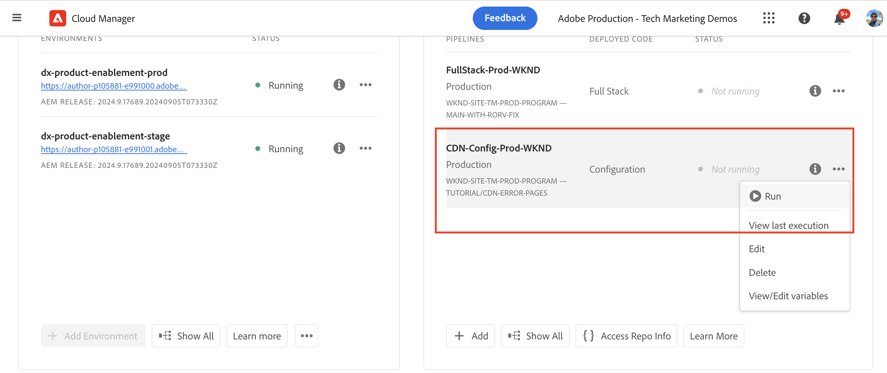

# 사용자 지정 오류 페이지

AEM as a Cloud Service 호스팅 웹 사이트에 대한 사용자 지정 오류 페이지를 구현하는 방법을 알아봅니다.

이 자습서에서는 다음 사항을 학습합니다.

- 기본 오류 페이지
- 오류 페이지가 제공되는 위치
   - AEM 서비스 유형 - 작성자, 게시, 미리보기
   - Adobe 관리 CDN
- 오류 페이지를 사용자 지정하는 옵션
   - ErrorDocument Apache 지시문
   - ACS AEM Commons - 오류 페이지 핸들러
   - CDN 오류 페이지

## 기본 오류 페이지

오류 페이지가 표시되는 시기, 기본 오류 페이지 및 해당 페이지가 제공되는 위치를 검토해 보겠습니다.

다음과 같은 경우 오류 페이지가 표시됩니다.

- 페이지가 없음(404)
- 페이지에 액세스할 권한이 없음(403)
- 코드 문제로 인해 서버 오류(500)가 발생하거나 서버에 연결할 수 없습니다.

AEM as a Cloud Service은 위의 시나리오에 대해 _기본 오류 페이지_&#x200B;를 제공합니다. 일반 페이지이며 브랜드와 일치하지 않습니다.

_AEM 서비스 유형_(작성자, 게시, 미리보기) 또는 _Adobe 관리 CDN_&#x200B;에서 기본 오류 페이지 _이(가) 제공됩니다_. 자세한 내용은 아래 표를 참조하십시오.

| 다음에서 제공된 오류 페이지 | 세부 사항 |
|---------------------|:-----------------------:|
| AEM 서비스 유형 - 작성자, 게시, 미리보기 | 페이지 요청이 AEM 서비스 유형에서 제공되고 위의 오류 시나리오가 발생하면 오류 페이지가 AEM 서비스 유형에서 제공됩니다. 기본적으로 `x-aem-error-pass: true` 헤더가 설정되지 않은 경우 Adobe 관리 CDN 오류 페이지로 5XX 오류 페이지가 재정의됩니다. |
| Adobe 관리 CDN | Adobe 관리 CDN _이(가) AEM 서비스 유형_(원본 서버)에 연결할 수 없으면 Adobe 관리 CDN에서 오류 페이지가 제공됩니다. **있을 수 없는 이벤트이지만 계획할 가치가 있습니다.** |

>[!NOTE]
>
>AEM as Cloud Service에서 CDN은 백엔드에서 5XX 오류를 받으면 일반 오류 페이지를 제공합니다. 백엔드의 실제 응답을 통과하려면 응답에 헤더 `x-aem-error-pass: true`을(를) 추가해야 합니다.
>AEM 또는 Apache/Dispatcher 계층에서 온 응답에만 작동합니다. 중간 인프라 계층에서 발생하는 기타 예기치 않은 오류는 여전히 일반 오류 페이지를 표시합니다.


예를 들어 AEM 서비스 유형 및 Adobe 관리 CDN에서 제공되는 기본 오류 페이지는 다음과 같습니다.


하지만 내 브랜드와 일치하고 더 나은 사용자 환경을 제공하기 위해 _AEM 서비스 유형과 Adobe 관리 CDN 오류 페이지를 모두 사용자 지정_&#x200B;할 수 있습니다.

## 오류 페이지를 사용자 지정하는 옵션

다음 옵션은 오류 페이지를 사용자 지정하는 데 사용할 수 있습니다.

| 적용 대상 | 옵션 이름 | 설명 |
|---------------------|:-----------------------:|:-----------------------:|
| AEM 서비스 유형 - 게시 및 미리보기 | ErrorDocument 지시문 | Apache 구성 파일에서 [ErrorDocument](https://httpd.apache.org/docs/2.4/custom-error.html) 지시문을 사용하여 사용자 지정 오류 페이지의 경로를 지정하십시오. AEM 서비스 유형(게시 및 미리보기)에만 적용할 수 있습니다. |
| AEM 서비스 유형 - 작성자, 게시, 미리보기 | ACS AEM Commons 오류 페이지 핸들러 | [ACS AEM Commons 오류 페이지 처리기](https://adobe-consulting-services.github.io/acs-aem-commons/features/error-handler/index.html)를 사용하여 모든 AEM 서비스 유형에서 오류를 사용자 지정합니다. |
| Adobe 관리 CDN | CDN 오류 페이지 | Adobe 관리 CDN이 AEM 서비스 유형(원본 서버)에 도달할 수 없는 경우 CDN 오류 페이지를 사용하여 오류 페이지를 사용자 지정합니다. |


## 사전 요구 사항

이 자습서에서는 _ErrorDocument_ 지시문, _ACS AEM Commons 오류 페이지 핸들러_ 및 _CDN 오류 페이지_ 옵션을 사용하여 오류 페이지를 사용자 지정하는 방법을 알아봅니다. 이 자습서를 수행하려면 다음이 필요합니다.

- [로컬 AEM 개발 환경](https://experienceleague.adobe.com/en/docs/experience-manager-learn/cloud-service/local-development-environment-set-up/overview) 또는 AEM as a Cloud Service 환경. _CDN 오류 페이지_ 옵션은 AEM as a Cloud Service 환경에 적용할 수 있습니다.

- 오류 페이지를 사용자 지정하는 [AEM WKND 프로젝트](https://github.com/adobe/aem-guides-wknd).

## 설정

- 아래 단계에 따라 AEM WKND 프로젝트를 로컬 AEM 개발 환경에 복제 및 배포합니다.

  ```
  # For local AEM development environment
  $ git clone git@github.com:adobe/aem-guides-wknd.git
  $ cd aem-guides-wknd
  $ mvn clean install -PautoInstallSinglePackage -PautoInstallSinglePackagePublish
  ```

- AEM as a Cloud Service 환경의 경우 [전체 스택 파이프라인](https://experienceleague.adobe.com/en/docs/experience-manager-cloud-service/content/implementing/using-cloud-manager/cicd-pipelines/introduction-ci-cd-pipelines#full-stack-pipeline)을 실행하여 AEM WKND 프로젝트를 배포하려면 [비프로덕션 파이프라인](https://experienceleague.adobe.com/en/docs/experience-manager-learn/cloud-service/cloud-manager/cicd-non-production-pipeline) 예를 참조하십시오.

- WKND 사이트 페이지가 올바르게 렌더링되는지 확인합니다.

## ErrorDocument Apache 지시문을 사용하여 AEM에서 제공하는 오류 페이지{#errordocument}

AEM에서 제공하는 오류 페이지를 사용자 지정하려면 `ErrorDocument` Apache 지시문을 사용하십시오.

AEM as a Cloud Service에서 `ErrorDocument` Apache 지시문 옵션은 게시 및 미리보기 서비스 유형에만 적용할 수 있습니다. Apache + Dispatcher은 배포 아키텍처의 일부가 아니므로 작성자 서비스 유형에 적용할 수 없습니다.

[AEM WKND](https://github.com/adobe/aem-guides-wknd) 프로젝트에서 `ErrorDocument` Apache 지시문을 사용하여 사용자 지정 오류 페이지를 표시하는 방법을 살펴보겠습니다.

- `ui.content.sample` 모듈에 브랜드 [오류 페이지](https://github.com/adobe/aem-guides-wknd/tree/main/ui.content.sample/src/main/content/jcr_root/content/wknd/language-masters/en/errors) @ `/content/wknd/language-masters/en/errors`이(가) 있습니다. [로컬 AEM](http://localhost:4502/sites.html/content/wknd/language-masters/en/errors) 또는 AEM as a Cloud Service `https://author-p<ID>-e<ID>.adobeaemcloud.com/ui#/aem/sites.html/content/wknd/language-masters/en/errors` 환경에서 검토하십시오.

- `dispatcher` 모듈의 `wknd.vhost` 파일에 다음이 포함되어 있습니다.
   - 위의 [오류 페이지](https://github.com/adobe/aem-guides-wknd/blob/main/dispatcher/src/conf.d/variables/custom.vars#L7-L8)를 가리키는 [ErrorDocument 지시문](https://github.com/adobe/aem-guides-wknd/blob/main/dispatcher/src/conf.d/available_vhosts/wknd.vhost#L139-L143).
   - [DispatcherPassError](https://github.com/adobe/aem-guides-wknd/blob/main/dispatcher/src/conf.d/available_vhosts/wknd.vhost#L133) 값이 1로 설정되어 Dispatcher에서 모든 오류를 처리할 수 있습니다.

  ```
  # In `wknd.vhost` file:
  
  ...
  
  ## ErrorDocument directive
  ErrorDocument 404 ${404_PAGE}
  ErrorDocument 500 ${500_PAGE}
  ErrorDocument 502 ${500_PAGE}
  ErrorDocument 503 ${500_PAGE}
  ErrorDocument 504 ${500_PAGE}
  
  ## Add Header for 5XX error page response
  <IfModule mod_headers.c>
    ### By default, CDN overrides 5XX error pages. To allow the actual response of the backend to pass through, add the header x-aem-error-pass: true
    Header set x-aem-error-pass "true" "expr=%{REQUEST_STATUS} >= 500 && %{REQUEST_STATUS} < 600"
  </IfModule>
  
  ...
  ## DispatcherPassError directive
  <IfModule disp_apache2.c>
      ...
      DispatcherPassError        1
  </IfModule>
  
  # In `custom.vars` file
  ...
  ## Define the error page paths
  Define 404_PAGE /content/wknd/us/en/errors/404.html
  Define 500_PAGE /content/wknd/us/en/errors/500.html
  ...
  ```

- [https://publish-p105881-e991000.adobeaemcloud.com/us/en/foo/bar.html](https://publish-p105881-e991000.adobeaemcloud.com/us/en/foo/bar.html)과 같이 환경에 잘못된 페이지 이름이나 경로를 입력하여 WKND 사이트의 사용자 지정 오류 페이지를 검토하십시오.

## AEM 제공 오류 페이지를 사용자 지정하는 ACS AEM Commons-Error 페이지 핸들러{#acs-aem-commons}

_모든 AEM 서비스 유형_&#x200B;에서 AEM에 제공된 오류 페이지를 사용자 지정하려면 [ACS AEM Commons 오류 페이지 처리기](https://adobe-consulting-services.github.io/acs-aem-commons/features/error-handler/index.html) 옵션을 사용할 수 있습니다.

. 자세한 단계별 지침은 [사용 방법](https://adobe-consulting-services.github.io/acs-aem-commons/features/error-handler/index.html#how-to-use) 섹션을 참조하십시오.

## CDN 제공 오류 페이지를 사용자 정의하는 CDN 오류 페이지{#cdn-error-pages}

Adobe 관리 CDN에서 제공하는 오류 페이지를 사용자 정의하려면 CDN 오류 페이지 옵션을 사용합니다.

Adobe 관리 CDN이 AEM 서비스 유형(원본 서버)에 도달할 수 없는 경우 CDN 오류 페이지를 구현하여 오류 페이지를 사용자 지정하겠습니다.

>[!IMPORTANT]
>
> _Adobe 관리 CDN이 AEM 서비스 유형에 도달할 수 없습니다._(원본 서버)은 **있을 수 없는 이벤트**&#x200B;이지만 계획할 가치가 있습니다.

CDN 오류 페이지를 구현하는 높은 수준의 단계는 다음과 같습니다.

- 사용자 지정 오류 페이지 콘텐츠를 단일 페이지 애플리케이션(SPA)으로 개발합니다.
- CDN 오류 페이지에 필요한 정적 파일을 공개적으로 액세스할 수 있는 위치에 호스팅합니다.
- CDN 규칙(errorPages)을 구성하고 위의 정적 파일을 참조합니다.
- Cloud Manager 파이프라인을 사용하여 구성된 CDN 규칙을 AEM as a Cloud Service 환경에 배포합니다.
- CDN 오류 페이지를 테스트합니다.


### CDN 오류 페이지 개요

CDN 오류 페이지는 Adobe 관리 CDN에 의해 SPA(단일 페이지 애플리케이션)로 구현됩니다. Adobe 관리 CDN에 의해 전달된 SPA HTML 문서에는 최소 HTML 코드 조각이 포함되어 있습니다. 사용자 지정 오류 페이지 콘텐츠는 JavaScript 파일을 사용하여 동적으로 생성됩니다. JavaScript 파일은 고객이 공개적으로 액세스할 수 있는 위치에서 개발 및 호스팅해야 합니다.

Adobe 관리 CDN에 의해 전달된 HTML 코드 조각의 구조는 다음과 같습니다.

```html
<!DOCTYPE html>
<html lang="en">
  <head>
    
    ...

    <title>{title}</title>
    <link rel="icon" href="{icoUrl}">
    <link rel="stylesheet" href="{cssUrl}">
  </head>
  <body>
    <script src="{jsUrl}"></script>
  </body>
</html>
```

HTML 스니펫에는 다음 자리 표시자가 포함되어 있습니다.

1. **jsUrl**: HTML 요소를 동적으로 만들어 오류 페이지 콘텐츠를 렌더링하기 위한 JavaScript 파일의 절대 URL입니다.
1. **cssUrl**: 오류 페이지 컨텐츠의 스타일을 지정하는 CSS 파일의 절대 URL입니다.
1. **icoUrl**: favicon의 절대 URL입니다.


### 사용자 지정 오류 페이지 개발

WKND별 브랜드 오류 페이지 콘텐츠를 단일 페이지 애플리케이션(SPA)으로 개발해 보겠습니다.

데모 목적으로 [React](https://react.dev/)를 사용해 보겠습니다. 하지만 모든 JavaScript 프레임워크 또는 라이브러리를 사용할 수 있습니다.

- 다음 명령을 실행하여 새 React 프로젝트를 만듭니다.

  ```
  $ npx create-react-app aem-cdn-error-page
  ```

- 즐겨 찾는 코드 편집기에서 프로젝트를 열고 아래 파일을 업데이트합니다.

   - `src/App.js`: 오류 페이지 콘텐츠를 렌더링하는 기본 구성 요소입니다.

     ```javascript
     import logo from "./wknd-logo.png";
     import "./App.css";
     
     function App() {
       return (
         <>
           <div className="App">
             <div className="container">
             
             </div>
           </div>
           <div className="container">
             <div className="error-code">CDN Error Page</div>
             <h1 className="error-message">Ruh-Roh! Page Not Found</h1>
             <p className="error-description">
               We're sorry, we are unable to fetch this page!
             </p>
           </div>
         </>
       );
     }
     
     export default App;
     ```

   - `src/App.css`: 오류 페이지 콘텐츠의 스타일을 지정합니다.

     ```css
     .App {
       text-align: left;
     }
     
     .App-logo {
       height: 14vmin;
       pointer-events: none;
     }
     
     
     body {
       margin-top: 0;
       padding: 0;
       font-family: Arial, sans-serif;
       background-color: #fff;
       color: #333;
       display: flex;
       justify-content: center;
       align-items: center;
     }
     
     .container {
       text-align: letf;
       padding-top: 10px;
     }
     
     .error-code {
       font-size: 4rem;
       font-weight: bold;
       color: #ff6b6b;
     }
     
     .error-message {
       font-size: 2.5rem;
       margin-bottom: 10px;
     }
     
     .error-description {
       font-size: 1rem;
       margin-bottom: 20px;
     }
     ```

   - `wknd-logo.png` 파일을 `src` 폴더에 추가합니다. [파일](https://github.com/adobe/aem-guides-wknd/blob/main/ui.frontend/src/main/webpack/resources/images/favicons/favicon-512.png)을(를) `wknd-logo.png`(으)로 복사합니다.

   - `favicon.ico` 파일을 `public` 폴더에 추가합니다. [파일](https://github.com/adobe/aem-guides-wknd/blob/main/ui.frontend/src/main/webpack/resources/images/favicons/favicon-32.png)을(를) `favicon.ico`(으)로 복사합니다.

   - 프로젝트를 실행하여 WKND 브랜드 CDN 오류 페이지 콘텐츠를 확인합니다.

     ```
     $ npm start
     ```

     브라우저를 열고 `http://localhost:3000/`(으)로 이동하여 CDN 오류 페이지 콘텐츠를 봅니다.

   - 프로젝트를 빌드하여 정적 파일을 생성합니다.

     ```
     $ npm run build
     ```

     정적 파일이 `build` 폴더에 생성됩니다.


또는 위의 React 프로젝트 파일이 포함된 [aem-cdn-error-page.zip](./assets/aem-cdn-error-page.zip) 파일을 다운로드할 수 있습니다.

그런 다음 위의 정적 파일을 공개적으로 액세스할 수 있는 위치에 호스팅합니다.

### CDN에 필요한 정적 파일 호스트 오류 페이지

Azure Blob Storage에서 정적 파일을 호스팅해 보겠습니다. 그러나 [Netlify](https://www.netlify.com/), [Vercel](https://vercel.com/) 또는 [AWS S3](https://aws.amazon.com/s3/)와 같은 정적 파일 호스팅 서비스를 사용할 수 있습니다.

- 공식 [Azure Blob 저장소](https://learn.microsoft.com/en-us/azure/storage/blobs/storage-quickstart-blobs-portal) 설명서에 따라 컨테이너를 만들고 정적 파일을 업로드하십시오.

  >[!IMPORTANT]
  >
  >다른 정적 파일 호스팅 서비스를 사용하는 경우 해당 설명서에 따라 정적 파일을 호스팅하십시오.

- 정적 파일을 공개적으로 액세스할 수 있는지 확인하십시오. 내 WKND 데모별 저장소 계정 설정은 다음과 같습니다.

   - **저장소 계정 이름**: `aemcdnerrorpageresources`
   - **컨테이너 이름**: `static-files`

  

- 위의 `static-files` 컨테이너에서 `build` 폴더의 아래 파일이 업로드됩니다.

   - `error.js`: `build/static/js/main.<hash>.js` 파일의 이름이 `error.js`(으)로 변경되고 [공개적으로 액세스할 수 있음](https://aemcdnerrorpageresources.blob.core.windows.net/static-files/error.js).
   - `error.css`: `build/static/css/main.<hash>.css` 파일의 이름이 `error.css`(으)로 변경되고 [공개적으로 액세스할 수 있음](https://aemcdnerrorpageresources.blob.core.windows.net/static-files/error.css).
   - `favicon.ico`: `build/favicon.ico` 파일이 그대로 업로드되고 [공개적으로 액세스할 수 있음](https://aemcdnerrorpageresources.blob.core.windows.net/static-files/favicon.ico).

그런 다음 CDN 규칙(errorPages)을 구성하고 위의 정적 파일을 참조합니다.

### CDN 규칙 구성

위의 정적 파일을 사용하여 CDN 오류 페이지 콘텐츠를 렌더링하는 `errorPages` CDN 규칙을 구성해 보겠습니다.

1. AEM 프로젝트의 기본 `config` 폴더에서 `cdn.yaml` 파일을 엽니다. 예를 들어 [WKND 프로젝트의 cdn.yaml](https://github.com/adobe/aem-guides-wknd/blob/main/config/cdn.yaml) 파일입니다.

1. `cdn.yaml` 파일에 다음 CDN 규칙을 추가합니다.

   ```yaml
   kind: "CDN"
   version: "1"
   metadata:
     envTypes: ["dev", "stage", "prod"]
   data:
     # The CDN Error Page configuration. 
     # The error page is displayed when the Adobe-managed CDN is unable to reach the origin server.
     # It is implemented as a Single Page Application (SPA) and WKND branded content must be generated dynamically using the JavaScript file 
     errorPages:
       spa:
         title: Adobe AEM CDN Error Page # The title of the error page
         icoUrl: https://aemcdnerrorpageresources.blob.core.windows.net/static-files/favicon.ico # The PUBLIC URL of the favicon
         cssUrl: https://aemcdnerrorpageresources.blob.core.windows.net/static-files/error.css # The PUBLIC URL of the CSS file
         jsUrl: https://aemcdnerrorpageresources.blob.core.windows.net/static-files/error.js # The PUBLIC URL of the JavaScript file
   ```

1. 변경 사항을 저장하고, 커밋하고, Adobe 업스트림 저장소에 푸시합니다.

### CDN 규칙 배포

마지막으로 Cloud Manager 파이프라인을 사용하여 구성된 CDN 규칙을 AEM as a Cloud Service 환경에 배포합니다.

1. Cloud Manager에서 **파이프라인** 섹션으로 이동합니다.

1. 새 파이프라인을 만들거나 **Config** 파일만 배포하는 기존 파이프라인을 선택하십시오. 자세한 단계는 [구성 파이프라인 만들기](https://experienceleague.adobe.com/en/docs/experience-manager-learn/cloud-service/security/traffic-filter-and-waf-rules/how-to-setup#deploy-rules-through-cloud-manager)를 참조하십시오.

1. CDN 규칙을 배포하려면 **실행** 단추를 클릭하십시오.



### CDN 오류 페이지 테스트

CDN 오류 페이지를 테스트하려면 아래 단계를 수행합니다.

- 브라우저에서 AEM as a Cloud Service의 게시 URL로 이동하고 `cdnstatus?code=404`을(를) URL에 추가합니다(예: [https://publish-p105881-e991000.adobeaemcloud.com/cdnstatus?code=404](https://publish-p105881-e991000.adobeaemcloud.com/cdnstatus?code=404)). 또는 [사용자 지정 도메인 URL](https://wknd.enablementadobe.com/cdnstatus?code=404)을(를) 사용하여 액세스합니다

  

- 지원되는 코드는 403, 404, 406, 500 및 503입니다.

- Azure Blob 저장소에서 정적 파일이 로드되었는지 확인하려면 브라우저 네트워크 탭을 확인하십시오. Adobe 관리 CDN에서 제공하는 HTML 문서에는 최소한의 컨텐츠가 포함되어 있으며 JavaScript 파일은 브랜딩된 오류 페이지 컨텐츠를 동적으로 만듭니다.

  

## 요약

이 자습서에서는 오류 페이지가 제공되는 기본 오류 페이지 및 오류 페이지를 사용자 지정하는 옵션에 대해 배웠습니다. `ErrorDocument` Apache 지시문, `ACS AEM Commons Error Page Handler` 및 `CDN Error Pages` 옵션을 사용하여 사용자 지정 오류 페이지를 구현하는 방법을 배웠습니다.

## 추가 리소스

- [CDN 오류 페이지 구성](https://experienceleague.adobe.com/en/docs/experience-manager-cloud-service/content/implementing/content-delivery/cdn-error-pages)

- [Cloud Manager - 파이프라인 구성](https://experienceleague.adobe.com/en/docs/experience-manager-cloud-service/content/implementing/using-cloud-manager/cicd-pipelines/introduction-ci-cd-pipelines#config-deployment-pipeline)
