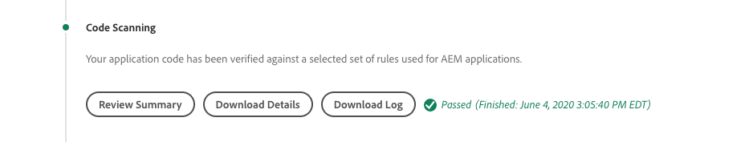
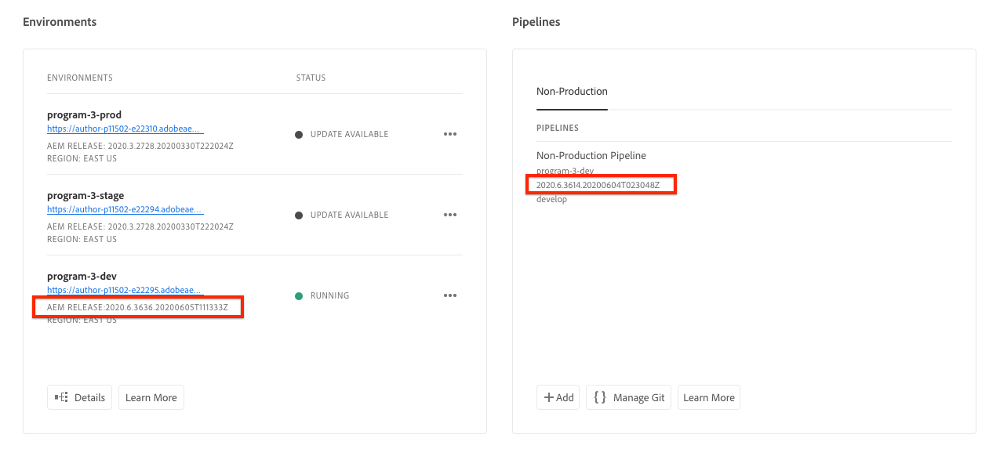

# AEM을 Cloud Service 빌드 및 배포로 디버깅

Adobe Cloud Manager를 사용하면 AEM as a Cloud Service에 대한 코드 작성 및 배포를 용이하게 할 수 있습니다. 빌드 프로세스의 단계 중에 오류가 발생할 수 있으므로 이를 해결하기 위한 작업이 필요합니다. 이 안내서에서는 배포의 일반적인 오류를 이해하고 이를 가장 잘 활용하는 방법을 안내합니다.


## 유효성 검사

유효성 검사 단계에서는 기본 Cloud Manager 구성이 유효한지 간단히 확인할 수 있습니다. 일반적인 유효성 검사 오류는 다음과 같습니다.

### 환경이 잘못된 상태입니다

+ __오류 메시지:__ 환경에 잘못된 상태가 있습니다.
   
+ __원인:__  파이프라인의 대상 환경이 전환 상태에 있으며, 이때 새 빌드를 수락할 수 없습니다.
+ __해결 방법:__ 상태가 실행 중(또는 사용 가능한 업데이트) 상태로 확인될 때까지 기다립니다. 환경이 삭제되는 경우 환경을 다시 만들거나 빌드할 다른 환경을 선택하십시오.

### 파이프라인과 연관된 환경을 찾을 수 없습니다

+ __오류 메시지:__ 환경이 삭제된 것으로 표시됩니다.
   
+ __원인:__ 파이프라인이 사용하도록 구성된 환경이 삭제되었습니다.
동일한 이름의 새 환경이 다시 만들어져도 Cloud Manager에서 파이프라인을 동일한 이름의 환경에 자동으로 다시 연결하지 않습니다.
+ __해결 방법:__ 파이프라인 구성을 편집하고 배포할 환경을 다시 선택합니다.

### 파이프라인과 연결된 Git 분기를 찾을 수 없습니다

+ __오류 메시지:__ 잘못된 파이프라인:XXXXXX. Reason=Branch=xxxx가 저장소에 없습니다.
   
+ __원인:__  파이프라인이 사용하도록 구성된 Git 분기가 삭제되었습니다.
+ __해결 방법:__ 정확히 동일한 이름을 사용하여 누락된 Git 분기를 다시 만들거나, 기존 다른 분기에서 빌드하도록 파이프라인을 다시 구성합니다.

## 빌드 및 단위 테스트


빌드 및 단위 테스트 단계는 파이프라인의 구성된 Git 분기에서 체크 아웃된 프로젝트의 Maven 빌드(`mvn clean package`)를 수행합니다.

이 단계에서 식별된 오류는 다음 예외를 제외하고 로컬에서 프로젝트를 다시 생성할 수 있어야 합니다.

+ [Maven Central](https://search.maven.org/)에 사용할 수 없는 maven 종속성이 사용되고 종속성이 포함된 Maven 저장소가 다음 중 하나입니다.
   + 비공개 내부 Maven 저장소 또는 Maven 리포지토리와 같이 Cloud Manager에서 연결할 수 없는 경우 인증을 요청하고 잘못된 자격 증명이 제공됩니다.
   + 프로젝트의 `pom.xml`에 명시적으로 등록되지 않았습니다. Maven 리포지토리를 포함하면 빌드 시간이 늘어나기 때문에 해당 리포지토리를 포함할 수 없습니다.
+ 시간 문제로 인해 단위 테스트가 실패합니다. 이는 단위 테스트가 타이밍에 민감한 경우 발생할 수 있습니다. 강력한 표시기가 테스트 코드의 `.sleep(..)`에 의존하고 있습니다.
+ 지원되지 않는 Maven 플러그인 사용.

## 코드 스캔



코드 스캔에서는 Java와 AEM 관련 우수 사례를 혼합하여 정적 코드 분석을 수행합니다.

코드 스캔은 코드에 위험 보안 취약점이 있는 경우 빌드 오류를 발생합니다. 작은 위반은 재정의할 수 있지만, 이를 수정하는 것이 좋습니다. 코드 스캔은 불완전하고 [긍정 오류](https://docs.adobe.com/content/help/en/experience-manager-cloud-service/implementing/developing/understand-test-results.html#dealing-with-false-positives)가 발생할 수 있습니다.

코드 스캔 문제를 해결하려면 **세부 정보 다운로드** 단추를 통해 Cloud Manager가 제공하는 CSV 형식 보고서를 다운로드하고 모든 항목을 검토하십시오.

자세한 내용은 AEM 관련 규칙 을 참조하십시오. Cloud Manager 설명서&#39; [사용자 지정 AEM 관련 코드 스캔 규칙](https://docs.adobe.com/content/help/en/experience-manager-cloud-manager/using/how-to-use/custom-code-quality-rules.html) 을 참조하십시오.

## 이미지 작성


빌드 이미지는 빌드 및 단위 테스트 단계에서 만든 빌드 코드 아티팩트를 AEM 릴리스와 결합하여 단일 배포 가능한 아티팩트를 형성해야 합니다.

빌드 및 단위 테스트 중에 코드 작성 및 컴파일 문제가 발견되지만 사용자 지정 빌드 아티팩트를 AEM 릴리스와 결합하려고 할 때 식별되는 구성 또는 구조적 문제가 있을 수 있습니다.

### 중복 OSGi 구성

여러 OSGi 구성이 target AEM 환경에 대한 런타임 모드를 통해 확인되면 이미지 작성 단계가 오류로 인해 실패합니다.

```
[ERROR] Unable to convert content-package [/tmp/packages/enduser.all-1.0-SNAPSHOT.zip]: 
Configuration ‘com.example.ExampleComponent’ already defined in Feature Model ‘com.example.groupId:example.all:slingosgifeature:xxxxx:X.X’, 
set the ‘mergeConfigurations’ flag to ‘true’ if you want to merge multiple configurations with same PID
```

#### 원인 1

+ __원인:__ AEM 프로젝트의 모든 패키지에 여러 코드 패키지가 포함되어 있으며, 둘 이상의 코드 패키지에서 동일한 OSGi 구성을 제공하므로 충돌이 발생하여 이미지 작성 단계에서 사용할 패키지를 결정할 수 없으므로 빌드가 실패합니다. 고유한 이름이 있는 한 OSGi 공장 구성에는 적용되지 않습니다.
+ __해결 방법:__ AEM 애플리케이션의 일부로 배포되는 모든 코드 패키지(포함된 타사 코드 패키지 포함)를 검토하여, 런타임 모드를 통해 Target 환경에 해결하는 중복 OSGi 구성을 찾습니다. AEM as a Cloud Service에서는 &quot;mergeConfigurations 플래그를 true로 설정&quot;이라는 오류 메시지의 지침을 사용할 수 없으며 무시해야 합니다.

#### 원인 2

+ __원인:__  AEM 프로젝트가 동일한 코드 패키지를 두 번 잘못 포함하므로 해당 패키지에 포함된 모든 OSGi 구성이 중복됩니다.
+ __해결 방법:__ 모든 프로젝트에 포함된 모든 pom.xml 패키지의 구성 `filevault-package-maven-plugin` [](https://docs.adobe.com/content/help/en/experience-manager-cloud-service/implementing/developing/aem-project-content-package-structure.html#cloud-manager-target) 을  `<cloudManagerTarget>none</cloudManagerTarget>`로 설정했는지 확인합니다.

### 잘못된 형식의 포인터 스크립트

보고서 스크립트는 기본 컨텐츠, 사용자, ACL 등을 정의합니다. AEM as a Cloud Service에서 포인터 스크립트는 이미지 작성 중에 적용되지만 AEM SDK의 로컬 빠른 시작에서는 OSGi 리포인트 팩터리 구성이 활성화될 때 적용됩니다. 이로 인해 Repointet 스크립트는 AEM SDK의 로컬 빠른 시작에서 조용히 실패할 수 있지만 Build Image 단계가 실패하여 배포를 중단합니다.

+ __원인:__ 포인터 스크립트의 형식이 잘못되었습니다. 실패한 스크립트가 리포지토리에 대해 실행된 후 리포인트 스크립트로 리포지토리를 불완전한 상태로 유지할 수 있습니다.
+ __해결 방법:__ 반복 스크립트 OSGi 구성이 배포될 때 AEM SDK의 로컬 빠른 시작을 검토하여 오류가 무엇인지 및 무엇인지 확인합니다.

### 충족되지 않은 컨텐츠 종속성

보고서 스크립트는 기본 컨텐츠, 사용자, ACL 등을 정의합니다. AEM SDK의 로컬 빠른 시작에서 포인트 스크립트는 Repointeit OSGi 공장 구성이 활성화될 때 또는 다시 말해 저장소가 활성 상태가 되고 콘텐츠 패키지를 통해 직접 또는 콘텐츠 패키지를 통해 콘텐츠 변경이 발생할 수 있는 경우에 적용됩니다. AEM as a Cloud Service에서 포인터 스크립트는 이미지 작성 중에 원격 스크립트가 종속되는 컨텐츠를 포함하지 않을 수 있는 저장소에 적용됩니다.

+ __원인:__ 포인터 스크립트는 존재하지 않는 컨텐츠에 따라 다릅니다.
+ __해결 방법:__ 리포인트 스크립트가 사용하는 컨텐츠가 존재하는지 확인합니다. 이는 이러한 지시어가 누락되었지만 필수 컨텐츠 구조를 정의하는 제대로 정의되지 않은 참조 스크립트를 나타내는 경우가 많습니다. 이 작업은 AEM을 삭제하고, Jar를 언패킹하고, repoinit 스크립트가 포함된 리포인트 OSGi 구성을 설치 폴더에 추가하고, AEM을 시작하여 로컬로 재생할 수 있습니다. 오류가 AEM SDK 로컬 quickstart의 error.log에 표시됩니다.


### 응용 프로그램의 핵심 구성 요소 버전이 배포된 버전보다 큽니다.

_이 문제는 최신 AEM 릴리스로 자동 업데이트하지 않는 비프로덕션 환경에만 영향을 줍니다._

AEM as a Cloud Service은 모든 AEM 릴리스에 최신 핵심 구성 요소 버전을 자동으로 포함합니다. 즉, AEM as a Cloud Service 환경이 자동 또는 수동으로 업데이트되면에 최신 버전의 핵심 구성 요소가 배포됩니다.

다음 경우에 이미지 작성 단계가 실패할 수 있습니다.

+ 배포 애플리케이션은 `core` (OSGi 번들) 프로젝트의 코어 구성 요소 maven 종속성 버전을 업데이트합니다
+ 그런 다음 배포 애플리케이션이 샌드박스(비프로덕션) AEM에 배포되며 이 새로운 코어 구성 요소 버전이 포함된 AEM 릴리스를 사용하도록 업데이트되지 않은 Cloud Service 환경으로 배포됩니다.

이 실패를 방지하기 위해 AEM as a Cloud Service 환경으로 업데이트를 사용할 수 있을 때마다 다음 빌드/배포의 일부로 업데이트를 포함시키고, 애플리케이션 코드 베이스에서 코어 구성 요소 버전을 증분 후에 항상 업데이트가 포함되도록 하십시오.

+ __증상:__
다음 오류 보고와 함께 이미지 작성 단계가 실패합니다. 
`com.adobe.cq.wcm.core.components...` 특정 버전 범위의 패키지를 프로젝트에서 가져올 수  `core` 없습니다.

   ```
   [ERROR] Bundle com.example.core:0.0.3-SNAPSHOT is importing package(s) Package com.adobe.cq.wcm.core.components.models;version=[12.13,13) in start level 20 but no bundle is exporting these for that start level in the required version range.
   [ERROR] Analyser detected errors on feature 'com.adobe.granite:aem-ethos-app-image:slingosgifeature:aem-runtime-application-publish-dev:1.0.0-SNAPSHOT'. See log output for error messages.
   [INFO] ------------------------------------------------------------------------
   [INFO] BUILD FAILURE
   [INFO] ------------------------------------------------------------------------
   ```

+ __원인:__  애플리케이션의 OSGi 번들(프로젝트에서 정의됨)은  `core` 핵심 구성 요소 코어 종속성에서 Java 클래스를 Cloud Service으로 AEM에 배포된 버전과 다른 버전 수준에서 가져옵니다.
+ __해상도:__
   + Git을 사용하여 핵심 구성 요소 버전 증가 전에 존재하는 작업 커밋으로 되돌립니다. 이 커밋을 Cloud Manager Git 분기에 푸시하고 이 분기에서 환경 업데이트를 수행합니다. 이렇게 하면 AEM이 최신 AEM 릴리스의 Cloud Service으로 업그레이드되고 여기에 최신 핵심 구성 요소 버전이 포함됩니다. AEM as a Cloud Service이 최신 핵심 구성 요소 버전이 있는 최신 AEM 릴리스로 업데이트되면 원래 실패한 코드를 재배포합니다.
   + 이 문제를 로컬에서 재현하려면 AEM SDK 버전이 AEM as a Cloud Service 환경에서 사용하는 것과 동일한 AEM 릴리스 버전인지 확인하십시오.


### Adobe 지원 사례 만들기

위의 문제 해결 방법으로 문제가 해결되지 않으면 다음을 통해 Adobe 지원 사례를 만드십시오.

+ [Adobe Admin Console](https://adminconsole.adobe.com)  > 지원 탭 > 사례 만들기

   _여러 Adobe 조직의 멤버인 경우 케이스를 만들기 전에 Adobe 조직 전환기에서 실패한 파이프라인이 있는 Adobe 조직이 선택되었는지 확인하십시오._

## 배포 대상

배포 대상 단계는 이미지 작성에서 생성된 코드 아티팩트를 가져와서 이를 사용하여 새 AEM 작성자 및 게시 서비스를 시작하고, 성공하면 이전 AEM 작성자 및 게시 서비스를 제거합니다. 가변 컨텐츠 패키지 및 인덱스가 이 단계에서도 설치 및 업데이트됩니다.

배포 대상 단계를 디버깅하기 전에 [AEM as a Cloud Service 로그](./logs.md)에 대해 숙지하십시오. `aemerror` 로그에는 문제에 대한 배포와 관련된 pod의 시작 및 종료에 대한 정보가 포함되어 있습니다. Cloud Manager의 배포 대상 단계의 다운로드 로그 단추를 통해 사용할 수 있는 로그는 `aemerror` 로그가 아니며, 애플리케이션 시작과 관련된 자세한 정보를 포함하지 않습니다.


배포 대상 단계가 실패하는 3가지 주요 이유:

### Cloud Manager 파이프라인에 이전 AEM 버전이 있습니다

+ __원인:__  Cloud Manager 파이프라인은 대상 환경에 배포된 버전보다 이전 버전의 AEM을 보관합니다. 이 문제는 파이프라인이 다시 사용되고 최신 버전의 AEM을 실행 중인 새 환경을 가리킬 때 발생할 수 있습니다. 이 식별은 환경의 AEM 버전이 파이프라인의 AEM 버전보다 커야 하는지 확인하여 확인할 수 있습니다.
   
+ __해상도:__
   + 대상 환경에 사용 가능한 업데이트 가 있는 경우 환경의 작업에서 업데이트 를 선택한 다음 빌드를 다시 실행합니다.
   + 타겟 환경에 사용 가능한 업데이트가 없는 경우 이는 타겟 환경에서 최신 버전의 AEM을 실행 중임을 의미합니다. 이 문제를 해결하려면 파이프라인을 삭제하고 다시 만듭니다.


### Cloud Manager 시간 초과

새로 배포된 AEM 서비스를 시작하는 동안 실행되는 코드가 너무 오래 걸려서 배포가 완료되기 전에 Cloud Manager 시간이 초과됩니다. 이러한 경우 Cloud Manager 상태가 실패 라고 보고해도 결국 배포가 실패할 수 있습니다.

+ __원인:__ 사용자 지정 코드는 OSGi 번들 또는 구성 요소 수명 주기에서 초기에 트리거된 큰 쿼리 또는 컨텐츠 순서와 같은 작업을 실행할 수 있으며 AEM의 시작 시간이 크게 지연됩니다.
+ __해결 방법:__ OSGi 번들 라이프사이클에서 초기에 실행되는 코드에 대한 구현을 검토하고, Cloud Manager에서  `aemerror` 보듯이 실패 시점(GMT에 로그 시간)에 AEM 작성자 및 게시 서비스의 로그를 검토하고, 사용자 지정 로그 실행 프로세스를 나타내는 로그 메시지를 찾습니다.

### 호환되지 않는 코드 또는 구성

대부분의 코드 및 구성 위반은 빌드에서 이전에 발견되지만, 사용자 지정 코드 또는 구성이 AEM과 Cloud Service으로 호환되지 않고 컨테이너에서 실행될 때까지 검색되지 않을 수 있습니다.

+ __원인:__  사용자 지정 코드는 OSGi 번들 또는 구성 요소 수명 주기에 초기에 트리거된 큰 쿼리 또는 컨텐츠 순서와 같은 긴 작업을 호출하는 경우 AEM의 시작 시간이 크게 지연될 수 있습니다.
+ __해결 방법:__ Cloud  `aemerror` Manager에서 보듯이 실패의 시간(GMT에 로그 시간)에 AEM 작성자 및 게시 서비스에 대한 로그를 검토합니다.
   1. 사용자 지정 응용 프로그램에서 제공하는 Java 클래스에서 발생하는 모든 ERRORS에 대한 로그를 검토합니다. 문제가 발견되면 문제를 해결하고 고정 코드를 푸시한 다음 파이프라인을 다시 빌드합니다.
   1. 사용자 지정 애플리케이션에서 확장/상호 작용하고 있는 AEM의 여러 측면을 통해 보고된 오류에 대해 로그를 검토하고 이를 조사합니다.이러한 오류는 Java 클래스에 직접적으로 귀속되지 않을 수 있습니다. 문제가 발견되면 문제를 해결하고 고정 코드를 푸시한 다음 파이프라인을 다시 빌드합니다.

### 컨텐츠 패키지에 /var 포함

`/var` 는 다양한 임시 런타임 컨텐츠를 포함하는 변경할 수 있습니다. 컨텐츠 패키지에 `/var` 포함(예: `ui.content`) Cloud Manager를 통해 배포되면 배포 단계가 실패할 수 있습니다.

이 문제는 초기 배포에 오류가 발생하지 않고 후속 배포에만 실패하므로 식별하기 어렵습니다. 눈에 띄는 증상은 다음과 같습니다.

+ 초기 배포는 성공하지만 배포에 포함된 새로운 변경 가능 콘텐츠 또는 변경 가능한 콘텐츠가 AEM 게시 서비스에 없는 것으로 표시됩니다.
+ AEM Author의 컨텐츠의 활성화/비활성화 가 차단되었습니다
+ 약 60분 후 배포가 실패하는 경우, 다음으로 배포에서 단계가 실패합니다.

이 문제의 원인을 확인하려면:

1. 배포의 일부인 하나 이상의 컨텐츠 패키지가 `/var`에 쓰는지 확인합니다.
1. 기본(볼드) 배포 큐가 다음 위치에서 차단되었는지 확인합니다.
   + AEM 작성자 > 도구 > 배포 > 배포
      
1. 후속 배포가 실패하면 다운로드 로그 단추를 사용하여 Cloud Manager의 &quot;배포 대상&quot; 로그를 다운로드하십시오.

   

   ... 및 로그 문 사이에 약 60분이 있는지 확인합니다.

   ```
   2020-01-01T01:01:02+0000 Begin deployment in aem-program-x-env-y-dev [CorrelationId: 1234]
   ```

   ... 및 ...

   ```
   2020-01-01T02:04:10+0000 Failed deployment in aem-program-x-env-y-dev
   ```

   이 로그에는 후속 배포가 실패한 경우에만 성공적이라고 보고하는 초기 배포에 이러한 지표가 포함되지 않습니다.

+ __원인:__ AEM 게시 서비스에 컨텐츠 패키지를 배포하는 데 사용되는 AEM 복제 서비스 사용자는 AEM 게시 `/var` 에서 쓰기를 할 수 없습니다. 따라서 AEM 게시 서비스에 컨텐츠 패키지를 배포하지 못합니다.
+ __해결 방법:__ 이 문제를 해결하는 다음과 같은 방법은 기본 설정 순서로 나열됩니다.
   1. `/var` 리소스가 필요하지 않으면 응용 프로그램의 일부로 배포되는 컨텐츠 패키지에서 `/var` 아래의 리소스를 제거할 수 있습니다.
   2. `/var` 리소스가 필요한 경우 [repoinit](https://docs.adobe.com/content/help/en/experience-manager-cloud-service/implementing/deploying/overview.html#repoinit)를 사용하여 노드 구조를 정의합니다. 리디렉션 스크립트는 OSGi 실행 모드를 통해 AEM 작성자, AEM 게시 또는 둘 다에 타깃팅될 수 있습니다.
   3. `/var` 리소스가 AEM 작성자에만 필요하며 [Repoinit](https://docs.adobe.com/content/help/en/experience-manager-cloud-service/implementing/deploying/overview.html#repoinit)를 사용하여 합리적으로 모델링할 수 없는 경우, AEM 작성자 런타임 모드 폴더(`<target>/apps/example-packages/content/install.author</target>`)의 [포함](https://docs.adobe.com/content/help/en/experience-manager-cloud-service/implementing/developing/aem-project-content-package-structure.html#embeddeds)에 의해 AEM 작성자에만 설치된 개별 컨텐츠 패키지로 이동합니다.`all`
   4. 이 [Adobe KB](https://helpx.adobe.com/in/experience-manager/kb/cm/cloudmanager-deploy-fails-due-to-sling-distribution-aem.html)에 설명된 대로 `sling-distribution-importer` 서비스 사용자에게 적절한 ACL을 제공합니다.

### Adobe 지원 사례 만들기

위의 문제 해결 방법으로 문제가 해결되지 않으면 다음을 통해 Adobe 지원 사례를 만드십시오.

+ [Adobe Admin Console](https://adminconsole.adobe.com)  > 지원 탭 > 사례 만들기

   _여러 Adobe 조직의 멤버인 경우 케이스를 만들기 전에 Adobe 조직 전환기에서 실패한 파이프라인이 있는 Adobe 조직이 선택되었는지 확인하십시오._
