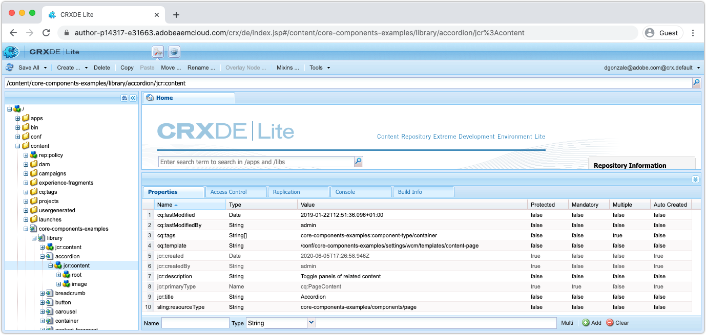

# CRXDE Lite을 사용하는 Cloud Service으로 AEM 디버깅

CRXDE Lite은 Cloud Service 개발 환경(및 로컬 AEM SDK)으로 AEM에서 사용할 수 있는 __ONLY__&#x200B;입니다.

## AEM 작성자의 CRXDE Lite 액세스

CRXDE Lite은 __AEM에서 Cloud Service 개발 환경으로 액세스할 수 있는__&#x200B;이며 스테이지 또는 프로덕션 환경에서 사용할 수 있는 __가 아닙니다.__

AEM 작성자의 CRXDE Lite에 액세스하려면:

1. AEM에 Cloud Service AEM 작성자 서비스로 로그인합니다.
1. 도구 > 일반 > CRXDE Lite으로 이동합니다.

이렇게 하면 AEM 작성자에 로그인하는 데 사용되는 자격 증명 및 권한을 사용하여 CRXDE Lite이 열립니다.

## 컨텐츠 디버깅

CRXDE Lite은 JCR에 직접 액세스할 수 있습니다. CRXDE Lite을 통해 볼 수 있는 컨텐츠는 사용자에게 부여된 권한에 의해 제한됩니다. 즉, 액세스 권한에 따라 JCR에서 모든 것을 보거나 수정할 수 없을 수도 있습니다.

`/apps`, `/libs` 및 `/oak:index`는 변경할 수 없습니다. 즉, 사용자는 런타임 시 변경할 수 없습니다. JCR의 이러한 위치는 코드 배포를 통해서만 수정할 수 있습니다.

+ JCR 구조는 왼쪽 탐색 창을 사용하여 탐색 및 조작됩니다.
+ 왼쪽 탐색 창에서 노드를 선택하면 노드 속성이 맨 아래 창에 표시됩니다.
   + 창에서 속성을 추가, 제거 또는 변경할 수 있습니다.
+ 왼쪽 탐색 창에서 파일 노드를 두 번 클릭하면 오른쪽 상단 창에 파일의 컨텐츠가 열립니다
+ 왼쪽 상단의 [모두 저장] 단추를 눌러 변경 사항을 유지하거나 저장하지 않은 변경 사항을 되돌리려면 모두 저장 옆에 있는 아래쪽 화살표를 누릅니다.

AEM에서 CRXDE Lite을 통한 Cloud Service 개발 환경으로서 런타임 시 변경 가능한 컨텐츠를 변경하는 것은 주의해야 합니다.
CRXDE Lite을 통해 AEM에 직접 적용한 변경 사항은 추적 및 제어하기가 어려울 수 있습니다. 적절한 경우 CRXDE Lite을 통해 변경한 내용이 AEM 프로젝트의 변경 가능한 컨텐츠 패키지(`ui.content`)로 다시 돌아오고 Git에 커밋되어 문제가 해결되도록 합니다. 이상적으로 모든 애플리케이션 컨텐츠 변경 사항은 CRXDE Lite을 통해 AEM에 직접 변경하는 것이 아니라 배포를 통해 AEM으로 전달됩니다.

### 액세스 제어 디버깅

CRXDE Lite은 특정 사용자 또는 그룹(주도자)에 대한 특정 노드에서 액세스 제어를 테스트하고 평가하는 방법을 제공합니다.

CRXDE Lite의 테스트 액세스 제어 콘솔에 액세스하려면 다음 위치로 이동하십시오.

+ CRXDE Lite > 도구 > 액세스 제어 테스트..

1. 경로 필드에서 평가할 JCR 경로를 선택합니다
1. 주도자 필드에서 경로를 평가할 사용자나 그룹을 선택합니다
1. 테스트 단추를 누릅니다.

결과는 다음과 같습니다.

+ __평가된__ 경로를 필터링합니다.
+ __이__ 원칙은 경로가 평가된 사용자 또는 그룹을
+ __선택한__ 주체가 속한 모든 주도자를 구성합니다.
   + 상속을 통해 권한을 제공할 수 있는 전환 그룹 멤버십을 이해하는 데 도움이 됩니다
+ __경로__ 의 권한은 선택된 주체가 평가 경로에 가지고 있는 모든 JCR 권한을 나열합니다

### 지원되지 않는 디버깅 작업

다음은 CRXDE Lite에서 수행할 수 없는 __디버깅 활동입니다.__

### OSGi 구성 디버깅

배포된 OSGi 구성은 CRXDE Lite을 통해 검토할 수 없습니다. OSGi 구성은 AEM Project의 `ui.apps` 코드 패키지(`/apps/example/config.xxx`)에서 유지되지만, AEM에 Cloud Service 환경으로 배포하는 경우 OSGi 구성 리소스가 JCR에 지속되지 않으므로 CRXDE Lite을 통해 볼 수 없습니다.

대신 [개발자 콘솔 > 구성](./developer-console.md#configurations)을 사용하여 배포된 OSGi 구성을 검토하십시오.
