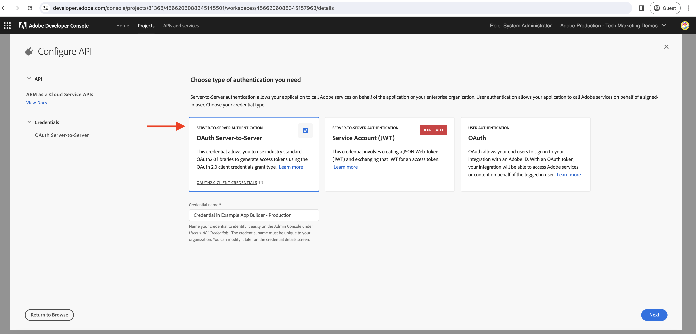

# App Builder 작업에서 서버 간 액세스 토큰 생성

App Builder 작업은 를 지원하는 Adobe API와 상호 작용해야 할 수 있습니다 **OAuth 서버 간 자격 증명** 및 는 App Builder 앱이 배포되는 Adobe Developer 콘솔 프로젝트와 연결됩니다.

이 안내서에서는 를 사용하여 액세스 토큰을 생성하는 방법을 설명합니다. _OAuth 서버 간 자격 증명_ App Builder 작업에 사용할 수 있습니다.

>[!IMPORTANT]
>
> JWT(서비스 계정) 자격 증명은 OAuth 서버 간 자격 증명을 위해 더 이상 사용되지 않습니다. 그러나 JWT(서비스 계정) 자격 증명만 지원하는 일부 Adobe API와 OAuth 서버 간 마이그레이션이 진행 중입니다. 지원되는 자격 증명을 이해하려면 Adobe API 설명서 를 검토하십시오.

## Adobe Developer 콘솔 프로젝트 구성

Adobe Developer 콘솔 프로젝트에 원하는 Adobe API를 추가하는 동안 _API 구성_ 단계에서 다음을 선택합니다. **OAuth 서버 간** 인증 유형입니다.



위에서 자동으로 만든 통합 서비스 계정을 할당하려면 원하는 제품 프로필을 선택합니다. 따라서 제품 프로필을 통해 서비스 계정 권한이 제어됩니다.


## .env 파일

App Builder 프로젝트의 `.env` Adobe Developer 콘솔 프로젝트의 OAuth 서버 간 자격 증명에 대한 사용자 지정 키를 추가합니다. OAuth 서버 간 자격 증명 값은 Adobe Developer 콘솔 프로젝트의 __자격 증명__ > __OAuth 서버 간__ (특정 작업 공간에 해당)


```
...
OAUTHS2S_CLIENT_ID=58b23182d80a40fea8b12bc236d71167
OAUTHS2S_CLIENT_SECRET=p8e-EIRF6kY6EHLBSdw2b-pLUWKodDqJqSz3
OAUTHS2S_CECREDENTIALS_METASCOPES=AdobeID,openid,ab.manage,additional_info.projectedProductContext,read_organizations,read_profile,account_cluster.read
```

값 `OAUTHS2S_CLIENT_ID`, `OAUTHS2S_CLIENT_SECRET`, `OAUTHS2S_CECREDENTIALS_METASCOPES` 는 Adobe Developer 콘솔 프로젝트의 OAuth 서버 간 자격 증명 화면에서 직접 복사할 수 있습니다.

## 입력 매핑

에 OAuth 서버 간 자격 증명 값이 설정된 경우 `.env` 파일에서, 작업 자체에서 읽을 수 있도록 이 매개 변수를 AppBuilder 작업 입력에 매핑해야 합니다. 이렇게 하려면 각 변수에 대한 항목을 `ext.config.yaml` 작업 `inputs` 형식을 사용하여 다음을 수행합니다. `PARAMS_INPUT_NAME: $ENV_KEY`.

예:

```yaml
operations:
  view:
    - type: web
      impl: index.html
actions: actions
runtimeManifest:
  packages:
    dx-excshell-1:
      license: Apache-2.0
      actions:
        generic:
          function: actions/generic/index.js
          web: 'yes'
          runtime: nodejs:16
          inputs:
            LOG_LEVEL: debug
            OAUTHS2S_CLIENT_ID: $OAUTHS2S_CLIENT_ID
            OAUTHS2S_CLIENT_SECRET: $OAUTHS2S_CLIENT_SECRET
            OAUTHS2S_CECREDENTIALS_METASCOPES: $OAUTHS2S_CECREDENTIALS_METASCOPES
          annotations:
            require-adobe-auth: false
            final: true
```

아래에 정의된 키 `inputs` 다음에서 사용할 수 있습니다. `params` App Builder 작업에 제공된 개체입니다.

## 토큰에 액세스하기 위한 OAuth 서버 간 자격 증명

App Builder 작업에서 OAuth 서버 간 자격 증명을 `params` 개체. 이러한 자격 증명을 사용하여 액세스 토큰을 생성하는 방법 [OAuth 2.0 라이브러리](https://oauth.net/code/). 또는 다음을 사용할 수 있습니다 [노드 가져오기 라이브러리](https://www.npmjs.com/package/node-fetch) 액세스 토큰을 가져오기 위해 Adobe IMS 토큰 엔드포인트에 대한 POST 요청을 수행합니다.

다음 예제에서는 를 사용하는 방법을 보여 줍니다. `node-fetch` 액세스 토큰을 가져오기 위해 Adobe IMS 토큰 엔드포인트에 대한 POST 요청을 수행하는 라이브러리입니다.

```javascript
const fetch = require("node-fetch");
const { Core } = require("@adobe/aio-sdk");
const { errorResponse, stringParameters, checkMissingRequestInputs } = require("../utils");

async function main(params) {
  const logger = Core.Logger("main", { level: params.LOG_LEVEL || "info" });

  try {
    // Perform any necessary input error checking
    const systemErrorMessage = checkMissingRequestInputs(params, ["OAUTHS2S_CLIENT_ID", "OAUTHS2S_CLIENT_SECRET", "OAUTHS2S_CECREDENTIALS_METASCOPES"], []);

    // The Adobe IMS token endpoint URL
    const adobeIMSV3TokenEndpointURL = 'https://ims-na1.adobelogin.com/ims/token/v3';

    // The POST request options
    const options = {
        method: 'POST',
        headers: {
        'Content-Type': 'application/x-www-form-urlencoded',
        },
        body: `grant_type=client_credentials&client_id=${params.OAUTHS2S_CLIENT_ID}&client_secret=${params.OAUTHS2S_CLIENT_SECRET}&scope=${params.OAUTHS2S_CECREDENTIALS_METASCOPES}`,
    };

    // Make a POST request to the Adobe IMS token endpoint to get the access token
    const tokenResponse = await fetch(adobeIMSV3TokenEndpointURL, options);
    const tokenResponseJSON = await tokenResponse.json();

    // The 24-hour IMS Access Token is used to call the AEM Data Service API
    // Can look at caching this token for 24 hours to reduce calls
    const accessToken = tokenResponseJSON.access_token;

    // Invoke an AEM Data Service API using the access token
    const aemDataResponse = await fetch(`https://api.adobeaemcloud.com/adobe/stats/statistics/contentRequestsQuota?imsOrgId=${IMS_ORG_ID}&current=true`, {
      headers: {
        'X-Adobe-Accept-Experimental': '1',
        'x-gw-ims-org-id': IMS_ORG_ID,
        'X-Api-Key': params.OAUTHS2S_CLIENT_ID,
        Authorization: `Bearer ${access_token}`, // The 24-hour IMS Access Token
      },
      method: "GET",
    });

    if (!aemDataResponse.ok) { throw new Error("Request to API failed with status code " + aemDataResponse.status);}

    // API data
    let data = await aemDataResponse.json();

    const response = {
      statusCode: 200,
      body: data,
    };

    return response;
  } catch (error) {
    logger.error(error);
    return errorResponse(500, "server error", logger);
  }
}

exports.main = main;
```
