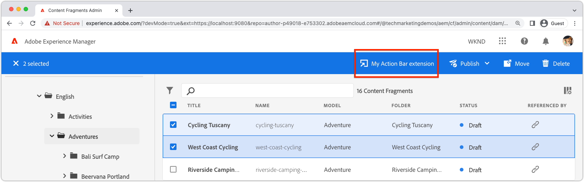

# 확장 등록

AEM 콘텐츠 조각 콘솔 확장은 React를 기반으로 하는 특수한 App Builder 앱이며 다음을 사용합니다. [반응 스펙트럼](https://react-spectrum.adobe.com/react-spectrum/) UI 프레임워크.

AEM 콘텐츠 조각 콘솔 확장의 표시 위치 및 방법을 정의하려면 확장의 App Builder 앱에 앱 라우팅 및 확장 등록의 두 가지 특정 구성이 필요합니다.

## 앱 경로{#app-routes}

확장 `App.js` 다음 선언: [React 라우터](https://reactrouter.com/en/main) AEM 콘텐츠 조각 콘솔에 확장을 등록하는 인덱스 경로가 포함됩니다.

AEM 콘텐츠 조각 콘솔이 처음 로드될 때 인덱스 경로가 호출되며 이 경로의 대상은 확장이 콘솔에 표시되는 방법을 정의합니다.

+ `./src/aem-cf-console-admin-1/web-src/src/components/App.js`

```javascript
import ExtensionRegistration from "./ExtensionRegistration"
...            
function App(props) {
  return (
    <Router>
      <ErrorBoundary onError={onError} FallbackComponent={fallbackComponent}>
        <Routes>
          {/* The index route maps to the extension registration */}
          <Route index element={<ExtensionRegistration />} />
          ...                                   
        </Routes>
      </ErrorBoundary>
    </Router>
  )
  ...
}
```

## 확장 등록

`ExtensionRegistration.js` 는 확장의 인덱스 경로를 통해 즉시 로드되어야 하며, 를 정의하고 확장의 등록 포인트를 처리합니다.

1. 확장 유형; a [머리글 메뉴](./header-menu.md) 또는 [작업 표시줄](./action-bar.md) 단추를 클릭합니다.
   + [머리글 메뉴](./header-menu.md#extension-registration) 확장은 로 표시됩니다 `headerMenu` 아래 속성 `methods`.
   + [작업 표시줄](./action-bar.md#extension-registration) 확장은 로 표시됩니다 `actionBar` 아래 속성 `methods`.
1. 확장 버튼의 정의, 위치 `getButton()` 함수. 이 함수는 필드가 있는 개체를 반환합니다.
   + `id` 는 버튼에 대한 고유 ID입니다
   + `label` 는 AEM 콘텐츠 조각 콘솔에서 확장 버튼의 레이블입니다
   + `icon` 는 AEM 콘텐츠 조각 콘솔에서 확장 버튼의 아이콘입니다. 아이콘은 입니다. [반응 스펙트럼](https://spectrum.adobe.com/page/icons/) 아이콘 이름으로, 공백은 제거됩니다.
1. 다음에서 정의된 단추의 클릭 처리기 `onClick()` 함수.
   + [머리글 메뉴](./header-menu.md#extension-registration) 확장은 클릭 처리기에 매개 변수를 전달하지 않습니다.
   + [작업 표시줄](./action-bar.md#extension-registration) 확장은에서 선택한 콘텐츠 조각 경로 목록을 제공합니다. `selections` 매개 변수.

### 헤더 메뉴 확장


콘텐츠 조각을 선택하지 않은 경우 헤더 메뉴 확장 버튼이 표시됩니다. 헤더 메뉴 확장은 콘텐츠 조각 선택 시 작동하지 않으므로 콘텐츠 조각은 해당 항목에 제공되지 않습니다 `onClick()` 핸들러입니다.

+ `./src/aem-cf-console-admin-1/web-src/src/components/ExtensionRegistration.js`

```javascript
function ExtensionRegistration() {
  const init = async () => {
    const guestConnection = await register({
      id: extensionId, // A unique ID for the extension
      methods: {
        // Configure your Action Bar button here
        headerMenu: {
          getButton() {
            return {
              'id': 'example.my-header-menu-extension', // Unique ID for the button
              'label': 'My header menu extension',      // Button label 
              'icon': 'Edit'                            // Button icon from https://spectrum.adobe.com/page/icons/
            }
          },

          // Click handler for the extension button
          // Header Menu extensions do not pass parameters to the click handler
          onClick() { ... }
        }
      }
    })
  }
  init().catch(console.error)
}
```

<div class="column is-8-desktop is-full-mobile is-half-tablet" style="
    border: solid 1px #ccc;
    border-radius: 10px;
    margin: 4rem auto;
">
  <div class="is-flex is-padded-small is-padded-big-mobile">
    <div>
      <p class="has-text-weight-bold is-size-36 is-size-27-touch is-margin-bottom-big has-text-blackest">헤더 메뉴 확장 작성으로 건너뛰기</p>
      <p class="has-text-blackest">AEM 콘텐츠 조각 콘솔에서 헤더 메뉴 확장을 등록하고 정의하는 방법을 알아봅니다.</p>
      <div class="has-align-start is-margin-top-big">
        <a href="./header-menu.md" target="_blank" class="spectrum-Button spectrum-Button--outline spectrum-Button--primary spectrum-Button--sizeM">
          <span class="spectrum-Button-label has-no-wrap has-text-weight-bold" title="헤더 메뉴 확장을 빌드하는 방법 알아보기">헤더 메뉴 확장을 빌드하는 방법 알아보기</span>
        </a>
      </div>
    </div>
  </div>
</div>

### 작업 표시줄 확장



하나 이상의 콘텐츠 조각을 선택하면 작업 표시줄 확장 버튼이 표시됩니다. 선택한 콘텐츠 조각의 경로는 를 통해 확장에서 사용할 수 있습니다. `selections` 매개 변수, 단추의 `onClick(..)` 핸들러입니다.

+ `./src/aem-cf-console-admin-1/web-src/src/components/ExtensionRegistration.js`

```javascript
function ExtensionRegistration() {
  const init = async () => {
    const guestConnection = await register({
      id: extensionId, // A unique ID for the extension
      methods: {
        // Configure your Action Bar button here
        actionBar: {
          getButton() {
            return {
              'id': 'example.my-action-bar-extension',  // Unique ID for the button
              'label': 'My action bar extension',       // Button label 
              'icon': 'Edit'                            // Button icon from https://spectrum.adobe.com/page/icons/
            }
          },

          // Click handler for the extension button
          // Only Action Bar buttons populate the selections parameter
          onClick(selections) { ... }
        }
      }
    })
  }
  init().catch(console.error)
}
```

<div class="column is-8-desktop is-full-mobile is-half-tablet" style="
    border: solid 1px #ccc;
    border-radius: 10px;
    margin: 4rem auto;
">
  <div class="is-flex is-padded-small is-padded-big-mobile">
    <div>
      <p class="has-text-weight-bold is-size-36 is-size-27-touch is-margin-bottom-big has-text-blackest">작업 표시줄 확장 작성으로 건너뛰기</p>
      <p class="has-text-blackest">AEM 콘텐츠 조각 콘솔에서 작업 표시줄 확장을 등록하고 정의하는 방법을 알아봅니다.</p>
      <div class="has-align-start is-margin-top-big">
        <a href="./action-bar.md" target="_blank" class="spectrum-Button spectrum-Button--outline spectrum-Button--primary spectrum-Button--sizeM">
          <span class="spectrum-Button-label has-no-wrap has-text-weight-bold" title="작업 표시줄 확장을 빌드하는 방법 알아보기">작업 표시줄 확장을 빌드하는 방법 알아보기</span>
        </a>
      </div>
    </div>
  </div>
</div>

## 조건부로 확장 포함

AEM 콘텐츠 조각 콘솔 확장은 사용자 지정 로직을 실행하여 확장이 AEM 콘텐츠 조각 콘솔에 표시되는 시기를 제한할 수 있습니다. 이 검사는 다음 작업 전에 수행됩니다. `register` 을 호출합니다. `ExtensionRegistration` 구성 요소를 반환하고, 확장을 표시하지 말아야 하는 경우 즉시 를 반환합니다.

이 검사에는 사용할 수 있는 제한된 컨텍스트가 있습니다.

+ 확장이 로드되는 AEM 호스트입니다.
+ 현재 사용자의 AEM 액세스 토큰입니다.

확장 로드에 대한 가장 일반적인 검사는 다음과 같습니다.

+ AEM 호스트 사용(`new URLSearchParams(window.location.search).get('repo')`)를 클릭하여 확장을 로드해야 하는지 확인합니다.
   + 특정 프로그램의 일부인 AEM 환경에서만 확장을 표시합니다(아래 예제에 표시됨).
   + 특정 AEM 환경(즉, AEM 호스트)에서만 확장을 표시합니다.
+ 사용 [Adobe I/O Runtime 작업](./runtime-action.md) AEM에 대한 HTTP 호출을 수행하여 현재 사용자에게 확장이 표시되는지 확인합니다.

아래 예제는 확장을 프로그램의 모든 환경으로 제한하는 방법을 보여 줍니다 `p12345`.

+ `./src/aem-cf-console-admin-1/web-src/src/components/ExtensionRegistration.js`

```javascript
function ExtensionRegistration() {
  const PROGRAM_ID = 'p12345';

  // Get the current AEM Host (author-pXXX-eYYY.adobeaemcloud.com) the extension is loading on
  const aemHost = new URLSearchParams(window.location.search).get('repo');

  // Create a check to determine if the current AEM host matches the AEM program that uses this extension 
  const aemHostRegex = new RegExp(`^author-${PROGRAM_ID}-e[\\d]+\\.adobeaemcloud\\.com$`)

  // Disable the extension if the Cloud Manager Program Id doesn't match the regex.
  if (!aemHostRegex.test(aemHost)) {
    return; // Skip extension registration if the environment is not in program p12345.
  }

  // Else, continue initializing the extension
  const init = async () => { .. };
  
  init().catch(console.error);
}
```
