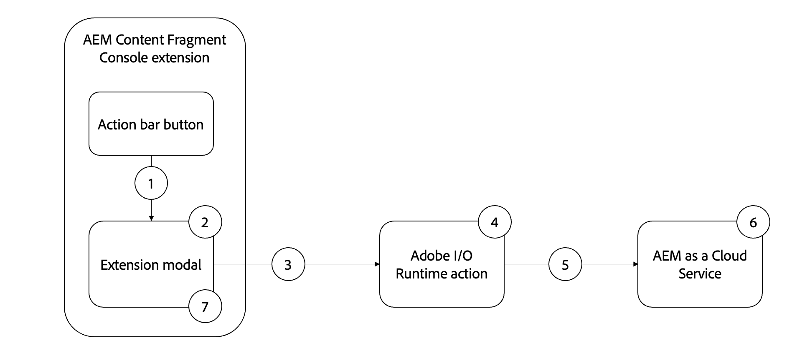

# 대량 속성 업데이트 예시 확장

>[!VIDEO](https://video.tv.adobe.com/v/3412296?quality=12&learn=on)

이 예제 AEM 콘텐츠 조각 콘솔 확장은 콘텐츠 조각 속성을 공통 값으로 대량 업데이트하는 [작업 표시줄](https://developer.adobe.com/uix/docs/services/aem-cf-console-admin/api/action-bar/) 확장입니다.

예제 확장의 기능 흐름은 다음과 같습니다.

{align="center"}

1. 콘텐츠 조각을 선택하고 [작업 모음](#extension-registration)에서 확장 단추를 클릭하면 [모달](#modal)이 열립니다.
2. [모달](#modal)은(는) [React Spectrum](https://react-spectrum.adobe.com/react-spectrum/)을(를) 사용하여 빌드된 사용자 지정 입력 양식을 표시합니다.
3. 양식을 제출하면 선택한 콘텐츠 조각 목록과 AEM 호스트가 [사용자 지정 Adobe I/O Runtime 작업](#adobe-io-runtime-action)에 전송됩니다.
4. [Adobe I/O Runtime 작업](#adobe-io-runtime-action)은(는) 입력을 확인하고 선택한 콘텐츠 조각을 업데이트하기 위해 AEM에 HTTP PUT 요청을 수행합니다.
5. 지정된 속성을 업데이트할 각 콘텐츠 조각에 대한 일련의 HTTP PUT입니다.
6. AEM as a Cloud Service은 콘텐츠 조각에 대한 속성 업데이트를 유지하고 Adobe I/O Runtime 작업에 대한 성공 또는 실패 응답을 반환합니다.
7. 모달은 Adobe I/O Runtime 작업에서 응답을 수신했으며 성공한 벌크 업데이트 목록을 표시합니다.

## 확장 지점

이 예제는 확장 지점 `actionBar`까지 확장하여 콘텐츠 조각 콘솔에 사용자 지정 단추를 추가합니다.

| AEM UI 확장 | 확장 지점 |
| ------------------------ | --------------------- | 
| [콘텐츠 조각 콘솔](https://developer.adobe.com/uix/docs/services/aem-cf-console-admin/) | [작업 표시줄](https://developer.adobe.com/uix/docs/services/aem-cf-console-admin/api/action-bar/) |


## 확장 예

이 예제에서는 기존 Adobe Developer Console 프로젝트를 사용하고 `aio app init`을(를) 통해 App Builder 앱을 초기화할 때 다음 옵션을 사용합니다.

+ 검색할 서식 파일: `All Extension Points`
+ 설치할 템플릿 선택: ` @adobe/aem-cf-admin-ui-ext-tpl`
+ 확장의 이름을 무엇으로 지정하시겠습니까? `Bulk property update`
+ 확장에 대한 간단한 설명을 입력하십시오. `An example action bar extension that bulk updates a single property one or more content fragments.`
+ 어떤 버전으로 시작하시겠습니까? `0.0.1`
+ 다음에는 무엇을 하고 싶으세요?
   + `Add a custom button to Action Bar`
      + 단추의 레이블 이름을 입력하십시오. `Bulk property update`
      + 버튼에 대한 모달을 표시해야 합니까? `y`
   + `Add server-side handler`
      + Adobe I/O Runtime을 사용하면 요청 시 서버를 사용하지 않는 코드를 호출할 수 있습니다. 이 작업의 이름을 어떻게 지정하시겠습니까? `generic`

생성된 App Builder 확장 앱이 아래와 같이 업데이트됩니다.

### 앱 경로{#app-routes}

`src/aem-cf-console-admin-1/web-src/src/components/App.js`에 [React 라우터](https://reactrouter.com/en/main)가 있습니다.

두 가지 논리적 경로 세트가 있습니다.

1. 첫 번째 경로는 요청을 `index.html`에 매핑하며, 이 요청은 [확장 등록](#extension-registration)을 담당하는 React 구성 요소를 호출합니다.

   ```javascript
   <Route index element={<ExtensionRegistration />} />
   ```

1. 두 번째 경로 세트는 URL을 확장 모달의 콘텐츠를 렌더링하는 React 구성 요소에 매핑합니다. `:selection` 매개 변수는 구분된 목록 콘텐츠 조각 경로를 나타냅니다.

   확장에 개별 작업을 호출하는 단추가 여러 개 있는 경우 각 [확장 등록](#extension-registration)은(는) 여기에 정의된 경로에 매핑됩니다.

   ```javascript
   <Route
       exact path="content-fragment/:selection/bulk-property-update"
       element={<BulkPropertyUpdateModal />}
       />
   ```

### 확장 등록

`index.html` 경로에 매핑된 `ExtensionRegistration.js`은(는) AEM 확장의 진입점이며 다음을 정의합니다.

1. 확장 단추의 위치가 AEM 작성 환경에 나타납니다(`actionBar` 또는 `headerMenu`).
1. `getButtons()` 함수에서 확장 단추의 정의
1. `onClick()` 함수에서 단추의 클릭 처리기

+ `src/aem-cf-console-admin-1/web-src/src/components/ExtensionRegistration.js`

```javascript
import React from "react";
import { generatePath } from "react-router";
import { Text } from "@adobe/react-spectrum";
import { register } from "@adobe/uix-guest";
import { extensionId } from "./Constants";

function ExtensionRegistration() {
  const init = async () => {
    const guestConnection = await register({
      id: extensionId, // Some unique ID for the extension used to facilitate communication between the extension and Content Fragment Console
      methods: {
        // Configure your Action Bar button here
        actionBar: {
          getButtons() {
            return [
              {
                id: "examples.action-bar.bulk-property-update", // Unique ID for the button
                label: "Bulk property update", // Button label
                icon: "OpenIn", // Button icon; get name from: https://spectrum.adobe.com/page/icons/ (Remove spaces, keep uppercase)
                // Click handler for the extension button
                onClick(selections) {
                  // Collect the selected content fragment paths
                  const selectionIds = selections.map(
                    (selection) => selection.id
                  );

                  // Create a URL that maps to the
                  const modalURL =
                    "/index.html#" +
                    generatePath(
                      "/content-fragment/:selection/bulk-property-update",
                      {
                        // Set the :selection React route parameter to an encoded, delimited list of paths of the selected content fragments
                        selection: encodeURIComponent(selectionIds.join("|")),
                      }
                    );

                  // Open the route in the extension modal using the constructed URL
                  guestConnection.host.modal.showUrl({
                    // The modal title
                    title: "Bulk property update",
                    url: modalURL,
                  });
                },
              },
            ];
          },
        },
      },
    });
  };

  init().catch(console.error);

  return <Text>IFrame for integration with Host (AEM)...</Text>;
}

export default ExtensionRegistration;
```

### 양식

[`App.js`](#app-routes)에 정의된 확장의 각 경로는 확장의 모달에서 렌더링되는 React 구성 요소에 매핑됩니다.

이 예제 앱에는 다음과 같은 세 가지 상태가 있는 모달 React 구성 요소(`BulkPropertyUpdateModal.js`)가 있습니다.

1. 로드 중, 사용자가 대기해야 함을 나타냄
1. 사용자가 업데이트할 속성 이름과 값을 지정할 수 있도록 해 주는 벌크 속성 업데이트 양식
1. 업데이트된 콘텐츠 조각과 업데이트할 수 없는 콘텐츠 조각을 나열하는 벌크 속성 업데이트 작업의 응답입니다

중요한 점은 확장에서 AEM을 사용하는 모든 상호 작용은 [Adobe I/O Runtime](https://developer.adobe.com/runtime/docs/)에서 실행되는 별도의 서버리스 프로세스인 [AppBuilder Adobe I/O Runtime 작업](https://developer.adobe.com/runtime/docs/guides/using/creating_actions/)에 위임해야 한다는 것입니다.
Adobe I/O Runtime 작업을 사용하여 AEM과 통신하면 CORS(원본 간 리소스 공유) 연결 문제를 방지할 수 있습니다.

벌크 속성 업데이트 양식이 제출되면 사용자 지정 `onSubmitHandler()`이(가) Adobe I/O Runtime 작업을 호출하여 현재 AEM 호스트(도메인)와 사용자의 AEM 액세스 토큰을 전달합니다. 그러면 콘텐츠 조각을 업데이트하기 위해 [AEM 콘텐츠 조각 API](https://experienceleague.adobe.com/docs/experience-manager-65/assets/extending/assets-api-content-fragments.html)가 호출됩니다.

Adobe I/O Runtime 작업의 응답을 받으면 모달이 업데이트되어 벌크 속성 업데이트 작업의 결과가 표시됩니다.

+ `src/aem-cf-console-admin-1/web-src/src/components/BulkPropertyUpdateModal.js`

```javascript
import React, { useState, useEffect } from 'react'
import { attach } from "@adobe/uix-guest"
import {
  Flex,
  Form,
  Provider,
  Content,
  defaultTheme,
  ContextualHelp,
  Text,
  TextField,
  ButtonGroup,
  Button,
  Heading,
  ListView,
  Item,
} from '@adobe/react-spectrum'

import Spinner from "./Spinner"

import { useParams } from "react-router-dom"

import allActions from '../config.json'
import actionWebInvoke from '../utils'

import { extensionId } from "./Constants"

export default function BulkPropertyUpdateModal() {
  // Set up state used by the React component
  const [guestConnection, setGuestConnection] = useState()
  
  const [actionInvokeInProgress, setActionInvokeInProgress] = useState(false);
  const [actionResponse, setActionResponse] = useState();

  const [propertyName, setPropertyName] = useState(null);
  const [propertyValue, setPropertyValue] = useState(null);
  const [validationState, setValidationState] = useState({});

  // Get the selected content fragment paths from the route parameter `:selection`
  let { selection } = useParams();
  let fragmentIds = selection?.split('|') || [];
  
  console.log('Content Fragment Ids', fragmentIds);

  if (!fragmentIds || fragmentIds.length === 0) {
    console.error("Unable to locate a list of Content Fragments to update.")
    return;
  }

  // Asynchronously attach the extension to AEM, we must wait or the guestConnection to be set before doing anything in the modal
  useEffect(() => {
    (async () => {
       // extensionId is the unique id of this extension (you can make this up as long as its unique) .. in this case its `bulk-property-update` pulled out into Constants.js as it is also referenced in ExtensionRegistration.js
      const guestConnection = await attach({ id: extensionId })
      setGuestConnection(guestConnection);
    })()
  }, [])


  // Determine view to display in the modal
  if (!guestConnection) {
    // If the guestConnection is not initialized, display a loading spinner
    return <Spinner />
  } else if (actionInvokeInProgress) {
    // If the bulk property action has been invoked but not completed, display a loading spinner
    return <Spinner />
  } else if (actionResponse) {
    // If the bulk property action has completed, display the response
    return renderResponse();
  } else {
    // Else display the bulk property update form
    return renderForm();
  }

  /**
   * Renders the Bulk Property Update form. 
   * This form has two fields:
   * - Property Name: The name of the Content Fragment property name to update
   * - Property Value: the value the Content Fragment property, specified by the Property Name, will be updated to
   * 
   * @returns the Bulk Property Update form
   */
  function renderForm() {
    return (
      // Use React Spectrum components to render the form
      <Provider theme={defaultTheme} colorScheme='light'>
        <Content width="100%">
          <Flex width="100%">
            <Form 
              width="100%">
              <TextField label="Property name"
                          isRequired={true}
                          validationState={validationState?.propertyName}
                onChange={setPropertyName}
                contextualHelp={
                  <ContextualHelp>
                    <Heading>Need help?</Heading>
                    <Content>
                      <Text>The <strong>Property name</strong> must be a valid for the Content Fragment model(s) the selected Content Fragments implement.</Text>
                    </Content>
                  </ContextualHelp>
                } />

              <TextField
                label="Property value"
                validationState={validationState?.propertyValue}
                onChange={setPropertyValue} />

              <ButtonGroup align="start" marginTop="size-200">
                <Button variant="cta" onPress={onSubmitHandler}>Update {fragmentIds.length} Content Fragments</Button>
              </ButtonGroup>
            </Form>
          </Flex>

          {/* Render the close button so the user can close the modal */}
          {renderCloseButton()}
        </Content>
      </Provider>
    )
  }
  /**
   * Display the response from the Adobe I/O Runtime action in the modal.
   * This includes:
   * - A list of content fragments that were updated successfully
   * - A list a content fragments that failed to update
   * 
   * @returns the response view
   */
  function renderResponse() {
    // Separate the successful and failed content fragments updates
    const successes = actionResponse.filter(item => item.status === 200);
    const failures = actionResponse.filter(item => item.status !== 200);

    return (
      <Provider theme={defaultTheme} colorScheme='light'>
        <Content width="100%">

          <Text>Bulk updated property <strong>{propertyName}</strong> with value <strong>{propertyValue}</strong></Text>

          {/* Render the list of content fragments that were updated successfully */}
          {successes.length > 0 &&
            <><Heading level="4">{successes.length} Content Fragments successfully updated</Heading>
              <ListView
                items={successes}
                selectionMode="none"
                aria-label="Successful updates"
              >
                {(item) => (
                  <Item key={item.fragmentId} textValue={item.fragmentId.split('/').pop()}>
                    {item.fragmentId.split('/').pop()}
                  </Item>
                )}
              </ListView></>}

          {/* Render the list of content fragments that failed to update */}
          {failures.length > 0 &&
            <><Heading level="4">{failures.length} Content Fragments failed to update</Heading><ListView
              items={failures}
              selectionMode="none"
              aria-label="Failed updates"
            >
              {(item) => (
                <Item key={item.fragmentId} textValue={item.fragmentId.split('/').pop()}>
                  {item.fragmentId.split('/').pop()}
                </Item>
              )}
            </ListView></>}

          {/* Render the close button so the user can close the modal */}
          {renderCloseButton()}
        </Content>
      </Provider>);
  }

  /**
   * Provide a close button for the modal, else it cannot be closed (without refreshing the browser window)
   * 
   * @returns a button that closes the modal.
   */
   function renderCloseButton() {
    return (
      <Flex width="100%" justifyContent="end" alignItems="center" marginTop="size-400">
        <ButtonGroup align="end">
          <Button variant="primary" onPress={() => guestConnection.host.modal.close()}>Close</Button>
        </ButtonGroup>
      </Flex>
    );
  }

  /**
   * Handle the Bulk Property Update form submission.
   * This function calls the supporting Adobe I/O Runtime action to update the selected Content Fragments, and then returns the response for display in the modal
   * When invoking the Adobe I/O Runtime action, the following parameters are passed as they're used by the action to connect to AEM:
   * - AEM Host to connect to
   * - AEM access token to connect to AEM with
   * - The list of Content Fragment paths to update
   * - The Content Fragment property name to update
   * - The value to update the Content Fragment property to
   * 
   * @returns a list of content fragment update successes and failures
   */
  async function onSubmitHandler() {
    // Validate the form input fields
    if (propertyName?.length > 1) {
      setValidationState({propertyName: 'valid', propertyValue: 'valid'});
    } else {
      setValidationState({propertyName: 'invalid', propertyValue: 'valid'});
      return;
    }

    // Mark the extension as invoking the action, so the loading spinner is displayed
    setActionInvokeInProgress(true);

    // Set the HTTP headers to access the Adobe I/O runtime action
    const headers = {
      'Authorization': 'Bearer ' + guestConnection.sharedContext.get('auth').imsToken,
      'x-gw-ims-org-id': guestConnection.sharedContext.get('auth').imsOrg
    };

    console.log('headers', headers);

    // Set the parameters to pass to the Adobe I/O Runtime action
    const params = {
      aemHost: `https://${guestConnection.sharedContext.get('aemHost')}`,

      fragmentIds: fragmentIds,
      propertyName: propertyName,
      propertyValue: propertyValue
    };

    // Invoke the Adobe I/O Runtime action named `generic`. This name defined in the `ext.config.yaml` file.
    const action = 'generic';

    try {
      // Invoke Adobe I/O Runtime action with the configured headers and parameters
      const actionResponse = await actionWebInvoke(allActions[action], headers, params);

      // Set the response from the Adobe I/O Runtime action
      setActionResponse(actionResponse);

      console.log(`Response from ${action}:`, actionResponse)
    } catch (e) {
      // Log and store any errors
      console.error(e)
    }

    // Set the action as no longer being invoked, so the loading spinner is hidden
    setActionInvokeInProgress(false);
  }
}
```


### Adobe I/O Runtime 작업

AEM 확장 App Builder 앱은 0개 이상의 Adobe I/O Runtime 작업을 정의하거나 사용할 수 있습니다.
Adobe Runtime 작업은 AEM 또는 기타 Adobe 웹 서비스와 상호 작용해야 하는 작업을 담당해야 합니다.

이 예제 앱에서는 기본 이름 `generic`을(를) 사용하는 Adobe I/O Runtime 작업이 다음을 담당합니다.

1. 콘텐츠 조각을 업데이트하기 위해 AEM 콘텐츠 조각 API에 대한 일련의 HTTP 요청 수행.
1. 이러한 HTTP 요청의 응답을 수집하여 성공 및 실패로 정렬
1. 모달(`BulkPropertyUpdateModal.js`)에 의해 표시할 성공 및 실패 목록을 반환합니다.

+ `src/aem-cf-console-admin-1/actions/generic/index.js`


```javascript
const fetch = require('node-fetch')
const { Core } = require('@adobe/aio-sdk')
const { errorResponse, getBearerToken, stringParameters, checkMissingRequestInputs } = require('../utils')

// main function that will be executed by Adobe I/O Runtime
async function main (params) {
  // create a Logger
  const logger = Core.Logger('main', { level: params.LOG_LEVEL || 'info' })

  try {
    // 'info' is the default level if not set
    logger.info('Calling the main action')

    // log parameters, only if params.LOG_LEVEL === 'debug'
    logger.debug(stringParameters(params))

    // check for missing request input parameters and headers
    const requiredParams = [ 'aemHost', 'fragmentIds', 'propertyName', 'propertyValue' ]
    const requiredHeaders = ['Authorization']
    const errorMessage = checkMissingRequestInputs(params, requiredParams, requiredHeaders)
    if (errorMessage) {
      // return and log client errors
      return errorResponse(400, errorMessage, logger)
    }
      
    const body = {
      "properties": {
        "elements": {
          [params.propertyName]: {
            "value": params.propertyValue
          }
        }
      }
    };

    // Extract the user Bearer token from the Authorization header used to authenticate the request to AEM
    const accessToken = getBearerToken(params);

    let results = await Promise.all(params.fragmentIds.map(async (fragmentId) => {

      logger.info(`Updating fragment ${fragmentId} with property ${params.propertyName} and value ${params.propertyValue}`);

      const res = await fetch(`${params.aemHost}${fragmentId.replace('/content/dam/', '/api/assets/')}.json`, { 
        method: 'put',
        body: JSON.stringify(body),
        headers: {
          'Authorization': `Bearer ${accessToken}`,
          'Content-Type': 'application/json'
        }
      });

      if (res.ok) {
        logger.info(`Successfully updated ${fragmentId}`);
        return { fragmentId, status: res.status, statusText: res.statusText, body: await res.json() };
      } else {
        logger.info(`Failed to update ${fragmentId}`);
        return { fragmentId, status: res.status, statusText: res.statusText, body: await res.text() };
      }
    }));

    const response = {
      statusCode: 200,
      body: results
    };

    logger.info('Adobe I/O Runtime action response', response);

    // Return the response to the A
     return response;

  } catch (error) {
    // log any server errors
    logger.error(error)
    // return with 500
    return errorResponse(500, 'server error', logger)
  }
}

exports.main = main
```
