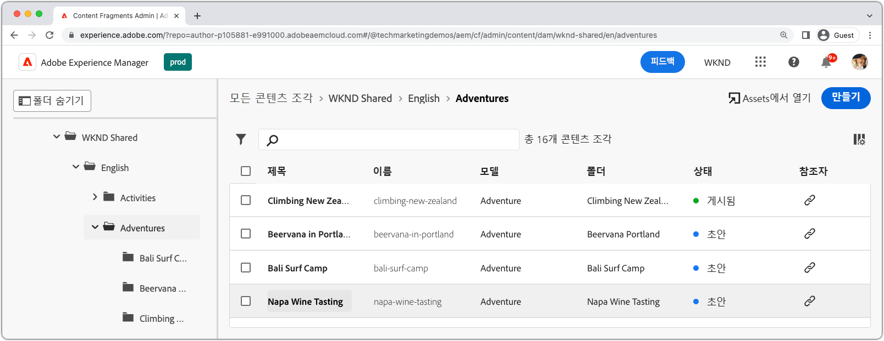
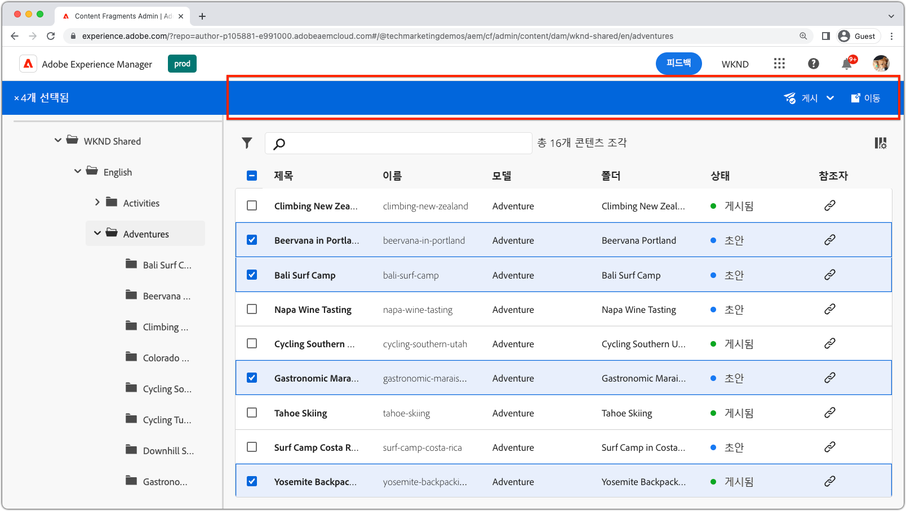
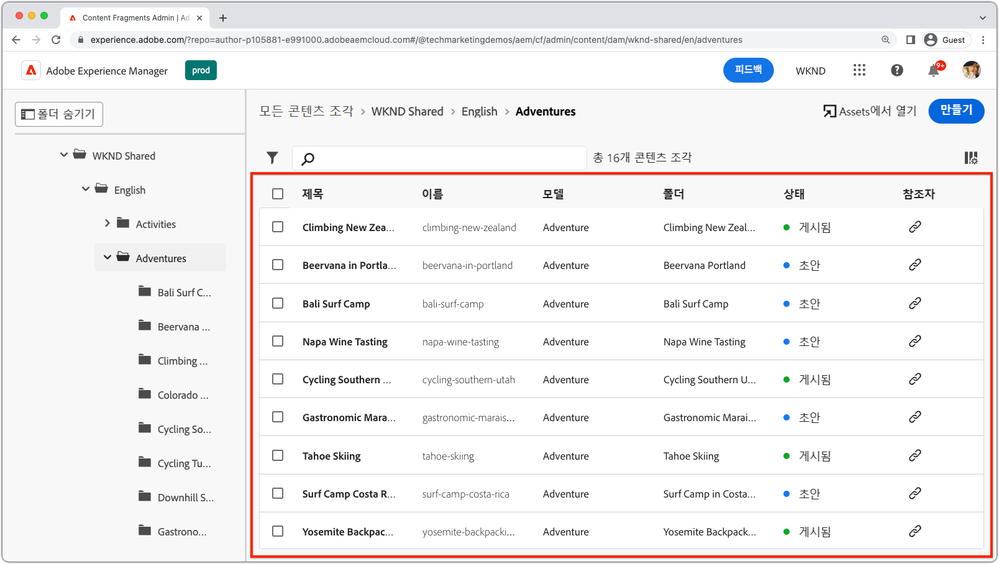
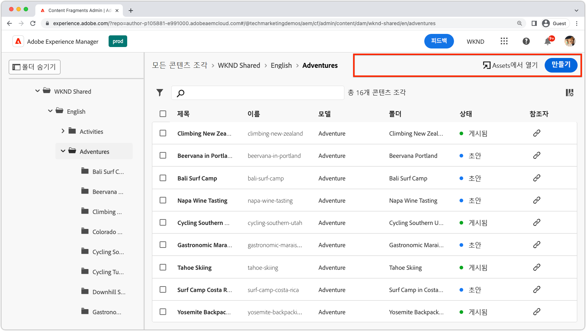
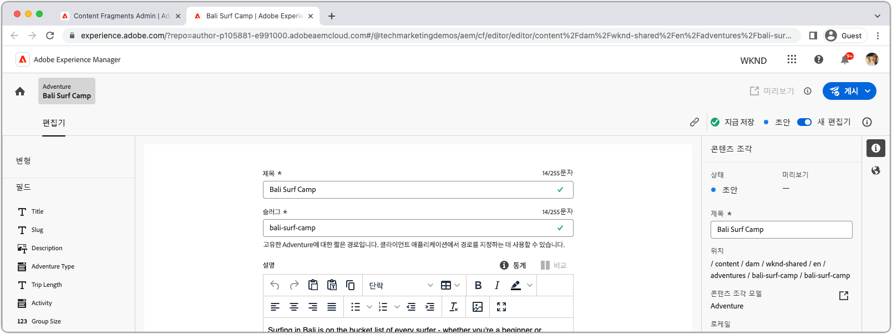
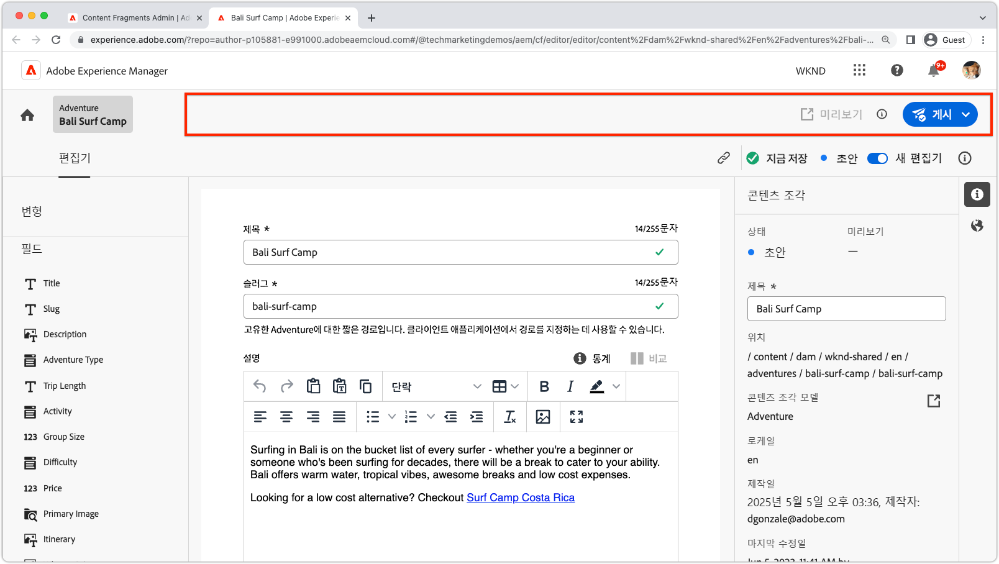
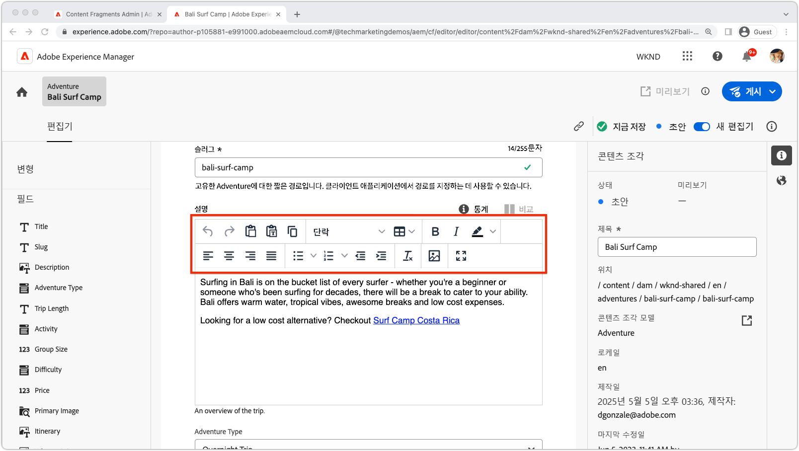
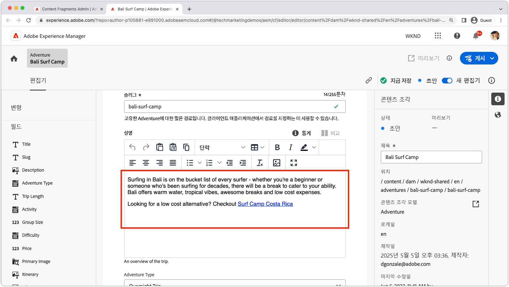

# AEM Content Fragments 확장성

AEM Content Fragments UI는 콘텐츠 조각 생성, 관리 및 편집을 관리하기 위한 강력한 확장 가능한 UI입니다. 요구 사항에 맞게 UI를 사용자 지정하는 데 사용할 수 있는 몇 가지 확장 지점이 있습니다. 확장 중인 UI에 따라 다양한 확장 지점을 사용할 수 있습니다.

## 콘텐츠 조각 콘솔 확장 지점

AEM(Adobe Experience Manager)의 콘텐츠 조각 콘솔 은 콘텐츠 조각을 관리 및 구성하기 위한 중앙 위치를 제공하는 사용자 인터페이스입니다. 콘텐츠 조각을 만들고, 편집하고, 게시하고, 추적할 수 있는 포괄적인 도구 및 기능 세트를 제공하여 사용자가 다양한 채널 및 터치포인트에서 구조화된 콘텐츠를 효율적으로 관리할 수 있도록 합니다.

[AEM 콘텐츠 조각 콘솔](https://experienceleague.adobe.com/docs/experience-manager-cloud-service/content/sites/administering/content-fragments/content-fragments-console.html) 는 콘텐츠 조각을 나열하고 관리하기 위한 확장 가능한 UI입니다. [AEM 콘텐츠 조각 콘솔 확장이 생성됨](https://developer.adobe.com/uix/docs/services/aem-cf-console-admin/code-generation) 사용 `@adobe/aem-cf-admin-ui-ext-tpl` App Builder 템플릿입니다.

다음 콘텐츠 조각 콘솔 확장 지점을 사용할 수 있습니다.

      

        

          

            <figure class="image is-16by9">
              
            </figure>
          

          

            

              
<a href="https://developer.adobe.com/uix/docs/services/aem-cf-console-admin/api/action-bar/" title="작업 표시줄" target="_blank" rel="referrer">작업 표시줄</a>

              
하나 이상의 콘텐츠 조각을 선택한 경우에 대한 작업을 사용자 지정합니다.

              <a href="https://developer.adobe.com/uix/docs/services/aem-cf-console-admin/api/action-bar/" class="spectrum-Button spectrum-Button--outline spectrum-Button--primary spectrum-Button--sizeM" target="_blank" rel="referrer">
                문서 보기
              </a>
            

          

        

      

  

    

      

        <figure class="image is-16by9">
          
        </figure>
      

      

        

          
<a href="https://developer.adobe.com/uix/docs/services/aem-cf-console-admin/api/grid-columns/" title="그리드 열" target="_blank" rel="referrer">그리드 열</a>

          
콘텐츠 조각 목록에 표시되는 데이터를 사용자 지정합니다.

          <a href="https://developer.adobe.com/uix/docs/services/aem-cf-console-admin/api/grid-columns/" class="spectrum-Button spectrum-Button--outline spectrum-Button--primary spectrum-Button--sizeM" target="_blank" rel="referrer">
            문서 보기
          </a>
        

      

    

  

  

    

      

        <figure class="image is-16by9">
          
        </figure>
      

      

        

          
<a href="https://developer.adobe.com/uix/docs/services/aem-cf-console-admin/api/header-menu/" title="머리글 메뉴" target="_blank" rel="referrer">머리글 메뉴</a>

          
콘텐츠 조각을 선택하지 않은 경우에 대한 작업을 사용자 정의합니다.

          <a href="https://developer.adobe.com/uix/docs/services/aem-cf-console-admin/api/header-menu/" class="spectrum-Button spectrum-Button--outline spectrum-Button--primary spectrum-Button--sizeM" target="_blank" rel="referrer">
            문서 보기
          </a>
        

      

    

  
  

## 콘텐츠 조각 편집기 확장 지점

AEM(Adobe Experience Manager)의 콘텐츠 조각 편집기는 사용자가 콘텐츠 조각을 만들고, 편집하고, 관리할 수 있는 사용자 인터페이스 구성 요소입니다. 구조화된 컨텐츠를 사용하기 위한 직관적이고 사용자 친화적인 환경을 제공하여 사용자가 컨텐츠 요소를 정의 및 구성하고, 템플릿을 적용하고, 변형을 관리하고, 다양한 채널에서 컨텐츠가 표시되는 방식을 미리 볼 수 있도록 합니다. 콘텐츠 조각 편집기를 사용하면 여러 디지털 경험에 쉽게 배포하고 게시할 수 있는 재사용 가능한 모듈식 콘텐츠를 만드는 프로세스를 간소화할 수 있습니다.

AEM Content Fragments Editor는 콘텐츠 조각을 편집하기 위한 확장 가능한 UI입니다. [AEM 콘텐츠 조각 편집기 확장이 생성됨](https://developer.adobe.com/uix/docs/services/aem-cf-editor/code-generation/) 사용 `@adobe/aem-cf-editor-ui-ext-tpl` App Builder 템플릿입니다.

다음 콘텐츠 조각 편집기 확장 지점을 사용할 수 있습니다.

    

      

        

          <figure class="image is-16by9">
            
          </figure>
        

        

          

            
<a href="https://developer.adobe.com/uix/docs/services/aem-cf-editor/api/header-menu/" title="머리글 메뉴" target="_blank" rel="referrer">머리글 메뉴</a>

            
콘텐츠 조각 편집기의 헤더 메뉴에서 작업을 사용자 지정합니다.

            <a href="https://developer.adobe.com/uix/docs/services/aem-cf-editor/api/header-menu" class="spectrum-Button spectrum-Button--outline spectrum-Button--primary spectrum-Button--sizeM" target="_blank" rel="referrer">
              문서 보기
            </a>
          

        

      

    

  

    

      

        <figure class="image is-16by9">
          
        </figure>
      

      

        

          
<a href="https://developer.adobe.com/uix/docs/services/aem-cf-editor/api/rte-toolbar/" title="리치 텍스트 편집기 도구 모음"  target="_blank" rel="referrer">리치 텍스트 편집기 도구 모음</a>

          
콘텐츠 조각 편집기의 리치 텍스트 편집기(RTE)에 사용자 지정 단추를 추가합니다.

          <a href="https://developer.adobe.com/uix/docs/services/aem-cf-editor/api/rte-toolbar/" class="spectrum-Button spectrum-Button--outline spectrum-Button--primary spectrum-Button--sizeM" target="_blank" rel="referrer">
            문서 보기
          </a>
        

      

    

  

    

      

        <figure class="image is-16by9">
          
        </figure>
      

      

        

          
<a href="https://developer.adobe.com/uix/docs/services/aem-cf-editor/api/rte-widgets/" title="리치 텍스트 편집기 위젯" target="_blank" rel="referrer">리치 텍스트 편집기 위젯</a>

          
키 입력에 바인딩된 RTE의 작업을 사용자 지정합니다.

          <a href="https://developer.adobe.com/uix/docs/services/aem-cf-editor/api/rte-widgets/" class="spectrum-Button spectrum-Button--outline spectrum-Button--primary spectrum-Button--sizeM" target="_blank" rel="referrer">
            문서 보기
          </a>
        

      

    

  

  

    

      

        <figure class="image is-16by9">
          
        </figure>
      

      

        

          
<a href="https://developer.adobe.com/uix/docs/services/aem-cf-editor/api/rte-badges/ " title="리치 텍스트 편집기 배지" target="_blank" rel="referrer">리치 텍스트 편집기 배지</a>

          
RTE 내에서 편집할 수 없는 스타일의 블록을 사용자 지정합니다.

          <a href="https://developer.adobe.com/uix/docs/services/aem-cf-editor/api/rte-badges/" class="spectrum-Button spectrum-Button--outline spectrum-Button--primary spectrum-Button--sizeM" target="_blank" rel="referrer">
            문서 보기
          </a>
        

      

    

  

## 확장 예

AEM UI 확장성 코드 예제 컬렉션을 시작합니다! 이 리소스는 Adobe Experience Manager(AEM) 사용자 인터페이스를 확장하는 데 대한 실용적인 데모와 통찰력을 제공하도록 설계되었습니다. AEM의 기능을 향상시키려는 개발자에 관계없이 이러한 코드 예는 중요한 참조 역할을 합니다.

  

    

      

        <figure class="image is-16by9">
          
        </figure>
      

      

        

          
<a href="./examples/console-bulk-property-update.md" title="벌크 속성 업데이트">벌크 콘텐츠 조각 속성 업데이트</a>

          
모달 및 Adobe I/O Runtime 작업이 포함된 콘텐츠 조각 콘솔 작업 표시줄 확장.

          <a href="./examples/console-bulk-property-update.md" class="spectrum-Button spectrum-Button--outline spectrum-Button--primary spectrum-Button--sizeM">
            예제 보기
          </a>
        

      

    

  

  

        

            

                <figure class="image is-16by9">
                    
                </figure>
            

            

                

                    
<a href="./examples/console-image-generation-and-image-upload.md" title="OpenAI 기반 이미지 생성 및 AEM 확장에 업로드">OpenAPI 이미지 생성</a>

                    
OpenAI를 사용하여 이미지를 생성하고 AEM에 업로드하며 선택한 콘텐츠 조각의 이미지 속성을 업데이트하는 예제 작업 표시줄 확장을 살펴봅니다.

                    <a href="./examples/console-image-generation-and-image-upload.md" class="spectrum-Button spectrum-Button--outline spectrum-Button--primary spectrum-Button--sizeM">
                        예제 보기
                    </a>
                

            

        

    
    
  

    

      

        <figure class="image is-16by9">
          
        </figure>
      

      

        

          
<a href="./examples/custom-grid-columns.md" title="사용자 정의 열">사용자 정의 열</a>

          
콘텐츠 조각 콘솔에 사용자 지정 열을 추가합니다.

          <a href="./examples/custom-grid-columns.md" class="spectrum-Button spectrum-Button--outline spectrum-Button--primary spectrum-Button--sizeM">
            예제 보기
          </a>
        

      

    

  
    
  

    

      

        <figure class="image is-16by9">
          
        </figure>
      

      

        

          
<a href="./examples/editor-export-to-xml.md" title="XML로 내보내기">XML로 내보내기</a>

          
콘텐츠 조각 편집기에서 콘텐츠 조각을 XML로 내보냅니다.

          <a href="./examples/editor-export-to-xml.md" class="spectrum-Button spectrum-Button--outline spectrum-Button--primary spectrum-Button--sizeM">
            예제 보기
          </a>
        

      

    

  
    
  

    

      

        <figure class="image is-16by9">
          
        </figure>
      

      

        

          
<a href="./examples/editor-rte-toolbar.md" title="리치 텍스트 편집기 도구 모음 단추">리치 텍스트 편집기 도구 모음 단추</a>

          
콘텐츠 조각 편집기의 RTE 필드에 사용자 지정 도구 모음 단추를 추가합니다.

          <a href="./examples/editor-rte-toolbar.md" class="spectrum-Button spectrum-Button--outline spectrum-Button--primary spectrum-Button--sizeM">
            예제 보기
          </a>
        

      

    

  
   
  

    

      

        <figure class="image is-16by9">
          
        </figure>
      

      

        

          
<a href="./examples/editor-rte-toolbar.md" title="리치 텍스트 편집기 위젯">리치 텍스트 편집기 위젯</a>

          
콘텐츠 조각 편집기에서 위젯을 리치 텍스트 편집기에 추가합니다.

          <a href="./examples/editor-rte-widget.md" class="spectrum-Button spectrum-Button--outline spectrum-Button--primary spectrum-Button--sizeM">
            예제 보기
          </a>
        

      

    

  
   
  

    

      

        <figure class="image is-16by9">
          
        </figure>
      

      

        

          
<a href="./examples/editor-rte-badges.md" title="리치 텍스트 편집기 배지">리치 텍스트 편집기 배지</a>

          
콘텐츠 조각 편집기에서 리치 텍스트 편집기에 배지를 추가합니다.

          <a href="./examples/editor-rte-badges.md" class="spectrum-Button spectrum-Button--outline spectrum-Button--primary spectrum-Button--sizeM">
            예제 보기
          </a>
        

      

    

  
 

