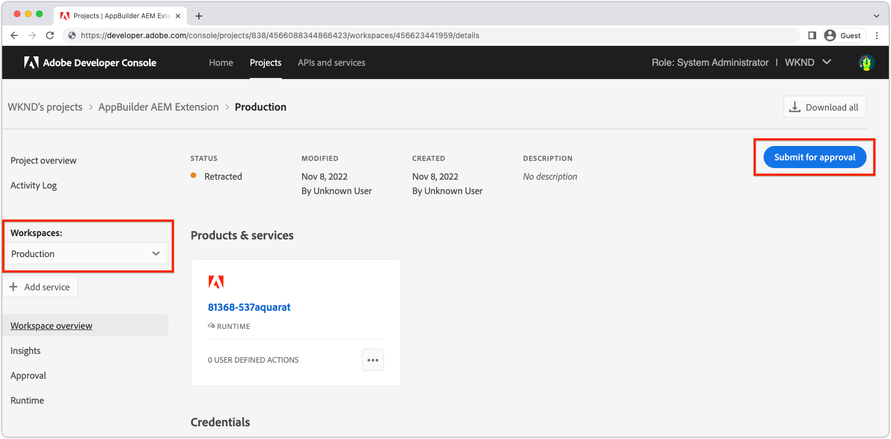

# 확장 배포

AEM as a Cloud Service 환경에서 사용하려면 확장 App Builder 앱을 배포하고 승인해야 합니다.

확장 App Builder 앱을 배포할 때 알아 두어야 할 몇 가지 고려 사항이 있습니다.

+ 확장은 Adobe Developer 콘솔 프로젝트 작업 공간에 배포됩니다. 기본 작업 공간은 다음과 같습니다.
   + __프로덕션__ 작업 공간에는 모든 AEM에서 as a Cloud Service으로 사용할 수 있는 확장 배포가 포함되어 있습니다.
   + __단계__ 작업 영역은 개발자 작업 영역으로 사용됩니다. 스테이지 작업 영역에 배포된 확장은 AEM에서 as a Cloud Service으로 사용할 수 없습니다.
Adobe Developer 콘솔 작업 영역은 AEM as a Cloud Service 환경 유형과 직접적인 상관 관계를 갖지 않습니다.
+ Production Workspace에 배포된 확장은 확장이 존재하는 Adobe 조직의 모든 AEM as a Cloud Service 환경에 표시됩니다.
확장을 추가하여 등록한 환경으로 제한할 수 없습니다. [AEM as a Cloud Service 호스트 이름을 확인하는 조건부 논리](https://developer.adobe.com/uix/docs/guides/publication/#enabling-extension-only-on-specific-aem-environments).
+ 여러 확장 프로그램은 AEM에서 as a Cloud Service으로 사용할 수 있습니다. Adobe은 각 확장 App Builder 앱을 사용하여 단일 비즈니스 목표를 해결하는 것을 권장합니다. 즉, 단일 확장 App Builder 앱은 일반적인 비즈니스 목표를 지원하는 여러 확장 지점을 구현할 수 있습니다.

## 초기 배포

AEM as a Cloud Service 환경에서 확장을 사용하려면 Adobe Developer 콘솔에 배포해야 합니다.

배포 프로세스는 다음 두 가지 논리적 단계로 분할됩니다.

1. 개발자가 Adobe Developer 콘솔에 확장 App Builder 앱을 배포합니다.
1. 배포 관리자 또는 비즈니스 소유자에 의한 확장 승인.

### 확장 배포

프로덕션 작업 영역에 확장을 배포합니다. AEM Production Workspace에 배포된 확장은 확장이 배포되는 Adobe 조직의 모든 as a Cloud Service 작성자 서비스에 자동으로 추가됩니다.

1. 업데이트된 확장 App Builder 앱의 루트에 대한 명령줄을 엽니다.
1. 프로덕션 작업 영역이 활성 상태인지 확인합니다.

   ```shell
   $ aio app use -w Production
   ```

   모든 변경 내용 병합 `.env` 및 `.aio`.

1. 업데이트된 확장 App Builder 앱을 배포합니다.

   ```shell
   $ aio app deploy
   ```

#### 배포 승인 요청

{align="center"}

1. 에 로그인 [Adobe Developer 콘솔](https://developer.adobe.com)
1. 선택 __콘솔__
1. 다음으로 이동 __프로젝트__
1. 확장과 연결된 프로젝트 선택
1. 다음 항목 선택 __프로덕션__ 작업 영역
1. 선택 __승인을 위해 제출__
1. 양식을 작성하여 제출하고 필요에 따라 필드를 업데이트합니다.

### 배포 승인

{align="center"}

1. 에 로그인 [Adobe 교환](https://exchange.adobe.com/)
1. 다음으로 이동 __관리__ > __검토 보류 중인 앱__
1. __리뷰__ 확장 App Builder 앱
1. 확장 변경이 허용되는 경우 __Accept__ 리뷰. 이렇게 하면 Adobe 조직 내의 모든 AEM as a Cloud Service Author 서비스에 확장이 즉시 삽입됩니다.

확장 요청이 승인되면 AEM as a Cloud Service Author 서비스에서 확장이 즉시 활성화됩니다.

## 확장 업데이트

App Builder 앱 업데이트 및 확장은 와 동일한 프로세스를 따릅니다. [초기 배포](#initial-deployment)를 사용하는 경우 기존 확장 배포를 먼저 취소해야 합니다.

### 확장 취소

새 버전의 확장을 배포하려면 먼저 확장을 취소(또는 제거)해야 합니다. 확장이 해지되었지만 AEM 콘솔에서는 사용할 수 없습니다.

1. 에 로그인 [Adobe 교환](https://exchange.adobe.com/)
1. 다음으로 이동 __관리__ > __App Builder 앱__
1. __취소__ 업데이트할 확장

### 확장 배포

프로덕션 작업 영역에 확장을 배포합니다. AEM Production Workspace에 배포된 확장은 확장이 배포되는 Adobe 조직의 모든 as a Cloud Service 작성자 서비스에 자동으로 추가됩니다.

1. 업데이트된 확장 App Builder 앱의 루트에 대한 명령줄을 엽니다.
1. 프로덕션 작업 영역이 활성 상태인지 확인합니다.

   ```shell
   $ aio app use -w Production
   ```

   모든 변경 내용 병합 `.env` 및 `.aio`.

1. 업데이트된 확장 App Builder 앱을 배포합니다.

   ```shell
   $ aio app deploy
   ```

#### 배포 승인 요청

{align="center"}

1. 에 로그인 [Adobe Developer 콘솔](https://developer.adobe.com)
1. 선택 __콘솔__
1. 다음으로 이동 __프로젝트__
1. 확장과 연결된 프로젝트 선택
1. 다음 항목 선택 __프로덕션__ 작업 영역
1. 선택 __승인을 위해 제출__
1. 양식을 작성하여 제출하고 필요에 따라 필드를 업데이트합니다.

#### 배포 요청 승인

{align="center"}

1. 에 로그인 [Adobe 교환](https://exchange.adobe.com/)
1. 다음으로 이동 __관리__ > __검토 보류 중인 앱__
1. __리뷰__ 확장 App Builder 앱
1. 확장 변경이 허용되는 경우 __Accept__ 리뷰. 이렇게 하면 Adobe 조직 내의 모든 AEM as a Cloud Service Author 서비스에 확장이 즉시 삽입됩니다.

확장 요청이 승인되면 AEM as a Cloud Service Author 서비스에서 확장이 즉시 활성화됩니다.

## 확장 제거


확장을 제거하려면 Adobe Exchange에서 확장을 취소(또는 제거)합니다. 확장이 취소되면 모든 AEM as a Cloud Service Author 서비스에서 제거됩니다.

1. 에 로그인 [Adobe 교환](https://exchange.adobe.com/)
1. 다음으로 이동 __관리__ > __App Builder 앱__
1. __취소__ 제거할 확장
