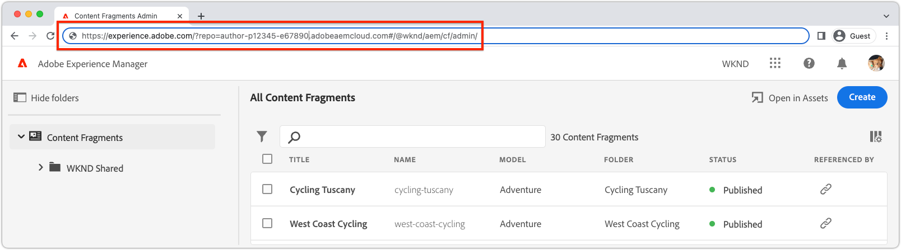

# 확장 확인

AEM UI 확장은 확장이 속한 Adobe 조직의 AEM as a Cloud Service 환경을 통해 확인할 수 있습니다.

확장 테스트는 해당 요청에 대해서만 AEM에서 확장을 로드하도록 지시하는 특별히 제작된 URL을 통해 수행됩니다.

>[!VIDEO](https://video.tv.adobe.com/v/3412877?quality=12&learn=on)

>[!IMPORTANT]
>
> 위의 비디오에서는 콘텐츠 조각 콘솔 확장을 사용하여 App Builder 확장 앱 미리 보기 및 확인을 보여 줍니다. 그러나 위에서 설명한 개념은 모든 AEM UI 확장에 적용할 수 있습니다.

## AEM UI URL

{align="center"}

비프로덕션 확장을 AEM에 마운트하는 URL을 만들려면 확장이 삽입되는 AEM UI의 URL을 얻어야 합니다. AEM as a Cloud Service 환경으로 이동하여 의 확장을 확인하고 확장을 미리 볼 UI를 엽니다.

예를 들어 콘텐츠 조각 콘솔의 확장을 미리 보려면 다음을 수행합니다.

1. 원하는 AEM as a Cloud Service 환경에 로그인합니다.
1. __콘텐츠 조각__ 아이콘을 선택합니다.
1. AEM 콘텐츠 조각 콘솔이 브라우저에서 로드될 때까지 기다립니다.
1. 브라우저의 주소 표시줄에서 AEM 콘텐츠 조각 콘솔의 URL을 복사합니다. URL은 다음과 유사해야 합니다.

   ```
   https://experience.adobe.com/?repo=author-p1234-e5678.adobeaemcloud.com#/@wknd/aem/cf/admin
   ```

이 URL은 개발 및 단계 확인을 위해 URL을 만들 때 아래에 사용됩니다. 다른 AEM UI에 대해 확장을 확인하는 경우 해당 URL을 가져오고 아래 동일한 단계를 적용합니다.

## 로컬 개발 빌드 확인

1. 확장 프로젝트의 루트에 대한 명령줄을 엽니다.
1. AEM UI 확장을 로컬 App Builder 앱으로 실행

   ```shell
   $ aio app run
   ...
   No change to package.json was detected. No package manager install will be executed.
   
   To view your local application:
     -> https://localhost:9080
   To view your deployed application in the Experience Cloud shell:
     -> https://experience.adobe.com/?devMode=true#/custom-apps/?localDevUrl=https://localhost:9080
   ```

위에 `-> https://localhost:9080`(으)로 표시된 로컬 응용 프로그램 URL을 참고하십시오.

1. 처음에(연결 오류가 표시될 때마다) 웹 브라우저에서 `https://localhost:9080`(또는 로컬 응용 프로그램 URL이 무엇이든)을 열고 [HTTPS 인증서](https://developer.adobe.com/uix/docs/services/aem-cf-console-admin/extension-development/#accepting-the-certificate-first-time-users)를 수동으로 수락합니다.
1. [AEM UI의 URL](#aem-ui-url)에 다음 두 개의 쿼리 매개 변수를 추가합니다.
   + `&devMode=true`
   + `&ext=<LOCAL APPLICATION URL>`, 일반적으로 `&ext=https://localhost:9080`입니다.

   위의 두 쿼리 매개 변수(`devMode` 및 `ext`)를 URL에서 __first__ 쿼리 매개 변수로 추가하십시오. AEM의 확장 가능한 UI에서 해시 경로(`#/@wknd/aem/...`)를 사용하므로 `#` 이후 매개 변수를 잘못 게시하면 작동하지 않습니다.

   미리보기 URL은 다음과 같아야 합니다.

   ```
   https://experience.adobe.com/?devMode=true&ext=https://localhost:9080&repo=author-p1234-e5678.adobeaemcloud.com#/@wknd/aem/cf/admin
   ```

1. 미리보기 URL을 복사하여 브라우저에 붙여넣습니다.

   + 로컬 응용 프로그램의 호스트(`https://localhost:9080`)에 대해 [HTTPS 인증서를 수락하고](https://developer.adobe.com/uix/docs/services/aem-cf-console-admin/extension-development/#accepting-the-certificate-first-time-users)해야 할 수 있습니다.

1. AEM UI는 확인을 위해 로컬 버전의 확장이 삽입되어 로드됩니다.

>[!IMPORTANT]
>
>이 접근 방식을 사용할 때 개발 중인 확장은 경험에만 영향을 주며 AEM UI의 다른 모든 사용자는 주입된 확장 없이 UI를 경험합니다.

## 스테이지 빌드 확인

1. 확장 프로젝트의 루트에 대한 명령줄을 엽니다.
1. 스테이지 작업 영역이 활성 상태인지 확인합니다(또는 확인에 Workspace을 사용하는 위치 확인).

   ```shell
   $ aio app use -w Stage
   ```

   `.env` 및 `.aio`에 대한 모든 변경 내용을 병합합니다.

1. 업데이트된 확장 App Builder 앱을 배포합니다. 로그인하지 않은 경우 먼저 `aio login`을(를) 실행하십시오.

   ```shell
   $ aio app deploy
   ...
   Your deployed actions:
   web actions:
     -> https://98765-123aquarat.adobeio-static.net/api/v1/web/aem-cf-console-admin-1/generic 
   To view your deployed application:
     -> https://98765-123aquarat.adobeio-static.net/index.html
   To view your deployed application in the Experience Cloud shell:
     -> https://experience.adobe.com/?devMode=true#/custom-apps/?localDevUrl=https://98765-123aquarat.adobeio-static.net/index.html
   New Extension Point(s) in Workspace 'Production': 'aem/cf-console-admin/1'
   Successful deployment 🏄
   ```

1. [AEM UI의 URL](#aem-ui-url)에 다음 두 개의 쿼리 매개 변수를 추가합니다.
   + `&devMode=true`
   + `&ext=<DEPLOYED APPLICATION URL>`

   확장 가능한 AEM UI에서 해시 경로(`#/@wknd/aem/...`)를 사용하므로 `#` 이후의 매개 변수를 잘못 사후 수정해도 작동하지 않으므로 위의 두 쿼리 매개 변수(`devMode` 및 `ext`)를 URL의 __first__ 쿼리 매개 변수로 추가하십시오.

   미리보기 URL은 다음과 같아야 합니다.

   ```
   https://experience.adobe.com/?devMode=true&ext=https://98765-123aquarat.adobeio-static.net/index.html&repo=author-p1234-e5678.adobeaemcloud.com#/@wknd/aem/cf/admin
   ```

1. 미리보기 URL을 복사하여 브라우저에 붙여넣습니다.
1. AEM 콘텐츠 조각 콘솔에서 의 스테이지 작업 영역에 배포된 확장 버전을 전달합니다. 이 단계 URL은 확인을 위해 QA 또는 비즈니스 사용자에게 공유할 수 있습니다.

이 접근 방식을 사용할 때 스테이징된 확장은 크래프트 스테이지 URL로 액세스할 때 AEM 콘텐츠 조각 콘솔에만 삽입됩니다.

1. 배포된 확장은 `aio app deploy`을(를) 다시 실행하여 업데이트할 수 있으며 이러한 변경 내용은 미리 보기 URL을 사용할 때 자동으로 반영됩니다.
1. 확인을 위해 확장을 제거하려면 `aio app undeploy`을(를) 실행하십시오.

## 북마클릿 미리 보기

위에서 설명한 미리 보기 및 미리 보기 URL을 쉽게 만들 수 있도록 확장을 로드하는 JavaScript 북마클릿을 만들 수 있습니다.

아래 북마클릿은 `https://localhost:9080`에서 확장의 [로컬 개발 빌드](#verify-local-development-builds)를 미리 봅니다. [스테이지 빌드](#verify-stage-builds)를 미리 보려면 배포된 App Builder 앱의 URL로 설정된 `previewApp` 변수로 북마클릿을 만드십시오.

1. 브라우저에서 책갈피를 만듭니다.
1. 책갈피를 편집합니다.
1. 책갈피에 `AEM UI Extension Preview (localhost:9080)`과(와) 같은 의미 있는 이름을 지정하십시오.
1. 책갈피의 URL을 다음 코드로 설정합니다.

   ```javascript
   javascript: (() => {
       /* Change this to the URL of the local App Builder app if not using https://localhost:9080 */
       const previewApp = 'https://localhost:9080';
   
       const repo = new URL(window.location.href).searchParams.get('repo');
   
       if (window.location.href.match(/https:\/\/experience\.adobe\.com\/.*\/aem\/cf\/(editor|admin)\/.*/i)) {
           window.location = `https://experience.adobe.com/?devMode=true&ext=${previewApp}&repo=${repo}${window.location.hash}`;
       } 
   })();
   ```

1. 확장 가능한 AEM UI로 이동하여 미리보기 확장을 로드한 다음 북마클릿을 클릭합니다.

>[!TIP]
>
> App Builder 확장이 로드되지 않으면 `&ext=https://localhost:9080`을(를) 사용할 때 브라우저 탭에서 해당 호스트와 포트를 직접 열고 자체 서명된 인증서를 수락합니다. 그런 다음 북마클릿을 다시 시도하십시오.
