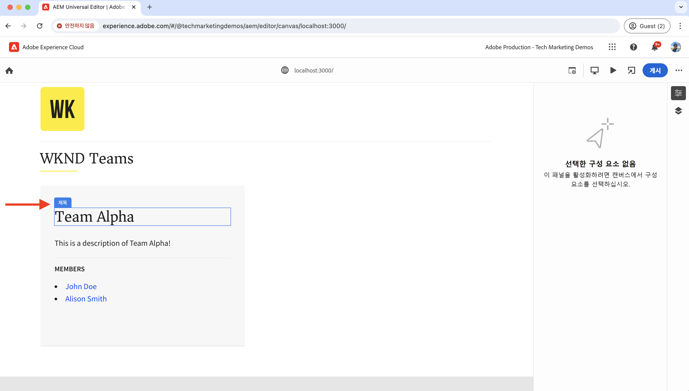
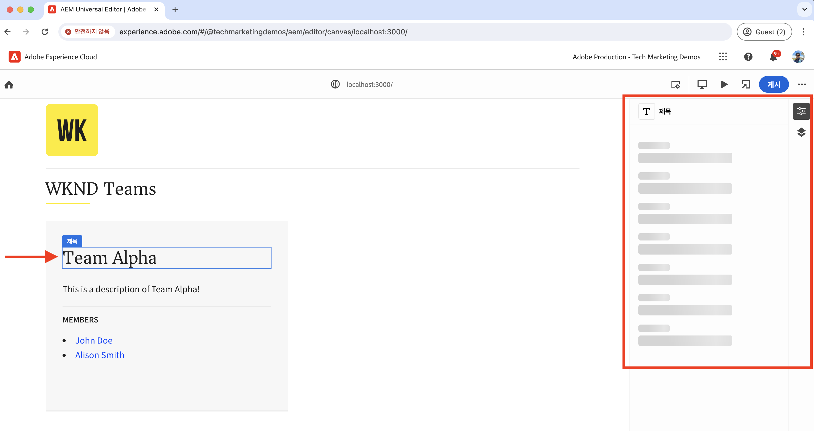
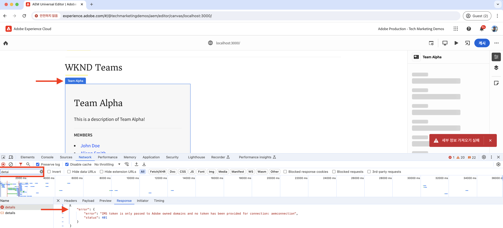
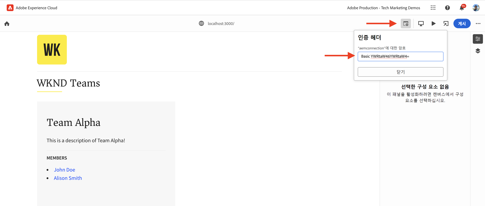
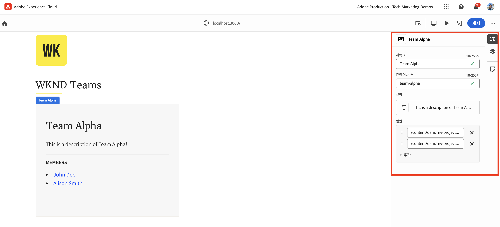
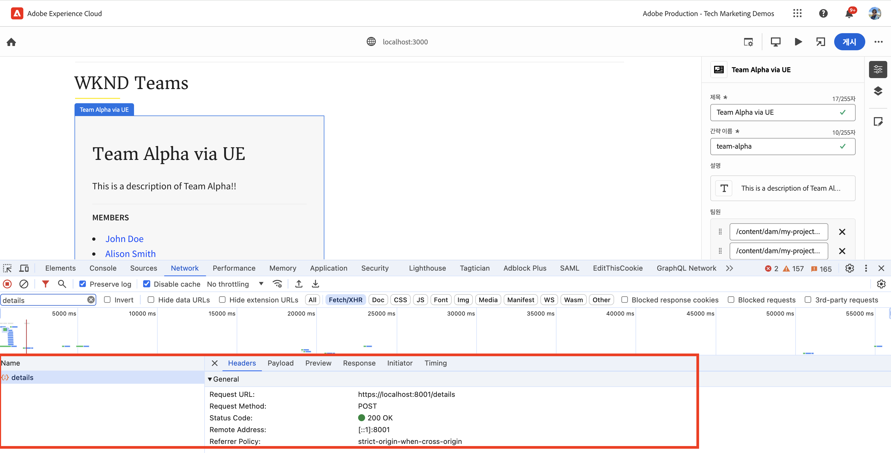
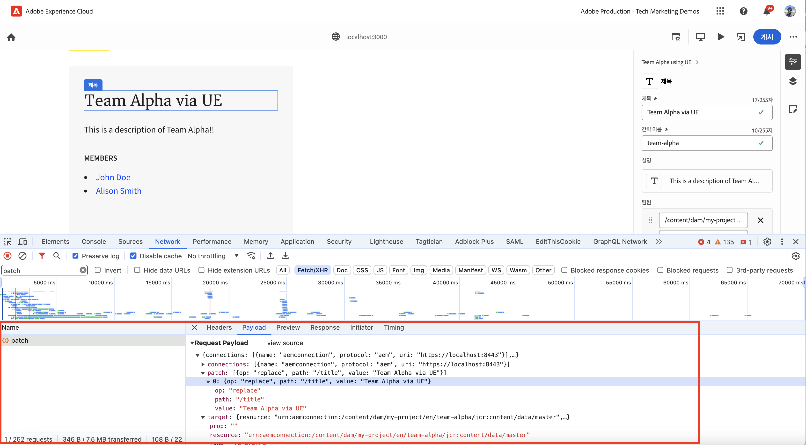
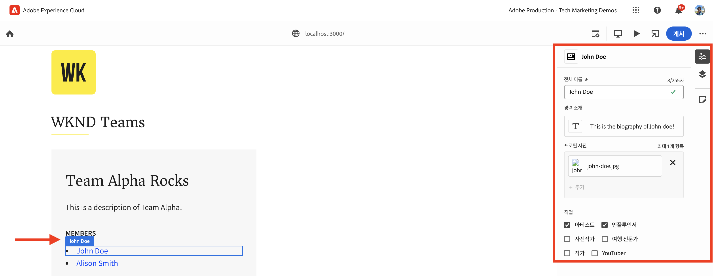
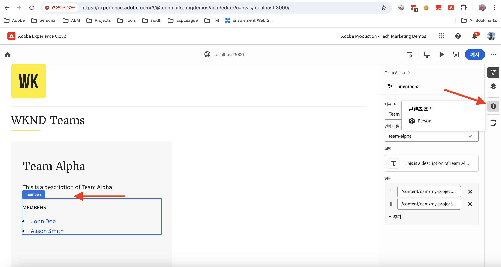
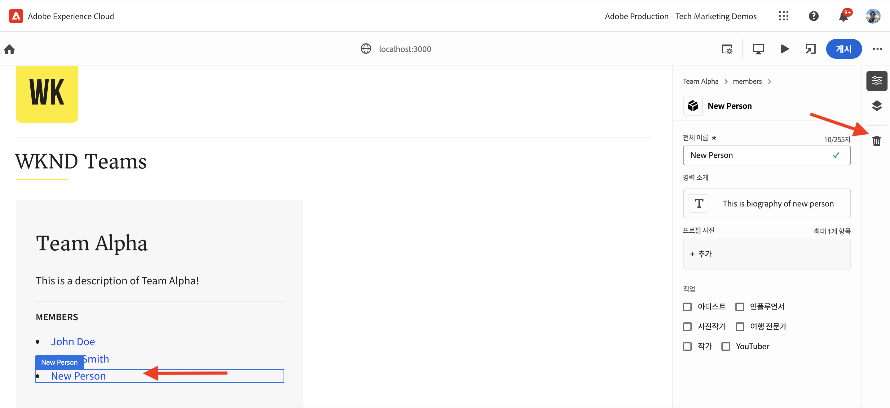

# 범용 편집기를 사용하여 콘텐츠를 편집하기 위한 React 앱 계측

범용 편집기를 사용하여 React 앱의 콘텐츠를 편집하는 방법을 알아봅니다.

## 사전 요구 사항

이전 [로컬 개발 설정](./local-development-setup.md) 단계에서 설명한 대로 로컬 개발 환경을 설정한 상태입니다.

## 범용 편집기 핵심 라이브러리 포함

먼저 WKND Teams React 앱에 범용 편집기 핵심 라이브러리를 포함해 보겠습니다. 편집된 앱과 범용 편집기 간에 통신 계층을 제공하는 JavaScript 라이브러리입니다.

React 앱에 범용 편집기 핵심 라이브러리를 포함하는 방법에는 두 가지가 있습니다.

1. npm 레지스트리의 노드 모듈 종속성은 [@adobe/universal-editor-cors](https://www.npmjs.com/package/@adobe/universal-editor-cors)에서 확인할 수 있습니다.
1. HTML 파일 내 스크립트 태그(`<script>`)입니다.

이 튜토리얼에서는 스크립트 태그 방식을 사용해 보겠습니다.

1. React 앱에서 태그를 관리하려면 `react-helmet-async`패키지를 설치`<script>`합니다.

   ```bash
   $ npm install react-helmet-async
   ```

1. WKND Teams React 앱의 `src/App.js` 파일을 업데이트하여 범용 편집기 핵심 라이브러리를 포함하도록 합니다.

   ```javascript
   ...
   import { Helmet, HelmetProvider } from "react-helmet-async";
   
   function App() {
   return (
       <HelmetProvider>
           <div className="App">
               <Helmet>
                   {/* AEM Universal Editor :: CORE Library
                     Loads the LATEST Universal Editor library
                   */}
                   <script
                       src="https://universal-editor-service.adobe.io/cors.js"
                       async
                   />
               </Helmet>
               <Router>
                   <header>
                       <Link to={"/"}>
                       
                       </Link>
                       <hr />
                   </header>
                   <Routes>
                       <Route path="/" element={<Home />} />
                       <Route path="/person/:fullName" element={<Person />} />
                   </Routes>
               </Router>
           </div>
       </HelmetProvider>
   );
   }
   
   export default App;
   ```

## 메타데이터 추가 - 콘텐츠 소스

편집을 위해 WKND Teams React 앱 _을 콘텐츠 소스_&#x200B;와 연결하려면 연결 메타데이터를 제공해야 합니다. 범용 편집기 서비스는 이 메타데이터를 사용하여 콘텐츠 소스와의 연결을 설정합니다.

연결 메타데이터는 HTML 파일에 `<meta>` 태그로 저장됩니다. 연결 메타데이터의 구문은 다음과 같습니다.

```html
<meta name="urn:adobe:aue:<category>:<referenceName>" content="<protocol>:<url>">
```

`<Helmet>` 구성 요소 내에서 WKND Teams React 앱에 연결 메타데이터를 추가해 보겠습니다. `<meta>` 태그를 사용하여 `src/App.js` 파일을 업데이트합니다. 이 예제에서 콘텐츠 소스는 `https://localhost:8443`에서 실행되는 로컬 AEM 인스턴스입니다.

```javascript
...
function App() {
return (
    <HelmetProvider>
        <div className="App">
            <Helmet>
                {/* AEM Universal Editor :: CORE Library
                    Loads the LATEST Universal Editor library
                */}
                <script
                    src="https://universal-editor-service.adobe.io/cors.js"
                    async
                />
                {/* AEM Universal Editor :: Connection metadata 
                    Connects to local AEM instance
                */}
                <meta
                    name="urn:adobe:aue:system:aemconnection"
                    content={`aem:https://localhost:8443`}
                />
            </Helmet>
            ...
    </HelmetProvider>
);
}

export default App;
```

`aemconnection`는 콘텐츠 소스의 짧은 이름을 제공합니다. 이후의 계측에서는 짧은 이름을 사용하여 콘텐츠 소스를 참조합니다.

## 메타데이터 추가 - 로컬 범용 편집기 서비스 구성

Adobe에서 호스팅하는 범용 편집기 서비스 대신, 범용 편집기 서비스의 로컬 복사본이 로컬 개발에 사용됩니다. 로컬 서비스는 범용 편집기와 AEM SDK를 바인딩하므로 로컬 범용 편집기 서비스 메타데이터를 WKND Teams React 앱에 추가해 보겠습니다.

이러한 구성 설정은 HTML 파일에 `<meta>` 태그로도 저장됩니다. 로컬 범용 편집기 서비스 메타데이터의 구문은 다음과 같습니다.

```html
<meta name="urn:adobe:aue:config:service" content="<url>">
```

`<Helmet>` 구성 요소 내에서 WKND Teams React 앱에 연결 메타데이터를 추가해 보겠습니다. `<meta>` 태그를 사용하여 `src/App.js` 파일을 업데이트합니다. 이 예제에서는 로컬 범용 편집기 서비스가 `https://localhost:8001`에서 실행되고 있습니다.

```javascript
...

function App() {
  return (
    <HelmetProvider>
      <div className="App">
        <Helmet>
          {/* AEM Universal Editor :: CORE Library
              Loads the LATEST Universal Editor library
          */}
          <script
            src="https://universal-editor-service.adobe.io/cors.js"
            async
          />
          {/* AEM Universal Editor :: Connection metadata 
              Connects to local AEM instance
          */}
          <meta
            name="urn:adobe:aue:system:aemconnection"
            content={`aem:https://localhost:8443`}
          />
          {/* AEM Universal Editor :: Configuration for Service
              Using locally running Universal Editor service
          */}
          <meta
            name="urn:adobe:aue:config:service"
            content={`https://localhost:8001`}
          />
        </Helmet>
        ...
    </HelmetProvider>
);
}
export default App;
```

## React 구성 요소 계측

_팀 제목 및 팀 설명_&#x200B;과 같은 WKND Teams React 앱의 내용을 편집하려면 React 구성 요소를 계측해야 합니다. 계측이란 범용 편집기를 사용하여 편집 가능하게 만들고자 하는 HTML 요소에 관련 데이터 속성(`data-aue-*`)을 추가하는 것을 의미합니다. 데이터 속성에 대한 자세한 내용은 [속성 및 유형](https://experienceleague.adobe.com/ko/docs/experience-manager-cloud-service/content/implementing/developing/universal-editor/attributes-types)에서 확인할 수 있습니다.

### 편집 가능한 요소 정의

먼저 범용 편집기를 사용하여 편집하려는 요소를 정의해 보겠습니다. WKND Teams React 앱에서는 팀 제목과 설명이 AEM의 팀 콘텐츠 조각에 저장되므로 편집에 가장 적합합니다.

`Teams` React 구성 요소를 사용하여 팀 제목과 설명을 편집할 수 있도록 해 보겠습니다.

1. WKND Teams React 앱의 `src/components/Teams.js` 파일을 엽니다.
1. 팀 타이틀과 설명 요소에 `data-aue-prop`, `data-aue-type` 및 `data-aue-label` 속성을 추가합니다.

   ```javascript
   ...
   function Teams() {
       const { teams, error } = useAllTeams();
       ...
   
       return (
           <div className="team">
               // AEM Universal Editor :: Instrumentation using data-aue-* attributes
               <h2 className="team__title" data-aue-prop="title" data-aue-type="text" data-aue-label="title">{title}</h2>
               <p className="team__description" data-aue-prop="description" data-aue-type="richtext" data-aue-label="description">{description.plaintext}</p>
               ...
           </div>
       );
   }
   
   export default Teams;
   ```

1. WKND Teams React 앱을 로드하는 브라우저에서 범용 편집기 페이지를 새로 고침합니다. 이제 팀 제목과 설명 요소를 편집할 수 있다는 것을 알 수 있습니다.

   

1. 인라인 편집이나 속성 레일을 사용하여 팀 제목이나 설명을 편집하려고 하면 로딩 스피너가 표시되나 콘텐츠를 편집할 수는 없습니다. 범용 편집기는 콘텐츠를 로드하고 저장하기 위한 AEM 리소스 세부 정보를 인식하지 못하기 때문입니다.

   

요약하자면, 위의 변경 사항은 범용 편집기에서 팀 제목과 설명 요소를 편집할 수 있음을 나타냅니다. 하지만 **아직은 인라인이나 속성 레일을 통해 변경 내용을 편집하고 저장할 수 없습니다**. 그러려면 `data-aue-resource` 속성을 사용하여 AEM 리소스 세부 정보를 추가해야 합니다. 다음 단계에서 이를 진행해 보겠습니다.

### AEM 리소스 세부 정보 정의

편집한 내용을 AEM에 다시 저장하고 속성 레일에 내용을 로드하려면 범용 편집기에 AEM 리소스 세부 정보를 제공해야 합니다.

이 경우 AEM 리소스는 팀 콘텐츠 조각 경로이므로 최상위 수준의 `<div>` 구성 요소에 있는 `Teams` React 구성 요소에 리소스 세부 정보를 추가해 보겠습니다.

1. `src/components/Teams.js` 파일을 업데이트하여 `data-aue-resource`, `data-aue-type`, `data-aue-label` 속성을 `<div>` 요소의 최상위 수준에 추가합니다.

   ```javascript
   ...
   function Teams() {
       const { teams, error } = useAllTeams();
       ...
   
       // Render single Team
       function Team({ _path, title, shortName, description, teamMembers }) {
           // Must have title, shortName and at least 1 team member
           if (!_path || !title || !shortName || !teamMembers) {
               return null;
           }
   
         return (
           // AEM Universal Editor :: Instrumentation using data-aue-* attributes
           <div className="team" data-aue-resource={`urn:aemconnection:${_path}/jcr:content/data/master`} data-aue-type="reference" data-aue-label={title}>
           ...
           </div>
       );
       }
   }
   export default Teams;
   ```

   `data-aue-resource` 속성의 값은 팀 콘텐츠 조각의 EM 리소스 경로입니다. `urn:aemconnection:` 접두사는 연결 메타데이터에 정의된 콘텐츠 소스의 짧은 이름을 사용합니다.

1. WKND Teams React 앱을 로드하는 브라우저에서 범용 편집기 페이지를 새로 고침합니다. 이제 최상위 팀 요소는 편집 가능하지만 속성 레일은 여전히 콘텐츠를 로드하지 않는 것이 확인됩니다. 브라우저의 네트워크 탭에서 콘텐츠를 로드하는 `details` 요청에 대한 401 인증되지 않음 오류가 표시됩니다. IMS 토큰을 사용하여 인증을 시도하지만 로컬 AEM SDK는 IMS 인증을 지원하지 않습니다.

   

1. 401 인증되지 않음 오류를 해결하려면 범용 편집기에서 **인증 머리말** 옵션을 사용하여 로컬 AEM SDK 인증 세부 정보를 범용 편집기에 제공해야 합니다. 로컬 AEM SDK와 마찬가지로 `admin:admin` 자격 증명에 대한 값을 `Basic YWRtaW46YWRtaW4=`로 설정합니다.

   

1. WKND Teams React 앱을 로드하는 브라우저에서 범용 편집기 페이지를 새로 고침합니다. 이제 속성 레일이 콘텐츠를 로드하는 것을 볼 수 있으며, 속성 레일을 사용하여 팀 제목과 설명을 인라인으로 편집할 수 있습니다.

   

#### 후드 아래

속성 레일은 로컬 범용 편집기 서비스를 사용하여 AEM 리소스에서 콘텐츠를 로드합니다. 브라우저의 네트워크 탭을 사용하면 로컬 범용 편집기 서비스(`https://localhost:8001/details`)에 대한 POST을 확인하고 콘텐츠를 로드할 수 있습니다.

인라인 편집이나 속성 레일을 사용하여 콘텐츠를 편집하면 변경 사항이 로컬 범용 편집기 서비스를 사용하여 AEM 리소스에 다시 저장됩니다. 브라우저의 네트워크 탭을 사용하면 로컬 범용 편집기 서비스(`https://localhost:8001/update` 또는 `https://localhost:8001/patch`)에 대한 POST을 확인하고 콘텐츠를 저장할 수 있습니다.



요청 페이로드 JSON 오브젝트에는 콘텐츠 서버(`connections`), 리소스 경로(`target`), 업데이트된 콘텐츠(`patch`) 등의 필수 세부 정보가 포함되어 있습니다.



### 편집 가능한 콘텐츠 확장

속성 레일을 사용하여 팀원을 편집할 수 있도록 편집 가능한 콘텐츠를 확장하고 **팀원**&#x200B;에 계측을 적용해 보겠습니다.

위에서와 마찬가지로 `Teams` React 구성 요소에서 관련 `data-aue-*` 속성을 팀원에 추가합니다.

1. `src/components/Teams.js` 파일을 업데이트하여 데이터 속성을 `<li key={index} className="team__member">` 요소에 추가합니다.

   ```javascript
   ...
   function Teams() {
       const { teams, error } = useAllTeams();
       ...
   
       <div>
           <h4 className="team__members-title">Members</h4>
           <ul className="team__members">
               {/* Render the referenced Person models associated with the team */}
               {teamMembers.map((teamMember, index) => {
                   return (
                       // AEM Universal Editor :: Instrumentation using data-aue-* attributes
                       <li key={index} className="team__member" data-aue-resource={`urn:aemconnection:${teamMember?._path}/jcr:content/data/master`} data-aue-type="component" data-aue-label={teamMember.fullName}>
                       <Link to={`/person/${teamMember.fullName}`}>
                           {teamMember.fullName}
                       </Link>
                       </li>
                   );
               })}
           </ul>
       </div>
       ...
   }
   export default Teams;
   ```

   팀원이 AEM에 `Person` 콘텐츠 조각으로 저장되어 있으며 이동 가능/삭제 가능한 콘텐츠 부분임을 표시하는 데 도움이 되므로 `data-aue-type` 속성의 값은 `component`입니다.

1. WKND Teams React 앱을 로드하는 브라우저에서 범용 편집기 페이지를 새로 고침합니다. 이제 속성 레일을 사용하여 팀원을 편집할 수 있음을 확인할 수 있습니다.

   

#### 후드 아래

위에서와 마찬가지로 콘텐츠 검색 및 저장은 로컬 범용 편집기 서비스에서 수행됩니다. 로컬 범용 편집기 서비스에 콘텐츠를 로드하고 저장하기 위해 `/details`, `/update` 또는 `/patch` 요청이 이루어집니다.

### 콘텐츠 추가 및 삭제 정의

지금까지 기존 콘텐츠를 편집 가능하게 만들어 보았습니다. 새로운 콘텐츠를 추가하고 싶다면 어떻게 해야 할까요? 범용 편집기를 사용하여 WKND 팀에 팀원을 추가하거나 삭제하는 기능을 추가해 보겠습니다. 이에 따라 콘텐츠 작성자는 AEM으로 가서 팀원을 추가하거나 삭제할 필요가 없습니다.

간단히 요약하자면 WKND 팀원은 AEM 내 `Person` 콘텐츠 조각으로 저장되며 `teamMembers` 속성을 사용하여 팀 콘텐츠 조각과 연결됩니다. AEM에서 모델 정의를 검토하려면 [my-project](http://localhost:4502/libs/dam/cfm/models/console/content/models.html/conf/my-project)를 방문합니다.

1. 먼저 `/public/static/component-definition.json` 구성 요소 정의 파일을 만듭니다. 이 파일에는 `Person` 콘텐츠 조각에 대한 구성 요소 정의가 포함되어 있습니다. `aem/cf` 플러그인을 사용하면 기본값을 적용하는 모델과 템플릿을 기반으로 콘텐츠 조각을 삽입할 수 있습니다.

   ```json
   {
       "groups": [
           {
           "title": "Content Fragments",
           "id": "content-fragments",
           "components": [
               {
               "title": "Person",
               "id": "person",
               "plugins": {
                   "aem": {
                       "cf": {
                           "name": "person",
                           "cfModel": "/conf/my-project/settings/dam/cfm/models/person",
                           "cfFolder": "/content/dam/my-project/en",
                           "title": "person",
                           "template": {
                               "fullName": "New Person",
                               "biographyText": "This is biography of new person"
                               }
                           }
                       }
                   }
               }
           ]
           }
       ]
   }
   ```

1. WKND Teams React 앱의 `index.html` 파일에서 위의 구성 요소 정의 파일을 참조합니다. `public/index.html` 파일의 `<head>` 섹션을 업데이트하여 구성 요소 정의 파일을 포함합니다.

   ```html
   ...
   <script
       type="application/vnd.adobe.aue.component+json"
       src="/static/component-definition.json"
   ></script>
   <title>WKND App - Basic GraphQL Tutorial</title>
   </head>
   ...
   ```

1. 마지막으로 `src/components/Teams.js` 파일을 업데이트하여 데이터 속성을 추가합니다. **멤버** 섹션은 팀원에 대한 컨테이너 역할을 담당하므로 `data-aue-prop`, `data-aue-type`, `data-aue-label` 속성을 `<div>` 요소에 추가해 보겠습니다.

   ```javascript
   ...
   function Teams() {
       const { teams, error } = useAllTeams();
       ...
   
       {/* AEM Universal Editor :: Team Members as container */}
       <div data-aue-prop="teamMembers" data-aue-type="container" data-aue-label="members">
           <h4 className="team__members-title">Members</h4>
           <ul className="team__members">
           {/* Render the referenced Person models associated with the team */}
           {teamMembers.map((teamMember, index) => {
               return (
               // AEM Universal Editor :: Instrumentation using data-aue-* attributes
               <li key={index} className="team__member" data-aue-resource={`urn:aemconnection:${teamMember?._path}/jcr:content/data/master`} data-aue-type="component" data-aue-label={teamMember.fullName}>
                   <Link to={`/person/${teamMember.fullName}`}>
                   {teamMember.fullName}
                   </Link>
               </li>
               );
           })}
           </ul>
       </div>
       ...
   }
   export default Teams;
   ```

1. WKND Teams React 앱을 로드하는 브라우저에서 범용 편집기 페이지를 새로 고침합니다. 이제 **멤버** 섹션이 컨테이너 역할을 하는 것을 볼 수 있습니다. 속성 레일과 **+** 아이콘을 사용하면 새로운 팀원을 삽입할 수 있습니다.

   

1. 팀원을 삭제하려면 해당 팀원을 선택하고 **삭제** 아이콘을 클릭합니다.

   

#### 후드 아래

콘텐츠 추가 및 삭제 작업은 로컬 범용 편집기 서비스에서 수행됩니다. `/add` 또는 `/remove`에 대한 POST 요청은 자세한 페이로드와 함께 로컬 범용 편집기 서비스에 전송되어 AEM에 콘텐츠를 추가하거나 삭제합니다.

## 솔루션 파일

구현 변경 사항을 확인하거나 범용 편집기에서 WKND Teams React 앱을 작동할 수 없는 경우 [basic-tutorial-instrumented-for-UE](https://github.com/adobe/aem-guides-wknd-graphql/tree/solution/basic-tutorial-instrumented-for-UE) 솔루션 분기를 참조하시기 바랍니다.

작업 중인 **기본-튜토리얼** 분기와의 파일별 비교는 [여기](https://github.com/adobe/aem-guides-wknd-graphql/compare/solution/basic-tutorial...solution/basic-tutorial-instrumented-for-UE?expand=1)에서 확인할 수 있습니다.

## 축하합니다

범용 편집기를 사용하여 WKND Teams React 앱에 콘텐츠를 추가, 편집, 삭제하는 데 성공했습니다. 지금까지 핵심 라이브러리를 포함하고, 연결과 로컬 범용 편집기 서비스 메타데이터를 추가하고, 다양한 데이터(`data-aue-*`) 속성을 사용하여 React 구성 요소를 계측하는 방법을 알아보았습니다.
