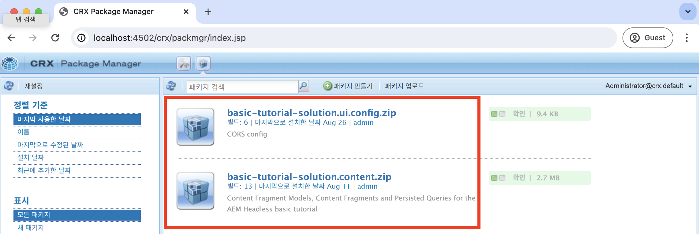
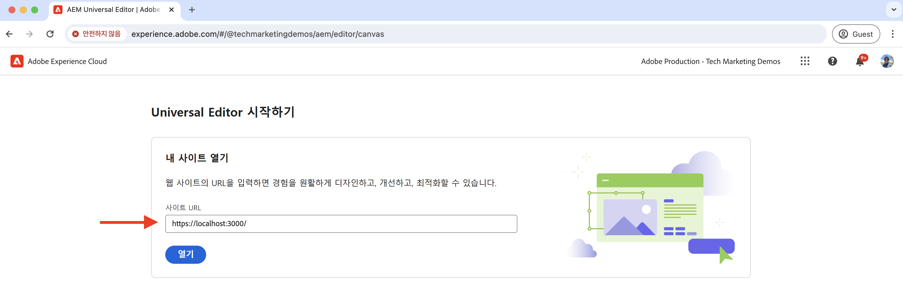
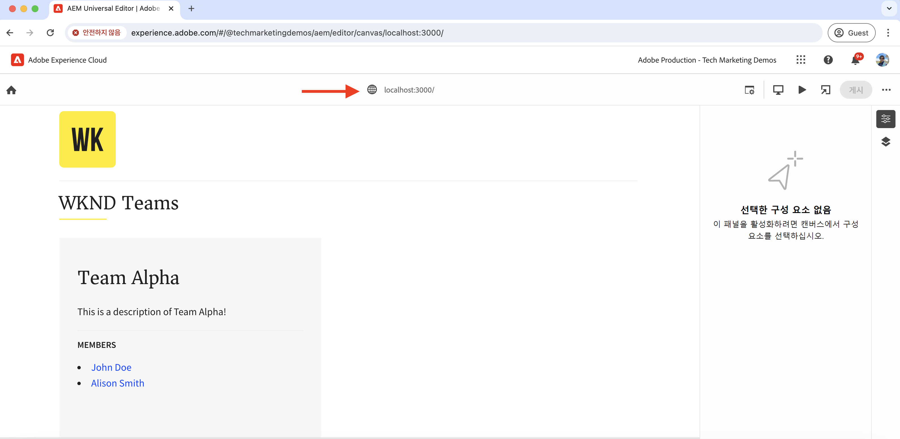

# 로컬 개발 설정

AEM 유니버설 편집기를 사용하여 React 앱의 콘텐츠를 편집하도록 로컬 개발 환경을 설정하는 방법에 대해 알아봅니다.

## 사전 요구 사항

이 튜토리얼을 따르려면 다음 사항이 필요합니다.

- 기본 HTML 및 JavaScript 스킬.
- 다음 도구가 로컬에 설치되어 있어야 합니다.
   - [Node.js](https://nodejs.org/en/download/)
   - [Git](https://git-scm.com/downloads)
   - [Visual Studio Code](https://code.visualstudio.com/)와 같은 IDE 또는 코드 편집기
- 다음을 다운로드하여 설치합니다.
   - [AEM as a Cloud Service SDK](https://experienceleague.adobe.com/en/docs/experience-manager-learn/cloud-service/local-development-environment-set-up/aem-runtime#download-the-aem-as-a-cloud-service-sdk): 여기에는 개발 목적으로 로컬에서 AEM 작성자 및 게시를 실행하는 데 사용되는 Quickstart Jar가 포함되어 있습니다.
   - [유니버설 편집기 서비스](https://experienceleague.adobe.com/en/docs/experience-cloud/software-distribution/home): 유니버설 편집기 서비스의 로컬 복사본으로, 기능의 하위 집합이 있으며 소프트웨어 배포 포털에서 다운로드할 수 있습니다.
   - [local-ssl-proxy](https://www.npmjs.com/package/local-ssl-proxy#local-ssl-proxy): 로컬 개발을 위해 자체 서명된 인증서를 사용하는 간단한 로컬 SSL HTTP 프록시입니다. AEM Universal Editor를 편집기에서 로드하려면 React 앱의 HTTPS URL이 필요합니다.

## 로컬 설정

로컬 개발 환경을 설정하려면 아래 단계를 따르십시오.

### AEM SDK

WKND Teams React 앱에 대한 콘텐츠를 제공하려면 로컬 AEM SDK에 다음 패키지를 설치하십시오.

- [WKND Teams - 콘텐츠 패키지](./assets/basic-tutorial-solution.content.zip): 콘텐츠 조각 모델, 콘텐츠 조각 및 지속 GraphQL 쿼리가 포함되어 있습니다.
- [WKND Teams - 구성 패키지](./assets/basic-tutorial-solution.ui.config.zip): CORS(원본 간 리소스 공유) 및 토큰 인증 처리기 구성을 포함합니다. CORS는 AEM이 아닌 웹 속성을 사용하여 AEM의 GraphQL API에 대한 브라우저 기반 클라이언트측 호출을 수행하고 토큰 인증 핸들러를 사용하여 AEM에 대한 각 요청을 인증합니다.

  

### React 앱

WKND Teams React 앱을 설정하려면 아래 단계를 따르십시오.

1. [ 솔루션 분기에서 ](https://github.com/adobe/aem-guides-wknd-graphql/tree/solution/basic-tutorial)WKND Teams React 앱`basic-tutorial`을 복제합니다.

   ```bash
   $ git clone -b solution/basic-tutorial git@github.com:adobe/aem-guides-wknd-graphql.git
   ```

1. `basic-tutorial` 디렉터리로 이동하여 코드 편집기에서 엽니다.

   ```bash
   $ cd aem-guides-wknd-graphql/basic-tutorial
   $ code .
   ```

1. 종속성을 설치하고 React 앱을 시작합니다.

   ```bash
   $ npm install
   $ npm start
   ```

1. 브라우저에서 [http://localhost:3000](http://localhost:3000)에 있는 WKND Teams React 앱을 엽니다. 이 페이지에는 팀원 목록과 세부 정보가 표시됩니다. React 앱의 콘텐츠는 브라우저의 네트워크 탭을 사용하여 확인할 수 있는 GraphQL API(`/graphql/execute.json/my-project/all-teams`)를 사용하여 로컬 AEM SDK에서 제공합니다.

   

### 유니버설 편집기 서비스

**local** 유니버설 편집기 서비스를 설정하려면 아래 단계를 따르십시오.

1. [소프트웨어 배포 포털](https://experience.adobe.com/downloads)에서 유니버설 편집기 서비스의 최신 버전을 다운로드하십시오.

   

1. 다운로드한 zip 파일을 추출하고 `universal-editor-service.cjs` 파일을 `universal-editor-service`(이)라는 새 디렉터리에 복사합니다.

   ```bash
   $ unzip universal-editor-service-vproduction-<version>.zip
   $ mkdir universal-editor-service
   $ cp universal-editor-service.cjs universal-editor-service
   ```

1. `.env` 디렉터리에 `universal-editor-service` 파일을 만들고 다음 환경 변수를 추가합니다.

   ```bash
   # The port on which the Universal Editor service runs
   UES_PORT=8000
   # Disable SSL verification
   UES_TLS_REJECT_UNAUTHORIZED=false
   ```

1. 로컬 유니버설 편집기 서비스를 시작합니다.

   ```bash
   $ cd universal-editor-service
   $ node universal-editor-service.cjs
   ```

위의 명령은 포트 `8000`에서 유니버설 편집기 서비스를 시작하고 다음 출력이 표시됩니다.

```bash
Either no private key or certificate was set. Starting as HTTP server
Universal Editor Service listening on port 8000 as HTTP Server
```

### 로컬 SSL HTTP 프록시

AEM 유니버설 편집기를 사용하려면 HTTPS를 통해 React 앱이 제공되어야 합니다. 로컬 개발을 위해 자체 서명된 인증서를 사용하는 로컬 SSL HTTP 프록시를 설정해 보겠습니다.

로컬 SSL HTTP 프록시를 설정하고 HTTPS를 통해 AEM SDK 및 유니버설 편집기 서비스를 제공하려면 아래 단계를 따르십시오.

1. `local-ssl-proxy` 패키지를 전체적으로 설치합니다.

   ```bash
   $ npm install -g local-ssl-proxy
   ```

1. 다음 서비스에 대해 로컬 SSL HTTP 프록시의 두 인스턴스를 시작합니다.

   - `8443` 포트의 AEM SDK 로컬 SSL HTTP 프록시입니다.
   - `8001` 포트의 유니버설 편집기 서비스 로컬 SSL HTTP 프록시입니다.

   ```bash
   # AEM SDK local SSL HTTP proxy on port 8443
   $ local-ssl-proxy --source 8443 --target 4502
   
   # Universal Editor service local SSL HTTP proxy on port 8001
   $ local-ssl-proxy --source 8001 --target 8000
   ```

### HTTPS를 사용하도록 React 앱 업데이트

WKND Teams React 앱에 대해 HTTPS를 활성화하려면 아래 단계를 따르십시오.

1. 터미널에서 `Ctrl + C`을(를) 눌러 React를 중지합니다.
1. `package.json` 스크립트에 `HTTPS=true` 환경 변수를 포함하도록 `start` 파일을 업데이트하십시오.

   ```json
   "scripts": {
       "start": "HTTPS=true react-scripts start",
       ...
   }
   ```

1. AEM SDK의 HTTPS 프로토콜 및 로컬 SSL HTTP 프록시 포트를 사용하도록 `REACT_APP_HOST_URI` 파일에서 `.env.development`을(를) 업데이트합니다.

   ```bash
   REACT_APP_HOST_URI=https://localhost:8443
   ...
   ```

1. `../src/proxy/setupProxy.auth.basic.js` 옵션을 사용하여 느슨한 SSL 설정을 사용하도록 `secure: false` 파일을 업데이트하십시오.

   ```javascript
   ...
   module.exports = function(app) {
   app.use(
       ['/content', '/graphql'],
       createProxyMiddleware({
       target: REACT_APP_HOST_URI,
       changeOrigin: true,
       secure: false, // Ignore SSL certificate errors
       // pass in credentials when developing against an Author environment
       auth: `${REACT_APP_BASIC_AUTH_USER}:${REACT_APP_BASIC_AUTH_PASS}`
       })
   );
   };
   ```

1. React 앱을 시작합니다.

   ```bash
   $ npm start
   ```

## 설정 확인

위의 단계를 사용하여 로컬 개발 환경을 설정한 후 설정을 확인하겠습니다.

### 로컬 확인

다음 서비스가 HTTPS를 통해 로컬로 실행되고 있는지 확인하십시오. 브라우저에서 자체 서명된 인증서에 대한 보안 경고를 수락해야 할 수 있습니다.

1. [https://localhost:3000](https://localhost:3000)에서 WKND Teams React 앱
1. [https://localhost:8443](https://localhost:8443)의 AEM SDK
1. [https://localhost:8001](https://localhost:8001)의 유니버설 편집기 서비스

### 범용 편집기에서 WKND Teams React 앱 로드

범용 편집기에서 WKND Teams React 앱을 로드하여 설정을 확인하겠습니다.

1. 브라우저에서 범용 편집기 https://experience.adobe.com/#/aem/editor 를 엽니다. 메시지가 표시되면 Adobe ID을 사용하여 로그인합니다.

1. 유니버설 편집기의 사이트 URL 입력 필드에 WKND Teams React 앱 URL을 입력하고 `Open`을(를) 클릭합니다.

   

1. WKND Teams React 앱이 유니버설 편집기 **에 로드되지만 아직 콘텐츠를 편집할 수 없습니다**. 범용 편집기를 사용하여 콘텐츠 편집을 활성화하려면 React 앱을 계측해야 합니다.

   


## 다음 단계

콘텐츠를 편집하기 위해 [React 앱을 계측하는 방법](./instrument-to-edit-content.md)을 알아보세요.
