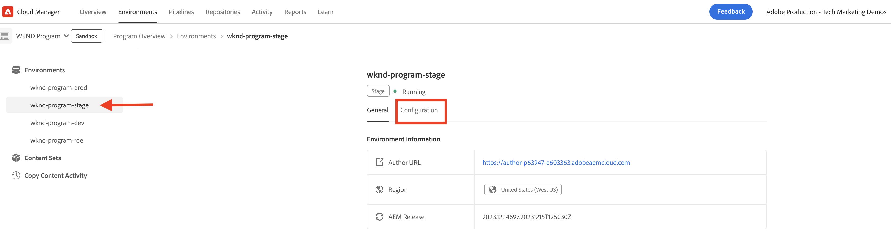
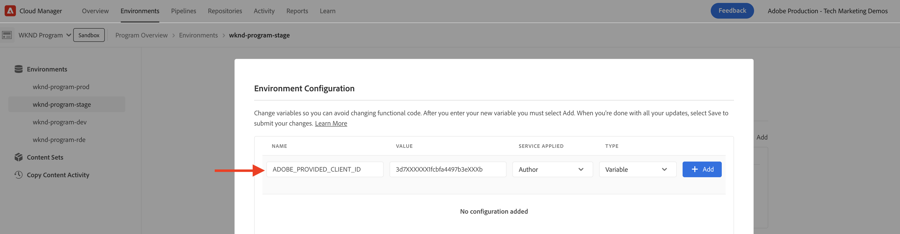

# PIM 통합을 위한 AEM Assets 이벤트

>[!IMPORTANT]
>
>이 자습서에서는 실험적인 AEM as a Cloud Service API를 사용합니다. 이러한 API에 액세스하려면 프리릴리스 소프트웨어 계약에 동의하고 Adobe 엔지니어링을 통해 이러한 API를 사용자 환경에서 수동으로 활성화해야 합니다. 액세스 권한을 요청하려면 Adobe 지원 담당자에게 문의하십시오.

AEM Assets을 PIM(제품 정보 관리) 또는 PLM(제품 라인 관리) 시스템과 같은 서드파티 시스템과 통합하여 에셋 메타데이터를 업데이트하는 방법에 대해 알아봅니다 **기본 AEM IO 이벤트 사용**. AEM Assets 이벤트를 수신하면 비즈니스 요구 사항에 따라 AEM, PIM 또는 두 시스템 모두에서 에셋 메타데이터를 업데이트할 수 있습니다. 그러나 이 예에서는 AEM에서 자산 메타데이터를 업데이트하는 방법을 보여 줍니다.

>[!VIDEO](https://video.tv.adobe.com/v/3427592?quality=12&learn=on)

자산 메타데이터 업데이트를 실행하려면 **AEM 외부의 코드**, [Adobe I/O Runtime](https://developer.adobe.com/runtime/docs/guides/overview/what_is_runtime/)서버리스 플랫폼이 사용됩니다.

이벤트 처리 플로우는 다음과 같습니다.


1. AEM Author 서비스가 _자산 처리 완료됨_ 이벤트: 에셋 업로드가 완료되고 모든 에셋 처리 활동이 완료된 경우. 처리가 완료될 때까지 기다리면 메타데이터 추출과 같은 기본 제공 처리가 완료됩니다.
1. 이벤트가 로 전송됩니다. [Adobe I/O 이벤트](https://developer.adobe.com/events/) 서비스.
1. 이벤트 Adobe I/O 서비스는에 이벤트를 전달합니다 [Adobe I/O Runtime 작업](https://developer.adobe.com/runtime/docs/guides/using/creating_actions/) 처리용.
1. Adobe I/O Runtime 작업은 PIM 시스템의 API를 호출하여 SKU, 공급자 정보 또는 기타 세부 정보와 같은 추가 메타데이터를 검색합니다.
1. 그런 다음 PIM에서 검색한 추가 메타데이터는 다음을 사용하여 AEM Assets에서 업데이트됩니다. [Assets 작성자 API](https://developer.adobe.com/experience-cloud/experience-manager-apis/api/experimental/assets/author/).

## 사전 요구 사항

이 자습서를 완료하려면 다음이 필요합니다.

- AEM as a Cloud Service 환경 [AEM 이벤트 활성화됨](https://developer.adobe.com/experience-cloud/experience-manager-apis/guides/events/#enable-aem-events-on-your-aem-cloud-service-environment). 또한 샘플도 [WKND 사이트](https://github.com/adobe/aem-guides-wknd?#aem-wknd-sites-project) 프로젝트가 배포되어야 합니다.

- 액세스 대상: [Adobe Developer 콘솔](https://developer.adobe.com/developer-console/docs/guides/getting-started/).

- [ADOBE DEVELOPER CLI](https://developer.adobe.com/runtime/docs/guides/tools/cli_install/) 가 로컬 컴퓨터에 설치되었습니다.

## 개발 단계

높은 수준의 개발 단계는 다음과 같습니다.

1. [Adobe Developer 콘솔(ADC)에서 프로젝트 만들기](./runtime-action.md#Create-project-in-Adobe-Developer-Console)
1. [로컬 개발을 위해 프로젝트 초기화](./runtime-action.md#initialize-project-for-local-development)
1. ADC에서 프로젝트 구성
1. ADC 프로젝트 통신을 사용하도록 AEM 작성자 서비스 구성
1. 메타데이터 검색 및 업데이트를 오케스트레이션하는 런타임 작업 개발
1. 자산을 AEM Author 서비스에 업로드하고 메타데이터가 업데이트되었는지 확인합니다

1-2단계에 대한 자세한 내용은 [Adobe I/O Runtime 작업 및 AEM 이벤트](./runtime-action.md#) 예 및 3-6단계의 경우 다음 섹션을 참조하십시오.

### Adobe Developer 콘솔(ADC)에서 프로젝트 구성

AEM Assets 이벤트를 수신하고 이전 단계에서 만든 Adobe I/O Runtime 작업을 실행하려면 ADC에서 프로젝트를 구성합니다.

- ADC에서 [프로젝트](https://developer.adobe.com/console/projects). 다음 항목 선택 `Stage` workspace, 여기서 런타임 작업이 배포되었습니다.

- 다음을 클릭합니다. **서비스 추가** 버튼을 클릭하고 다음을 선택합니다. **이벤트** 옵션을 선택합니다. 다음에서 **이벤트 추가** 대화 상자, 선택 **Experience Cloud** > **AEM Assets**, 및 클릭 **다음**. 추가 구성 단계를 수행하고 AEMCS 인스턴스, _자산 처리 완료됨_ event, OAuth 서버 간 인증 유형 및 기타 세부 사항.

  

- 마지막으로 **이벤트 수신 방법** 단계, 확장 **런타임 작업** 옵션을 선택하고 _일반_ 이전 단계에서 만든 작업입니다. 클릭 **구성된 이벤트 저장**.

  

- 마찬가지로 **서비스 추가** 버튼을 클릭하고 다음을 선택합니다. **API** 옵션을 선택합니다. 다음에서 **API 추가** 모달, 선택 **Experience Cloud** > **AEM AS A CLOUD SERVICE API** 및 클릭 **다음**.

  

- 그런 다음 을 선택합니다 **OAuth 서버 간** 인증 유형 및 클릭 **다음**.

- 그런 다음 를 선택합니다. **AEM Administrators-XXX** 제품 프로필 및 클릭 **구성된 API 저장**. 해당 에셋을 업데이트하려면 선택한 제품 프로필이 이벤트가 생성되는 AEM Assets 환경과 연결되어 있어야 하며 에셋을 업데이트할 수 있는 충분한 액세스 권한이 있어야 합니다.

  

### ADC 프로젝트 통신을 사용하도록 AEM 작성자 서비스 구성

위의 ADC 프로젝트에서 AEM의 에셋 메타데이터를 업데이트하려면 ADC 프로젝트의 클라이언트 ID로 AEM 작성자 서비스를 구성합니다. 다음 _클라이언트 id_ 를 사용하여 환경 변수로 추가됩니다 [Adobe Cloud Manager](https://experienceleague.adobe.com/docs/experience-manager-cloud-service/content/implementing/using-cloud-manager/environment-variables.html#add-variables) UI.

- 다음으로 로그인 [Adobe Cloud Manager](https://my.cloudmanager.adobe.com/), 선택 **프로그램** > **환경** > **생략 부호** > **세부 사항 보기** > **구성** 탭.

  

- 그러면 **구성 추가** 버튼을 클릭하고 변수 세부 사항을 입력합니다.

  | 이름 | 값 | AEM 서비스 | 유형 |
  | ----------- | ----------- | ----------- | ----------- |
  | ADOBE 제공 클라이언트 ID | &lt;COPY_FROM_ADC_PROJECT_CREDENTIALS> | 작성자 | 변수 |

  

- 클릭 **추가** 및 **저장** 구성.

### 런타임 작업 개발

메타데이터 검색 및 업데이트를 수행하려면 먼저 자동 생성 _일반_ 의 작업 코드 `src/dx-excshell-1/actions/generic` 폴더를 삭제합니다.

첨부된 을 참조하십시오 [WKND-Assets-PIM-Integration.zip](../assets/examples/assets-pim-integration/WKND-Assets-PIM-Integration.zip) 전체 코드의 파일 및 아래 섹션에서 주요 파일을 강조 표시합니다.

- 다음 `src/dx-excshell-1/actions/generic/mockPIMCommunicator.js` 파일은 PIM API 호출을 클릭하여 SKU 및 공급자 이름과 같은 추가 메타데이터를 검색합니다. 이 파일은 데모용으로 사용됩니다. 전체적인 흐름이 작동하면 이 함수를 실제 PIM 시스템에 대한 호출로 대체하여 에셋에 대한 메타데이터를 검색합니다.

  ```javascript
  /**
   * Mock PIM API to get the product data such as SKU, Supplier, etc.
   *
   * In a real-world scenario, this function would call the PIM API to get the product data.
   * For this example, we are returning mock data.
   *
   * @param {string} assetId - The assetId to get the product data.
   */
  module.exports = {
      async getPIMData(assetId) {
          if (!assetId) {
          throw new Error('Invalid assetId');
          }
          // Mock response data for demo purposes
          const data = {
          SKUID: 'MockSKU 123',
          SupplierName: 'mock-supplier',
          // ... other product data
          };
          return data;
      },
  };
  ```

- 다음 `src/dx-excshell-1/actions/generic/aemCommunicator.js` 파일은 를 사용하여 AEM의 자산 메타데이터를 업데이트합니다. [Assets 작성자 API](https://developer.adobe.com/experience-cloud/experience-manager-apis/api/experimental/assets/author/).

  ```javascript
  const fetch = require('node-fetch');
  
  ...
  
  /**
  *  Get IMS Access Token using Client Credentials Flow
  *
  * @param {*} clientId - IMS Client ID from ADC project's OAuth Server-to-Server Integration
  * @param {*} clientSecret - IMS Client Secret from ADC project's OAuth Server-to-Server Integration
  * @param {*} scopes - IMS Meta Scopes from ADC project's OAuth Server-to-Server Integration as comma separated strings
  * @returns {string} - Returns the IMS Access Token
  */
  async function getIMSAccessToken(clientId, clientSecret, scopes) {
    const adobeIMSV3TokenEndpointURL = 'https://ims-na1.adobelogin.com/ims/token/v3';
  
    const options = {
      method: 'POST',
      headers: {
        'Content-Type': 'application/x-www-form-urlencoded',
      },
      body: `grant_type=client_credentials&client_id=${clientId}&client_secret=${clientSecret}&scope=${scopes}`,
    };
  
    const response = await fetch(adobeIMSV3TokenEndpointURL, options);
    const responseJSON = await response.json();
  
    return responseJSON.access_token;
  }    
  
  async function updateAEMAssetMetadata(metadataDetails, aemAssetEvent, params) {
    ...
    // Transform the metadata details to JSON Patch format,
    // see https://developer.adobe.com/experience-cloud/experience-manager-apis/api/experimental/assets/author/#operation/patchAssetMetadata
    const transformedMetadata = Object.keys(metadataDetails).map((key) => ({
      op: 'add',
      path: `wknd-${key.toLowerCase()}`,
      value: metadataDetails[key],
    }));
  
    ...
  
    // Get ADC project's OAuth Server-to-Server Integration credentials
    const clientId = params.ADC_CECREDENTIALS_CLIENTID;
    const clientSecret = params.ADC_CECREDENTIALS_CLIENTSECRET;
    const scopes = params.ADC_CECREDENTIALS_METASCOPES;
  
    // Get IMS Access Token using Client Credentials Flow
    const access_token = await getIMSAccessToken(clientId, clientSecret, scopes);
  
    // Call AEM Author service to update the metadata using Assets Author API
    // See https://developer.adobe.com/experience-cloud/experience-manager-apis/api/experimental/assets/author/
    const res = await fetch(`${aemAuthorHost}/adobe/assets/${assetId}/metadata`, {
      method: 'PATCH',
      headers: {
        'Content-Type': 'application/json-patch+json',
        'If-Match': '*',
        'X-Adobe-Accept-Experimental': '1',
        'X-Api-Key': 'aem-assets-management-api', // temporary value
        Authorization: `Bearer ${access_token}`,
      },
      body: JSON.stringify(transformedMetadata),
    });
  
    ...
  }
  
  module.exports = { updateAEMAssetMetadata };
  ```

  다음 `.env` 파일은 ADC 프로젝트의 OAuth 서버 간 자격 증명 세부 사항을 저장하고, 을 사용하여 작업에 매개 변수로 전달됩니다. `ext.config.yaml` 파일. 다음을 참조하십시오. [App Builder 구성 파일](https://developer.adobe.com/app-builder/docs/guides/configuration/) 암호 및 작업 매개 변수 관리.

- 다음 `src/dx-excshell-1/actions/model` 폴더에 다음 포함: `aemAssetEvent.js` 및 `errors.js` 파일: 작업에서 수신된 이벤트를 구문 분석하고 오류를 처리하는 데 각각 사용됩니다.

- 다음 `src/dx-excshell-1/actions/generic/index.js` 파일은 앞에서 언급한 모듈을 사용하여 메타데이터 검색 및 업데이트를 조정합니다.

  ```javascript
  ...
  
  let responseMsg;
  // handle the challenge probe request, they are sent by I/O to verify the action is valid
  if (params.challenge) {
    logger.info('Challenge probe request detected');
    responseMsg = JSON.stringify({ challenge: params.challenge });
  } else {
    logger.info('AEM Asset Event request received');
  
    // create AEM Asset Event object from request parameters
    const aemAssetEvent = new AEMAssetEvent(params);
  
    // Call mock PIM API to get the product data such as SKU, Supplier, etc.
    const mockPIMData = await mockPIMAPI.getPIMData(
      aemAssetEvent.getAssetName(),
    );
    logger.info('Mock PIM API response', mockPIMData);
  
    // Update PIM received data in AEM as Asset metadata
    const aemUpdateStatus = await updateAEMAssetMetadata(
      mockPIMData,
      aemAssetEvent,
      params,
    );
    logger.info('AEM Asset metadata update status', aemUpdateStatus);
  
    if (aemUpdateStatus) {
      // create response message
      responseMsg = JSON.stringify({
        message:
          'AEM Asset Event processed successfully, updated the asset metadata with PIM data.',
        assetdata: {
          assetName: aemAssetEvent.getAssetName(),
          assetPath: aemAssetEvent.getAssetPath(),
          assetId: aemAssetEvent.getAssetId(),
          aemHost: aemAssetEvent.getAEMHost(),
          pimdata: mockPIMData,
        },
      });
    } 
  
    // response object
    const response = {
      statusCode: 200,
      body: responseMsg,
    };
  
    // Return the response to the caller
    return response;
  
    ...
  }
  ```

다음 명령을 사용하여 업데이트된 작업을 Adobe I/O Runtime에 배포합니다.

```bash
$ aio app deploy
```

### 에셋 업로드 및 메타데이터 확인

AEM Assets 및 PIM 통합을 확인하려면 다음 단계를 따르십시오.

- SKU 및 공급업체 이름과 같은 모의 PIM 제공 메타데이터를 보려면 AEM Assets에서 메타데이터 스키마를 만드십시오. [메타데이터 스키마](https://experienceleague.adobe.com/docs/experience-manager-learn/assets/configuring/metadata-schemas.html) sku 및 공급자명 메타데이터 속성을 표시합니다.

- AEM Author 서비스에서 에셋을 업로드하고 메타데이터 업데이트를 확인합니다.

  

## 개념 및 주요 특징

엔터프라이즈에서 AEM과 PIM과 같은 다른 시스템 간의 에셋 메타데이터 동기화가 필요한 경우가 많습니다. AEM 이벤트를 사용하면 이러한 요구 사항을 충족할 수 있습니다.

- 에셋 메타데이터 검색 코드는 AEM 외부에서 실행되므로 AEM Author 서비스에 대한 로드를 방지하여 독립적으로 확장하는 이벤트 기반 아키텍처가 사용됩니다.
- 새로 도입된 에셋 작성자 API는 AEM에서 에셋 메타데이터를 업데이트하는 데 사용됩니다.
- API 인증은 OAuth 서버 간(즉, 클라이언트 자격 증명 흐름)을 사용합니다. 참조: [OAuth 서버 간 자격 증명 구현 안내서](https://developer.adobe.com/developer-console/docs/guides/authentication/ServerToServerAuthentication/implementation/).
- Adobe I/O Runtime 작업 대신 다른 웹후크 또는 Amazon EventBridge를 사용하여 AEM Assets 이벤트를 수신하고 메타데이터 업데이트를 처리할 수 있습니다.
- AEM Eventing을 통한 자산 이벤트는 기업이 중요한 프로세스를 자동화하고 능률화할 수 있도록 지원하여 컨텐츠 에코시스템 전반의 효율성과 일관성을 향상시킵니다.
