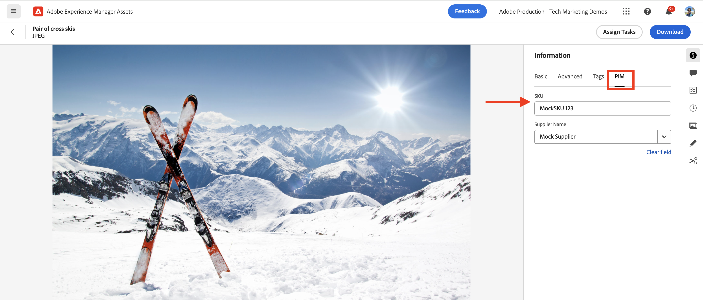

# PIM 통합을 위한 AEM Assets 이벤트

>[!IMPORTANT]
>
>이 자습서에서는 OpenAPI 기반 AEM API를 사용합니다. 이 기능은 조기 액세스 프로그램의 일부로 사용할 수 있습니다. 이 프로그램에 액세스하는 데 관심이 있는 경우 사용 사례에 대한 설명을 [aem-apis@adobe.com](mailto:aem-apis@adobe.com)에 전자 메일로 보내십시오.

OpenAPI 기반 AEM Author API를 사용하여 AEM 이벤트를 수신하고 이 이벤트를 사용하여 Assets의 컨텐츠 상태를 업데이트하는 방법에 대해 알아봅니다.

수신된 이벤트를 처리하는 방법은 비즈니스 요구 사항에 따라 다릅니다. 예를 들어 이벤트 데이터를 사용하여 서드파티 시스템이나 AEM 또는 둘 다를 업데이트할 수 있습니다.

이 예에서는 PIM(제품 정보 관리) 시스템과 같은 서드파티 시스템을 AEM as a Cloud Service Assets과 통합하는 방법을 보여 줍니다. AEM Assets 이벤트를 수신하면 PIM 시스템에서 추가 메타데이터를 검색하고 AEM에서 에셋 메타데이터를 업데이트하도록 처리됩니다. 업데이트된 에셋 메타데이터에는 SKU, 공급업체 이름 또는 기타 제품 세부 사항과 같은 추가 정보가 포함될 수 있습니다.

AEM Assets 이벤트를 받고 처리하기 위해 [Adobe I/O Runtime](https://developer.adobe.com/runtime/docs/guides/overview/what_is_runtime/), 서버리스 플랫폼이 사용됩니다. 그러나 서드파티 시스템의 Webhook이나 Amazon EventBridge와 같은 다른 이벤트 처리 시스템도 사용할 수 있습니다.

높은 수준의 통합 흐름은 다음과 같습니다.


1. AEM 작성자 서비스는 자산 업로드가 완료되고 모든 자산 처리 활동도 완료되면 _자산 처리 완료됨_ 이벤트를 트리거합니다. 에셋 처리가 완료될 때까지 기다리면 메타데이터 추출과 같은 기본 제공 처리가 완료됩니다.
1. 이벤트가 [Adobe I/O Events](https://developer.adobe.com/events/) 서비스로 전송됩니다.
1. Adobe I/O Events 서비스가 처리를 위해 이벤트를 [Adobe I/O Runtime 작업](https://developer.adobe.com/runtime/docs/guides/using/creating_actions/)에 전달합니다.
1. Adobe I/O Runtime 작업은 PIM 시스템의 API를 호출하여 SKU, 공급자 정보 또는 기타 세부 정보와 같은 추가 메타데이터를 검색합니다.
1. 그런 다음 OpenAPI 기반 [Assets 작성자 API](https://developer.adobe.com/experience-cloud/experience-manager-apis/api/experimental/assets/author/)를 사용하여 PIM에서 검색한 추가 메타데이터가 AEM Assets에서 업데이트됩니다.

## 사전 요구 사항

이 자습서를 완료하려면 다음이 필요합니다.

- [AEM 이벤트 사용](https://developer.adobe.com/experience-cloud/experience-manager-apis/guides/events/#enable-aem-events-on-your-aem-cloud-service-environment)이 설정된 AEM as a Cloud Service 환경. 또한 샘플 [WKND Sites](https://github.com/adobe/aem-guides-wknd?#aem-wknd-sites-project) 프로젝트를 여기에 배포해야 합니다.

- [Adobe Developer Console](https://developer.adobe.com/developer-console/docs/guides/getting-started/)에 액세스

- 로컬 컴퓨터에 [Adobe Developer CLI](https://developer.adobe.com/runtime/docs/guides/tools/cli_install/)가 설치되어 있습니다.

## 개발 단계

높은 수준의 개발 단계는 다음과 같습니다.

1. [AEM as a Cloud Service 환경 현대화](https://experienceleague.adobe.com/en/docs/experience-manager-learn/cloud-service/aem-apis/invoke-openapi-based-aem-apis#modernization-of-aem-as-a-cloud-service-environment)
1. [AEM API 액세스 사용](https://experienceleague.adobe.com/en/docs/experience-manager-learn/cloud-service/aem-apis/invoke-openapi-based-aem-apis#enable-aem-apis-access)
1. [Adobe Developer Console(ADC)에서 프로젝트 만들기](./runtime-action.md#Create-project-in-Adobe-Developer-Console)
1. [로컬 개발을 위해 프로젝트 초기화](./runtime-action.md#initialize-project-for-local-development)
1. ADC에서 프로젝트 구성
1. ADC 프로젝트 통신을 사용하도록 AEM 작성자 서비스 구성
1. 런타임 작업을 개발하여 오케스트레이션
   1. PIM 시스템에서 메타데이터 검색
   1. Assets 작성자 API를 사용하여 AEM Assets에서 메타데이터 업데이트
1. 자산 메타데이터 스키마 만들기 및 적용
1. 에셋 업로드 및 메타데이터 업데이트 확인

1-2단계에 대한 자세한 내용은 [OpenAPI 기반 AEM API 호출](https://experienceleague.adobe.com/ko/docs/experience-manager-learn/cloud-service/aem-apis/invoke-openapi-based-aem-apis) 안내서를 참조하고, 3-4단계에 대한 자세한 내용은 [Adobe I/O Runtime 작업 및 AEM 이벤트](./runtime-action.md#) 예를 참조하십시오. 5-9단계는 다음 섹션을 참조하십시오.

### Adobe Developer Console(ADC)에서 프로젝트 구성

AEM Assets 이벤트를 수신하고 이전 단계에서 만든 Adobe I/O Runtime 작업을 실행하려면 ADC에서 프로젝트를 구성합니다.

- ADC에서 3단계에서 만든 [프로젝트](https://developer.adobe.com/console/projects)로 이동합니다. 해당 프로젝트에서 `aio app deploy`을(를) 4단계 지침의 일부로 실행할 때 런타임 작업이 배포되는 `Stage` 작업 영역을 선택하십시오.

- **서비스 추가** 단추를 클릭하고 **이벤트** 옵션을 선택합니다. **이벤트 추가** 대화 상자에서 **Experience Cloud** > **AEM Assets**&#x200B;을 선택하고 **다음**을 클릭합니다.
  

- **이벤트 등록 구성** 단계에서 원하는 AEMCS 인스턴스, _자산 처리 완료_ 이벤트 및 OAuth 서버 간 인증 유형을 선택합니다.

  

- 마지막으로 **이벤트를 받는 방법** 단계에서 **런타임 작업** 옵션을 확장하고 이전 단계에서 만든 _일반_ 작업을 선택합니다. **구성된 이벤트 저장**&#x200B;을 클릭합니다.

  

- 마찬가지로 **서비스 추가** 단추를 클릭하고 **API** 옵션을 선택하십시오. **API 추가** 모달에서 **Experience Cloud** > **AEM Assets 작성자 API**&#x200B;를 선택하고 **다음**&#x200B;을 클릭합니다.

  

- 그런 다음 인증 유형으로 **OAuth 서버 간**&#x200B;을(를) 선택하고 **다음**&#x200B;을(를) 클릭합니다.

- 그런 다음 이벤트가 생성되는 AEM Assets 환경과 연결되어 있고 자산을 업데이트할 수 있는 충분한 액세스 권한이 있는 올바른 **제품 프로필**&#x200B;을 선택하십시오. 마지막으로 **구성된 API 저장** 단추를 클릭합니다.

  

  내 경우 _AEM 관리자 - 작성자 - 프로그램 XXX - 환경 YYY_ 제품 프로필이 선택되어 있고 **AEM Assets API 사용자** 서비스가 활성화되어 있습니다.

  

## ADC 프로젝트 통신을 사용하도록 AEM 인스턴스 구성

ADC 프로젝트의 OAuth 서버 간 자격 증명 ClientID가 AEM 인스턴스와 통신할 수 있도록 하려면 AEM 인스턴스를 구성해야 합니다.

이 작업은 AEM 프로젝트의 `config.yaml` 파일에서 구성을 정의하여 수행됩니다. 그런 다음 Cloud Manager에서 구성 파이프라인을 사용하여 `config.yaml` 파일을 배포합니다.

- AEM 프로젝트에서 `config` 폴더에서 `config.yaml` 파일을 찾거나 만듭니다.

  

- `config.yaml` 파일에 다음 구성을 추가합니다.

  ```yaml
  kind: "API"
  version: "1.0"
  metadata: 
      envTypes: ["dev", "stage", "prod"]
  data:
      allowedClientIDs:
          author:
          - "<ADC Project's OAuth Server-to-Server credential ClientID>"
  ```

  `<ADC Project's OAuth Server-to-Server credential ClientID>`을(를) ADC 프로젝트의 OAuth 서버 간 자격 증명의 실제 ClientID로 바꿉니다.

  >[!CAUTION]
  >
  > 데모 목적으로 모든 환경에 동일한 ClientID가 사용됩니다. 더 나은 보안 및 제어를 위해 환경(개발, 단계, 프로덕션)별로 별도의 ClientID를 사용하는 것이 좋습니다.


- 구성 변경 사항을 Git 저장소에 커밋하고 변경 사항을 원격 저장소에 푸시합니다.

- Cloud Manager의 구성 파이프라인 을 사용하여 위의 변경 사항을 배포합니다. 명령줄 도구를 사용하여 RDE에 `config.yaml` 파일을 설치할 수도 있습니다.

  

### 런타임 작업 개발

메타데이터 검색 및 업데이트를 수행하려면 먼저 `src/dx-excshell-1/actions/generic` 폴더에서 자동으로 만든 _generic_ 작업 코드를 업데이트합니다.

전체 코드가 필요하면 첨부된 [WKND-Assets-PIM-Integration.zip](../assets/examples/assets-pim-integration/WKND-Assets-PIM-Integration.zip) 파일을 참조하십시오. 아래 섹션에서는 주요 파일을 강조 표시합니다.

- `src/dx-excshell-1/actions/generic/mockPIMCommunicator.js` 파일은 PIM API 호출을 모방해 SKU 및 공급자 이름과 같은 추가 메타데이터를 검색합니다. 이 파일은 데모용으로 사용됩니다. 전체적인 흐름이 작동하면 이 함수를 실제 PIM 시스템에 대한 호출로 대체하여 에셋에 대한 메타데이터를 검색합니다.

  ```javascript
  /**
   * Mock PIM API to get the product data such as SKU, Supplier, etc.
   *
   * In a real-world scenario, this function would call the PIM API to get the product data.
   * For this example, we are returning mock data.
   *
   * @param {string} assetId - The assetId to get the product data.
   */
  module.exports = {
      async getPIMData(assetId) {
          if (!assetId) {
          throw new Error('Invalid assetId');
          }
          // Mock response data for demo purposes
          const data = {
          SKUID: 'MockSKU 123',
          SupplierName: 'mock-supplier',
          // ... other product data
          };
          return data;
      },
  };
  ```

- `src/dx-excshell-1/actions/generic/aemCommunicator.js` 파일은 [Assets 작성자 API](https://developer.adobe.com/experience-cloud/experience-manager-apis/api/experimental/assets/author/)를 사용하여 AEM의 자산 메타데이터를 업데이트합니다.

  ```javascript
  const fetch = require('node-fetch');
  ...
  /**
  *  Get IMS Access Token using Client Credentials Flow
  *
  * @param {*} clientId - IMS Client ID from ADC project's OAuth Server-to-Server Integration
  * @param {*} clientSecret - IMS Client Secret from ADC project's OAuth Server-to-Server Integration
  * @param {*} scopes - IMS Meta Scopes from ADC project's OAuth Server-to-Server Integration as comma separated strings
  * @returns {string} - Returns the IMS Access Token
  */
  async function getIMSAccessToken(clientId, clientSecret, scopes) {
    const adobeIMSV3TokenEndpointURL = 'https://ims-na1.adobelogin.com/ims/token/v3';
    const options = {
      method: 'POST',
      headers: {
        'Content-Type': 'application/x-www-form-urlencoded',
      },
      body: `grant_type=client_credentials&client_id=${clientId}&client_secret=${clientSecret}&scope=${scopes}`,
    };
    const response = await fetch(adobeIMSV3TokenEndpointURL, options);
    const responseJSON = await response.json();
    return responseJSON.access_token;
  }    
  async function updateAEMAssetMetadata(metadataDetails, aemAssetEvent, params) {
    ...
    // Transform the metadata details to JSON Patch format,
    // see https://developer.adobe.com/experience-cloud/experience-manager-apis/api/experimental/assets/author/#operation/patchAssetMetadata
    const transformedMetadata = Object.keys(metadataDetails).map((key) => ({
      op: 'add',
      path: `wknd-${key.toLowerCase()}`,
      value: metadataDetails[key],
    }));
    ...
    // Get ADC project's OAuth Server-to-Server Integration credentials
    const clientId = params.ADC_CECREDENTIALS_CLIENTID;
    const clientSecret = params.ADC_CECREDENTIALS_CLIENTSECRET;
    const scopes = params.ADC_CECREDENTIALS_METASCOPES;
    // Get IMS Access Token using Client Credentials Flow
    const access_token = await getIMSAccessToken(clientId, clientSecret, scopes);
    // Call AEM Author service to update the metadata using Assets Author API
    // See https://developer.adobe.com/experience-cloud/experience-manager-apis/api/experimental/assets/author/
    const res = await fetch(`${aemAuthorHost}/adobe/assets/${assetId}/metadata`, {
      method: 'PATCH',
      headers: {
        'Content-Type': 'application/json-patch+json',
        'If-Match': '*',
        'X-Adobe-Accept-Experimental': '1',
        'X-Api-Key': 'aem-assets-management-api', // temporary value
        Authorization: `Bearer ${access_token}`,
      },
      body: JSON.stringify(transformedMetadata),
    });
    ...
  }
  module.exports = { updateAEMAssetMetadata };
  ```

  `.env` 파일은 ADC 프로젝트의 OAuth 서버 간 자격 증명 세부 정보를 저장하며 `ext.config.yaml` 파일을 사용하여 작업에 매개 변수로 전달됩니다. 암호 및 작업 매개 변수 관리에 대해서는 [App Builder 구성 파일](https://developer.adobe.com/app-builder/docs/guides/configuration/)을 참조하세요.
- `src/dx-excshell-1/actions/model` 폴더에 `aemAssetEvent.js` 및 `errors.js` 파일이 있습니다. 이 파일은 작업에서 수신된 이벤트를 구문 분석하고 오류를 처리하는 데 각각 사용됩니다.
- `src/dx-excshell-1/actions/generic/index.js` 파일은 위에서 언급한 모듈을 사용하여 메타데이터 검색 및 업데이트를 조정합니다.

  ```javascript
  ...
  let responseMsg;
  // handle the challenge probe request, they are sent by I/O to verify the action is valid
  if (params.challenge) {
    logger.info('Challenge probe request detected');
    responseMsg = JSON.stringify({ challenge: params.challenge });
  } else {
    logger.info('AEM Asset Event request received');
    // create AEM Asset Event object from request parameters
    const aemAssetEvent = new AEMAssetEvent(params);
    // Call mock PIM API to get the product data such as SKU, Supplier, etc.
    const mockPIMData = await mockPIMAPI.getPIMData(
      aemAssetEvent.getAssetName(),
    );
    logger.info('Mock PIM API response', mockPIMData);
    // Update PIM received data in AEM as Asset metadata
    const aemUpdateStatus = await updateAEMAssetMetadata(
      mockPIMData,
      aemAssetEvent,
      params,
    );
    logger.info('AEM Asset metadata update status', aemUpdateStatus);
    if (aemUpdateStatus) {
      // create response message
      responseMsg = JSON.stringify({
        message:
          'AEM Asset Event processed successfully, updated the asset metadata with PIM data.',
        assetdata: {
          assetName: aemAssetEvent.getAssetName(),
          assetPath: aemAssetEvent.getAssetPath(),
          assetId: aemAssetEvent.getAssetId(),
          aemHost: aemAssetEvent.getAEMHost(),
          pimdata: mockPIMData,
        },
      });
    } 
    // response object
    const response = {
      statusCode: 200,
      body: responseMsg,
    };
    // Return the response to the caller
    return response;
    ...
  }
  ```

- 다음 명령을 사용하여 업데이트된 작업을 Adobe I/O Runtime에 배포합니다.

  ```bash
  $ aio app deploy
  ```

### 자산 메타데이터 스키마 만들기 및 적용

기본적으로 WKND Sites 프로젝트에는 SKU, 공급업체 이름 등과 같은 PIM 관련 메타데이터를 표시하는 자산 메타데이터 스키마가 없습니다. AEM 인스턴스의 에셋 폴더에 에셋 메타데이터 스키마를 만들고 적용해 보겠습니다.

1. AEM as a Cloud Service 자산 인스턴스에 로그인하고 [자산 보기](https://experienceleague.adobe.com/en/docs/experience-manager-learn/assets/authoring/switch-views)에 있습니다.

   

1. 왼쪽 레일에서 **설정** > **메타데이터 Forms** 옵션으로 이동하고 **만들기** 단추를 클릭합니다. **메타데이터 양식 만들기** 대화 상자에서 다음 세부 정보를 입력하고 **만들기**&#x200B;를 클릭합니다.
   - 이름: `PIM`
   - 기존 양식 구조를 템플릿으로 사용: `Check`
   - 다음 중에서 선택: `default`

   

1. **+** 아이콘을 클릭하여 새 **PIM** 탭을 추가하고 **한 줄 텍스트** 구성 요소를 추가합니다.

   

   다음 표에는 메타데이터 속성과 해당 필드가 나와 있습니다.

   | 레이블 | 플레이스홀더 | 메타데이터 속성 |
   | --- | --- | --- |
   | SKU | AEM 이벤트 통합을 통해 자동 채워짐 | `wknd-skuid` |
   | 공급자명 | AEM 이벤트 통합을 통해 자동 채워짐 | `wknd-suppliername` |

1. 메타데이터 양식을 저장하려면 **저장** 및 **닫기**&#x200B;를 클릭하십시오.

1. 마지막으로 **PIM** 메타데이터 스키마를 **PIM** 폴더에 적용합니다.

   

위의 단계를 수행하면 **모험** 폴더의 자산이 SKU, 공급자 이름 등과 같은 PIM 관련 메타데이터를 표시할 준비가 되었습니다.

### 에셋 업로드 및 메타데이터 확인

AEM Assets 및 PIM 통합을 확인하려면 AEM Assets의 **모험** 폴더에 자산을 업로드합니다. 자산 세부 사항 페이지의 PIM 탭에 SKU 및 공급자명 메타데이터가 표시되어야 합니다.



## 개념 및 주요 특징

엔터프라이즈에서 AEM과 PIM과 같은 기타 시스템 간의 에셋 메타데이터 동기화가 필요한 경우가 많습니다. AEM 이벤트를 사용하면 이러한 요구 사항을 충족할 수 있습니다.

- 에셋 메타데이터 검색 코드는 AEM 외부에서 실행되어 AEM Author 서비스의 로드를 방지하므로 독립적으로 확장하는 이벤트 기반 아키텍처입니다.
- 새로 도입된 Assets 작성자 API는 AEM에서 에셋 메타데이터를 업데이트하는 데 사용됩니다.
- API 인증은 OAuth 서버 간(즉, 클라이언트 자격 증명 흐름)을 사용합니다. [OAuth 서버 간 자격 증명 구현 안내서](https://developer.adobe.com/developer-console/docs/guides/authentication/ServerToServerAuthentication/implementation/)를 참조하십시오.
- Adobe I/O Runtime 작업 대신 다른 웹후크 또는 Amazon EventBridge를 사용하여 AEM Assets 이벤트를 수신하고 메타데이터 업데이트를 처리할 수 있습니다.
- AEM Eventing을 통한 에셋 이벤트는 기업이 중요한 프로세스를 자동화하고 능률화할 수 있도록 지원하여 콘텐츠 생태계 전반의 효율성과 일관성을 증진합니다.
