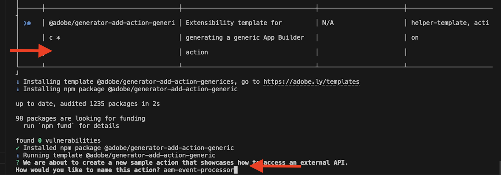

# Adobe I/O Runtime 작업을 사용하여 AEM 이벤트 처리

[Adobe I/O Runtime](https://developer.adobe.com/runtime/docs/guides/overview/what_is_runtime/) 액션을 사용하여 받은 AEM 이벤트를 처리하는 방법에 대해 알아보십시오. 이 예제에서는 이전 예인 [Adobe I/O Runtime 작업 및 AEM 이벤트](runtime-action.md)를 향상시킵니다. 이 작업을 진행하기 전에 완료했는지 확인하십시오.

>[!VIDEO](https://video.tv.adobe.com/v/3427054?quality=12&learn=on)

이 예에서, 이벤트 처리는 원래 이벤트 데이터 및 수신된 이벤트를 활동 메시지로서 Adobe I/O Runtime 저장소에 저장한다. 그러나 이벤트가 _콘텐츠 조각 수정됨_ 유형인 경우 AEM 작성자 서비스를 호출하여 수정 세부 정보를 찾습니다. 마지막으로 단일 페이지 애플리케이션(SPA)에 이벤트 세부 사항이 표시됩니다.

## 사전 요구 사항

이 자습서를 완료하려면 다음이 필요합니다.

- [AEM 이벤트 사용](https://developer.adobe.com/experience-cloud/experience-manager-apis/guides/events/#enable-aem-events-on-your-aem-cloud-service-environment)이 설정된 AEM as a Cloud Service 환경. 또한 샘플 [WKND Sites](https://github.com/adobe/aem-guides-wknd?#aem-wknd-sites-project) 프로젝트를 여기에 배포해야 합니다.

- [Adobe Developer Console](https://developer.adobe.com/developer-console/docs/guides/getting-started/)에 액세스

- 로컬 컴퓨터에 [Adobe Developer CLI](https://developer.adobe.com/runtime/docs/guides/tools/cli_install/)가 설치되어 있습니다.

- 이전 예제 [Adobe I/O Runtime 작업 및 AEM 이벤트](./runtime-action.md#initialize-project-for-local-development)에서 프로젝트를 로컬로 초기화했습니다.

## AEM 이벤트 프로세서 작업

이 예에서 이벤트 프로세서 [action](https://developer.adobe.com/runtime/docs/guides/using/creating_actions/)은(는) 다음 작업을 수행합니다.

- 수신된 이벤트를 활동 메시지로 구문 분석합니다.
- 수신된 이벤트가 _콘텐츠 조각 수정됨_ 유형인 경우 AEM 작성자 서비스로 다시 호출하여 수정 세부 정보를 찾으십시오.
- Adobe I/O Runtime 저장소에 원래 이벤트 데이터, 활동 메시지 및 수정 세부 사항(있는 경우)을 유지합니다.

위의 작업을 수행하려면 프로젝트에 작업을 추가하고, 위의 작업을 수행할 JavaScript 모듈을 개발하고, 마지막으로 개발된 모듈을 사용하도록 작업 코드를 업데이트하겠습니다.

첨부된 [WKND-AEM-Eventing-Runtime-Action.zip](../assets/examples/event-processing-using-runtime-action/WKND-AEM-Eventing-Runtime-Action.zip) 파일을 참조하여 전체 코드를 확인하십시오. 아래 섹션에서는 주요 파일을 강조 표시합니다.

### 작업 추가

- 작업을 추가하려면 다음 명령을 실행합니다.

  ```bash
  aio app add action
  ```

- `@adobe/generator-add-action-generic`을(를) 작업 템플릿으로 선택하고 작업 이름을 `aem-event-processor`(으)로 지정합니다.

  

### JavaScript 모듈 개발

위에서 언급한 작업을 수행하기 위해 다음 JavaScript 모듈을 개발해 보겠습니다.

- `src/dx-excshell-1/actions/aem-event-processor/eventValidator.js` 모듈은 수신된 이벤트가 _수정된 콘텐츠 조각_ 유형인지 확인합니다.

  ```javascript
  async function needsAEMCallback(aemEvent) {
  // create a Logger
  const logger = Core.Logger('eventValidator', {
      level: 'info',
  });
  
  let isValid = false;
  
  // verify the event is a Content Fragment Modified event
  if (
      aemEvent
      && aemEvent.ContentType === 'contentFragment'
      && aemEvent.EventName === 'modified'
  ) {
      logger.info('Processing Content Fragment Modified Event');
      isValid = true;
  }
  
  return isValid;
  }
  
  module.exports = needsAEMCallback;
  ```

- `src/dx-excshell-1/actions/aem-event-processor/loadEventDetailsFromAEM.js` 모듈이 AEM 작성자 서비스를 호출하여 수정 세부 정보를 찾습니다.

  ```javascript
  ...
  const auth = require('@adobe/jwt-auth');
  ...
  // Get AEM Service Credentials aka Technical Account details.
  // These are passed to the action as params and added in .env file.
  const clientId = params.AEM_SERVICECREDENTIALS_TECHNICALACCOUNT_CLIENTID;
  const technicalAccountId = params.AEM_SERVICECREDENTIALS_ID;
  const orgId = params.AEM_SERVICECREDENTIALS_ORG;
  const clientSecret = params.AEM_SERVICECREDENTIALS_TECHNICALACCOUNT_CLIENTSECRET;
  // Private key is passed as a string with \n and \r characters escaped.
  const privateKey = params.AEM_SERVICECREDENTIALS_PRIVATEKEY.replace(
      /\\n/g,
      '\n',
  ).replace(/\\r/g, '\r');
  const metaScopes = params.AEM_SERVICECREDENTIALS_METASCOPES.split(',');
  const ims = `https://${params.AEM_SERVICECREDENTIALS_IMSENDPOINT}`;
  
  // Get the access token from IMS using Adobe I/O SDK
  const { access_token } = await auth({
      clientId,
      technicalAccountId,
      orgId,
      clientSecret,
      privateKey,
      metaScopes,
      ims,
  });
  ...
  // Call AEM Author service to get the CF details using AEM Assets API
  const res = await fetch(
      `${aemAuthorHost}${cfPath.replace('/content/dam/', '/api/assets/')}.json`,
  {
    method: 'GET',
    headers: {
      'Content-Type': 'application/json',
      Authorization: `Bearer ${access_token}`,
    },
  },
  );
  
  let newValuesOfCFPropertiesAddedOrModified = {};
  // If the response is OK, get the values of the CF properties that were added or modified
  if (res.ok) {
      logger.info('AEM Event Details loaded from AEM Author instance');
      const responseJSON = await res.json();
  
      // Get the values of the CF properties that were added or modified
      if (
      responseJSON
      && responseJSON.properties
      && responseJSON.properties.elements
      ) {
      const allCurrentCFProperties = responseJSON.properties.elements;
  
      newValuesOfCFPropertiesAddedOrModified = cfPropertiesAddedOrModified.map(
          (key) => ({
          key,
          value: allCurrentCFProperties[key],
          }),
      );
      }    
  }
  ...
  ```

  자세한 내용은 [AEM 서비스 자격 증명 튜토리얼](https://experienceleague.adobe.com/docs/experience-manager-learn/getting-started-with-aem-headless/authentication/service-credentials.html?lang=en)을 참조하세요. 또한 암호 및 작업 매개 변수 관리를 위한 [App Builder 구성 파일](https://developer.adobe.com/app-builder/docs/guides/configuration/)입니다.

- `src/dx-excshell-1/actions/aem-event-processor/storeEventData.js` 모듈은 원본 이벤트 데이터, 활동 메시지 및 수정 세부 사항(있는 경우)을 Adobe I/O Runtime 저장소에 저장합니다.

  ```javascript
  ...
  const filesLib = require('@adobe/aio-lib-files');
  ...
  
  const files = await filesLib.init();
  
  const eventDataAsJSON = JSON.stringify({
      activity: activityMessage,
      aemEvent,
      aemEventDetails,
  });
  
  // store details in a folder named YYYY-MM-DD and a file named <eventID>.json
  const bytesWritten = await files.write(
      `${formattedDate}/${aemEvent.getEventID()}.json`,
      eventDataAsJSON,
  );
  ...
  ```

### 작업 코드 업데이트

마지막으로 개발된 모듈을 사용하려면 `src/dx-excshell-1/actions/aem-event-processor/index.js`에서 작업 코드를 업데이트하십시오.

```javascript
...
// handle the challenge probe request, they are sent by I/O to verify the action is valid
if (params.challenge) {
    logger.info('Challenge probe request detected');
    responseMsg = JSON.stringify({ challenge: params.challenge });
} else {
    logger.info('AEM Event request received');

    // create AEM Event object from request parameters
    const aemEvent = new AEMEvent(params);

    // get AEM Event as activity message using the helper method
    const activityMessage = aemEvent.getEventAsActivityMessage();

    // determine if AEM Event requires callback to AEM Author service
    const callbackAEMForEventDetails = await needsAEMCallback(aemEvent);

    let eventDetails = {};
    if (callbackAEMForEventDetails) {
    // call AEM Author service to get specifics about the event
    eventDetails = await loadEventDetailsFromAEMAuthorService(
        aemEvent,
        params,
    );
    }

    // store AEM Event and Event details in the file system
    const storageDetails = await storeEventData(
    activityMessage,
    aemEvent,
    eventDetails || {},
    );
    logger.info(`Storage details: ${JSON.stringify(storageDetails)}`);

    // create response message
    responseMsg = JSON.stringify({
    message: 'AEM Event processed',
    activityMessage,
    });

    // response object
    const response = {
    statusCode: 200,
    body: responseMsg,
    };
    logger.info('Adobe I/O Runtime action response', response);

    // Return the response to the caller
    return response;
}
...
```

## 추가 리소스

- `src/dx-excshell-1/actions/model` 폴더에 `aemEvent.js` 및 `errors.js` 파일이 있습니다. 이 파일은 작업에서 수신된 이벤트를 구문 분석하고 오류를 처리하는 데 각각 사용됩니다.
- `src/dx-excshell-1/actions/load-processed-aem-events` 폴더에 작업 코드가 있습니다. 이 작업은 SPA에서 Adobe I/O Runtime 저장소에서 처리된 AEM 이벤트를 로드하는 데 사용됩니다.
- `src/dx-excshell-1/web-src` 폴더에는 처리된 AEM 이벤트를 표시하는 SPA 코드가 있습니다.
- `src/dx-excshell-1/ext.config.yaml` 파일에 작업 구성 및 매개 변수가 포함되어 있습니다.

## 개념 및 주요 특징

이벤트 처리 요구 사항은 프로젝트마다 다르지만 이 예제의 주요 사항은 다음과 같습니다.

- 이벤트 처리는 Adobe I/O Runtime 작업을 사용하여 수행할 수 있습니다.
- 런타임 작업은 내부 애플리케이션, 서드파티 솔루션 및 Adobe 솔루션과 같은 시스템과 통신할 수 있습니다.
- 런타임 작업은 콘텐츠 변경을 중심으로 설계된 비즈니스 프로세스의 진입점 역할을 합니다.
