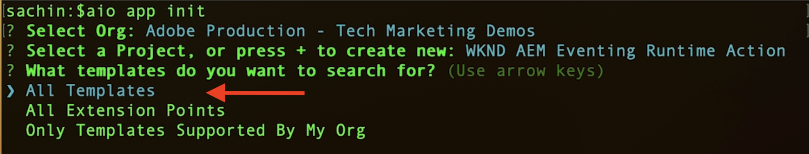
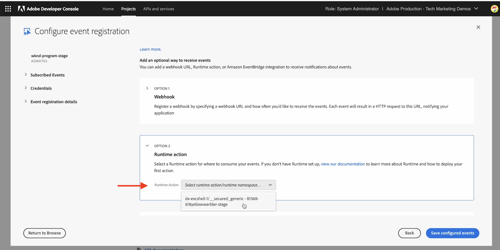
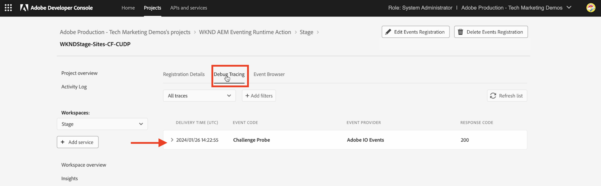

# Adobe I/O Runtime 작업 및 AEM 이벤트

[Adobe I/O Runtime](https://developer.adobe.com/runtime/docs/guides/overview/what_is_runtime/) 액션을 사용하여 AEM 이벤트를 수신하고 페이로드, 헤더 및 메타데이터 등 이벤트 세부 사항을 검토하는 방법에 대해 알아봅니다.

>[!VIDEO](https://video.tv.adobe.com/v/3427053?quality=12&learn=on)

Adobe I/O Runtime은 Adobe I/O Events에 대한 응답으로 코드 실행을 허용하는 서버를 사용하지 않는 플랫폼입니다. 따라서 인프라 걱정 없이 이벤트 기반 애플리케이션을 구축할 수 있습니다.

이 예제에서는 AEM 이벤트를 수신하고 이벤트 세부 정보를 기록하는 Adobe I/O Runtime [Action](https://developer.adobe.com/runtime/docs/guides/using/creating_actions/)을(를) 만듭니다.
https://developer.adobe.com/runtime/docs/guides/overview/what_is_runtime/

높은 수준의 단계는 다음과 같습니다.

- Adobe Developer Console에서 프로젝트 만들기
- 로컬 개발을 위한 프로젝트 초기화
- Adobe Developer Console에서 프로젝트 구성
- AEM 이벤트 트리거 및 작업 실행 확인

## 사전 요구 사항

이 자습서를 완료하려면 다음이 필요합니다.

- [AEM 이벤트 사용](https://developer.adobe.com/experience-cloud/experience-manager-apis/guides/events/#enable-aem-events-on-your-aem-cloud-service-environment)이 설정된 AEM as a Cloud Service 환경.

- [Adobe Developer Console](https://developer.adobe.com/developer-console/docs/guides/getting-started)에 액세스

- 로컬 컴퓨터에 [Adobe Developer CLI](https://developer.adobe.com/runtime/docs/guides/tools/cli_install/)가 설치되어 있습니다.

## Adobe Developer Console에서 프로젝트 만들기

Adobe Developer Console에서 프로젝트를 만들려면 다음 단계를 수행하십시오.

- [Adobe Developer Console](https://developer.adobe.com/)&#x200B;(으)로 이동하고 **콘솔** 단추를 클릭합니다.

- **빠른 시작** 섹션에서 **템플릿에서 프로젝트 만들기**&#x200B;를 클릭합니다. 그런 다음 **템플릿 찾아보기** 대화 상자에서 **App Builder** 템플릿을 선택합니다.

- 프로젝트 제목, 앱 이름을 업데이트하고 필요한 경우 작업 영역을 추가합니다. 그런 다음 **저장**&#x200B;을 클릭합니다.

  


## 로컬 개발을 위한 프로젝트 초기화

프로젝트에 Adobe I/O Runtime 작업을 추가하려면 로컬 개발을 위해 프로젝트를 초기화해야 합니다. 로컬 컴퓨터 열기 터미널에서 프로젝트를 초기화할 위치로 이동하여 다음 단계를 수행합니다.

- 실행하여 프로젝트 초기화

  ```bash
  aio app init
  ```

- `Organization`, 이전 단계에서 만든 `Project` 및 작업 영역을 선택합니다. `What templates do you want to search for?` 단계에서 `All Templates` 옵션을 선택합니다.

  

- 템플릿 목록에서 `@adobe/generator-app-excshell` 옵션을 선택합니다.

  

- 즐겨찾는 IDE에서 프로젝트(예: VSCode)를 엽니다.

- 선택한 _확장성 템플릿_(`@adobe/generator-app-excshell`)은(는) 일반 런타임 작업을 제공합니다. 코드는 `src/dx-excshell-1/actions/generic/index.js` 파일에 있습니다. 간단하게 업데이트하고, 이벤트 세부 사항을 기록하고, 성공 응답을 반환하겠습니다. 그러나 다음 예에서는 수신된 AEM 이벤트를 처리하도록 향상되었습니다.

  ```javascript
  const fetch = require("node-fetch");
  const { Core } = require("@adobe/aio-sdk");
  const {
  errorResponse,
  getBearerToken,
  stringParameters,
  checkMissingRequestInputs,
  } = require("../utils");
  
  // main function that will be executed by Adobe I/O Runtime
  async function main(params) {
  // create a Logger
  const logger = Core.Logger("main", { level: params.LOG_LEVEL || "info" });
  
  try {
      // 'info' is the default level if not set
      logger.info("Calling the main action");
  
      // log parameters, only if params.LOG_LEVEL === 'debug'
      logger.debug(stringParameters(params));
  
      const response = {
      statusCode: 200,
      body: {
          message: "Received AEM Event, it will be processed in next example",
      },
      };
  
      // log the response status code
      logger.info(`${response.statusCode}: successful request`);
      return response;
  } catch (error) {
      // log any server errors
      logger.error(error);
      // return with 500
      return errorResponse(500, "server error", logger);
  }
  }
  
  exports.main = main;
  ```

- 마지막으로 를 실행하여 Adobe I/O Runtime에 업데이트된 작업을 배포합니다.

  ```bash
  aio app deploy
  ```

## Adobe Developer Console에서 프로젝트 구성

AEM 이벤트를 수신하고 이전 단계에서 만든 Adobe I/O Runtime 작업을 실행하려면 Adobe Developer Console에서 프로젝트를 구성합니다.

- Adobe Developer Console에서 이전 단계에서 만든 [프로젝트](https://developer.adobe.com/console/projects)&#x200B;(으)로 이동한 다음 클릭하여 엽니다. 작업을 배포한 `Stage` 작업 영역을 선택하십시오.

- **서비스 추가** 단추를 클릭하고 **API** 옵션을 선택합니다. **API 추가** 모달에서 **Adobe 서비스** > **I/O 관리 API**&#x200B;를 선택하고 **다음**&#x200B;을(를) 클릭한 다음 추가 구성 단계를 수행하고 **구성된 API 저장**&#x200B;을(를) 클릭합니다.

  

- 마찬가지로 **서비스 추가** 단추를 클릭하고 **이벤트** 옵션을 선택하십시오. **이벤트 추가** 대화 상자에서 **Experience Cloud** > **AEM Sites**&#x200B;을 선택하고 **다음**&#x200B;을 클릭합니다. 추가 구성 단계를 수행하고 AEMCS 인스턴스, 이벤트 유형 및 기타 세부 정보를 선택합니다.

- 마지막으로 **이벤트를 받는 방법** 단계에서 **런타임 작업** 옵션을 확장하고 이전 단계에서 만든 _일반_ 작업을 선택합니다. **구성된 이벤트 저장**&#x200B;을 클릭합니다.

  

- 이벤트 등록 세부 정보와 **Debug Tracing** 탭을 검토하고 **Challenge Probe** 요청 및 응답을 확인합니다.

  


## AEM 이벤트 트리거

위의 Adobe Developer Console 프로젝트에 등록된 AEM as a Cloud Service 환경에서 AEM 이벤트를 트리거하려면 다음 단계를 따르십시오.

- [Cloud Manager](https://my.cloudmanager.adobe.com/)을(를) 통해 AEM as a Cloud Service 작성자 환경에 액세스하고 로그인합니다.

- **구독한 이벤트**&#x200B;에 따라 콘텐츠 조각을 만들거나, 업데이트하거나, 삭제하거나, 게시하거나, 게시 취소합니다.

## 이벤트 세부 사항 검토

위의 단계를 완료하면 AEM 이벤트가 일반 작업에 전달되는 것을 볼 수 있습니다.

이벤트 등록 세부 정보의 **디버그 추적** 탭에서 이벤트 세부 사항을 검토할 수 있습니다.


## 다음 단계

다음 예에서는 이 작업을 개선하여 AEM 이벤트를 처리하고, AEM 작성자 서비스를 다시 호출하여 컨텐츠 세부 정보를 가져오고, Adobe I/O Runtime 저장소에 세부 정보를 저장하고, SPA(단일 페이지 애플리케이션)를 통해 표시해 보겠습니다.
