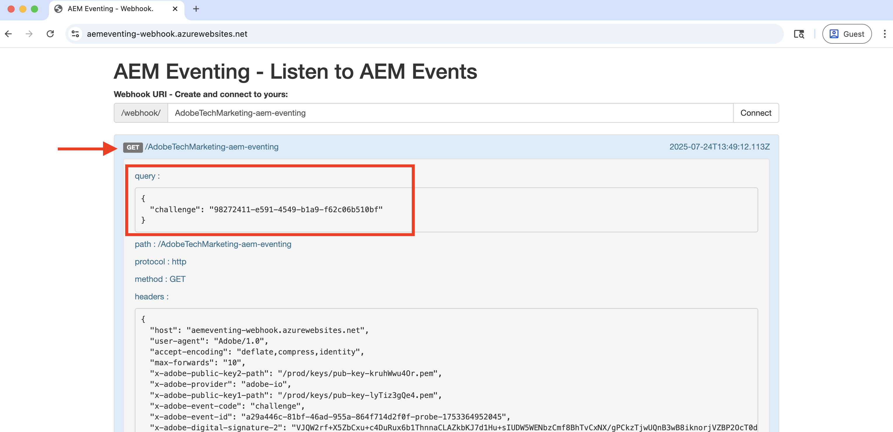

# Webhooks 및 AEM 이벤트

웹후크에서 AEM 이벤트를 수신하고 페이로드, 헤더 및 메타데이터 등 이벤트 세부 사항을 검토하는 방법에 대해 알아봅니다.


>[!VIDEO](https://video.tv.adobe.com/v/3449755?quality=12&learn=on&captions=kor)


>[!IMPORTANT]
>
>이 비디오는 결함 호스팅된 웹후크 끝점을 참조합니다. Glitch가 호스팅 서비스를 중단했으므로 웹후크가 Azure 앱 서비스로 마이그레이션되었습니다.
>
>기능은 동일하게 유지됩니다. 호스팅 플랫폼만 변경되었습니다.


Adobe에서 제공한 샘플 웹후크를 사용하는 대신 자체 웹후크 엔드포인트를 사용하여 AEM 이벤트를 받을 수도 있습니다.

## 사전 요구 사항

이 자습서를 완료하려면 다음이 필요합니다.

- [AEM 이벤트 사용](https://developer.adobe.com/experience-cloud/experience-manager-apis/guides/events/#enable-aem-events-on-your-aem-cloud-service-environment)이 설정된 AEM as a Cloud Service 환경.

- [AEM 이벤트에 대해 Adobe Developer Console 프로젝트가 구성됨](https://developer.adobe.com/experience-cloud/experience-manager-apis/guides/events/#how-to-subscribe-to-aem-events-in-the-adobe-developer-console).


## Webhook 액세스

Adobe 제공 샘플 웹후크에 액세스하려면 다음 단계를 따르십시오.

- 새 브라우저 탭에서 [Adobe 제공 샘플 webhook](https://aemeventing-webhook.azurewebsites.net/)에 액세스할 수 있는지 확인하십시오.

  

- 웹후크의 고유 이름(예: `<YOUR_PETS_NAME>-aem-eventing`)을 입력하고 **연결**&#x200B;을 클릭합니다. 화면에 `Connected to: ${YOUR-WEBHOOK-URL}`개의 메시지가 표시됩니다.

  

- **Webhook URL**&#x200B;을 메모하세요. 나중에 이 자습서에서 필요합니다.

## Adobe Developer Console 프로젝트에서 Webhook 구성

위의 웹후크 URL에서 AEM 이벤트를 수신하려면 다음 단계를 따르십시오.

- [Adobe Developer Console](https://developer.adobe.com)에서 프로젝트로 이동한 다음 클릭하여 엽니다.

- **제품 및 서비스** 섹션에서 웹후크로 AEM 이벤트를 보낼 원하는 이벤트 카드 옆에 있는 생략 부호 `...`을(를) 클릭하고 **편집**&#x200B;을(를) 선택합니다.

  

- 새로 연 **이벤트 등록 구성** 대화 상자에서 **다음**&#x200B;을 클릭하여 **이벤트를 받는 방법** 단계로 진행합니다.

  

- **이벤트를 받는 방법** 단계에서 **Webhook** 옵션을 선택하고 Adobe 제공 샘플 Webhook에서 이전에 복사한 **Webhook URL**&#x200B;을(를) 붙여 넣은 다음 **구성된 이벤트 저장**&#x200B;을 클릭합니다.

  

- Adobe에서 제공한 샘플 웹후크 페이지에 GET 요청이 표시되어야 합니다. 이는 Adobe I/O Events이 웹후크 URL을 확인하기 위해 보낸 챌린지 요청입니다.

  


## AEM 이벤트 트리거

위의 Adobe Developer Console 프로젝트에 등록된 AEM as a Cloud Service 환경에서 AEM 이벤트를 트리거하려면 다음 단계를 따르십시오.

- [Cloud Manager](https://my.cloudmanager.adobe.com/)을(를) 통해 AEM as a Cloud Service 작성자 환경에 액세스하고 로그인합니다.

- **구독한 이벤트**&#x200B;에 따라 콘텐츠 조각을 만들거나, 업데이트하거나, 삭제하거나, 게시하거나, 게시 취소합니다.

## 이벤트 세부 사항 검토

위의 단계를 완료하면 AEM 이벤트가 웹후크로 전달되는 것을 볼 수 있습니다. Adobe 제공 샘플 웹후크 페이지에서 POST 요청을 찾습니다.


다음은 POST 요청의 주요 세부 정보입니다.

- 경로: `/webhook/${YOUR-WEBHOOK-URL}`(예: `/webhook/AdobeTM-aem-eventing`)

- headers: Adobe I/O Events에서 보낸 요청 헤더(예: )

```json
{
  "host": "aemeventing-webhook.azurewebsites.net",
  "user-agent": "Adobe/1.0",
  "accept-encoding": "deflate,compress,identity",
  "max-forwards": "10",
  "x-adobe-public-key2-path": "/prod/keys/pub-key-kruhWwu4Or.pem",
  "x-adobe-delivery-id": "25c36f70-9238-4e4c-b1d8-4d9a592fed9d",
  "x-adobe-provider": "aemsites_7ABB3E6A5A7491460A495D61@AdobeOrg_acct-aem-p63947-e1249010@adobe.com",
  "x-adobe-public-key1-path": "/prod/keys/pub-key-lyTiz3gQe4.pem",
  "x-adobe-event-id": "b555a1b1-935b-4541-b410-1915775338b5",
  "x-adobe-event-code": "aem.sites.contentFragment.modified",
  "x-adobe-digital-signature-2": "Lvw8+txbQif/omgOamJXJaJdJMLDH5BmPA+/RRLhKG2LZJYWKiomAE9DqKhM349F8QMdDq6FXJI0vJGdk0FGYQa6JMrU+LK+1fGhBpO98LaJOdvfUQGG/6vq8/uJlcaQ66tuVu1xwH232VwrQOKdcobE9Pztm6UX0J11Uc7vtoojUzsuekclKEDTQx5vwBIYK12bXTI9yLRsv0unBZfNRrV0O4N7KA9SRJFIefn7hZdxyYy7IjMdsoswG36E/sDOgcnW3FVM+rhuyWEizOd2AiqgeZudBKAj8ZPptv+6rZQSABbG4imOa5C3t85N6JOwffAAzP6qs7ghRID89OZwCg==",
  "x-adobe-digital-signature-1": "ZQywLY1Gp/MC/sXzxMvnevhnai3ZG/GaO4ThSGINIpiA/RM47ssAw99KDCy1loxQyovllEmN0ifAwfErQGwDa5cuJYEoreX83+CxqvccSMYUPb5JNDrBkG6W0CmJg6xMeFeo8aoFbePvRkkDOHdz6nT0kgJ70x6mMKgCBM+oUHWG13MVU3YOmU92CJTzn4hiSK8o91/f2aIdfIui/FDp8U20cSKKMWpCu25gMmESorJehe4HVqxLgRwKJHLTqQyw6Ltwy2PdE0guTAYjhDq6AUd/8Fo0ORCY+PsS/lNxim9E9vTRHS7TmRuHf7dpkyFwNZA6Au4GWHHS87mZSHNnow==",
  "x-arr-log-id": "881073f0-7185-4812-9f17-4db69faf2b68",
  "client-ip": "52.37.214.82:46066",
  "disguised-host": "aemeventing-webhook.azurewebsites.net",
  "x-site-deployment-id": "aemeventing-webhook",
  "was-default-hostname": "aemeventing-webhook.azurewebsites.net",
  "x-forwarded-proto": "https",
  "x-appservice-proto": "https",
  "x-arr-ssl": "2048|256|CN=Microsoft Azure RSA TLS Issuing CA 03, O=Microsoft Corporation, C=US|CN=*.azurewebsites.net, O=Microsoft Corporation, L=Redmond, S=WA, C=US",
  "x-forwarded-tlsversion": "1.3",
  "x-forwarded-for": "52.37.214.82:46066",
  "x-original-url": "/webhook/AdobeTechMarketing-aem-eventing",
  "x-waws-unencoded-url": "/webhook/AdobeTechMarketing-aem-eventing",
  "x-client-ip": "52.37.214.82",
  "x-client-port": "46066",
  "content-type": "application/cloudevents+json; charset=UTF-8",
  "content-length": "1178"
}
```

- body/payload: Adobe I/O Events에서 보낸 요청 본문(예: )

```json
{
  "specversion": "1.0",
  "id": "83b0eac0-56d6-4499-afa6-4dc58ff6ac7f",
  "source": "acct:aem-p63947-e1249010@adobe.com",
  "type": "aem.sites.contentFragment.modified",
  "datacontenttype": "application/json",
  "dataschema": "https://ns.adobe.com/xdm/aem/sites/events/content-fragment-modified.json",
  "time": "2025-07-24T13:53:23.994109827Z",
  "eventid": "b555a1b1-935b-4541-b410-1915775338b5",
  "event_id": "b555a1b1-935b-4541-b410-1915775338b5",
  "recipient_client_id": "606d4074c7ea4962aaf3bc2a5ac3b7f9",
  "recipientclientid": "606d4074c7ea4962aaf3bc2a5ac3b7f9",
  "data": {
    "user": {
      "imsUserId": "ims-933E1F8A631CAA0F0A495E53@80761f6e631c0c7d495fb3.e",
      "principalId": "xx@adobe.com",
      "displayName": "Sachin Mali"
    },
    "path": "/content/dam/wknd-shared/en/adventures/beervana-portland/beervana-in-portland",
    "sourceUrl": "https://author-p63947-e1249010.adobeaemcloud.com",
    "model": {
      "id": "L2NvbmYvd2tuZC1zaGFyZWQvc2V0dGluZ3MvZGFtL2NmbS9tb2RlbHMvYWR2ZW50dXJl",
      "path": "/conf/wknd-shared/settings/dam/cfm/models/adventure"
    },
    "id": "9e1e9835-64c8-42dc-9d36-fbd59e28f753",
    "tags": [
      "wknd-shared:region/nam/united-states",
      "wknd-shared:activity/social",
      "wknd-shared:season/fall"
    ],
    "properties": [
      {
        "name": "price",
        "changeType": "modified"
      }
    ]
  }
}
```

AEM 이벤트 세부 사항에 웹후크에서 이벤트를 처리하는 데 필요한 모든 정보가 포함되어 있음을 볼 수 있습니다. 예를 들어 이벤트 유형(`type`), 이벤트 소스(`source`), 이벤트 ID(`event_id`), 이벤트 시간(`time`) 및 이벤트 데이터(`data`)가 있습니다.

## 추가 리소스

- [AEM-Eventing Webhook](../assets/examples/webhook/aemeventing-webhook.tgz) 소스 코드를 참조할 수 있습니다.
