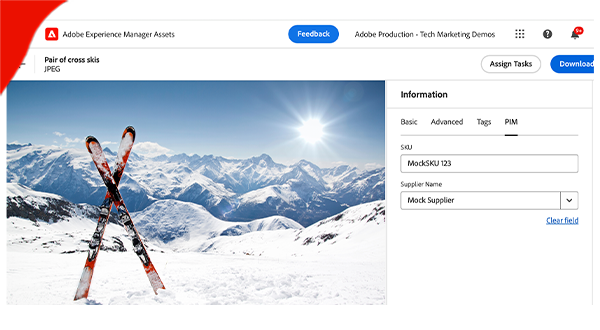

# AEM Eventing

AEM Eventing은 물론 AEM Eventing의 정의, 사용 이유, 시기, 예에 대해 알아봅니다.

>[!VIDEO](https://video.tv.adobe.com/v/3426686?quality=12&learn=on)

## AEM Eventing이란 무엇입니까?

AEM Eventing은 외부 시스템에서 AEM Events 구독을 처리하도록 하는 클라우드 기반 이벤트 시스템입니다. AEM Event는 특정 액션이 발생할 때마다 AEM에서 전송하는 상태 변경 알림입니다. 예를 들어 여기에는 콘텐츠 조각이 생성, 업데이트 또는 삭제될 때의 이벤트가 포함될 수 있습니다.

위 다이어그램은 AEM as a Cloud Service가 이벤트를 생성하고 이를 Adobe I/O Events로 전송하며, Adobe I/O Events가 이를 이벤트 구독자에게 노출하는 과정을 시각화한 것입니다.

요약하자면 세 가지 주요 구성 요소가 있습니다.

1. **이벤트 제공자:** AEM as a Cloud Service.
1. **Adobe I/O Events:** Adobe의 제품과 기술을 기반으로 앱과 경험을 통합하고, 확장하고, 빌드하기 위한 개발자 플랫폼.
1. **이벤트 사용자:** AEM Events를 구독한 고객이 소유한 시스템. (예: CRM(고객 관계 관리), PIM(제품 정보 관리), OMS(주문 관리 시스템) 또는 맞춤형 애플리케이션).

### 기존 이벤트 시스템과의 차이점

[Apache Sling 이벤트](https://sling.apache.org/documentation/bundles/apache-sling-eventing-and-job-handling.html), OSGi 이벤트, [JCR 관찰](https://jackrabbit.apache.org/oak/docs/features/observation.html) 등도 이벤트를 구독하고 처리할 수 있는 메커니즘을 제공합니다. 하지만 이 문서에서 다루는 AEM Eventing은 이들과 비교하여 다음과 같은 주요 차이점을 가집니다.

AEM Eventing의 주요 특징은 다음과 같습니다.

- 이벤트 사용자 코드는 AEM과 동일한 JVM에서 실행되지 않고 AEM 외부에서 실행됩니다.
- AEM 제품 코드는 이벤트를 정의하고 이를 Adobe I/O Events로 전송하는 역할을 합니다.
- 이벤트 정보는 표준화되어 JSON 형식으로 전송됩니다. 자세한 내용은 [클라우드 이벤트](https://cloudevents.io/)를 참조하십시오.
- 이벤트 사용자가 AEM과 다시 통신할 때는 AEM as a Cloud Service API를 사용합니다.

## 사용 이유 및 시기

AEM Eventing은 시스템 아키텍처와 운영 효율성 측면에서 수많은 이점을 제공합니다. AEM Eventing을 사용하는 주요 이유는 다음과 같습니다.

- **이벤트 기반 아키텍처 빌드**: 독립적으로 확장 가능하고 실패에 대한 복원력이 있는 느슨하게 결합된 시스템을 만드는 데 도움이 됩니다.
- **낮은 코드 작성 요구 및 운영 비용 절감**: AEM에서 사용자 정의를 피함으로써 유지 관리와 확장이 더 쉬운 시스템을 빌드하고, 결과적으로 운영 비용을 절감할 수 있습니다.
- **AEM과 외부 시스템 간 통신 단순화**: 지점 간 통신 대신 Adobe I/O Events가 통신을 관리하므로 어떤 이벤트를 어떤 시스템에 전달할지 쉽게 제어할 수 있습니다.
- **높은 이벤트 내구성**: Adobe I/O Events는 고가용성과 확장성을 갖춘 시스템으로, 많은 이벤트를 안정적으로 구독자에게 전달합니다.
- **이벤트 병렬 처리**: 이벤트를 여러 구독자에게 동시에 게재할 수 있으므로 다양한 시스템에서 분산된 이벤트 처리가 가능합니다.
- **서버리스 애플리케이션 개발**: 이벤트 사용자 코드를 서버리스 애플리케이션으로 배포할 수 있어 시스템 유연성과 확장성을 더욱 개선합니다.

### 제한 사항

AEM Eventing은 강력하지만 고려해야 할 몇 가지 한계가 있습니다.

- **AEM as a Cloud Service으로 제한된 가용성**: 현재 AEM Eventing은 AEM as a Cloud Service에서만 독점적으로 사용할 수 있습니다.

- **사용 가능한 이벤트 유형**: [여기](https://developer.adobe.com/experience-cloud/experience-manager-apis/guides/events/#available-event-types)에서 사용 가능한 이벤트 유형의 현재 목록을 검토할 수 있습니다.

## 활성화 방법

자세한 단계는 [AEM Cloud Service 환경에서 AEM Events 활성화](https://developer.adobe.com/experience-cloud/experience-manager-apis/guides/events/#enable-aem-events-on-your-aem-cloud-service-environment)를 참조하십시오.

## 구독 방법

AEM Events를 구독하기 위해 AEM 내에서 코드를 작성할 필요는 없습니다. 대신 [Adobe Developer Console](https://developer.adobe.com/)에서 프로젝트를 구성하면 됩니다. Adobe Developer Console은 Adobe API, SDK, Events, Runtime 및 App Builder로의 게이트웨이입니다.

이 경우 Adobe Developer Console에서 _프로젝트_&#x200B;를 만들면 AEM as a Cloud Service 환경에서 발생하는 이벤트를 구독하고 해당 이벤트를 외부 시스템으로 전달하도록 구성할 수 있습니다.

자세한 내용은 [Adobe Developer Console에서 AEM Events를 구독하는 방법](https://developer.adobe.com/experience-cloud/experience-manager-apis/guides/events/#how-to-subscribe-to-aem-events-in-the-adobe-developer-console)을 참조하십시오.

## 사용 방법

AEM Events를 사용하는 방식은 _푸시_ 방식과 _가져오기_ 방식의 두 가지가 있습니다.

- **푸시 방식**: 이벤트가 발생하면 Adobe I/O Events에서 이벤트 사용자에게 사전 알림을 전송합니다. 통합 옵션에는 Webhook, Adobe I/O Runtime 및 Amazon EventBridge가 포함됩니다.
- **가져오기 방식**: 이벤트 사용자가 Adobe I/O Events를 주기적으로 폴링하여 새로운 이벤트가 있는지 확인합니다. 이 방법에 대한 기본 통합 옵션은 Adobe Developer Journaling API입니다.

자세한 내용은 [Adobe I/O Events를 통한 AEM Events 처리](https://developer.adobe.com/experience-cloud/experience-manager-apis/guides/events/#aem-events-processing-via-adobe-io)를 참조하십시오.

## 예

<table>
  <tr>
    <td>
        
        
<strong><a href="./examples/webhook.md">웹 후크로 AEM Events 수신</a></strong>

        

          Adobe가 제공하는 웹 후크를 사용하여 AEM Events를 수신하고 이벤트 세부 정보를 검토합니다.
        

      </td>
      <td>
        
        
<strong><a href="./examples/journaling.md">AEM Events 저널 로드</a></strong>

        

          Adobe가 제공하는 웹 애플리케이션을 사용하여 저널에서 AEM Events를 로드하고 이벤트 세부 정보를 검토합니다.
        

      </td>
    </tr>
  <tr>
    <td>
        
        
<strong><a href="./examples/runtime-action.md">Adobe I/O Runtime Action으로 AEM Events 수신</a></strong>

        

          AEM Events를 수신하고 이벤트 세부 정보를 검토합니다.
        

      </td>
      <td>
        
        
<strong><a href="./examples/event-processing-using-runtime-action.md">Adobe I/O Runtime Action을 사용한 AEM 이벤트 처리</a></strong>

        

          Adobe I/O Runtime Action을 사용하여 수신된 AEM Events를 처리하는 방법에 대해 알아보십시오. 이벤트 처리에는 AEM 콜백, 이벤트 데이터 지속성, SPA에서의 표시가 포함됩니다.
        

      </td>
  </tr>
  <tr>
    <td>
        
        
<strong><a href="./examples/assets-pim-integration.md">PIM 통합을 위한 AEM Assets 이벤트</a></strong>

        

          메타데이터 업데이트를 위해 AEM Assets과 제품 정보 관리(PIM) 시스템을 통합하는 방법을 알아봅니다.
        

      </td>
  </tr> 
</table>
