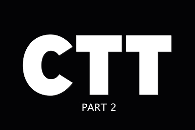

# 클라우드 시즌

## 소개

AEM Engineering의 Cloud 5 Series를 시작합니다. 모든 제품의 구현 단계에서 가장 중요한 문제 중 하나는 충분한 코드 샘플 및/또는 이러한 샘플, 도구 또는 API에 대한 실시간 데모가 있다는 것입니다. 이 시리즈의 목표는 5분 이내에 AEM에 대한 유용한 정보를 as a Cloud Service으로 제공하는 것입니다.

다음 방문: [제안 상자](https://forms.office.com/r/74P5Xz4UH0) 주제 아이디어 제출용

## 시즌

각 시즌의 길이는 다양하며 고정된 일정에 따라 릴리스됩니다. 시즌 1의 주제는 주로 고객 및 파트너와의 일상적인 계약에서 접한 과거의 요청에서 비롯됩니다. 주간 업데이트를 보려면 이 페이지를 방문하거나 선택한 소셜 네트워크에서 팔로우하십시오.

<table>
  <tr>
   <td>
      
      

         <a href="./cloud5-aem-cdn-part1.md"><strong>AEM CDN 심층 분석(1부)</strong></a>         
          <em>Darin Kuntze 및 James Talbot과 함께 수석 클라우드 아키텍트</em>
      

      

         
         1부는 AEM의 as a Cloud Service CDN과 이를 구현에 사용하는 방법에 대해 설명합니다.
      

     </td>   
     <td>
      
      

         <a href="./cloud5-aem-cdn-part2.md"><strong>AEM CDN 심층 분석(2부)</strong></a>
          <em>Darin Kuntze 및 James Talbot과 함께 수석 클라우드 아키텍트</em>
      

      

         
         2부는 AEM as a Cloud Service CDN에 대한 우리의 관찰의 연속이다. 새로운 CDN을 통해 얻을 수 있는 기능에 대한 몇 가지 일반적인 질문과 통념에 대해 답변합니다.
      

   </td>
     <td>
        
      

         <a href="./cloud5-aem-log-files.md"><strong>로그 파일 및 로깅</strong></a>
          <em>Darin Kuntze 및 James Talbot과 함께 수석 클라우드 아키텍트</em>
      

      

         
         사용자 인터페이스와 API를 통해 로그에 액세스하는 방법을 포함하여 AEMas a Cloud Service 에서 로그에 액세스하는 방법을 간략하게 살펴봅니다.
      

   </td> 
  </tr>
  <tr>
   <td>
        
      

        <a href="./cloud5-getting-login-token-integrations.md"><strong>액세스 토큰과 통합</strong></a>        
          <em>Darin Kuntze 및 James Talbot과 함께 수석 클라우드 아키텍트</em>
      

      

         
         클라우드 서비스 환경 내에서 통합 작업을 수행하기 위해 로그인 토큰과 상호 작용하는 방법에 대한 빠른 개요 및 데모입니다.
      

     </td>   
     <td>
        
      

        <a href="./cloud5-aem-dispatcher-cloud.md"><strong>클라우드의 디스패처</strong></a>
          <em>Darin Kuntze 및 James Talbot과 함께 수석 클라우드 아키텍트</em>
      

      

         
        Darin과 James는 몇 가지 모범 사례와 AMS/On-Prem과의 차이점 등 AEM Cloud의 Dispatcher에 대해 설명합니다. 
      

   </td>
     <td>
        
      

         <a href="./cloud5-aem-content-migration-part-1.md"><strong>마이그레이션(1부)</strong></a>
          <em>Darin Kuntze 및 James Talbot, 선임 클라우드 아키텍트 및 Applesmith 박사</em>
      

      

         
         클라우드로 마이그레이션하기 위한 팁과 요령 중 하나(둘 중 하나)입니다. 첫 번째 부분에서 우리의 주요 초점은 마이그레이션 준비 할 수있는 모범 사례 및 준비 작업입니다.
      

   </td> 
  </tr>
<tr>
   <td>
        
      

        <a href="./cloud5-aem-content-migration-part-2.md"><strong>마이그레이션(2부)</strong></a>     
          <em>Darin Kuntze 및 James Talbot과 함께 수석 클라우드 아키텍트</em>
      

      

         
         클라우드로 마이그레이션하기 위한 팁과 요령 중 2부(2부)입니다. 2부는 주로 마이그레이션에 사용할 수 있는 도구를 사용하는 것입니다.
      

     </td>   
     <td>
        
      

         <a href="./cloud5-aem-dispatcher-validator.md"><strong>Dispatcher 검사기</strong></a>
          <em>Darin Kuntze 및 James Talbot과 함께 수석 클라우드 아키텍트</em>
      

      

         
         이전 마이그레이션 논의의 발판으로, Dispatcher 유효성 검사기와 이 검사기가 수행할 수 있는 몇 가지 작업을 살펴보겠습니다.
      

   </td>
     <td>
        
      

         <a href="./cloud5-aem-search-and-indexing.md"><strong>색인 지정 및 검색 팁</strong></a>
          <em>Darin Kuntze 및 James Talbot과 함께 수석 클라우드 아키텍트</em>
      

      

         
         색인화 및 검색과 같이 복잡한 작업의 경우, 팀은 개발 시간을 최적화하고 문제가 되기 전에 문제를 해결하는 몇 가지 쉬운 성과를 보여줍니다.
      

   </td> 
  </tr>
    <tr>
        <td>
            
            

                <a href="./cloud5-adobe-app-builder.md"><strong>Adobe 앱 빌더</strong></a>         
                <em>Darin Kuntze 및 James Talbot, 선임 클라우드 아키텍트 및 Amol Anand</em>
            

            
 
                Adobe App Builder로 할 수 있는 멋진 일들을 확인하고, 클라우드 내 맞춤화의 미래에 대해 새로운 정보를 알아보십시오.
            

        </td>
        <td></td>
        <td></td>
    </tr>
</table>
